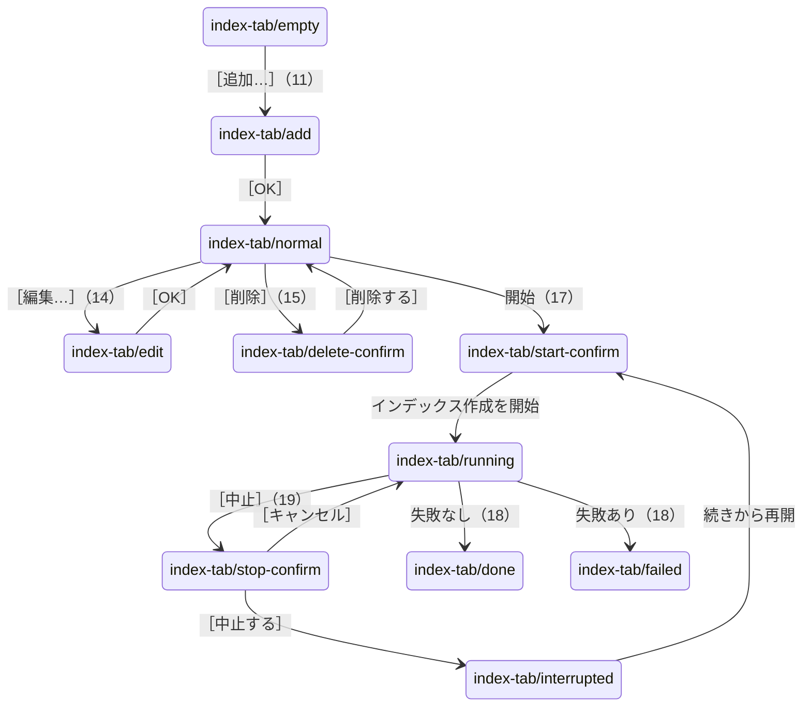
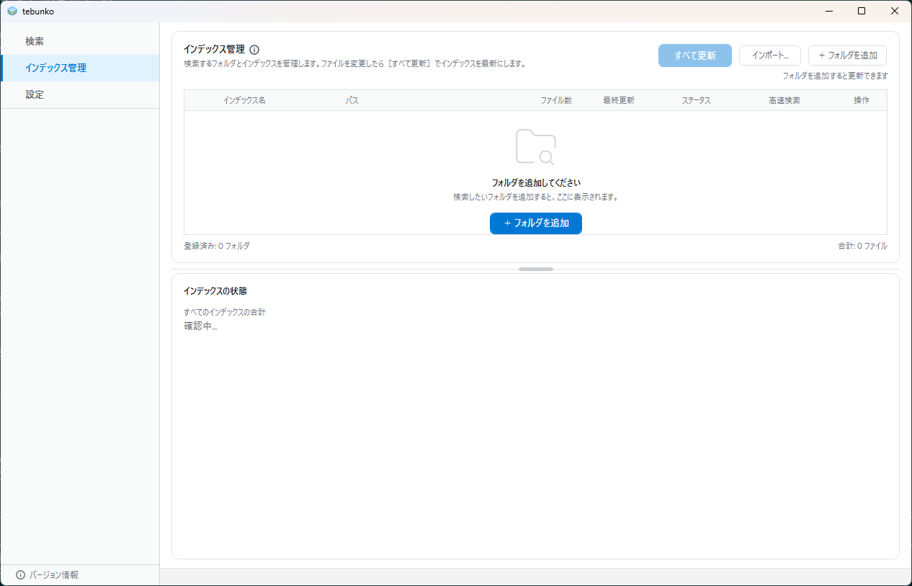
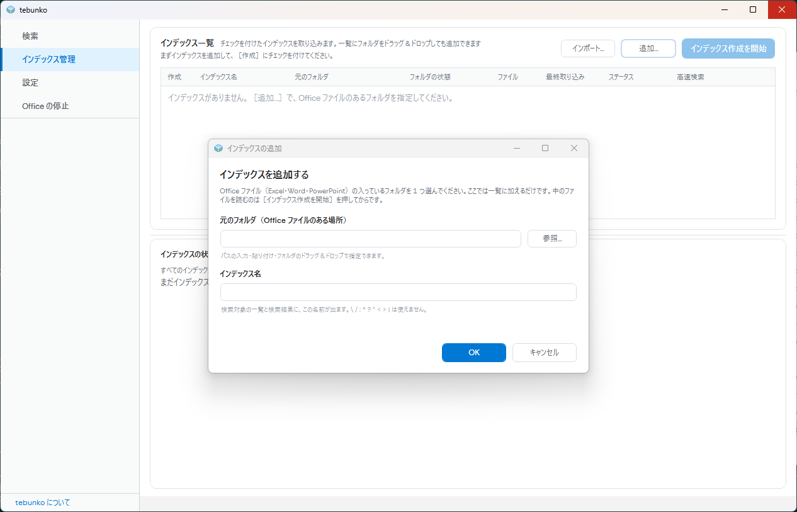
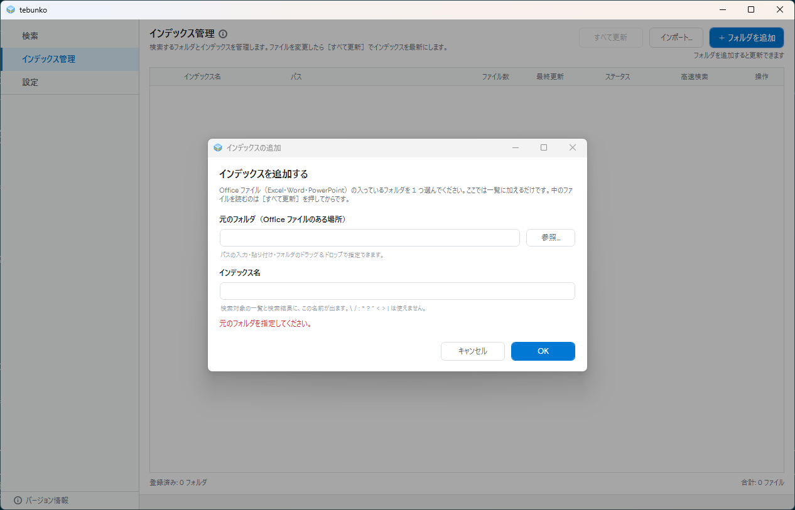
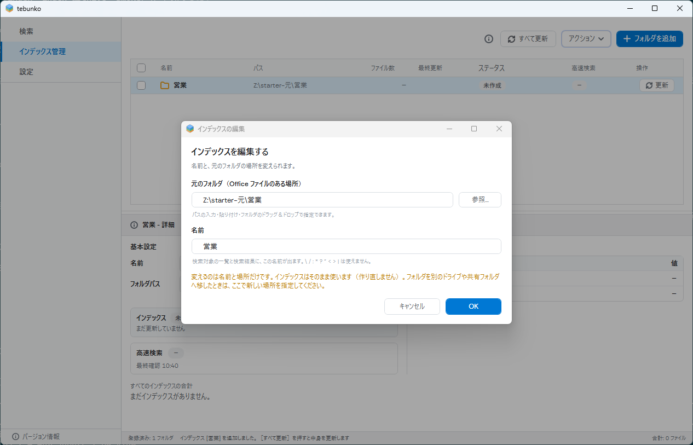
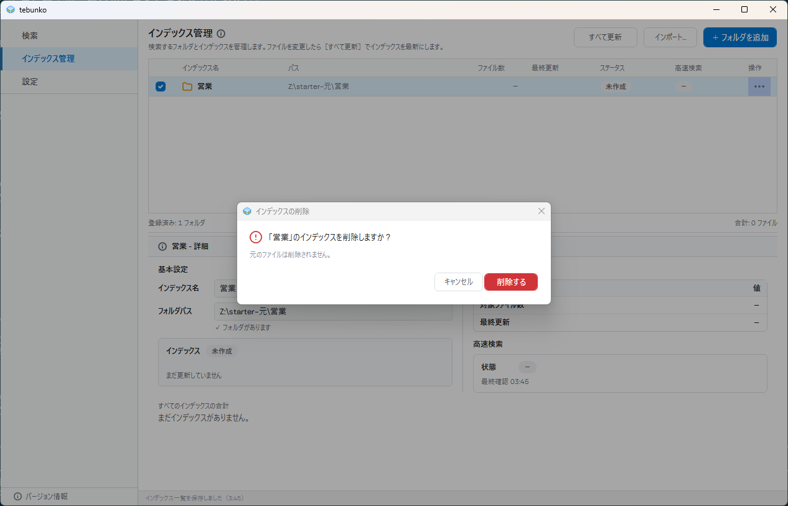
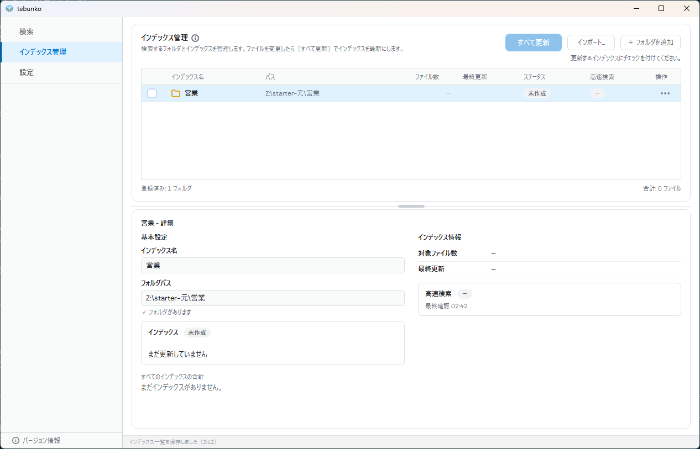
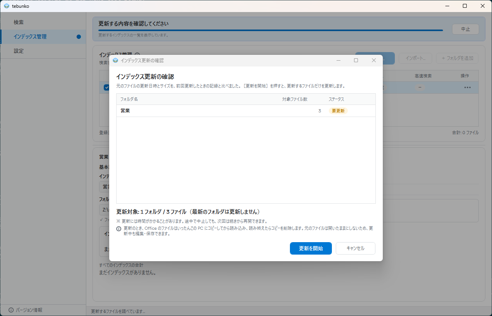
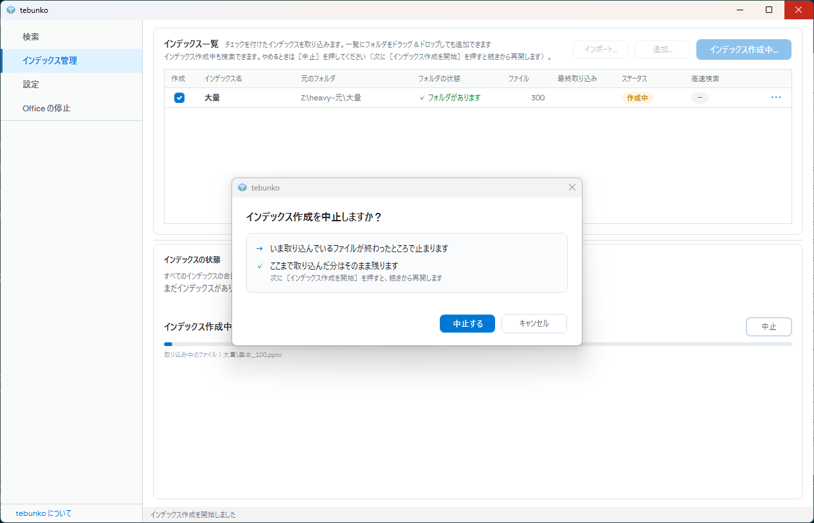
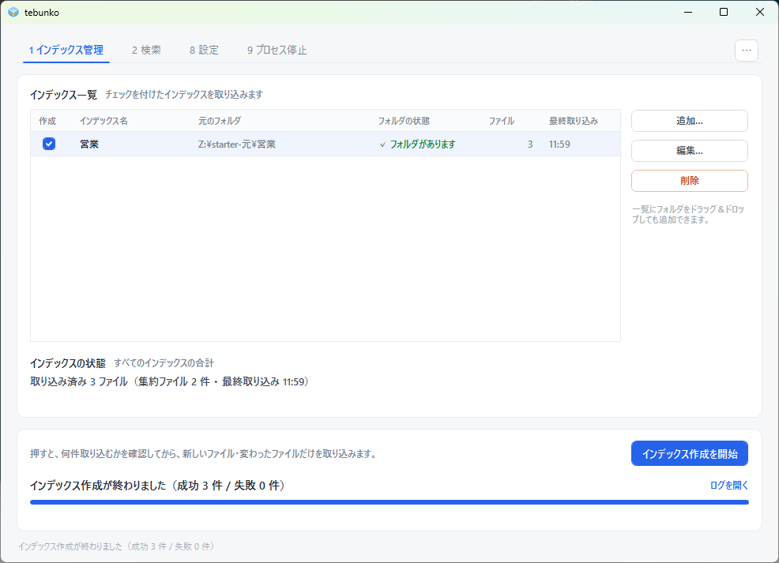

# ［1 インデックス管理］タブ

細かい仕様は [［1 インデックス管理］タブ](../index-tab.md) にある。

## 目的

検索の対象にするフォルダを登録し、インデックスを作る。インデックスの有無・作成中・中断・失敗の状態を、この画面で見分けられる。

## 部品と並び

- 上に「インデックス一覧」。チェックを付けた行だけを取り込む。列は 作成・インデックス名・元のフォルダ・フォルダの状態・ファイル・最終取り込み。
- 一覧の横に［追加…］［編集…］［削除］。一覧へのドラッグ＆ドロップでも追加できる。
- 「インデックスの状態」に、すべてのインデックスの合計を出す。
- 下端に進み具合と、［インデックス作成を開始］（作成中は［中止］）。
- 失敗があると、タブに ⚠ が付き、失敗したファイルの一覧と「失敗の原因」の列が出る。

## 状態と遷移

- 追加のダイアログで入力が足りないと、ダイアログの中に注意が出る（`index-tab/add-error`。12）。
- 一覧の［作成］のチェックを外すと、その行は取り込まない（`index-tab/unchecked`。16）。
- 作成中は［追加…］［編集…］［削除］が押せない（20）。作成が終わると、また押せる。
- 前回の作成が中断したまま起動すると、この画面が選ばれて `index-tab/interrupted` になる（4）。
状態の判定と画面の更新は[状態の判定と操作の流れ](../state-flow.md)、メッセージの一覧は[メッセージ一覧](../messages.md)にあり、ここには書き写さない。
## 表示する文言

| 状態 | 文言 |
|---|---|
| 一覧が空 | 「インデックスがありません。［追加…］で、Office ファイルのあるフォルダを指定してください。」「まだインデックスがありません。」「まずインデックスを追加して、［作成］にチェックを付けてください。」 |
| 追加 | 「インデックスの追加」。欄は「元のフォルダ（Office ファイルのある場所）」「インデックス名」。注意は「元のフォルダを指定してください。」 |
| 編集 | 「インデックスの編集」。名前と場所だけを変えられる旨の注記 |
| 削除の確認 | 「インデックス「営業」を一覧から削除しますか？」、［削除する］［キャンセル］ |
| 作成の確認 | 「インデックス作成の確認」「合計 3 件を取り込みます。」 |
| 作成中 | 「インデックス作成中… 18 / 300 件」「残り 1 分未満」、［中止］ |
| 中止の確認 | 「インデックス作成を中止しますか？」、［中止する］［キャンセル］ |
| 中断 | 「まだ取り込んでいないファイルがあります（残り 265 件）」、［続きから再開（残り 265 件）］ |
| 完了 | 「インデックス作成が終わりました（成功 3 件 / 失敗 0 件）」、［ログを開く］ |
| 失敗 | 「取り込みに失敗したファイル 1 件」と「失敗の原因」の列 |

## 写真

### index-tab/empty（インデックスが無い。遷移 3）

### index-tab/normal（インデックスがあり、取り込み済み。遷移 7）

### index-tab/interrupted（前回の作成が中断している。遷移 4）

### index-tab/add（追加のダイアログ。遷移 11）

### index-tab/add-error（追加のダイアログの注意。遷移 12）

### index-tab/edit（編集のダイアログ。遷移 14）

### index-tab/delete-confirm（削除の確認。遷移 15）

### index-tab/unchecked（［作成］のチェックを外した行がある。遷移 16）

### index-tab/start-confirm（作成の確認ダイアログ。遷移 17）

### index-tab/running（作成中。遷移 17・20）

### index-tab/stop-confirm（中止の確認。遷移 19）

### index-tab/done（作成が終わった。遷移 18）

### index-tab/failed（失敗したファイルの一覧がある。遷移 18）

