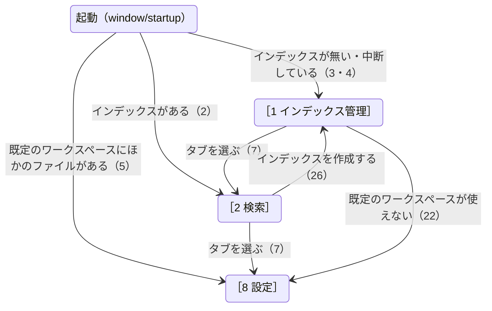

# 画面設計（現行）

GUI を改善する前に、今の画面をすべての状態で写真に撮って残す区分。写真は道具（`tools/capture_screens.ps1`）で自動で撮り、`docs/images/screens/` に置く。タブごとの No. の表（[［1 インデックス管理］タブ](../index-tab.md) など）は仕様として残し、ここには書き写さない。画面ごとのページは、目的・部品と並び・状態と遷移・表示する文言・写真をまとめる。

## この区分のページ

- [本体・共通の状態](window.md)
- [［1 インデックス管理］タブ](index-tab.md)
- [［2 検索］タブ](search-tab.md)
- [［8 設定］タブ](settings-tab.md)

## 画面全体の遷移

画面ごとの状態と遷移は各ページにある。ここではタブの間の行き来だけを示す。



## 撮り方と撮り直し方

```
.\tools\capture_screens.ps1                          すべての状態を撮り直す
.\tools\capture_screens.ps1 -Only <ID...>            指定した状態だけを撮り直す（例: -Only index-tab/empty search-tab/results）
.\tools\capture_screens.ps1 -OutDir <フォルダ>        写真の置き場所（既定 docs\images\screens）
```

- **状態の ID**（写真のファイル名）は `<画面>/<状態>` の形。画面は `window`・`index-tab`・`search-tab`・`settings-tab`（このページの下の一覧のページ名と同じ）。
- **撮り直しは、見た目が変わった画面だけにする。** 撮り直しても写真のファイル名は変えない（git は同じファイルの差し替えになる）。日付・時刻が写るので、全部を撮り直すと変わらない画面まで差し替わり、リポジトリが重くなる。
- **道具が撮る前に確かめる、そろえる条件**（合わなければ理由を出して止まる）:
  - 表示の倍率が 100%（`HKCU:\Control Panel\Desktop\WindowMetrics` の `AppliedDPI` が 96）。画面が複数あると `AppliedDPI` が窓のある画面と合わないことがあるため、撮るときは画面を 1 つにする。
  - Windows のテーマがライトモード（`AppsUseLightTheme` が 1）。tebunko の色は `theme.xaml` が決めるため、ほかの設定は問わない。
  - Excel・Word・PowerPoint が動いていない（撮る画面に、本物の文書の名前が出ることがあるため）。
  - Windows の通知を止めている（集中モード・応答不可。撮る途中で通知が重なるのを防ぐ）。
  - 道具と tebunko は、管理者でない同じ利用者の権限で動かす。
- **架空のデータを使う。** 道具は一時フォルダを、空いているドライブの文字（`Z:` から下へ探す）に `subst` で割り当て、その下でツール・ワークスペース・元のフォルダを動かす。終わったら（失敗しても）`subst /D` で外す。インデックス名・ファイル名・中身は、[個人情報を書かない](../../../../AGENTS.md#個人情報を書かない)の架空の名前を使う。
- **利用者名が出る部品を塗りつぶす。** ［8 設定］の「既定の場所は「`C:\Users\<利用者名>\Documents\tebunko_ws`」です。」のように、OS から取る利用者のフォルダの場所は差し替えられない。道具は撮るたびに、窓の中の部品の UI オートメーションの `Name` と、入力欄（`ValuePattern`）の `Value` を調べ、利用者名・コンピューター名・利用者のフォルダのパスを含む部品の範囲を塗りつぶし、その上に置き換えた文字を描き直す。利用者のフォルダのパスは `C:\Users\test\...`、利用者名は `test`、コンピューター名は `TEST-PC` に置き換える。
- **本体・ダイアログ・メニューの窓の外**（デスクトップ・後ろの窓・通知）は無地の色で塗る（`CopyFromScreen` は画面に出ているものをそのまま撮るため）。
- 撮る間はマウス・キーボードに触らない（[画面のスモークテスト](../../testing/gui-smoke.md#画面のスモークテスト)と同じ。共通の関数 `tests/gui/gui_helpers.ps1` を使い回す）。

## 撮る状態の一覧

「遷移」は[画面遷移の一覧](../../testing/gui-smoke.md#画面のスモークテスト)の番号。計 45 枚。

**本体・共通（`window`）**

| ID | 状態 | 遷移 |
|---|---|---|
| `window/startup` | 起動中の表示（「起動中…」） | 1 |
| `window/about` | 「tebunko について」 | 8 |
| `window/close-confirm` | 作成中に閉じるときの確認 | 10 |
| `window/settings-broken` | 設定が壊れていたときの知らせ（メッセージボックス） | – |
| `window/leftover` | 起動時の、前回残った Office の確認（基本） | – |
| `window/leftover-open` | 同・詳細を開いた | – |
| `window/leftover-many` | 同・数が多い（詳細の表が縦にスクロールする） | – |
| `window/leftover-search` | 同・［2 検索］の上に出ている | – |
| `window/leftover-killed` | ［終了する］のあと、すべて終了したときのステータス | – |
| `window/leftover-partial` | 同・一部が確認の後に変わっていたときのステータス | – |

**［1 インデックス管理］（`index-tab`）**

| ID | 状態 | 遷移 |
|---|---|---|
| `index-tab/empty` | インデックスが無い | 3 |
| `index-tab/normal` | インデックスがあり、取り込み済み | 7 |
| `index-tab/interrupted` | 前回の作成が中断している（起動時） | 4 |
| `index-tab/add` | 追加のダイアログ | 11 |
| `index-tab/add-error` | 追加のダイアログの注意（入力が足りない） | 12 |
| `index-tab/edit` | 編集のダイアログ | 14 |
| `index-tab/delete-confirm` | 削除の確認 | 15 |
| `index-tab/unchecked` | ［作成］のチェックを外した行がある | 16 |
| `index-tab/start-confirm` | 更新の確認ダイアログ（件数・失敗分の更新し直し） | 17 |
| `index-tab/running` | 更新中（更新の帯・［＋ フォルダを追加］［編集…］［削除］が押せない） | 17・20 |
| `index-tab/stop-confirm` | 中止の確認 | 19 |
| `index-tab/done` | 作成が終わった（失敗なし） | 18 |
| `index-tab/failed` | 失敗したファイルの一覧があり、タブに ⚠ | 18 |

**［2 検索］（`search-tab`）**

| ID | 状態 | 遷移 |
|---|---|---|
| `search-tab/no-index` | インデックスが無い（［インデックスを作成する］） | 26 |
| `search-tab/initial` | 起動した直後（語を入れる前） | 2 |
| `search-tab/results` | 結果あり（ファイルごとの見出し・行を選んだプレビュー） | 23 |
| `search-tab/no-results` | 結果が 0 件 | 23 |
| `search-tab/limit` | 件数の上限で打ち切った | 23 |
| `search-tab/regex-error` | 不正な正規表現の注意 | 24 |
| `search-tab/tree-none` | 検索対象のツリーですべて解除した注意 | 25 |
| `search-tab/collapsed` | 結果をすべて折りたたんだ | 27 |
| `search-tab/filtered` | 結果を絞り込んだ | 27 |
| `search-tab/missing-source` | 元のファイルが見つからないときの確認 | 29 |
| `search-tab/min-width` | 最小の大きさ（760 × 580）で結果あり | – |

**［8 設定］（`settings-tab`）**

| ID | 状態 | 遷移 |
|---|---|---|
| `settings-tab/normal` | 既定でないワークスペース（既定の場所の文は塗る） | 7 |
| `settings-tab/running-warning` | 作成中に［変更…］（メッセージボックス） | 21 |
| `settings-tab/empty-confirm` | 空のフォルダを選んだときの確認 | 31 |
| `settings-tab/nonempty-confirm` | 空でないフォルダを選んだときの確認 | 32 |
| `settings-tab/index-confirm` | インデックスのあるフォルダを選んだときの確認 | 33 |
| `settings-tab/invalid-warning` | 使えないフォルダを選んだときの警告 | 34 |

## 撮らないもの

| 遷移・状態 | 理由 |
|---|---|
| 5（起動時の既定のワークスペースの警告）・22（作成の開始で既定のワークスペースが使えない）・35（［既定に戻す］の確認） | 利用者の本物の既定のワークスペース（`Documents\tebunko_ws`）に書き込み、その中身が写る |
| 13・30（OS のフォルダ選択） | OS の画面で、利用者名と PC の中のフォルダが写る |
| 6（多重起動）・9（閉じる） | 見える画面が無い（前の窓が前に出る・窓が消える） |
| 元のファイル・フォルダ・ログを開く、結果をファイルに出力 | 行き先が外のアプリ（Office・エクスプローラー・メモ帳） |
| ドラッグ＆ドロップ・ダブルクリック・キーボードのショートカット | 行き先はボタンと同じ画面 |
| 予期しない例外のメッセージボックス、インデクサが続けられないエラー | 起こすには本体に仕掛けが要る |
| 検索中・インデックスの削除中の表示 | 一瞬で終わり、同じ絵を撮り直せない |
| 高速検索が「使用可」の表示 | Windows Search の索引の対象（利用者の Documents など）にワークスペースを置く必要がある。写真は「使用不可」のまま撮る |
| 28（結果・プレビューの右クリックのメニュー） | UI オートメーションの Invoke では開けない（[画面のスモークテスト](../../testing/gui-smoke.md#画面のスモークテスト)の対象外と同じ理由）。道具はマウス・キーボードの合成にならないネイティブの `WM_CONTEXTMENU`（キー操作と同じ扱い）も試したが、フォーカスで出るツールヒントを拾うだけで、メニューは開けなかった |
