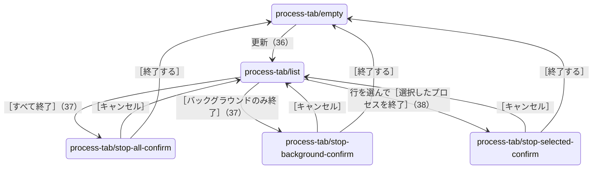

# ［9 プロセス停止］タブ

細かい仕様は [［9 プロセス停止］タブ](../process-tab.md) にある。写真の中の Excel のプロセスは、`PING.EXE` を `EXCEL.EXE` の名前で写した偽のプロセス（[画面のスモークテスト](../../testing/gui-smoke.md#画面のスモークテスト)と同じ）。

## 目的

インデックス作成を中断したときなどに残った Excel・Word・PowerPoint のプロセスを見つけて終了する。

## 部品と並び

- 「残っている Office のプロセス」の一覧。列は 種類・PID・起動時刻・メモリ・ウィンドウ。
- 一覧の下に件数と時刻の行、［更新］。
- 下端に［すべて終了］［選択したプロセスを終了］［バックグラウンドのみ終了（N 件）］。説明に、バックグラウンドと、画面に表示中のプロセスを終了すると保存していない内容が失われることを書いている。
- プロセスがあるとタブに ⚠ が付く。

## 状態と遷移

状態の判定と画面の更新は[状態の判定と操作の流れ](../state-flow.md)、メッセージの一覧は[メッセージ一覧](../messages.md)にあり、ここには書き写さない。
## 表示する文言

| 状態 | 文言 |
|---|---|
| プロセスが無い | 「実行中の Excel・Word・PowerPoint はありません。（12:00:36 時点）」。ボタンは押せない |
| 一覧あり | 「1 件（バックグラウンド 1 件・画面に表示中 0 件）・12:00:38 時点」、［バックグラウンドのみ終了（1 件）］ |
| 終了の確認 | 「バックグラウンドの Office を 1 件終了しますか？」。「画面に出ているファイルはありません」「残ったまま動いていたものを片付けます」「次のインデックス作成で作り直されます」、［終了する］［キャンセル］ |

時刻と件数は写真を撮ったときの値。

## 写真

### process-tab/empty（Office のプロセスが無い。遷移 36）

### process-tab/list（偽のプロセスがある。遷移 36）

### process-tab/stop-all-confirm（［すべて終了］の確認。遷移 37）

### process-tab/stop-background-confirm（［バックグラウンドのみ終了］の確認。遷移 37）

### process-tab/stop-selected-confirm（選んで終了するときの確認。遷移 38）

