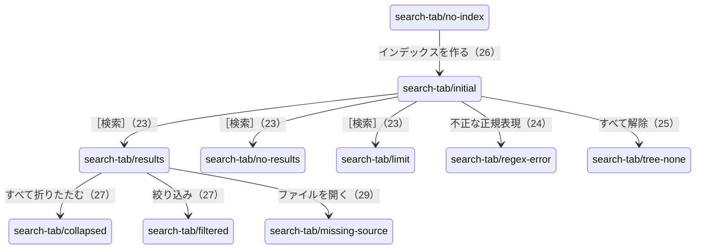

# ［2 検索］タブ

細かい仕様は [［2 検索］タブ](../search-tab.md) にある。

## 目的

インデックスの中から語を探し、該当するファイル・場所・行を見つけ、元のファイルを開く。

## 部品と並び

- 左に「検索対象」のツリー（チェックしたインデックス・フォルダだけを検索する。名前の絞り込み・［すべて選択］［すべて解除］）。
- 右上に「検索ワード」の欄と［検索］、その下に種類のチップ（Excel・Word・PowerPoint・テキスト）、［ファイル内の対象 ▾］（本文・図形・コメント）、右に「大文字・小文字を区別」「正規表現」と高速検索の状態。
- その下に、注意・「検索対象」の説明・「高速検索」の状態を出す行。
- 結果は、［すべて展開］［すべて折りたたむ］、「絞り込み」の欄、場所・種別・該当行の表。
- 表の下に、プレビュー（選んだ行の前後）、開き方の選択、［Excel で開く］［フォルダを開く］、［結果をファイルに出力］。

## 状態と遷移

- 最小の大きさ（760 × 580）でも結果とプレビューが見える（`search-tab/min-width`）。
- 不正な正規表現のときは文字どおり検索にして、［検索］は押せたままになる。
状態の判定と画面の更新は[状態の判定と操作の流れ](../state-flow.md)、メッセージの一覧は[メッセージ一覧](../messages.md)にあり、ここには書き写さない。
## 表示する文言

| 状態 | 文言 |
|---|---|
| インデックスが無い | 「インデックスがありません。［1 インデックス管理］でインデックスを作成してください。」「検索対象：なし（…）」、［インデックスを作成する］、「高速検索：使用不可」 |
| 起動直後 | 「検索対象：すべて（集約ファイル 3 件・最終取り込み 11:59）」 |
| 0 件 | 「見つかりませんでした。」、状態の欄は「検索しました（…：0 件）」 |
| 上限 | 「該当 10,000 件（1 ファイル）」「10,000 件を超えたため、ここで打ち切りました。…」 |
| 不正な正規表現 | 「正規表現として不正なため、文字どおり検索します。」 |
| すべて解除 | 「検索対象：なし（左の一覧で、検索するインデックス・フォルダにチェックを付けてください）」 |
| 折りたたみ・絞り込み | 「該当 2 件（2 ファイル）」「2 件中 1 件を表示」 |
| 元のファイルが無い | 「見積.xlsx が見つかりません」、［フォルダを選ぶ］［キャンセル］。窓の下端には「元のファイルが見つかりません：…」 |
| 開き方 | 「通常（編集する）」ほか、［Excel で開く］［フォルダを開く］ |

## 写真

### search-tab/no-index（インデックスが無い。遷移 26）

### search-tab/initial（起動した直後。遷移 2）

### search-tab/results（結果あり。遷移 23）

### search-tab/no-results（結果が 0 件。遷移 23）

### search-tab/limit（件数の上限で打ち切った。遷移 23）

### search-tab/regex-error（不正な正規表現の注意。遷移 24）

### search-tab/tree-none（検索対象のツリーですべて解除した注意。遷移 25）

### search-tab/collapsed（結果をすべて折りたたんだ。遷移 27）

### search-tab/filtered（結果を絞り込んだ。遷移 27）

結果・プレビューの右クリックのメニュー（遷移 28）は撮らない（[画面設計（現行）](index.md#撮らないもの)）。

### search-tab/missing-source（元のファイルが見つからないときの確認。遷移 29）

### search-tab/min-width（最小の大きさで結果あり）

