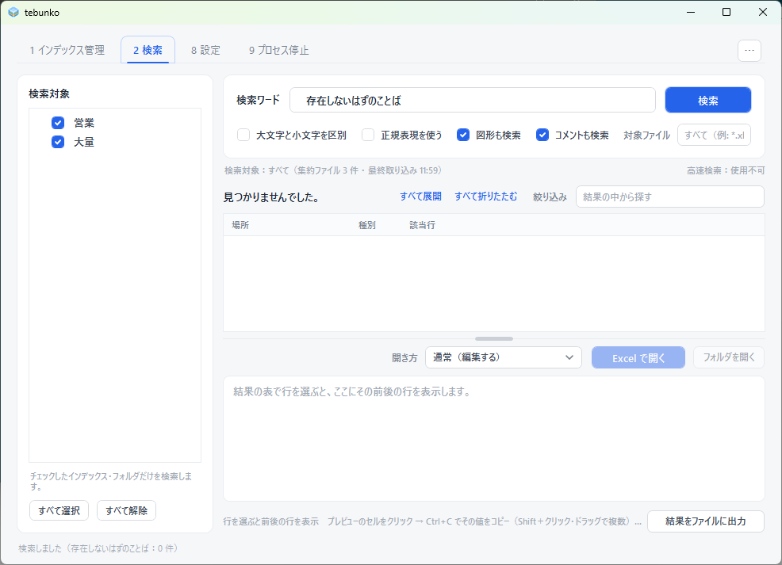
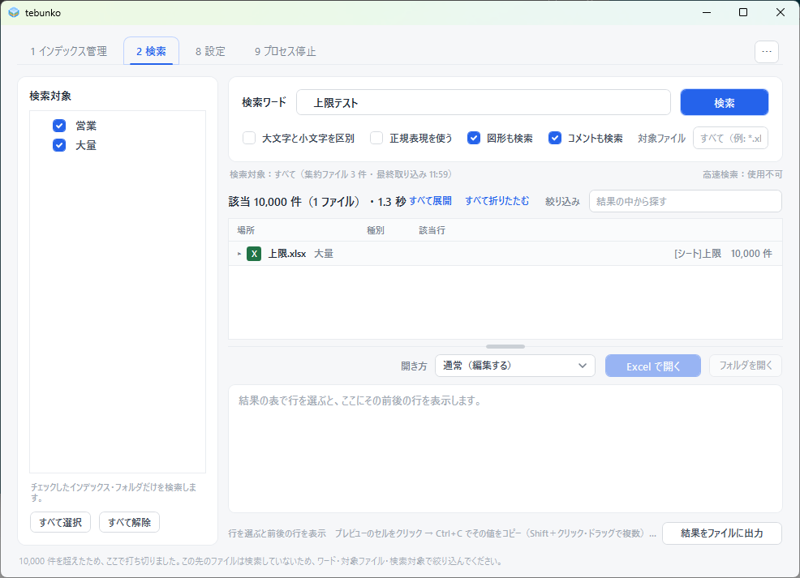
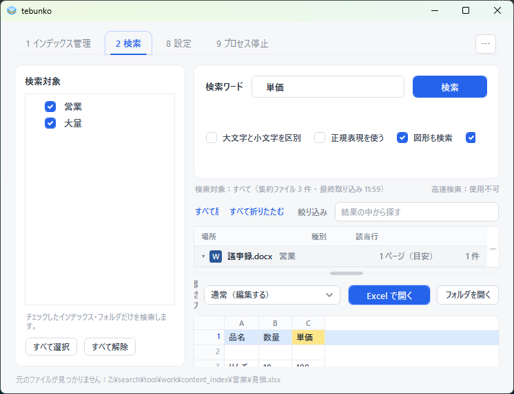

# ［2 検索］タブ

部品と並び・状態と遷移・表示する文言・改善の候補は、写真を載せた後の別のアイテムでまとめる。細かい仕様は [［2 検索］タブ](../search-tab.md) にある。

## 写真

### search-tab/no-index（インデックスが無い。遷移 26）

### search-tab/initial（起動した直後。遷移 2）

### search-tab/results（結果あり。遷移 23）

### search-tab/no-results（結果が 0 件。遷移 23）

### search-tab/limit（件数の上限で打ち切った。遷移 23）

### search-tab/regex-error（不正な正規表現の注意。遷移 24）

### search-tab/tree-none（検索対象のツリーですべて解除した注意。遷移 25）

### search-tab/collapsed（結果をすべて折りたたんだ。遷移 27）

### search-tab/filtered（結果を絞り込んだ。遷移 27）

結果・プレビューの右クリックのメニュー（遷移 28）は撮らない（[画面設計（現行）](index.md#撮らないもの)）。

### search-tab/missing-source（元のファイルが見つからないときの確認。遷移 29）

### search-tab/min-width（最小の大きさで結果あり）

