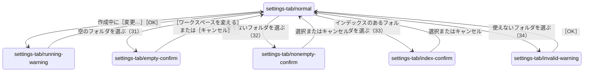
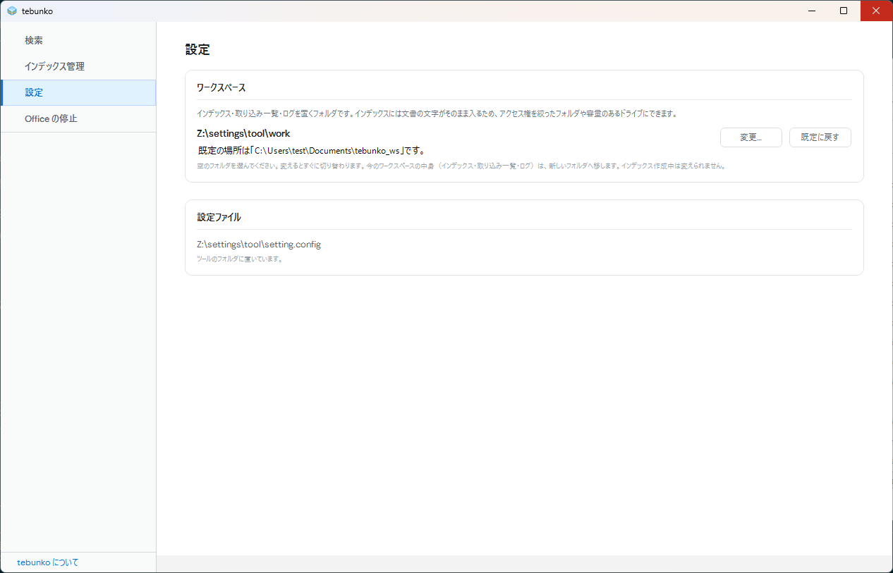
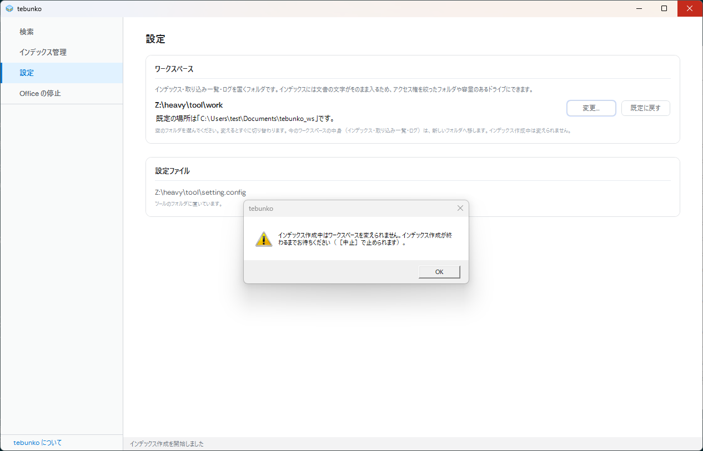
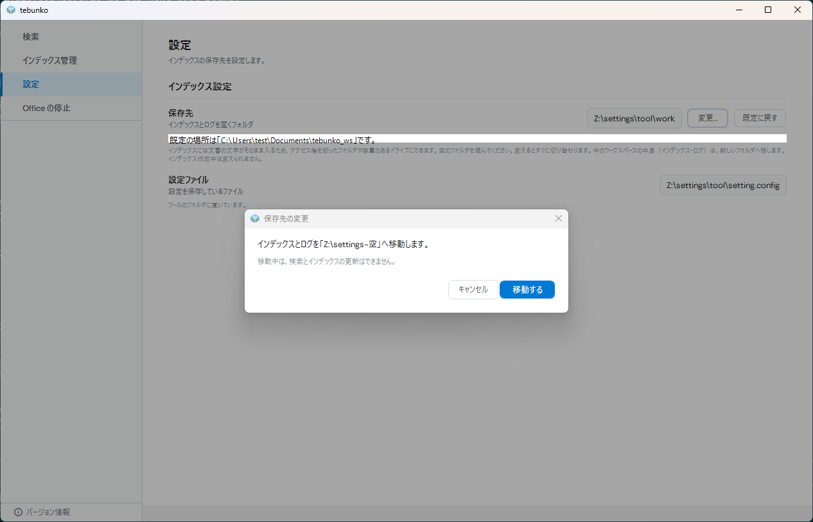
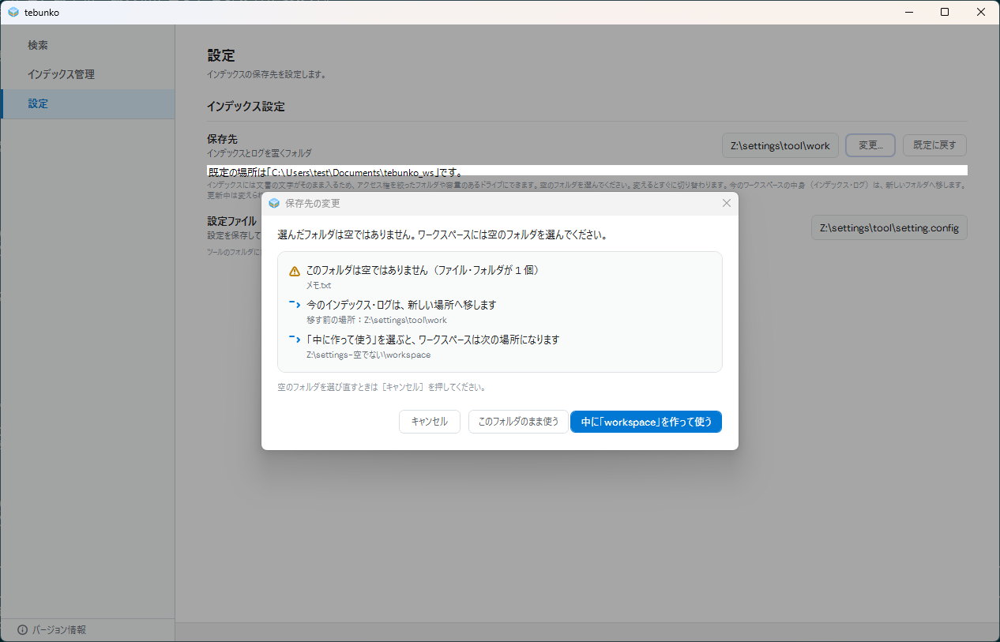
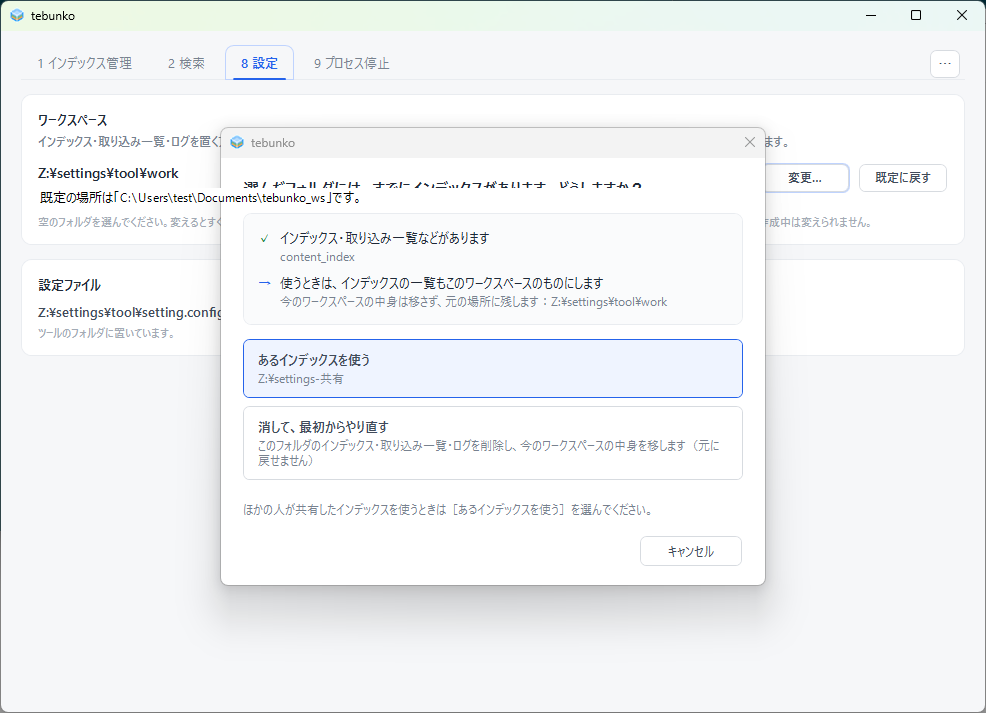
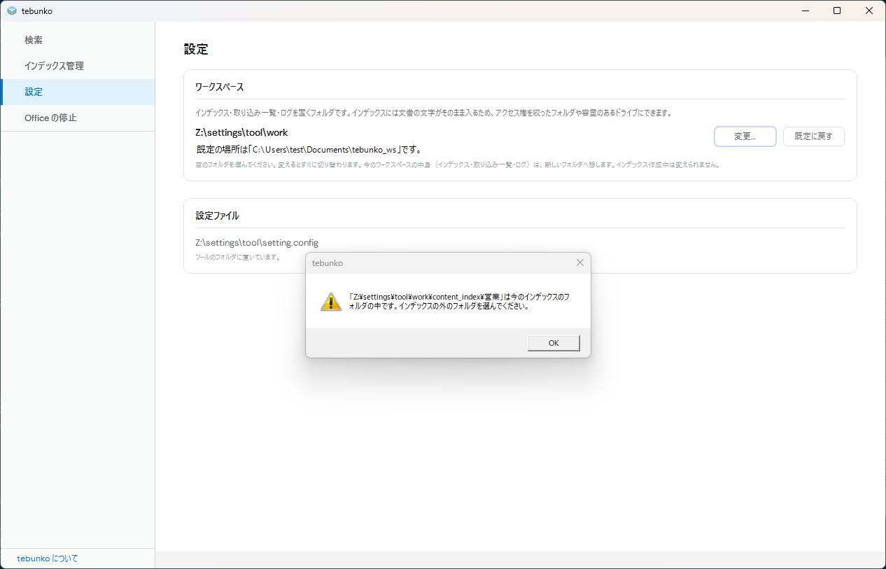

# ［8 設定］タブ

細かい仕様は [［8 設定］タブ](../settings-tab.md) にある。写真の中で利用者のフォルダのパスが出る部分は、塗りつぶして `C:\Users\test\...` と描き直している（[撮り方](index.md#撮り方と撮り直し方)）。

## 目的

インデックス・取り込み一覧・ログを置く場所（ワークスペース）を確かめ、変える。設定ファイルの場所も見られる。

## 部品と並び

- 見出し「設定」。
- 「ワークスペース」のカード（節の見出しの下に線）。今の場所、既定の場所の説明、［変更…］［既定に戻す］、変え方の注意。
- 「設定ファイル」のカード（節の見出しの下に線）。設定ファイルの場所と、置き場所の説明。

## 状態と遷移

［既定に戻す］の確認（35）と OS のフォルダ選択（30）は、写真に撮らない（[撮らないもの](index.md#撮らないもの)）。
状態の判定と画面の更新は[状態の判定と操作の流れ](../state-flow.md)、メッセージの一覧は[メッセージ一覧](../messages.md)にあり、ここには書き写さない。
## 表示する文言

| 状態 | 文言 |
|---|---|
| 普通 | 「ワークスペース」「インデックス・取り込み一覧・ログを置くフォルダです。…」、［変更…］［既定に戻す］。「設定ファイル」「ツールのフォルダに置いています。」 |
| 作成中の［変更…］ | 「インデックス作成中はワークスペースを変えられません。インデックス作成が終わるまでお待ちください（［中止］で止められます）。」 |
| 空のフォルダ | 「ワークスペースを変えますか？」、［ワークスペースを変える］［キャンセル］。中身は新しいワークスペースへ移す旨を示す |
| 空でないフォルダ | 「選んだフォルダは空ではありません。ワークスペースには空のフォルダを選んでください」。選択肢は「中に「workspace」フォルダを作って、ワークスペースにする」「このフォルダをそのまま使う」、［キャンセル］ |
| インデックスのあるフォルダ | 「あるインデックスを使う」「消して、最初からやり直す」の選択 |
| 使えないフォルダ | 「…は今のインデックスのフォルダの中です。インデックスの外のフォルダを選んでください。」、［OK］ |

## 写真

### settings-tab/normal（既定でないワークスペース。遷移 7）

### settings-tab/running-warning（作成中に［変更…］。遷移 21）

### settings-tab/empty-confirm（空のフォルダを選んだときの確認。遷移 31）

### settings-tab/nonempty-confirm（空でないフォルダを選んだときの確認。遷移 32）

### settings-tab/index-confirm（インデックスのあるフォルダを選んだときの確認。遷移 33）

### settings-tab/invalid-warning（使えないフォルダを選んだときの警告。遷移 34）

