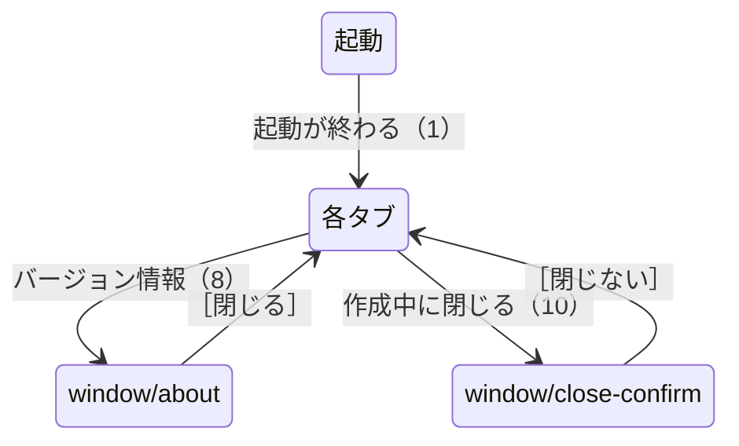
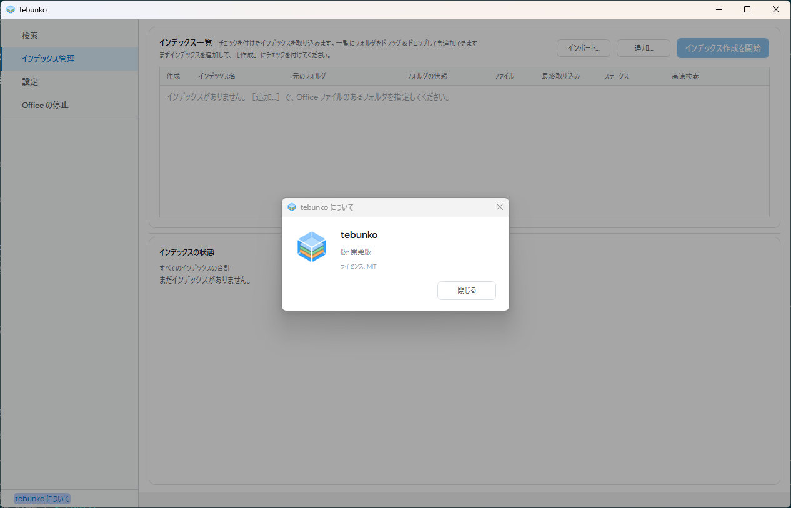
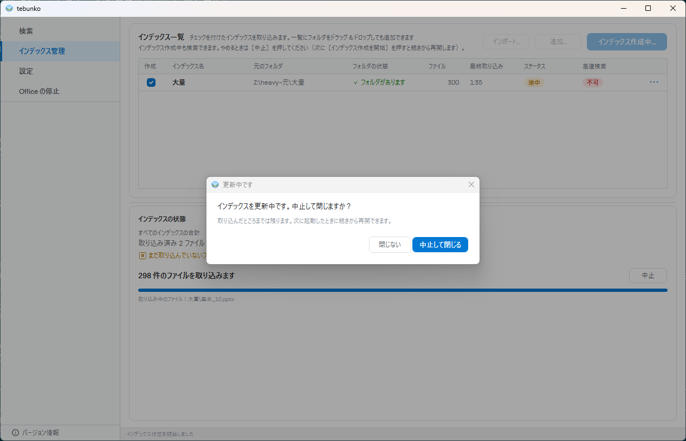
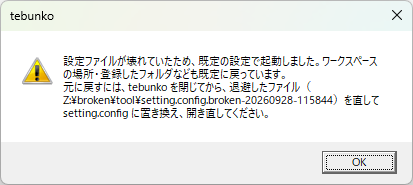
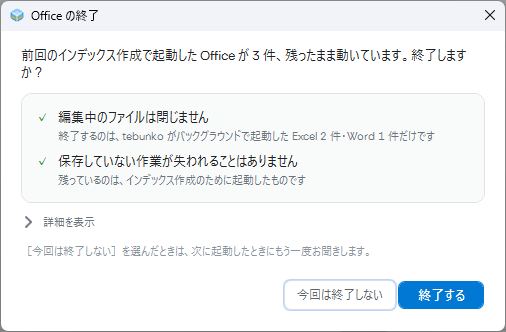
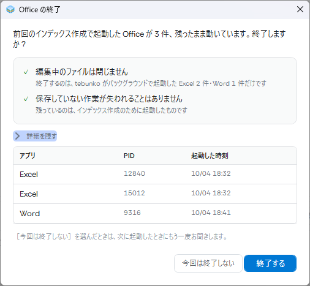
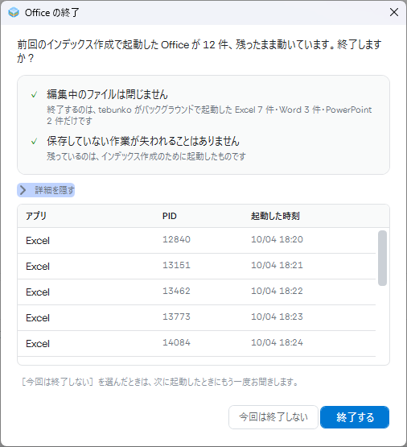
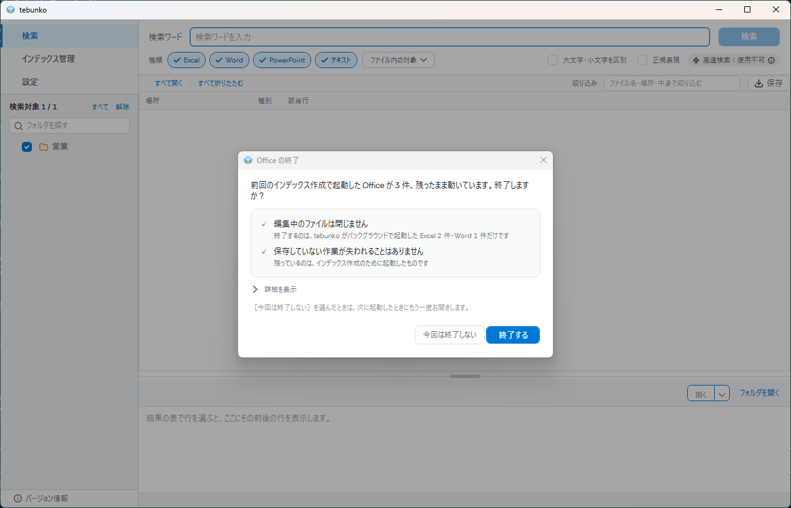
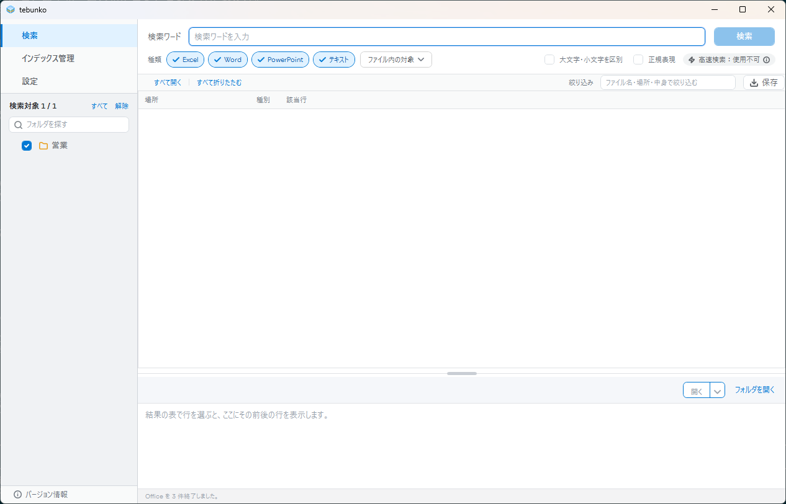
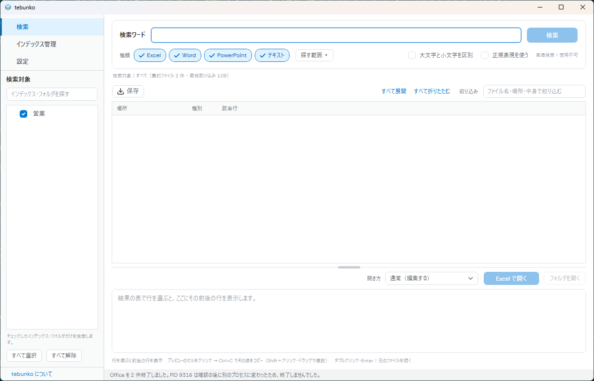

# 本体・共通の状態

タブに関わらない、本体の窓・起動中の表示・確認・メッセージボックス。状態の判定と画面の更新は[状態の判定と操作の流れ](../state-flow.md)、メッセージの一覧は[メッセージ一覧](../messages.md)にあり、ここには書き写さない。

## 目的

どのタブにいても出る、窓そのものの状態を残す。起動の途中、閉じるときの確認、設定が壊れていたときの知らせがある。

## 部品と並び

- 左に画面の一覧（［インデックス管理］［検索］［設定］）と、その下に［バージョン情報］。
- 窓の下端に、操作の結果を 1 行で出す状態の欄がある。

## 状態と遷移

設定ファイルが壊れていたときの知らせ（`window/settings-broken`）は、起動のときに出るメッセージボックスで、［OK］で本体に進む。

## 表示する文言

| 状態 | 文言 |
|---|---|
| 「バージョン情報」 | アイコン・名前・説明・「バージョン 開発版」、動作環境の表、「MIT ライセンスで公開しています」、［OK］ |
| 閉じるときの確認 | 「インデックスを更新中です。中止して閉じますか？」「更新したところまでは残ります。…」、［中止して閉じる］［閉じない］ |
| 設定が壊れていたとき | 「設定ファイルが壊れていたため、既定の設定で起動しました。…」、［OK］ |

「版」は、配布物では版の番号が入る。写真は開発中の版で撮っている。

## 写真

### window/about（「バージョン情報」。遷移 8）

### window/close-confirm（作成中に閉じるときの確認。遷移 10）

### window/settings-broken（設定が壊れていたときの知らせ）

### window/leftover（起動時の、前回残った Office の確認）

### window/leftover-open（詳細を開いた）

### window/leftover-many（数が多い）

### window/leftover-search（［検索］の上に出ている）

### window/leftover-killed・window/leftover-partial（終了したあとのステータス）

この 6 枚は、本物の Office を使わず、偽の行（[画面の実装](../leftover-office.md#画面の実装)の継ぎ目）を差し込んで撮る。

## 改善の候補

#169 の後の今の画面（写真は 10-08 撮影）を見て気づいたこと。直すかどうかは決めておらず、直すときは別のアイテムにする。一覧は[画面設計（現行）](index.md#改善の候補の一覧)にある。

- **W-1**（写真 `window/leftover`）: 「今回は終了しない」を選ぶと次に起動したときにも聞くという説明が、薄い小さな文字で、ボタンから離れている。理由: 選ぶ前に読んでほしい結果なので、ボタンの近くか本文に近い濃さで出すほうが気づきやすい。
