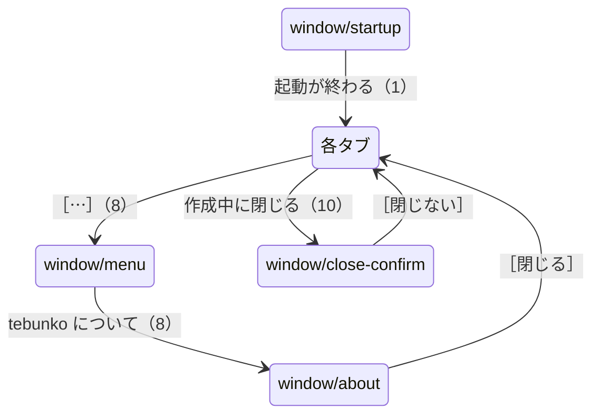
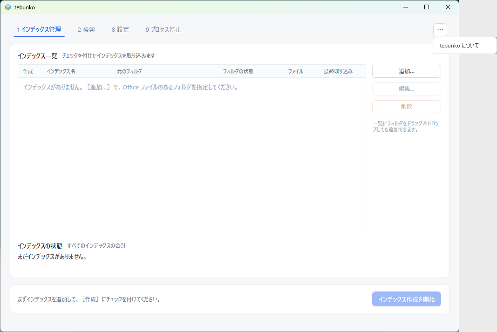

# 本体・共通の状態

タブに関わらない、本体の窓・起動中の表示・メニュー・確認・メッセージボックス。状態の判定と画面の更新は[状態の判定と操作の流れ](../state-flow.md)、メッセージの一覧は[メッセージ一覧](../messages.md)にあり、ここには書き写さない。

## 目的

どのタブにいても出る、窓そのものの状態を残す。起動の途中、［⋯］のメニュー、閉じるときの確認、設定が壊れていたときの知らせがある。

## 部品と並び

- 上にタブ（［1 インデックス管理］［2 検索］［8 設定］［9 プロセス停止］）、右上に［⋯］。
- 窓の下端に、操作の結果を 1 行で出す状態の欄がある。
- ［⋯］のメニューは「tebunko について」の 1 項目だけ。

## 状態と遷移

設定ファイルが壊れていたときの知らせ（`window/settings-broken`）は、起動のときに出るメッセージボックスで、［OK］で本体に進む。

## 表示する文言

| 状態 | 文言 |
|---|---|
| メニュー | 「tebunko について」 |
| 「tebunko について」 | 「版: 開発版」「ライセンス: MIT」、［閉じる］ |
| 閉じるときの確認 | 「まだインデックス作成の途中です。止めてから閉じますか？」、［インデックス作成を止めて閉じる］［閉じない］ |
| 設定が壊れていたとき | 「設定ファイルが壊れていたため、既定の設定で起動しました。…」、［OK］ |

「版」は、配布物では版の番号が入る。写真は開発中の版で撮っている。

## 写真

### window/startup（起動中の表示。遷移 1）

### window/menu（［⋯］のメニュー。遷移 8）

### window/about（「tebunko について」。遷移 8）

### window/close-confirm（作成中に閉じるときの確認。遷移 10）

### window/settings-broken（設定が壊れていたときの知らせ）

