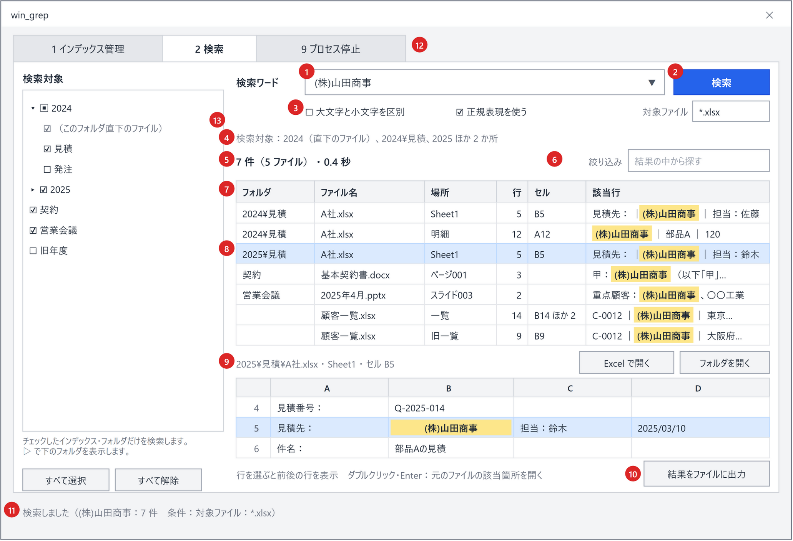
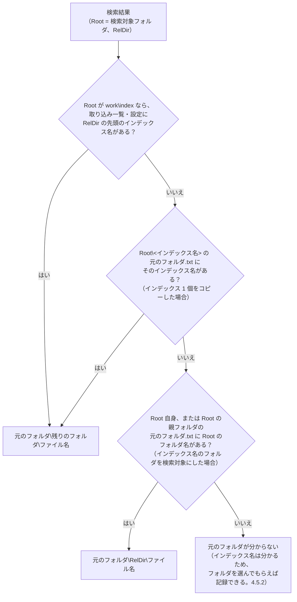
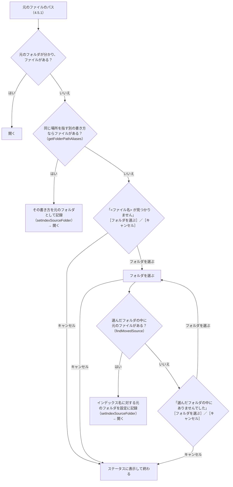
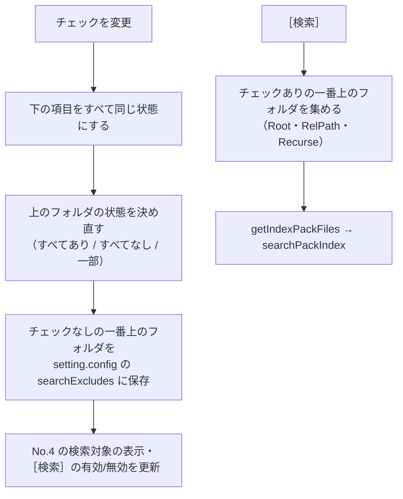

# ［2 検索］タブ

ワードを入れて検索し、結果を元のファイルごとの見出しで確かめ、元のファイルを開くタブ。左のツリーで検索するインデックス・フォルダを選ぶ。

| No. | 部品 | 仕様 |
|---|---|---|
| 1 | 検索ワード | 1 行の入力欄。**1 ワードのみ**。Enter で検索する |
| 2 | ［検索］ | 主ボタン。検索ワードが空、検索対象の集約ファイルが 0 件、または No.13 でチェックしたフォルダが無ければ無効。検索中は［中止］に変わる（[検索の実行](#検索の実行)） |
| 3 | 検索条件 | 検索ワードの下の行。［□ 大文字と小文字を区別］［□ 正規表現を使う］［☑ 図形も検索］［☑ コメントも検索］と「対象ファイル」の入力欄（図形・コメントは既定でオン、ほかは既定でオフ・空）。サクラエディタの Grep の条件にならう（[検索ワードの扱い](#検索ワードの扱い)）。正規表現がオンで、正規表現として不正なワードは入力欄の下に注意を出し、文字どおり検索する。対象ファイルの欄で Enter を押しても検索する |
| 4 | 検索対象 | No.13 のツリーで選んだ範囲。すべてチェックしているときは `検索対象：すべて（集約ファイル N 件 ・ 最終取り込み M/d H:mm）`（数え終わるまでは `検索対象：すべて（確認中…）`）、一部のときは `検索対象：営業\2024、営業\見積（直下のファイル） ほか 2 か所` のようにチェックしたフォルダを先頭の 3 か所まで表示する。何もチェックしていなければ `検索対象：なし（左の一覧で、検索するインデックス・フォルダにチェックを付けてください）`。集約ファイルが 0 件なら `検索対象：なし（インデックスがありません。先に［1 インデックス管理］で作成してください）` と表示し、［1 インデックス管理］タブへ移動するリンク［インデックスを作成する］を付ける |
| 5 | 件数 | `該当 N 件（M ファイル） ・ 0.4 秒`。検索中は `検索中…　該当 K 件`（集約ファイルを数えている間は `検索対象のファイルを確認しています…（N 件）`）。絞り込み中は `N 件中 K 件を表示` |
| 6 | 絞り込み | 結果の中から文字列で絞り込む（[絞り込み](#絞り込み)）。検索し直さずに結果を絞れる |
| 7 | 結果の表 | 元のファイルごとの見出しと、その下のヒットした行（フォルダ・ファイル名・場所・行・セル・該当行）。**検索した直後は見出しだけ**を出し、見出しのクリックで行を開く・閉じる（[ファイルごとにまとめた表示](#ファイルごとにまとめた表示)）。一致箇所を黄色で強調する（[結果の表](#結果の表)） |
| 8 | 選択行 | 選択した行と、その前後の行を No.9 に表示する。ダブルクリック・Enter で元のファイルの該当箇所を開く（[元のファイルを開く](#元のファイルを開く)） |
| 9 | 選択行のプレビュー | 選択行とその前後の行を、シートのような表（行番号と列見出し A, B, C…）で表示する（出す行数は高さに合わせて増減する）。一致したセルを黄色で強調する。見出しの右の［Excel で開く］（Word・PowerPoint は［開く］）で元のファイルの該当箇所を開き、［フォルダを開く］でエクスプローラーを開く。セルをクリックして Ctrl+C で値をコピーでき、列見出しの右端のドラッグで列幅を変えられる。**行を選んでいなくても枠は常に表示する**（[選択行のプレビュー](#選択行のプレビュー)） |
| 10 | ［結果をファイルに出力］ | 表示中の結果を `work/検索結果.txt`（[検索](../search/index.md) と同じ形式）に出力して開く（[結果をファイルに出力](#結果をファイルに出力)） |
| 11 | ステータス表示 | `検索しました（<ワード>：N 件）` など（[メッセージ一覧](common.md#メッセージ一覧)） |
| 12 | タブ見出し | ［9 プロセス停止］タブ（[［9 プロセス停止］タブ](process-tab.md)） |
| 13 | 検索対象のツリー | 画面の左側。**インデックスの一覧**（［1 インデックス管理］で作ったインデックス）と、その下のフォルダをチェック付きのツリーで表示し、**チェックしたインデックス・フォルダだけを検索する**（[検索対象のツリー（No.13）](#検索対象のツリーno13)）。下に［すべて選択］［すべて解除］を置く。左右の境目はドラッグで幅を変えられる |
| 14 | ［すべて展開］［すべて折りたたむ］ | 件数の行の右（No.6 の左）。すべてのファイルの行を開く・閉じる（[ファイルごとにまとめた表示](#ファイルごとにまとめた表示)） |
| 15 | ［開き方］ | No.9 の見出しの右。ダブルクリック・Enter・［Excel で開く］（［開く］）で元のファイルを開くときの開き方を `通常（編集する）` / `読み取り専用` / `新規（元のファイルを占有しない）` から選ぶ（既定は `通常（編集する）`。[元のファイルを開く](#元のファイルを開く)） |

## 検索の実行

- **検索処理は `tebunko/search/pack_search.ps1` の関数**（`getIndexPackFiles` / `searchPackIndex`、[実装構成](implementation.md#実装構成)）で行う。対象・照合・速度の仕様は [検索](../search/index.md) のとおり。
  - 検索対象は No.13 のツリーでチェックしたインデックス・フォルダ配下の `*.tsv`（[検索対象のツリー（No.13）](#検索対象のツリーno13)）。結果のフォルダ（相対パス）は、選んだフォルダではなくインデックスのフォルダ（`work\index`）から求めるため、フォルダを絞っても結果の表示・元のファイルを開く動作は変わらない。
- **検索の司令のスレッド（`SearchService`）で実行**し、検索中も画面を操作できるようにする。司令のスレッドと照合のプールは画面を開いている間使い回し、検索のたびに作らない（[寿命](../architecture/threads.md#寿命)）。検索 1 回は要求（`newSearchRequest`）として渡し、新しい検索を始めると前の検索は取り消す（要求の `Stop`）。
  - 高速検索が使えるとき（検索ワードの下の `高速検索：使用可`）は、Windows Search で検索語を含みうるフォルダを先に絞り、その集約ファイルだけを検索する（[検索](../search/index.md) [高速検索（Windows Search）](../search/fast-search.md)）。`高速検索：使用可 / 使用不可` は、ワード・［正規表現を使う］を変えるとすぐ変わる（`getFastSearchView`。Windows Search が使えるかは、画面を開いたときと検索のたびに確かめる）。
  - 集約ファイルを約 16MB ずつ検索し（[検索の実装（速度）](../search/index.md#検索の実装速度) [検索の実装（速度）](../search/index.md#検索の実装速度)）、そのたびに進捗（No.5 のバーと `検索中…　該当 K 件`、タスクバーのアイコン）を更新する。結果は 0.1 秒ごとに表へ移し、見つかったファイルの見出しから順に表示する（[ファイルごとにまとめた表示](#ファイルごとにまとめた表示)）。
  - 検索中は［検索］が［中止］に変わる（Esc でも中止）。中止した場合は、それまでの結果を残し、`中止しました（N 件まで表示）` と表示する。
- **件数の上限**：10,000 件（[決めたこと](implementation.md#決めたこと) U3）。上限に達したら検索を打ち切り、`10,000 件を超えたため、ここで打ち切りました。この先のファイルは検索していないため、ワード・対象ファイル・検索対象で絞り込んでください。` と表示する。
  - フォルダの順・集約ファイルの名前（拡張子・番号）の順・集約ファイルの中の順に検索するため、打ち切った時点より後ろのファイルのヒットは結果に出ない（件数の多い順などで選ばれるわけではない）。利用者が「全部出ている」と誤解しないよう、メッセージでその旨を伝える。
- インデックス作成中でも検索できる。その場合、ステータスに `インデックス作成中のため、作成途中のインデックスを検索しています。` と表示する（U4）。

## 検索ワードの扱い

| 項目 | 仕様 |
|---|---|
| ワード数 | 1 つ。入力欄は 1 行。前後の空白は取り除く |
| 正規表現オフ（既定） | 文字どおりに検索する（`newSearchRegex` でワードをエスケープする）。`(株)` `1.5` `C++` などもそのまま探せる |
| 正規表現オン | 正規表現として検索する。`[regex]::new()` が失敗するワードは、入力欄の下に `正規表現として不正なため、文字どおり検索します。` と表示し、文字どおり検索する（[検索](../search/index.md) [検索仕様](../search/index.md#検索仕様)） |
| 大文字と小文字を区別 | オンなら英字の大文字と小文字を区別する（既定は区別しない） |
| 図形も検索・コメントも検索 | オフにすると、図形（場所 `<元の場所>[図形]`）・コメント（場所 `<元の場所>[コメント]`）を検索しない（既定はどちらもオン）。本文（セルの値・段落）だけを探したいときに使う。Excel・Word・PowerPoint で共通（PowerPoint のテキストボックス・図形の文字はスライドの本文なので、オフにしても検索する） |
| 対象ファイル | 元のファイル名で検索するファイルを絞る。書き方は [検索](../search/index.md) [検索条件（サクラエディタの Grep にならう）](../search/index.md#検索条件サクラエディタの-grep-にならう)（例: `*.xlsx;見積;!*old*`。空欄には `すべて（例: *.xlsx;見積;!*old*）` と薄く出す）。結果の上限（10,000 件）に達しやすいときに、検索前に対象を絞れる。一致するファイルが無ければ No.5 に `対象ファイル（<指定>）に一致するファイルがありません。` と表示する |
| 一致箇所の強調 | 結果の表・プレビューの強調には、検索と同じ正規表現（`newSearchRegex`）を使う。このため、大文字と小文字の区別も強調に反映される |
| 条件の表示 | 既定から変えた条件があれば、ステータスを `検索しました（<ワード>：N 件　条件：大文字と小文字を区別・対象ファイル：*.xlsx）` とする（図形・コメントをオフにしたときは `図形を除く` `コメントを除く`）。0 件のときは No.5 にも `見つかりませんでした。（検索条件：…）` と条件を出す（正規表現オフで記号を含むワードなら、代わりに `見つかりませんでした。（正規表現として探す場合は［正規表現を使う］をオンにしてください）`） |
| 設定の保存 | 各条件は `setting.config` の `useRegex` / `caseSensitive` / `fileFilter` / `includeShapes` / `includeComments` に保存し、次回も引き継ぐ（[画面での読み書き](../architecture/settings-file.md#画面での読み書き)）。チェックボックスはクリックしたとき、対象ファイルは欄からフォーカスが外れたときと検索したときに保存する |

正規表現を既定オフにするのは、業務文書によく出る表記が意図しない結果になるためである。

| 入力 | 利用者の意図 | 正規表現として検索した場合 |
|---|---|---|
| `(株)` | 「(株)」を探す | `( )` がグループとみなされ、「株」を含む行すべてにヒットする |
| `1.5` | 「1.5」を探す | `.` が任意の 1 文字とみなされ、「105」「1-5」にもヒットする |
| `C++` | 「C++」を探す | 正規表現として不正なので文字どおり検索になる |

## 結果の表

| 列 | 内容 | 例 |
|---|---|---|
| フォルダ | インデックスフォルダからの相対フォルダ（= クロール対象フォルダからの相対フォルダ）。直下は空欄 | `2024\見積` |
| ファイル名 | 元のファイル名（ヒットの `Book`。集約ファイルの `ファイル名=` の値） | `A社.xlsx` |
| 場所 | 種類と、シート名・ページ番号・スライド番号（`describePlace`。[検索](../search/index.md) [出力フォーマット](../search/output.md#出力フォーマットwork検索結果txt)）。Word のページは目安のため「（目安）」を付ける。並べ替えは TSV の名前（`Location`。`ページ003` のように桁をそろえてある）で行う | `[シート] 売上` / `[ページ] 3（目安）` / `[スライド] 2（非表示）` |
| 種別 | 行の中身の種類。Excel はセル・図形・コメント、Word・PowerPoint は本文・ノート。図形・コメントは、検索条件の［図形も検索］［コメントも検索］と同じ言葉 | `セル` / `図形` / `コメント` / `本文` / `ノート` |
| 行 | 場所の中の行番号（元の TSV の行番号。Excel では元のシートの行番号） | `5` |
| セル | Excel のみ。最初に一致したセル。図形・コメントの場所（`<シート名>[図形]` 等）は、図形の左上・コメントのセル（該当行の 1 列目。プレビューの列名は「セル」「文字」）。1 行の中で複数のセルが一致したときは、ほかの数を ` ほか N` で付ける。Word・PowerPoint は空欄 | `B5` / `B5 ほか 2` |
| 該当行 | インデックスの 1 行（元の TSV の 1 行）。セルの区切り（タブ）は ` │ ` で表示する。Excel の図形・コメントの行（場所 `<シート名>[図形]` 等）は、先頭のセル番地を「セル」列に出すため除き、囲みの `"` を外した文字だけを出す（例: `納期は↵別途ご相談`。`HitRow.ShownText`）。一致箇所は黄色の背景・太字で強調する（正規表現オンのときは一致した範囲） | `見積先： │ (株)山田商事 │ 担当：佐藤` |

- 2 つ以上の検索対象インデックスのフォルダ（No.13 のツリーの一番上）から検索したときは、先頭に「インデックス」列（インデックスフォルダ名）を追加する。
- 表示順は既定でパス順（[検索](../search/index.md) [検索仕様](../search/index.md#検索仕様) の検索順）。列見出しのクリックで並べ替える（もう一度で逆順。ファイルの中の行を並べ替え、ファイルの順もそれに合わせる。[ファイルごとにまとめた表示](#ファイルごとにまとめた表示)）。
- 列幅は変えられる。該当行が長いときは末尾を `…` で省略し、ツールチップに全文を出す。
- 複数行を選択できる（Shift / Ctrl＋クリック）。
- Excel のセル内改行（取り込み時にマーカーへ置き換えたもの。[Excel](../indexer/excel.md) の [TSV 整形仕様](../indexer/excel.md#tsv-整形仕様prettytsv--formattsv)）は `↵` で表示する。

## 絞り込み

- 入力のたびに（0.3 秒待ってから）、フォルダ・ファイル名・場所・種別・行・該当行（インデックスの行そのまま）を対象に部分一致（大文字・小文字を区別しない）で絞り込む（`HitRow.Contains`）。「セル」列は対象にしない。
- 絞り込み中は No.5 に `N 件中 K 件を表示` と表示する。入力欄を空にすると解除する。
- 新しく検索すると絞り込みは解除する。

> **[元のファイルを開く](#元のファイルを開く) 元のファイルを開く**（[元のフォルダの特定（インデックスを別の PC・場所で使う場合）](#元のフォルダの特定インデックスを別の-pc場所で使う場合) 元のフォルダの特定・[元のファイルが見つからないとき（元のフォルダを設定する）](#元のファイルが見つからないとき元のフォルダを設定する) 元のファイルが見つからないとき）→ [元のファイルを開く](#元のファイルを開く)

## 元のファイルを開く

検索結果の行から元の Office ファイルを開く方法（開き方の 3 種類・Excel の該当セルへの移動）と、インデックスを別の PC・場所で使うときに元のファイルを見つける仕組み（[元のフォルダの特定（インデックスを別の PC・場所で使う場合）](#元のフォルダの特定インデックスを別の-pc場所で使う場合)・[元のファイルが見つからないとき（元のフォルダを設定する）](#元のファイルが見つからないとき元のフォルダを設定する)）を定める。

ダブルクリック、Enter、選択行のプレビューの［Excel で開く］（Word・PowerPoint は［開く］。[選択行のプレビュー](#選択行のプレビュー)）、または右クリックメニュー［元のファイルを開く］で開く。

| 項目 | 仕様 |
|---|---|
| 元のファイルのパス | 結果のフォルダの先頭（インデックス名）からクロール対象フォルダを引き、`<クロール対象フォルダ>\<残りのフォルダ>\<ファイル名>` とする（`getSourceLocation` / `resolveSourcePath`、[元のフォルダの特定（インデックスを別の PC・場所で使う場合）](#元のフォルダの特定インデックスを別の-pc場所で使う場合)）。記録された置き換え（[元のファイルが見つからないとき（元のフォルダを設定する）](#元のファイルが見つからないとき元のフォルダを設定する)）があれば反映する |
| 開き方 | 選択行のプレビューの［開き方］で選ぶ（既定は「通常」）。選んだ開き方は `setting.config` の `openMode` に保存し、次回も引き継ぐ（[画面での読み書き](../architecture/settings-file.md#画面での読み書き)）。右クリックメニューでは、その時だけ別の開き方も選べる ・**通常**（`normal`）: 元のファイルをそのまま開く（編集して上書き保存できる） ・**読み取り専用**（`readOnly`）: 元のファイルを読み取り専用で開く（誤って上書き保存しない） ・**新規**（`new`）: 元のファイルを基にした無題のブック・文書として開く（元のファイルを占有しない） |
| Excel | 起動中の Excel があればそれを使い、無ければ起動する（COM）。ブックを開き（「読み取り専用」は `Workbooks.Open(<元のファイル>, , ReadOnly:=True)`、「新規」は `Workbooks.Add(<元のファイル>)`。そのブックが既に開いていれば、開き方によらずそのブックを使う）、**該当シートを表示して、一致したセル（最初に一致したセル。[結果の表](#結果の表) の「セル」列）を選択する**。該当シートは「場所」と名前が同じシートとし（図形・コメントの場所 `<シート名>[図形]` `<シート名>[コメント]` は、`[…]` を除いたシート名。`splitObjectPlace` の Base。選ぶセルは図形の左上・コメントのセル）、無ければ名前を `toSafeFileName` で全角に置き換えて一致するシートとする（以前の版のインデックスは、シート名の記号を全角に置き換えてあるため。`衝突"` と `衝突”` のように置き換えると重なるシートがあるので、名前が同じものを先に選ぶ）。COM で失敗したら、ファイルを既定のアプリで開くだけにする（「新規」ならエクスプローラーの［新規］と同じ動作） |
| Word・PowerPoint | ファイルを既定のアプリで開く。エクスプローラーの右クリックメニューと同じシェルの動詞を使う（「読み取り専用」は `OpenAsReadOnly`、「新規」は `New`）。該当ページ・スライドへの移動はしない（[今後の検討](implementation.md#今後の検討)） |
| ファイルが無い・元の場所が分からない | 元のファイルのあるフォルダを選んでもらい、その中から探す（[元のファイルが見つからないとき（元のフォルダを設定する）](#元のファイルが見つからないとき元のフォルダを設定する)）。選ばなかった場合は、ステータスに `元のファイルが見つかりません：<パス>` と表示する |

右クリックメニュー：

| メニュー | 動作 |
|---|---|
| 元のファイルを開く（編集する） | 「通常」で開く |
| 読み取り専用で開く | 「読み取り専用」で開く |
| 新規で開く | 「新規」で開く |
| フォルダを開く | 選択行のプレビューの［フォルダを開く］と同じ。エクスプローラーで元のファイルを選択した状態で開く（`explorer /select,`）。ファイルが無い・元の場所が分からない場合は、元のファイルを開くときと同じくフォルダを選んでもらう |
| 選択行をコピー（Ctrl+C） | 選択行を `work/検索結果.txt` と同じ形式（`toResultHeader` の見出し＋`toResultLine` の各行）でクリップボードに入れる。Excel に貼るとセルが元の列の位置に並ぶ |
| ファイルのパスをコピー | 元のファイルのフルパス（置き換えを反映。分からない場合は、インデックスの中の位置 `<相対フォルダ>\<元のファイル名>`）。ファイルがあるかは確かめず、フォルダも聞かない |

「読み取り専用」「新規」で開く：

| 開き方 | 開いた後 | 元のファイル |
|---|---|---|
| 通常 | 元のファイルを編集し、上書き保存できる | 編集できる状態で開く |
| 読み取り専用 | 上書き保存はできない（編集するときは名前を付けて保存する）。誤って元のファイルを変えてしまうことがない | 読み取り専用で開く（実測では、開いている間もほかのアプリ・利用者が書き込めた） |
| 新規 | 元のファイルを基にした新しい無題のブック・文書（例: `見積.xlsx` → `見積1`）。保存するときは名前を付けて保存になる | 読み込む間だけ読み、開いた後は占有しない。共有フォルダのファイルをほかの人が編集中でも開け、ほかの人の編集・上書き保存も妨げない |

- Word・PowerPoint はシェルの動詞で開く。その動詞が登録されていない種類のファイルは、元のファイルをそのまま開き、ステータスに `読み取り専用で開けなかったため、元のファイルを開きました：<パス>` / `新規で開けなかったため、元のファイルを開きました：<パス>` と表示する。`ProcessStartInfo.Verbs` は `New` を一覧に含めないため、事前に確かめず実行して例外（`Win32Exception`）で判断する（`openWithShell`）。
- `Start-Process` はパスの `[` `]` をワイルドカードとして扱うため、`ProcessStartInfo` で開く。
- ［開き方］は、起動時に設定から読み込むときは保存しない（設定していない利用者の `setting.config` を作らないため。[画面での読み書き](../architecture/settings-file.md#画面での読み書き)）。

### 元のフォルダの特定（インデックスを別の PC・場所で使う場合）

インデクサは `元のフォルダ.txt`（インデックス名とクロール対象フォルダの対応。[インデックス作成（インデクサ）](../indexer/index.md) の [取り込み一覧と取り込み対象の決定（差分・中断・再試行）](../indexer/flow.md#取り込み一覧と取り込み対象の決定差分中断再試行)）を、**各インデックスのフォルダ（`work\index\<インデックス名>`）に 1 件分ずつ**置く。このため、`work\index` ごとコピーしても、`<インデックス名>` のフォルダだけを別の PC の `work\index` 直下へコピーしても、元のファイルの場所が分かる。

対応は次の順に読み、後のもので上書きする（`getSourceFolderMap`）。**設定が最も優先される**ため、フォルダを移したときは設定の場所（インデックス名に対する 1 か所）を書き換えるだけで、元のファイルを開けるようになる。

| 順 | 情報 | 内容 |
|---|---|---|
| 1 | インデックスの `元のフォルダ.txt`（`<インデックス名>` のフォルダの中。検索対象フォルダにインデックス名のフォルダを直接指定した場合は、その直下） | インデックスを作ったときの場所。インデックスをコピーしても付いてくる |
| 2 | 取り込み一覧（`work\取り込み一覧.tsv`） | 既定のインデックス（`work\index`）のときだけ |
| 3 | 設定（`setting.config` の `targetFolders` / `indexSources`） | **インデックス名に対する今の置き場所**。利用者が指定した情報のため最優先 |

- 読んだ対応は、検索対象フォルダごとに画面でキャッシュする（インデックス作成が終わったとき・元のフォルダを設定したときに捨てる）。
- `元のフォルダ.txt` の無い古いインデックスは、インデックス作成を 1 回実行すると作られる（取り込みが必要なファイルが無くても作る）。
- どれにも無い場合は、元のフォルダが分からない（`Known` = `$false`）。インデックス名（相対フォルダの先頭）は分かるため、フォルダを選んでもらえば設定に記録できる（[元のファイルが見つからないとき（元のフォルダを設定する）](#元のファイルが見つからないとき元のフォルダを設定する)）。

### 元のファイルが見つからないとき（元のフォルダを設定する）

別の PC ではドライブ名・共有フォルダのパスが違う、フォルダを移した、といった場合は元のパスのままでは開けない。その場合は元のファイルのあるフォルダを選んでもらい、**そのインデックスの元のフォルダ（今の置き場所）として設定に記録する**（`setIndexSourceFolder`）。インデックス名に対して 1 か所を持つため、以後は同じインデックスのどのファイルも聞かずに開ける。

- 記録された場所にファイルが無い場合は、フォルダを聞く前に**同じ場所を指す別の書き方**でも探す（`getFolderPathAliases`）。
  ファイルサーバーのフォルダは、ネットワークドライブ（`Z:\見積`）と UNC パス（`\\server\share\見積`）のどちらでも書けるため、
  インデックスを作った PC と、この PC でドライブの割り当てが違っても、聞かずに開ける。見つかった書き方はそのまま元のフォルダとして記録する。
  この PC にそのドライブの割り当てが無い場合は別名が分からないため、フォルダを選んでもらう。
- 選ぶフォルダは、インデックスの元のフォルダに当たるフォルダでも、その下のどのフォルダ（ファイルのあるフォルダなど）に当たるフォルダでもよい。元の相対フォルダが `2024\見積` なら、`<選んだフォルダ>\2024\見積\<ファイル名>`、`<選んだフォルダ>\見積\<ファイル名>`、`<選んだフォルダ>\<ファイル名>` の順に探し、最初に見つかったものを使う。
- 記録するのは、選んだフォルダから相対フォルダの分だけ上に戻ったフォルダ（`findMovedSource` の `Root`）。どのフォルダを選んでも、インデックスの元のフォルダに当たる 1 か所が記録される。上に戻れない場合は記録せず、そのファイルを開くだけにする。
- 記録先（`setIndexSourceFolder`、[画面での読み書き](../architecture/settings-file.md#画面での読み書き)）:
  - そのインデックス名がクロール対象フォルダ（`targetFolders`）にあれば、そのフォルダの `path` を書き換える（次のインデックス作成では、この新しいフォルダを取り込む）。
  - 無ければ `indexSources` に `{name, path}` として記録する（取り込まない、検索だけのインデックス）。
- フォルダ選択の初期位置は、元のパスの上のフォルダのうち存在する最も深いフォルダ。
- 記録したら、元のフォルダの対応のキャッシュ（[元のフォルダの特定（インデックスを別の PC・場所で使う場合）](#元のフォルダの特定インデックスを別の-pc場所で使う場合)）を捨てて読み直す。

確認は確認ダイアログ（[確認ダイアログ](common.md#確認ダイアログshowconfirm)）で行う。見出しは `<ファイル名> が見つかりません`、ボタンは［フォルダを選ぶ］。

メッセージ：

| 場面 | メッセージ |
|---|---|
| ファイルが無い | `✗ 記録されていた場所にありません`（`<パス>`）＋ `→ 今ある場所のフォルダを選べば開けます`（`選んだ場所はインデックス「<名前>」に覚えさせるので、同じインデックスのほかのファイルも次から開けます`） |
| 元のフォルダが分からない | `✗ このファイルが今どこにあるか、記録がありません`（`<相対パス>`）＋ 上と同じ `→` の行 |
| フォルダ選択の説明 | `「<元のフォルダ>」に当たるフォルダ（または <ファイル名> のあるフォルダ）を選んでください`（元のフォルダが分からない場合は `<ファイル名> のあるフォルダ（またはインデックス [<名前>] の元のフォルダ）を選んでください`） |
| 選んだフォルダに無い | `✗ 選んだフォルダの中にありませんでした`（`選んだフォルダ：<フォルダ>` / `探したファイル：<相対パス>`）＋ `→ 別のフォルダを選んで、もう一度探せます` |
| 記録した（ステータス） | `インデックス [<名前>] の元のフォルダを <フォルダ> に変えました`（続けて開いた結果で上書きされる） |

## 結果をファイルに出力

- 表示中の結果（絞り込み後。閉じているファイルの行も含む）を `work/検索結果.txt` に出力し、既定のアプリで開く。ステータスには `検索結果.txt に出力しました（N 件）` と表示する。
- 形式は [検索結果ファイル](../search/output.md) のとおり。出力は `tebunko/search/search_run.ps1` の関数（`toSearchResultLines` / `writeSearchResult`、[実装構成](implementation.md#実装構成)）で行う。
- 絞り込み中は、見出しの件数を表示中の件数とし、ステータスに `絞り込み後の K 件を検索結果.txt に出力しました` と表示する（U7）。
- 書き込めないときはステータスに表示する。ファイルが開かれているときは `検索結果.txt に書き込めません。開いているアプリを閉じてから、もう一度出力してください。`、読み取り専用・権限が無いときは `検索結果.txt に書き込む権限がありません（読み取り専用など）。<パス> を確かめてから、もう一度出力してください。`。
- まだ検索していなければ `先に検索してください。` と表示する。

## 選択行のプレビュー

結果の表で行を選ぶと、表の下に**選択行とその前後の行**を表示する。元のファイルを開かなくても、一致した場所の周り（見出しの行・隣のセルなど）が分かる。

| 項目 | 仕様 |
|---|---|
| 表示・非表示 | **常に表示する**（行を選んでいなくても枠を出したままにする）。行を選ぶたびに表の高さが変わらず、次に選んだ行も同じ場所に出る。行を選んでいないときは、枠の中に `結果の表で行を選ぶと、ここにその前後の行を表示します。` と出し、［Excel で開く］［フォルダを開く］は押せない |
| 高さの変更 | 結果の表とプレビューの間の線を**上下にドラッグして高さを変えられる**（`GridSplitter`）。結果の表は 60px、プレビューは 100px（列見出し＋1 行が見える高さ）を下限とする。初めの高さは 200px。高さは画面を開いている間だけ保つ（設定には保存しない）。**高さを変えると、出す行数もそれに合わせて変わる**（下の「表示する行」） |
| 見出し | `<相対フォルダ\ファイル名> ・ <場所> ・ <種別> ・ セル <B5>`（Excel）/ `… ・ <N> 行目`（Word・PowerPoint）。右に［開き方］の選択（[元のファイルを開く](#元のファイルを開く)）、［Excel で開く］（Word・PowerPoint は［開く］）と［フォルダを開く］を置く。動作は [元のファイルを開く](#元のファイルを開く) の［元のファイルを開く］・［フォルダを開く］と同じ |
| 表示する行 | **プレビューの高さに収まるだけ**（`getPreviewContextLines`）。表示できる行数を「行の表示領域の高さ ÷ 1 行の高さの目安 22px（`previewRowHeight`）」で求め、選択行の前後に同数ずつ割り当てる（余りの 1 行は後ろに付ける）。下限の高さでは**選択行の 1 行だけ**、高くするとその分だけ前後の行が見える。上限は 101 行（`maxPreviewRows`）。 高さを変えると（`PreviewScroll` の `SizeChanged`）読み直すが、ドラッグ中は何度も起きるため、選択の変更と同じ 120 ms のタイマーでまとめて 1 回だけ読む。このとき横スクロールの位置は変えない（ドラッグのたびに左へ戻らないようにするため） インデックスの集約ファイルから、ヒットの元のファイル・場所（`Book`・`Location`）の中の該当の行だけを取り出す（`readPackContext`、[実装構成](implementation.md#実装構成)）。Excel は場所の N 行目がシートの N 行目なので、元のシートの前後の行になる。場所の先頭・末尾では、ある行だけを表示する |
| 読み込みの速さ | 大きな集約ファイルでも画面が固まらないよう、次の 3 つを行う。 ・読み込み（`readPackContext`）は画面のスレッドでは行わず、画面の裏の仕事のスレッド（`startJob`。`BackgroundQueue`）で行う。読み終わったら表を作る。読んでいる間に別の行を選んだら、古い行の結果（頼んだ番号が古いもの・今選んでいない行のもの）は捨てる ・検索で読んだ集約ファイルの内容と場所の一覧（`newTsvTextCache`。[検索の実装（速度）](../search/index.md#検索の実装速度) [検索の実装（速度）](../search/index.md#検索の実装速度)）があれば、ファイルを読み直さずに使う。集約ファイルが書き換わったら（大きさ・更新日時が変わったら）読み直す。キャッシュに無い（上限を超えた等）ときは、選ぶたびに集約ファイルを読む ・↑↓で続けて選択が変わったときは、最後の選択の 120 ms 後に 1 回だけ読む |
| 表示する列 | 横に長い行（2,000 列など）をそのまま並べると画面が重くなるため、**一度に表示する列は 200 列まで**にする（`MaxPreviewColumns`）。一致したセルが真ん中に来るように範囲を選び、行の端に近ければその端に寄せる。省略したときは、プレビューの下に `表示は <BQG〜BXX> の 200 列（全 2,000 列）` と出す（`PreviewNote`）。ほかの列は元のファイルを開いて確認する 実測（2,000 列の行）: 行を選んでからプレビューが出るまで、全列を並べると約 2.8 秒、200 列までにして約 0.6 秒 |
| 表の形 | 左端に行番号、上に列見出し（Excel は A, B, C…、Word・PowerPoint はタブで分けた順の 1, 2, 3…）。セルの分け方は `splitTsvCells` と同じ（`"` で囲まれたセルは 1 セル） |
| 強調 | 選択行は行全体を薄い青にし、行番号を太字にする。一致したセルは黄色の背景・太字（前後の行で一致したセルも同じ） |
| 列の幅 | 初めの幅は、見出しと各行のセルの文字数（セル内改行のあるセルは最も長い行）から決める（Excel は最大 260px、段落が 1 列になる Word・PowerPoint は最大 640px）。**列見出しの右端をドラッグすると幅を変えられる**（下限 24px）。変えた幅はその表示の間だけ有効で、ほかの行を選ぶと初めの幅に戻る |
| セルの表示 | セル内改行のあるセルは改行のまま折り返して表示する（3 行程度まで。入りきらない分は隠れる）。1 行のセルも幅に入りきらなければ折り返す **長いセルは先頭 300 文字＋`…` で表示**し（`MaxCellChars`）、ツールチップは先頭 1,000 文字まで（`MaxToolTipChars`）。コピー（下の「値のコピー」）は切り詰めずに元の値をそのまま使う。列の幅を決めるときも各行の先頭 100 文字までしか見ない（`MaxWidthChars`。幅には上限があるため結果は変わらない） 実測（32,767 文字のセル）: 切り詰めないと約 0.9 秒、切り詰めて約 0.4 秒 |
| 値のコピー | セルをクリックするとそのセルを選び（青い枠）、**Ctrl+C でその値をコピーする**。Shift＋クリック、またはドラッグで四角い範囲を選べる。右クリックメニューに［選んだセルをコピー］［この行をコピー］を置く ・1 セル：値をそのまま（引用符・エスケープなし）入れるので、ほかのアプリの入力欄にそのまま貼れる ・複数セル：タブ区切り・行は改行で入れる。改行・タブ・`"` を含むセルは `"` で囲む（Excel に貼り付けると元の位置に並ぶ） ・ステータスに `セルの値をコピーしました：<値>` / `N 個のセルをコピーしました（Excel に貼り付けると、元の位置に並びます）` と表示する |
| 縦スクロール | 出す行数は高さに合わせるが、セル内改行のある行は 1 行の目安（22px）より高いため入りきらないことがある。そのときは縦にスクロールする。**列見出しは行とは別のスクロールに置いて固定**し、縦スクロールで隠れないようにする（横位置は行に合わせる） |
| 横スクロール | 選択行で最初に一致したセルが見えないときは、そのセルが見える位置まで横にスクロールする |
| 集約ファイルが読めない | インデックスが作り直された・削除されたなどで読めない・その場所が見つからないときは、選択行だけを表示する（読み込みのスレッドで失敗したときも同じ） |

## 検索対象のツリー（No.13）

インデックスが大量にあると、すべてを検索するのに時間がかかる。ツリーで**インデックス単位・フォルダ単位に検索対象を絞れる**ようにする。

| 項目 | 仕様 |
|---|---|
| 一番上の項目 | **インデックス 1 件**（`getSearchIndexes`。`work\index` 直下のフォルダ）。表示名はインデックス名で、並びは［1 インデックス管理］の一覧と同じ（その一覧に無いもの＝別の場所・PC からコピーしたインデックスは名前順で後ろ）。インデックスが 1 つも無ければ、ツリーに `インデックスがありません。［1 インデックス管理］でインデックスを作成してください。` と表示する。存在しないフォルダは茶色で表示し、ツールチップに `（フォルダが見つかりません。検索時はスキップします）` を出す |
| 下の項目 | インデックスの中のフォルダ（= クロール対象フォルダの中のフォルダ）。名前順。**元のファイル名のフォルダ**（`A社.xlsx` など。取り込み中だけ TSV をこの中に置く。[配置・命名規則](../indexer/index-format.md#配置命名規則) [配置・命名規則](../indexer/index-format.md#配置命名規則)）は、フォルダではなくファイルなのでツリーに出さない（`IndexNode.IsBookDir`。判定は `tebunko/index/index_name.ps1` の `$indexBookDirPattern` と同じ、Office の拡張子で終わる名前） |
| 読み込み | 起動時はインデックスの一覧だけを読む。その下は、▷ で展開したときに初めてそのフォルダの中を読む（フォルダの一覧だけを読み、集約ファイルは数えない）。大量のインデックスでも表示に時間がかからない |
| ツールチップ | 元のフォルダ（`元のフォルダ.txt`・取り込み一覧から引いたクロール対象フォルダ＋その下のフォルダ）。一番上の項目はインデックスのフォルダのパスも出す。分からなければインデックスのフォルダのパス |
| 直下のファイル | サブフォルダと集約ファイル（`content.*.tsv`）の両方があるフォルダには、先頭に `（このフォルダ直下のファイル）` の項目を置く（灰色）。サブフォルダの一部だけを選んだとき、そのフォルダ直下のファイルを含めるかをこの項目のチェックで表す（`getIndexPackFiles` の `Recurse` が `$false` のときと同じ）。集約ファイルに入れる前の TSV（元のファイル名のフォルダの中）が残っているフォルダも、直下のファイルがあるものとして扱う（`IndexNode.HasFiles`） |
| チェック | 既定はすべてチェックあり。フォルダのチェックを付ける・外すと、その下もすべて同じにする。下の項目の一部だけがチェックありのフォルダは「一部」（▣）の表示になる。スペースキーで選択中の項目のチェックを切り替える。［すべて選択］［すべて解除］は一番上の項目ごと切り替える |
| 検索する範囲 | チェックありの一番上のフォルダごとに、その配下（`（このフォルダ直下のファイル）` は直下だけ）の集約ファイルを検索する（`getIndexPackFiles` に Root＝`work\index`・RelPath＝`<インデックス名>` からの相対パス・Recurse を渡す） |
| 保存 | チェックを変えるたびに、**チェックなし**の一番上のフォルダ（直下のファイルだけ外した場合はその旨）を `setting.config` の `searchExcludes` に保存し、次回起動時に戻す（`readSearchExcludes` / `writeSearchExcludes`）。チェックなしを保存するため、あとから作成したインデックス・フォルダはチェックありで表示される。存在しないインデックスのフォルダ（ネットワークのドライブが切れているなど）の記録は消さずに残す |
| 読み直し | インデックス作成が終わったとき、F5 で読み直す。チェックの状態（保存したもの）と展開の状態は保つ |

## ファイルごとにまとめた表示

結果の表（No.7）は、**元のファイルごとの見出し**の下に、そのファイルでヒットした行を並べる。検索した直後は**すべて閉じた状態（見出しだけ）**にし、どのファイルに何件あるかを先に見せる。1 つのファイルに多くヒットしても一覧が長くならず、件数が多くても表に入れる項目がファイルの数だけで済むため速い。

| 項目 | 仕様 |
|---|---|
| 見出し | 元のファイル 1 つに 1 行。左から、開閉の印（閉じている `▸` / 開いている `▾`）、アプリのアイコン（Excel は緑の `X`、Word は青の `W`、PowerPoint は赤の `P`）、ファイル名（太字）、フォルダ（インデックスフォルダからの相対パス）。右端に、ヒットした場所と件数（`[シート] 4月 ほか 2 か所` ・ `3 件`）。ツールチップは元のファイルのフルパス |
| 場所の表記 | 結果の表の「場所」列と同じ表記（`describePlace`。`[シート] 4月`・`[ページ] 3（目安）`・`[スライド] 7` など）。2 か所以上なら、見つかった順の先頭と残りの数を `[シート] 4月 ほか 2 か所` のように出す（`describeFileLocations`）。絞り込み中もすべてのヒットから作る |
| 件数 | 見出しの件数は、そのファイルで**絞り込みに合う行の数**。No.5 の件数は `該当 N 件（M ファイル）`（行の数と、ファイルの数） |
| 開く・閉じる | 見出しをクリック（または選んで Enter）すると、そのファイルの行を開く・閉じる。Shift・Ctrl を押しながらのクリックは複数選択なので切り替えない。No.14 の［すべて展開］［すべて折りたたむ］で、すべてのファイルを開く・閉じる。検索中に［すべて展開］を押すと、そのあと見つかったファイルも開いた状態で足す。新しく検索すると、すべて閉じた状態に戻る |
| 見出しを選んだとき | そのファイルの先頭の行（絞り込みに合うもの）を選んだものとして扱う。選択行のプレビュー（[選択行のプレビュー](#選択行のプレビュー)）はその行を出し、［Excel で開く］［フォルダを開く］、右クリックメニューの［元のファイルを開く］などはその行の場所を開く。ダブルクリックでは開かない（クリックで開閉するため）。Ctrl+C（［選択行をコピー］）は、そのファイルの行（絞り込みに合うもの）をすべてコピーする |
| 並び順 | ファイルは既定でパス順（見つかった順）。列見出しをクリックすると、ファイルの中の行をその列で並べ替え、ファイルの順は並べ替えた後の先頭の行の順にする（もう一度で逆順。`sortFileGroups`）。検索中に並べ替えたときは、検索の終わりに、あとから来た行も含めて並べ直す |
| 絞り込み | 絞り込み（[絞り込み](#絞り込み)）はファイルの中の行に当て、合う行が 1 つも無いファイルは見出しも出さない（`selectShownRows`・`getResultItems`） |
| 結果をファイルに出力 | 閉じているファイルの行も含め、絞り込みに合うすべての行を表の順に出力する（`getShownHitRows`。形式は [結果をファイルに出力](#結果をファイルに出力) のまま） |

- 表（`ResultGrid`）には、見出し（`FileGroup`）と、開いているファイルの行（`HitRow`）だけを入れる（`result_list.ps1`）。見出しの行は、行の形（`DataGridRow` の `Template`）を `tab_search.xaml` の `FileHeaderRow` に替えて、列をまたいだ 1 行にする。
- **行は必要になるまで作らない（遅延表示）。** 検索中は、ヒットを見出しの `Hits` に生のまま足すだけにし、1 回の取り込み（`pumpSearch`）の最後に、新しいファイルの見出しをまとめて表に入れる（`flushResults`）。表の行（`HitRow`。場所の表示・強調の元になる）は、ファイルを開いたとき・見出しを選んだとき・絞り込み・並べ替え・出力・コピーのときに、必要なファイルの分だけ作る（`ensureRows`）。見出しの件数は、絞り込んでいなければヒットの数（行を作らずに分かる）、絞り込み中は合う行の数にする。一致箇所の強調などは、画面に出た行だけで作る（`HitRow.Prepare`）。
- 開閉・絞り込み・並べ替えで多くの行を出し入れするときは、1 件ずつではなく表の中身をまとめて入れ替える（`rebuildResults`）。
- WPF の DataGrid のグループ化（`GroupStyle`）は使わない。グループ化は 1 件ごとに振り分けるため遅く（実測: 10,000 件・504 ファイルで、行ごとの一覧 約 3 秒 → グループ化 約 8〜9 秒。最初に閉じておいても速くならない）、列の幅が決まらない不具合もあったため。
- 実測（10,000 件・504 ファイル。検索スレッドが結果を出し終えたあと、画面が取り込み終えるまでの待ちが検索時間の大半を占める）: 検索中に行を作ると 約 4.0 秒（うち待ち 約 2.4 秒）、行を後で作ると 約 2.6〜2.9 秒（うち待ち 約 1.1〜1.3 秒）。代わりに［すべて展開］は、そのとき 10,000 行を作るため 約 1.1〜1.5 秒かかる（1 ファイルを開くときは、そのファイルの分だけ）。
- 判断（アプリの種類 `getAppKind`・場所の要約 `describeFileLocations`・表に並べる項目 `getResultItems`・絞り込み `selectShownRows`・並べ替え `sortFileGroups`）は判断層の `search_view.ps1` に置き、テストする。
