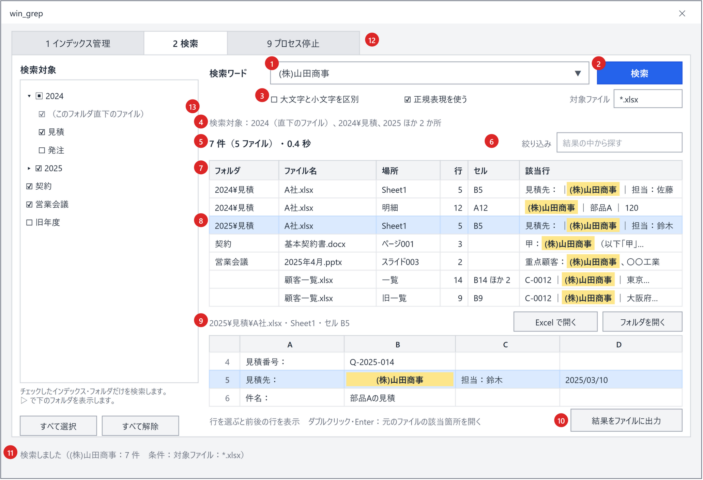
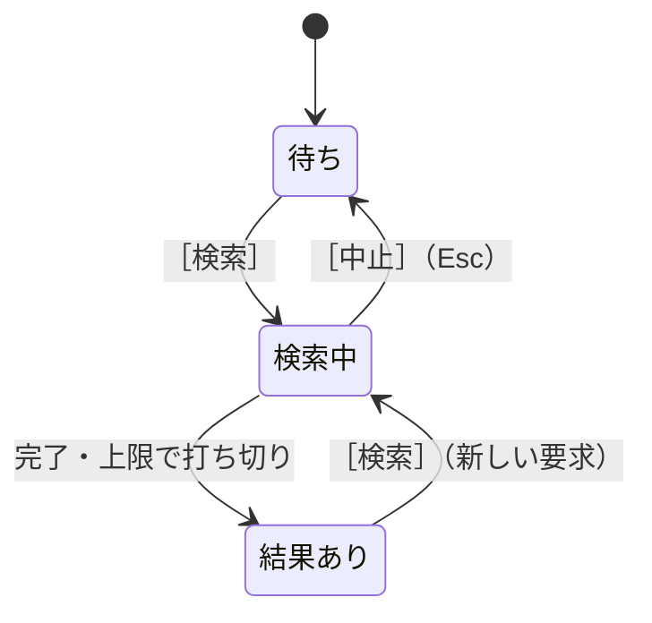
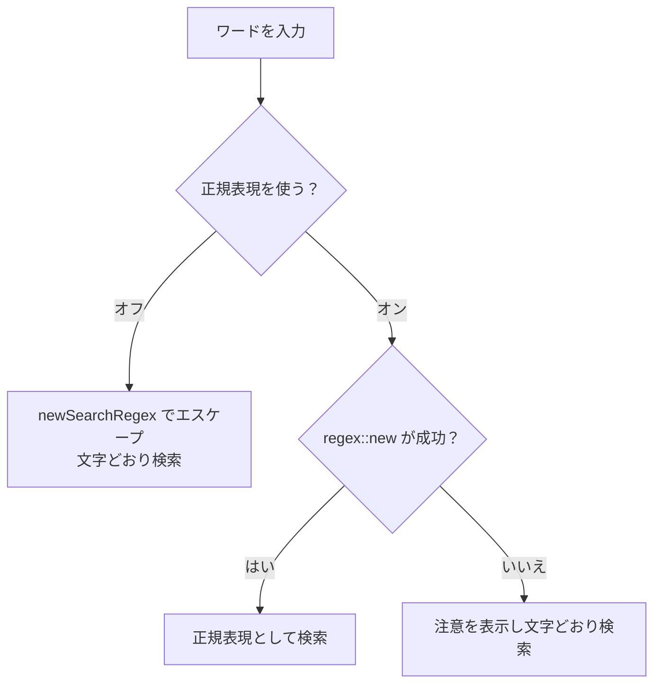

# 検索タブ

扱うこと: ［2 検索］タブでの検索の実行・検索ワードの扱い・結果の表・絞り込み・結果をファイルに出力。扱わないこと: 元のファイルを開く（[元のファイルを開く](open-file.md)）、選択行のプレビューとファイルごとの表示（[選択行のプレビュー](preview.md)）、検索対象のツリー（[検索対象のツリー](search-tree.md)）。先に読むページ: [画面](index.md)、[検索](../search/index.md)。

ワードを入れて検索し、結果を元のファイルごとの見出しで確かめ、元のファイルを開くタブ。左のツリーで検索するインデックス・フォルダを選ぶ。

今の画面の写真は[画面設計（現行）](screens/search-tab.md)にある。

| No. | 部品 | 仕様 |
|---|---|---|
| 1 | 検索ワード | 1 行の入力欄。**1 ワードのみ**。Enter で検索する |
| 2 | ［検索］ | 主ボタン。検索ワードが空、検索対象の本文インデックスのファイルが 0 件、または No.13 でチェックしたフォルダが無ければ無効。検索中は［中止］に変わる（[検索の実行](#検索の実行)） |
| 3 | 検索条件 | 検索ワードの下の行。検索する種類のチップ（［Excel］［Word］［PowerPoint］［テキスト］。既定はすべて選んでいる）と、［ファイル内の対象 ▾］のメニュー（「共通」の下に、本文（常に対象）・［図形］・［コメント］。既定は図形・コメントもオン。既定から外すと、ボタンは「ファイル内の対象・N 件変更」になり、線が青くなる）、右に［□ 大文字・小文字を区別］［□ 正規表現］と高速検索の状態（緑＝使用可・灰色＝使用不可。使えない理由があるときは ⓘ を付け、ツールチップで知らせる）。サクラエディタの Grep の条件にならう（[検索ワードの扱い](#検索ワードの扱い)）。正規表現がオンで、正規表現として不正なワードは入力欄の下に注意を出し、文字どおり検索する。チップは押すたびに選びを切り替える（最後の 1 つは外せない） |
| 4 | 検索対象の見出し | 左の欄の一番上に `検索対象 選んだ数 / インデックスの数`（インデックスが無いときは `検索対象` だけ）。詳しい中身（`検索対象：すべて（集約ファイル N 件 ・ 最終更新 M/d H:mm）`、一部のときはチェックしたフォルダの先頭 3 か所など）はこの見出しのツールチップに出す。インデックスはあるが検索するフォルダを 1 つも選んでいないときは、左の欄の下に `検索するフォルダを選んでください` を出す。本文インデックスのファイルが 0 件なら、結果の表の場所に空の状態（フォルダの絵と［インデックス管理へ］）を出し、高速検索の状態は出さない |
| 5 | 件数 | `該当 N 件（M ファイル） ・ 0.4 秒`。検索中は `検索中…　該当 K 件`（本文インデックスを数えている間は `検索対象のファイルを確認しています…（N 件）`）。絞り込み中は `N 件中 K 件を表示` |
| 6 | 絞り込み | 結果の中から文字列で絞り込む（[絞り込み](#絞り込み)）。検索し直さずに結果を絞れる |
| 7 | 結果の表 | 元のファイルごとの見出しと、その下のヒットした行（場所・種別・該当行）。**検索した直後は見出しだけ**を出し、見出しのクリックで行を開く・閉じる（[ファイルごとにまとめた表示](preview.md#ファイルごとにまとめた表示)）。一致箇所を黄色で強調する（[結果の表](#結果の表)） |
| 8 | 選択行 | 選択した行と、その前後の行を No.9 に表示する。ダブルクリック・Enter で元のファイルの該当箇所を開く（[元のファイルを開く](open-file.md)） |
| 9 | 選択行のプレビュー | 選択行とその前後の行を、シートのような表（行番号と列見出し A, B, C…）で表示する（出す行数は高さに合わせて増減する）。一致したセルを黄色で強調する。見出しの右の［Excel で開く］（Word・PowerPoint は［開く］）で元のファイルの該当箇所を開き、［フォルダを開く］でエクスプローラーを開く。セルをクリックして Ctrl+C で値をコピーでき、列見出しの右端のドラッグで列幅を変えられる。**行を選んでいなくても枠は常に表示する**（[選択行のプレビュー](preview.md)） |
| 10 | ［結果をファイルに出力］ | 表示中の結果を `work/search_results.txt`（[検索](../search/index.md) と同じ形式）に出力して開く（[結果をファイルに出力](#結果をファイルに出力)） |
| 11 | ステータス表示 | `検索しました：<ワード> N 件` など（[画面に出すメッセージの一覧](messages.md)） |
| 13 | 検索対象のツリー | 画面の左側。**インデックスの一覧**（［1 インデックス管理］で作ったインデックス）と、その下のフォルダをチェック付きのツリーで表示し、**チェックしたインデックス・フォルダだけを検索する**（[検索対象のツリー](search-tree.md)）。見出しの右に［すべて］［解除］を置く。インデックスの下に「フォルダを探す」の欄を置く。元のフォルダが見つからないインデックスには赤い点を付ける。左右の境目はドラッグで幅を変えられる |
| 14 | ［すべて開く］［すべて折りたたむ］ | 件数の行の右（No.6 の左）。すべてのファイルの行を開く・閉じる（[ファイルごとにまとめた表示](preview.md#ファイルごとにまとめた表示)） |
| 15 | ［開く］［▾］ | No.9 の見出しの右。［開く］で元のファイルを開く。［▾］のメニューで `通常（編集する）` / `新規（元のファイルを占有しない）` / `読み取り専用` を選ぶと、その開き方で開き、既定にもする（既定は `通常（編集する）`。[元のファイルを開く](open-file.md)） |

## 検索の実行

```mermaid
stateDiagram-v2
    state "待ち" as Idle
    state "検索中" as Searching
    state "結果あり" as Done
    [*] --> Idle
    Idle --> Searching : ［検索］
    Searching --> Done : 完了・上限で打ち切り
    Searching --> Idle : ［中止］（Esc）
    Done --> Searching : ［検索］（新しい要求）
```

- **検索処理は `tebunko/search/pack_search.ps1` の関数**（`getIndexPackFiles` / `searchPackIndex`、[実装構成](implementation.md#実装構成)）で行う。対象・照合・速度の仕様は [検索](../search/index.md) のとおり。
  - 検索対象は No.13 のツリーでチェックしたインデックス・フォルダ配下の `*.tsv`（[検索対象のツリー](search-tree.md)）。結果のフォルダ（相対パス）は、選んだフォルダではなくインデックスのフォルダ（`work\content_index`）から求めるため、フォルダを絞っても結果の表示・元のファイルを開く動作は変わらない。
- **検索の司令のスレッド（`SearchService`）で実行**し、検索中も画面を操作できるようにする。司令のスレッドと照合のプールは画面を開いている間使い回し、検索のたびに作らない（[寿命](../structure/threads.md#寿命)）。検索 1 回は要求（`newSearchRequest`）として渡し、新しい検索を始めると前の検索は取り消す（要求の `Stop`）。
  - 高速検索が使えるとき（検索ワードの下の `高速検索：使用可`）は、Windows Search で検索語を含みうるフォルダを先に絞り、その本文インデックスだけを検索する（[検索](../search/index.md) [高速検索（Windows Search）](../search/fast-search.md)）。`高速検索：使用可 / 使用不可` は、ワード・［正規表現を使う］を変えるとすぐ変わる（`getFastSearchView`。Windows Search が使えるかは、画面を開いたときと検索のたびに確かめる）。
  - 本文インデックスを約 16MB ずつ検索し（[検索を速くする仕組み](../search/speed.md)）、そのたびに進捗（No.5 のバーと `検索中…　該当 K 件`、タスクバーのアイコン）を更新する。結果は 0.1 秒ごとに表へ移し、見つかったファイルの見出しから順に表示する（[ファイルごとにまとめた表示](preview.md#ファイルごとにまとめた表示)）。
  - 検索中は［検索］が［中止］に変わる（Esc でも中止）。中止した場合は、それまでの結果を残し、`中止しました（N 件まで表示）` と表示する。
- **件数の上限**：10,000 件（[決めたこと](implementation.md#決めたこと) U3）。上限に達したら検索を打ち切り、`10,000 件を超えたため、ここで打ち切りました。この先のファイルは検索していないため、ワード・種類・検索対象で絞り込んでください。` と表示する。
  - フォルダの順・本文インデックスのファイルの名前（拡張子・番号）の順・本文インデックスのファイルの中の順に検索するため、打ち切った時点より後ろのファイルのヒットは結果に出ない（件数の多い順などで選ばれるわけではない）。利用者が「全部出ている」と誤解しないよう、メッセージでその旨を伝える。
- インデックス作成中でも検索できる。その場合、ステータスに `インデックス作成中のため、作成途中のインデックスを検索しています。` と表示する（U4）。

## 検索ワードの扱い

```mermaid
flowchart TD
    W["ワードを入力"] --> R{"正規表現を使う？"}
    R -- オフ --> E["newSearchRegex でエスケープ<br>文字どおり検索"]
    R -- オン --> V{"regex::new が成功？"}
    V -- はい --> Rx["正規表現として検索"]
    V -- いいえ --> E2["注意を表示し文字どおり検索"]
```

| 項目 | 仕様 |
|---|---|
| ワード数 | 1 つ。入力欄は 1 行。前後の空白は取り除く |
| 正規表現オフ（既定） | 文字どおりに検索する（`newSearchRegex` でワードをエスケープする）。`(株)` `1.5` `C++` などもそのまま探せる |
| 正規表現オン | 正規表現として検索する。`[regex]::new()` が失敗するワードは、入力欄の下に `正規表現として不正なため、文字どおり検索します。` と表示し、文字どおり検索する（[検索](../search/index.md) [検索仕様](../search/index.md#検索仕様)） |
| 大文字と小文字を区別 | オンなら英字の大文字と小文字を区別する（既定は区別しない） |
| 図形も検索・コメントも検索 | オフにすると、図形（場所 `<元の場所>[図形]`）・コメント（場所 `<元の場所>[コメント]`）を検索しない（既定はどちらもオン）。本文（セルの値・段落）だけを探したいときに使う。Excel・Word・PowerPoint で共通（PowerPoint のテキストボックス・図形の文字はスライドの本文なので、オフにしても検索する） |
| 種類 | 検索するファイルの種類を、チップ（Excel・Word・PowerPoint・テキスト）で選ぶ（既定はすべて）。選んだ種類の拡張子のファイルだけを検索する（`newFileKindFilter`）。ファイル名での絞り込みは、検索後の［絞り込み］（No.6）で行う。選んだ種類に合うファイルが検索の対象に無ければ No.5 に `種類（Word・テキスト）に合うファイルがありません。` と表示する |
| 一致箇所の強調 | 結果の表・プレビューの強調には、検索と同じ正規表現（`newSearchRegex`）を使う。このため、大文字と小文字の区別も強調に反映される |
| 条件の表示 | 既定から変えた条件があれば、ステータスを `検索しました：<ワード> N 件　条件：大文字・小文字を区別・種類：Excel・テキスト` とする（図形・コメントをオフにしたときは `図形を除く` `コメントを除く`）。0 件のときは No.5 にも `見つかりませんでした。（検索条件：…）` と条件を出す（正規表現オフで記号を含むワードなら、代わりに `見つかりませんでした。（正規表現として探す場合は［正規表現を使う］をオンにしてください）`） |
| 設定の保存 | 各条件は `setting.config` の `useRegex` / `caseSensitive` / `fileKinds` / `includeShapes` / `includeComments` に保存し、次回も引き継ぐ（[画面での読み書き](../structure/settings-file.md#画面での読み書き)）。チェックボックス・チップは、クリックしたときに保存する |

正規表現を既定オフにするのは、業務文書によく出る表記が意図しない結果になるためである。

| 入力 | 利用者の意図 | 正規表現として検索した場合 |
|---|---|---|
| `(株)` | 「(株)」を探す | `( )` がグループとみなされ、「株」を含む行すべてにヒットする |
| `1.5` | 「1.5」を探す | `.` が任意の 1 文字とみなされ、「105」「1-5」にもヒットする |
| `C++` | 「C++」を探す | 正規表現として不正なので文字どおり検索になる |

## 結果の表

| 列 | 内容 | 例 |
|---|---|---|
| 場所 | 行ごとの場所の表記（`describeHitPlace`）。Excel は場所ごとの表記にセル番地を足し（`[シート]売上!B12`。1 行の中で複数のセルが一致したときは、ほかの数を ` ほか N` で付ける。セル番地が求まらないときは `[シート]売上 12 行目`）、図形・コメントは図形の左上・コメントのセルを足す（`[シート]売上!D5`。求まらないときは通し番号のため行番号を出さず `[シート]売上`）、ヘッダー・フッターは行にセル番地が無いため `[シート]売上` だけを出す。Word・PowerPoint は場所ごとの表記のまま（`describePlace`。[検索](../search/index.md) [出力フォーマット](../search/output.md#出力フォーマットworksearch_resultstxt)。種類の見出しは付けない）。Word のページは目安のため「（目安）」を付ける。幅より長いときはツールチップで全文を出す。並べ替えは TSV の名前（`Location`。`ページ003` のように桁をそろえてある）→ 行番号の順で行う | `[シート]売上!B12` / `[シート]売上!B12 ほか 2` / `[シート]売上!D5` / `3 ページ（目安）` / `スライド 2（非表示）` |
| 種別 | 行の中身の種類。Excel はセル・図形・コメント・ヘッダー・フッター、Word・PowerPoint は本文・ノート。図形・コメントは、検索条件の［図形も検索］［コメントも検索］と同じ言葉（ヘッダー・フッターに選択肢は無く、いつも検索する） | `セル` / `図形` / `コメント` / `ヘッダー・フッター` / `本文` / `ノート` |
| 該当行 | インデックスの 1 行（元の TSV の 1 行）。セルの区切り（タブ）は ` │ ` で表示する。Excel の図形・コメントの行（場所 `<シート名>[図形]` 等）は、先頭のセル番地を「場所」列に出すため除き、囲みの `"` を外した文字だけを出す（例: `納期は↵別途ご相談`。`HitRow.ShownText`）。ヘッダー・フッターの行（場所 `<シート名>[ヘッダー・フッター]`）は文字だけの行なので、そのまま囲みの `"` だけを外して出す。プレビューの列の見出しは `文字` 1 つ。一致箇所は黄色の背景・太字で強調する（正規表現オンのときは一致した範囲） | `見積先： │ (株)山田商事 │ 担当：佐藤` |

- 列は場所・種別・該当行の 3 つ。インデックス・フォルダ・ファイル名は、ファイルごとの見出し（[ファイルごとにまとめた表示](preview.md#ファイルごとにまとめた表示)）に出すため、行には出さない（これらの列での並べ替えも無い）。Word の段落番号・表のセル、PowerPoint の図形の番号は、インデックスに記録していないため出さない。
- 表示順は既定でパス順（[検索](../search/index.md) [検索仕様](../search/index.md#検索仕様) の検索順）。列見出しのクリックで並べ替える（もう一度で逆順。ファイルの中の行を並べ替え、ファイルの順もそれに合わせる。[ファイルごとにまとめた表示](preview.md#ファイルごとにまとめた表示)）。
- 列幅は変えられる。該当行が長いときは末尾を `…` で省略し、ツールチップに全文を出す。
- 複数行を選択できる（Shift / Ctrl＋クリック）。
- Excel のセル内改行（取り込み時にマーカーへ置き換えたもの。[Excel](../indexing/excel.md) の [TSV 整形仕様](../indexing/excel.md#tsv-整形仕様prettytsv--formattsv)）は `↵` で表示する。

## 絞り込み

- 入力のたびに（0.3 秒待ってから）、フォルダ・ファイル名・場所・種別・該当行（インデックスの行そのまま）を対象に部分一致（大文字・小文字を区別しない）で絞り込む（`HitRow.Contains`）。行番号・セル番地は対象にしない。
- 絞り込み中は No.5 に `N 件中 K 件を表示` と表示する。入力欄を空にすると解除する。
- 新しく検索すると絞り込みは解除する。

## 結果をファイルに出力

- 表示中の結果（絞り込み後。閉じているファイルの行も含む）を `work/search_results.txt` に出力し、既定のアプリで開く。ステータスには `search_results.txt に出力しました（N 件）` と表示する。
- 形式は [検索結果ファイル](../search/output.md) のとおり。出力は `tebunko/search/search_run.ps1` の関数（`toSearchResultLines` / `writeSearchResult`、[実装構成](implementation.md#実装構成)）で行う。
- 絞り込み中は、見出しの件数を表示中の件数とし、ステータスに `絞り込み後の K 件を search_results.txt に出力しました` と表示する（U7）。
- 書き込めないときはステータスに表示する。ファイルが開かれているときは `search_results.txt に書き込めません。開いているアプリを閉じてから、もう一度出力してください。`、読み取り専用・権限が無いときは `search_results.txt に書き込む権限がありません（読み取り専用など）。<パス> を確かめてから、もう一度出力してください。`。
- まだ検索していなければ `先に検索してください。` と表示する。
