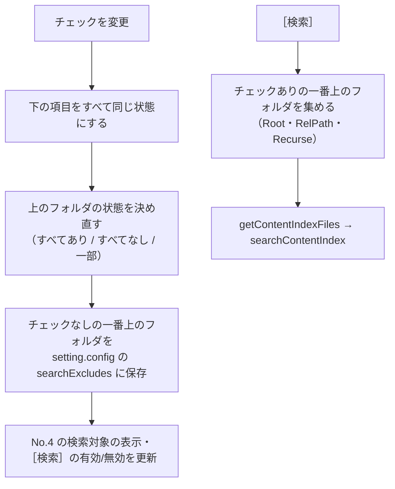

# 検索対象のツリー

扱うこと: 検索対象を絞るツリー（インデックス単位・フォルダ単位）の構成・読み込み・チェックの保存。扱わないこと: 検索そのもの（[検索タブ](search-tab.md)）。先に読むページ: [検索タブ](search-tab.md)。

インデックスが大量にあると、すべてを検索するのに時間がかかる。ツリーで**インデックス単位・フォルダ単位に検索対象を絞れる**ようにする。

| 項目 | 仕様 |
|---|---|
| 一番上の項目 | **インデックス 1 件**（`getSearchIndexes`。`work\content_index` 直下のフォルダ）。表示名はインデックス名で、並びは［インデックス管理］の一覧と同じ（その一覧に無いもの＝別の場所・PC からコピーしたインデックスは名前順で後ろ）。インデックスが 1 つも無ければ、ツリーに `インデックスがありません。［インデックス管理］でインデックスを作成してください。` と表示する。存在しないフォルダは茶色で表示し、ツールチップに `（フォルダが見つかりません。検索時はスキップします）` を出す |
| 下の項目 | インデックスの中のフォルダ（= クロール対象フォルダの中のフォルダ）。名前順。**元のファイル名のフォルダ**（`A社.xlsx` など。更新中だけ TSV をこの中に置く。[インデックスのファイルの形](../index-data/format.md#配置命名規則)）は、フォルダではなくファイルなのでツリーに出さない（`IndexNode.IsBookDir`。判定は `tebunko/index/index_name.ps1` の `$indexBookDirPattern` と同じ、Office・テキストの拡張子で終わる名前） |
| 読み込み | 起動時はインデックスの一覧だけを読む。その下は、▷ で展開したときに初めてそのフォルダの中を読む（フォルダの一覧だけを読み、本文インデックスのファイルは数えない）。大量のインデックスでも表示に時間がかからない。ワークスペースがネットワークにあるときは、一覧・展開とも裏の列で読み、読み込み中は［検索］を押せない。届かなければ見出しと欄に `ワークスペースに接続できません：<パス>` を出す（[ワークスペースがネットワークにあるとき](network.md#ワークスペースがネットワークにあるとき)） |
| ツールチップ | 元のフォルダ（元のフォルダの記録・取り込み一覧から引いたクロール対象フォルダ＋その下のフォルダ）。一番上の項目はインデックスのフォルダのパスも出す。分からなければインデックスのフォルダのパス |
| 直下のファイル | サブフォルダと本文インデックスのファイル（`content_index.*.tsv`）の両方があるフォルダには、先頭に `（このフォルダ直下のファイル）` の項目を置く（灰色）。サブフォルダの一部だけを選んだとき、そのフォルダ直下のファイルを含めるかをこの項目のチェックで表す（`getContentIndexFiles` の `Recurse` が `$false` のときと同じ）。本文インデックスに入れる前の TSV（元のファイル名のフォルダの中）が残っているフォルダも、直下のファイルがあるものとして扱う（`IndexNode.HasFiles`） |
| チェック | 既定はすべてチェックあり。フォルダのチェックを付ける・外すと、その下もすべて同じにする。下の項目の一部だけがチェックありのフォルダは「一部」（▣）の表示になる。スペースキーで選択中の項目のチェックを切り替える。［すべて］［解除］は一番上の項目ごと切り替える |
| 検索する範囲 | チェックありの一番上のフォルダごとに、その配下（`（このフォルダ直下のファイル）` は直下だけ）の本文インデックスのファイルを検索する（`getContentIndexFiles` に Root＝`work\content_index`・RelPath＝`<インデックス名>` からの相対パス・Recurse を渡す） |
| 保存 | チェックを変えるたびに、**チェックなし**の一番上のフォルダ（直下のファイルだけ外した場合はその旨）を `setting.config` の `searchExcludes` に保存し、次回起動時に戻す（`readSearchExcludes` / `writeSearchExcludes`）。チェックなしを保存するため、あとから作成したインデックス・フォルダはチェックありで表示される。存在しないインデックスのフォルダ（ネットワークのドライブが切れているなど）の記録は消さずに残す。ただしインデックスの名前を変えたとき・削除したときは、そのインデックスの下の記録を消す（外したフォルダは検索対象に戻る。[名前を変えたときの処理](index-tab.md#名前を変えたときの処理renameindex)） |
| 読み直し | インデックス作成が終わったとき、F5 で読み直す。チェックの状態（保存したもの）と展開の状態は保つ |

