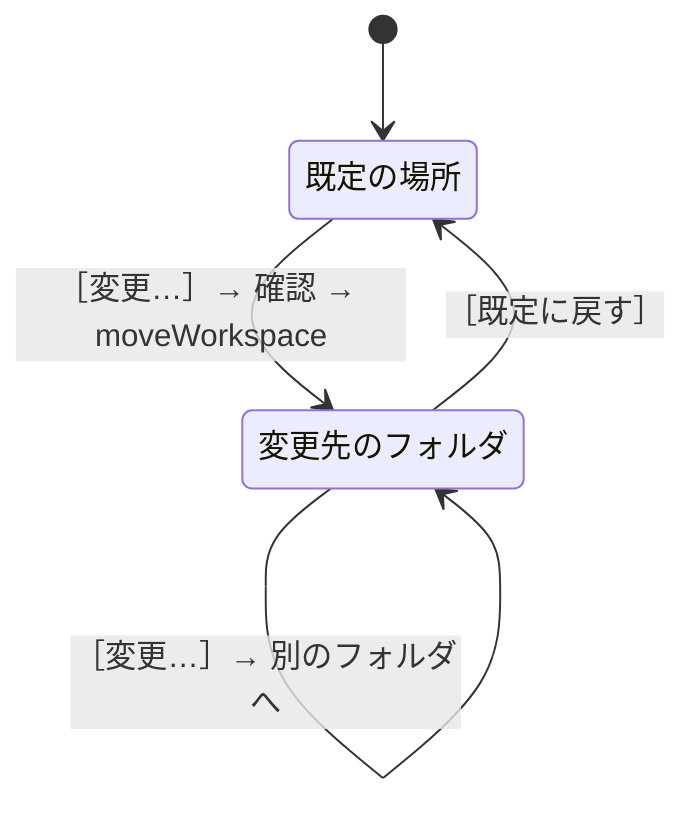

# ［8 設定］タブ

扱うこと: ワークスペース（インデックス・取り込み一覧・ログの置き場所）の表示・変更、設定ファイルの場所の表示。扱わないこと: 設定ファイルの中身そのもの（[設定ファイル（setting.config）](../structure/settings-file.md)）。先に読むページ: [画面](index.md)、[データの置き場所とパスの決め方](../structure/data.md)。

設定の画面（`xaml\settings\settings.xaml`・`ui\settings\settings.ps1`）は、上に見出し「設定」、その下に「ワークスペース」と「設定ファイル」の 2 つの節を縦に並べる。節の間は 24、節の中の行の間は 12。節の見出しの下に細い線（`Bg.Section`）を引く。中身が窓の高さを超えるときは、画面全体が縦にスクロールする。左の欄の最後の画面にする。

今の画面の写真は[画面設計（現行）](screens/settings-tab.md)にある。

**ワークスペース**は、インデックス・取り込み一覧・ログ（`work` の中身。[配布物と開発用のフォルダ構成](../structure/folders.md)）を置くフォルダ。既定は `%USERPROFILE%\Documents\tebunko_ws`（高速検索のため、Windows Search の索引の対象になる場所。[データの置き場所とパスの決め方](../structure/data.md)）。

「ワークスペース」の枠には、今のワークスペースのフォルダを出し、その下に補足を出す。既定の場所なら `既定の場所（ドキュメントの tebunko）です。`、既定でなければ `既定の場所は「<既定の場所>」です。`。「設定ファイル」の枠には `setting.config` の場所を出し（表示だけ）、ツールのフォルダにあれば `ツールのフォルダに置いています。`、利用者ごとの場所なら `ツールのフォルダ（<ツールのフォルダ>）に書き込めないため、利用者ごとの場所に置いています。` と補足する。文言は判断層の `getWorkspaceView`・`getSettingsFileView`（`settings_view.ps1`）が決める。

- ［変更…］: フォルダ選択ダイアログ（[フォルダ選択ダイアログ（［参照…］）](common.md#フォルダ選択ダイアログ参照)。説明は `ワークスペースにする空のフォルダを選んでください。…`）で**空のフォルダ**を選んでもらい、ワークスペースにする。空でなければ警告する（下）。
- ［既定に戻す］: 既定の場所に戻す（無ければ作る）。ほかのファイルが置いてあれば `「…」は空のフォルダではありません。…` と出して戻さない（前から使っているワークスペースなら戻す）。既定でない場所のときだけ表示する。

どちらも、更新中（画面を使わずに起動したものも含む）と、前のインデックスの削除中は変えられない（`更新中はワークスペースを変えられません。…`）。選んだフォルダは `testWorkspaceChoice` が調べる。

| 選んだフォルダ | 動き |
|---|---|
| 今と同じ（書き方の違い・ドライブの割り当てを含む） | 何もしない（ステータスに `今と同じワークスペースです`） |
| 今のインデックス（`<ワークスペース>\content_index`）の中 | `「<フォルダ>」は今のインデックスのフォルダの中です。…` と出して変えない |
| ファイルを作れない | `「<フォルダ>」にはファイルを作れません。書き込めるフォルダを選んでください。` と出して変えない |
| 空のフォルダ | 確認ダイアログを出す |
| 空でないフォルダ | 警告のダイアログを出す |

どちらのダイアログも [確認ダイアログ](common.md#確認ダイアログshowconfirm) の形で、中身は `newWorkspaceConfirm` が決める。

**確認ダイアログ（空のフォルダ）** の見出しは `インデックスとログを「<フォルダ>」へ移動します。`、ボタンは［移動する］（［既定に戻す］からは［戻す］）。

- `→ インデックス・ログを、このフォルダに置きます`（選んだフォルダ）
- `→ 今のワークスペースの中身（インデックス・ログ）は、新しいワークスペースへ移します`（`移す前の場所：<今のワークスペース>`）

**警告のダイアログ（空でないフォルダ）** の見出しは `選んだフォルダは空ではありません。ワークスペースには空のフォルダを選んでください。`。選び直さなくても済むよう、選んだフォルダの中にワークスペースのフォルダを作る選択肢も出す。既定のボタンは［キャンセル］（何もしない。空のフォルダを選び直す）。

- `! このフォルダは空ではありません（ファイル・フォルダが N 個）`（中身の名前を先頭の 3 つまで。ほかにもあれば `など`。数えるのは 1,000 個までで、それ以上は `1,000 個以上`）

- `→ 今のワークスペースの中身（インデックス・ログ）は、新しいワークスペースへ移します`
- 選択肢［中に「workspace」を作って使う］（`<選んだフォルダ>\workspace`）: `workspace` が無いか、あっても空のときだけ出す。作ってから、そこをワークスペースにする。
- 選択肢［このフォルダをそのまま使う］（`中のファイルは消しません。tebunko のファイルが同じフォルダに混ざります`）。

**インデックスがあるフォルダ**（中に tebunko のファイル・フォルダ（`getWorkspaceEntries`）があるとき。ほかの人が共有したワークスペースなど）の見出しは `選んだフォルダには、すでにインデックスがあります。どうしますか？`。インデックスを共有し、ほかの人が使えるようにするための選択肢を出す。既定のボタンは［キャンセル］。

- `✓ インデックス・取り込み一覧などがあります`（中にある名前）
- `→ 使うときは、インデックスの一覧もこのワークスペースのものにします`（`今のワークスペースの中身は移さず、元の場所に残します：<今のワークスペース>`）
- 補足: `ほかの人が共有したインデックスを使うときは［あるインデックスを使う］を選んでください。`
- 選択肢［あるインデックスを使う］: 今のワークスペースの中身は移さない。インデックスの一覧（`targetFolders`）を、そのワークスペースの取り込み一覧にあるクロール対象フォルダにする（`useWorkspaceTargets`。取り込み一覧が無ければ一覧は変えない）。一覧を合わせないままインデックス作成をすると、一覧に無いインデックスが削除されたフォルダのものとして消えるため。
- 選択肢［消して、最初からやり直す］（赤いボタン。`このフォルダのインデックス・ログを削除し、今のワークスペースの中身を移します（元に戻せません）`）: そのフォルダの tebunko のファイル・フォルダだけを削除し（`removeWorkspaceEntries`。ほかのファイルは消さない）、今のワークスペースの中身を移す。

決めると、実行中の検索を止めてから、今のワークスペースの中身（tebunko が作るファイル・フォルダだけ。利用者のほかのファイルは移さない）を新しいワークスペースへ移す（`moveWorkspace`。[データの置き場所とパスの決め方](../structure/data.md)）。移し先に同じ名前があるときや、ファイルが開かれていて移せないときは、移した分を戻し、理由を知らせてワークスペースを変えない。移せたら `setting.config` の `workspaceFolder` に保存し（既定の場所なら空）、画面は開き直さず、その場で新しいワークスペースに切り替える（`settings_tab.ps1` の `switchWorkspace`）。実行中の検索は止め、検索結果・プレビューを空にし、インデックス一覧・更新の状態・検索対象のツリー・件数を新しいワークスペースから読み直す。切り替える前に始めた裏の仕事（更新の状態の集計・件数の数え上げ・高速検索が使えるかの確認）の結果は、画面に出さない。インデックス一覧（クロール対象フォルダ）は変わらず、中身を移したので、インデックス・更新の状態もそのまま使える。検索対象のツリーでチェックを外したフォルダ（`searchExcludes`）は `<ワークスペース>\content_index` の下のフルパスで持つため、移した先のインデックスの下に付け替える（`moveSearchExcludes`）。
