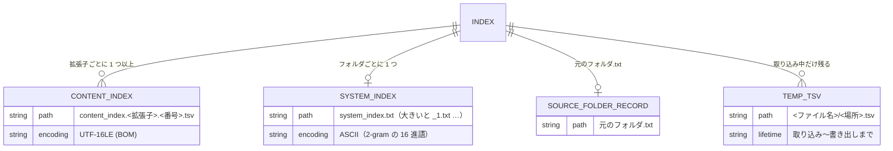

# インデックスのファイルの形

扱うこと: インデックスの配置・命名規則、本文インデックスの形式（メタ情報の行・中身の行）、図形・コメントの場所の決まり、場所の符号化。扱わないこと: 作った TSV を本文インデックスへ入れ替え・書き出す手順（[入れ替えと書き出し](publish.md)）、システムインデックス（[システムインデックス](system-index.md)）。先に読むページ: [インデックス作成](../indexing/index.md)。

## インデックスのファイルの関係



## 配置・命名規則

インデックスは、クロール対象フォルダの中のフォルダ 1 つ・元のファイルの拡張子 1 つにつき 1 つの**本文インデックス**にする。検索は本文インデックスだけを読む（[検索を速くする仕組み](../search/speed.md)）。

```
work/content_index/<インデックス名>/<相対フォルダ>/content_index.<拡張子（小文字）>.<番号>.tsv                        … 本文インデックス（検索に使う）
work/content_index/<インデックス名>/<相対フォルダ>/<ファイル名（拡張子あり）>/<encodeIndexPlace(場所)>.tsv … 取り込み中だけの TSV
```

- **本文インデックス**（`content_index.xlsx.001.tsv` `content_index.docx.001.tsv` など）には、そのフォルダ**直下**にある、その拡張子の元のファイルすべての中身を入れる。サブフォルダのファイルは、サブフォルダの本文インデックスに入る。形式は下の「本文インデックスの形式」。
- **TSV**（元のファイル 1 つ・場所 1 つにつき 1 つ）は、取り込んでから本文インデックスに入れるまでの**一時的な置き場所**。フォルダの取り込みが終わると本文インデックスに入れ、TSV のフォルダは消す（[入れ替えと書き出し](publish.md)。残すとインデックスの容量が倍になるため）。インデックス作成が途中で止まったときだけ残り、次のインデックス作成の始めに本文インデックスへ入れる。

TSV は**元のファイル名をフォルダ名**にし、その中に場所ごとの TSV を置く。クロール対象フォルダが `C:\data\営業`（インデックス名 `営業`）の場合:

| 元ファイル（クロール対象フォルダからの相対パス） | 場所 | 本文インデックスに入れる前の TSV | 本文インデックス |
|---|---|---|---|
| `2024/見積/A社.xlsx` | シート `明細` | `work/content_index/営業/2024/見積/A社.xlsx/明細.tsv` | `work/content_index/営業/2024/見積/content_index.xlsx.001.tsv` |
| `売上.xls` | シート `2024_上期` | `work/content_index/営業/売上.xls/2024%5F上期.tsv` | `work/content_index/営業/content_index.xls.001.tsv` |
| `[確定]見積.xlsx` | シート `記号<>` | `work/content_index/営業/[確定]見積.xlsx/記号%3C%3E.tsv` | `work/content_index/営業/content_index.xlsx.001.tsv` |
| `コピー.xls_old.xlsx` | シート `Sheet1` | `work/content_index/営業/コピー.xls_old.xlsx/Sheet1.tsv` | `work/content_index/営業/content_index.xlsx.001.tsv` |
| `報告書.DOCX` | `ページ001` | `work/content_index/営業/報告書.DOCX/ページ001.tsv` | `work/content_index/営業/content_index.docx.001.tsv` |

- クロール対象フォルダのフォルダ構成が `work/content_index/<インデックス名>/` 配下にそのまま再現され、各フォルダに**拡張子ごとの本文インデックス**ができる。検索結果の先頭の相対フォルダにもインデックス名が付くため、どのクロール対象フォルダのファイルかが分かる。
- 本文インデックスの拡張子は小文字にそろえる（`報告書.DOCX` は `content_index.docx.001.tsv` に入る）。
- 「場所」は Excel ではシート名と、図形・コメント・ヘッダー・フッターの `<シート名>[図形]` `<シート名>[コメント]` `<シート名>[ヘッダー・フッター]`（下の「図形・コメントの場所」、[Excel の図形・コメントの読み取り](../indexing/excel.md#excel-の図形コメントの読み取りreadxlsxobjectunits)）、Word ではページ・ヘッダー/フッター・脚注（[Word のテキスト読み取りと TSV の場所](../indexing/word.md#word-のテキスト読み取りと-tsv-の場所readdocxunits)）、PowerPoint ではスライド・ノート（[PowerPoint のテキスト読み取りと TSV の場所](../indexing/powerpoint.md#powerpoint-のテキスト読み取りと-tsv-の場所readpptxunits)）。
- TSV のファイル名は場所だけ（`toIndexFileName`）。場所は Excel のシート名で最長 31 文字のため、Windows のファイル名の上限（255 文字）は超えない。元のファイル名は Windows 上のファイル名そのものなので、フォルダ名にしても上限を超えない。
- **TSV でファイル名をフォルダ名にする理由**（`<ファイル名>_<場所>.tsv` のように 1 つの名前にしない理由）:
  - ファイル名と場所の区切りが `\` になり、名前の中の文字と衝突しない（`_` の符号化に頼らずに分けられる）。
  - 取り込み直すときは**フォルダごと入れ替え**ればよく、別のファイルの TSV を巻き込まない（`<ファイル名>_*.tsv` で消すと、`a.xls` の取り込みで `a.xls_b.xlsx` の TSV まで消える）。
  - `<ファイル名>＋<場所>` が 255 文字を超えて保存できない、ということが起きない。
- **本文インデックスにする理由**: 検索の時間は、読むファイルの数でほぼ決まる。ウイルス対策ソフト（Microsoft Defender）は、ファイルを初めて開くたびに検査し（実測で 1 ファイル約 11 ミリ秒）、検査済みとして覚えておけるのはおよそ 2 万ファイルまで。元のファイル 1 つ・場所 1 つにつき TSV 1 つだと、TSV が数万件になり、初回の検索が数分〜10 分以上かかった。フォルダ・拡張子ごとにまとめると、読むファイルの数が数百分の 1 になる（実測は [検索を速くする仕組み](../search/speed.md)）。

### 前の版の index\ の扱い（`getLegacyIndexState`・`clearLegacySystemIndex`）

フォルダ名・ファイル名を `content_index`・`system_index` にそろえる前の版が使っていた `index\` は、そのままでは読めない（フォルダ名・ファイル名が違う）。新しい版はここを読まず、消しもしない。

- **前の版のしるし**: `index\` があり、その直下のどれかのフォルダに `元のフォルダ.txt` がある（`getLegacyIndexState` の `HasLegacyIndex`）。`index\` があるだけでは、利用者が選んだフォルダにたまたま `index` があるときと区別できないため、しるしとしない。
- **知らせ**: インデクサは `content_index\` を作る前に前の版のしるしを調べ、見つかれば `前の版のインデックス（「<index\ のパス>」）は、この版では使えません。インデックス作成で、元のファイルをすべて取り込み直します。取り込み直した後、「<index\ のパス>」フォルダは削除してかまいません。` をログに黄色で出す（`getLegacyIndexMessage`）。
- **片付けの条件**: `content_index\` が空（無いか、下のフォルダを含めてファイルが 1 つも無い）で、かつ、前の版のしるしがあるか、`system_index\` に前の名前の txt（`システムインデックス*.txt`）が残っている（`testLegacyCleanupNeeded`）。取り込み直す前に利用者が `index\` を消していても、前の名前の txt を残さないための条件。
- **片付け**: 条件に当たれば、取り込み直しを始める前に前の版のシステムインデックスを片付ける（`clearLegacySystemIndex`）。順番は (1) 状態ファイル（`システムインデックスの状態.tsv`）の中身を排他の中で空にする（ファイルは消さない） (2) `system_index\` を `removeDirectoryRetry` で消す（Windows Search が txt を一時的に開くことがあるため）。どちらかに失敗したら、`content_index\` を作らず、失敗の理由をログと `channel.Error` に入れて終了コード 1 で終わる。途中で止まっても、次の開始で同じ条件に当たり、やり直せる。
- 画面での確かめ（[取り込み直しの確かめ](../gui/indexing-run.md#取り込み直しの確かめ)）とインデックス作成のメインフローでの扱い（[インデックス作成のメインフロー](../indexing/flow.md)）も参照。

### 本文インデックスの形式（`pack_format.ps1`）

本文インデックスは、元のファイルごと・場所（シート・ページ・スライドなど）ごとに、**メタ情報の行**と、その場所の TSV の中身（[TSV 整形仕様](../indexing/excel.md#tsv-整形仕様prettytsv--formattsv) など。1 行 = Excel の 1 行・段落 1 つ）を並べたもの。例（`␞` は RS（U+001E）、`→` はタブ）:

```
␞ 版=1
␞ ファイル名=(株)山田商事_見積書.xlsx
␞ 種類=Excel
␞ シート=見積
␞ 対象=本文
品名→数量→単価
りんご→10→100
␞ シート=見積
␞ 対象=図形
B2→確定版
␞ ファイル名=(株)山田商事_請求書.xlsx
␞ 種類=Excel
␞ シート=請求
␞ 対象=本文
品名→金額
```

| 項目 | 仕様 |
|---|---|
| 文字コード・改行 | UTF-16LE（BOM 付き）。改行は LF にそろえる（TSV の CRLF・CR も LF にする。行の分け方は `StreamReader.ReadLine` と同じにし、行番号を変えない）。UTF-16 にするのは、読んだ後の文字列への変換が UTF-8 より速く、日本語が多いと大きさがほとんど変わらないため |
| メタ情報の行 | 先頭が RS（U+001E）、半角スペース、`キー=値`。1 行に 1 項目。中身の行には U+001C〜U+001F を入れない（書くときに取り除く）ため、先頭が RS の行はメタ情報の行と分かる |
| 値の符号化 | 値に改行などの制御文字（タブを除く U+0000〜U+001F）と `%` があれば `%XX`（16 進 2 桁）にする（`encodePackValue` / `decodePackValue`） |
| 中身の行 | 場所の TSV の行そのまま（セルはタブ区切り、セル内改行は U+2028）。場所のメタ情報の後の最初の行が 1 行目（Excel ではシートの 1 行目） |
| 並び | 元のファイルは名前の順（現在のカルチャ・大文字と小文字を区別しない）。場所は TSV のファイル名の順 |
| 名前 | `content_index.<元のファイルの拡張子（小文字）>.<番号（3 桁）>.tsv`（`getPackFileName`。例 `content_index.xlsx.001.tsv`）。分けていないときも `001` を付ける |
| 分け方 | 1 つの本文インデックスのファイルが 4MB（`$packFileMaxBytes`）以上になったら、それ以上元のファイルを足さず、次の番号の本文インデックスのファイルに足す（`planPackParts`）。更新した元のファイルは今入っている本文インデックスのファイルの中で入れ替え、無くなった元のファイルは外す。変わらない本文インデックスのファイルは書き直さない。元のファイルが無くなった本文インデックスのファイルは消す（番号は詰めない）。1 つの元のファイルは 2 つの本文インデックスのファイルにまたがらない |

| キー | 値 | 意味 |
|---|---|---|
| `版` | `1` | 形式の版。ファイルの 1 行目。今の版と違えば例外にする（`readPackPlaces`） |
| `ファイル名` | 元のファイル名（例 `見積書.xlsx`） | ここから新しい元のファイルが始まる |
| `種類` | `Excel` / `Word` / `PowerPoint` / `テキスト` | 元のファイルの種類（拡張子から決める） |
| `シート` / `ページ` / `スライド` / `部分` | シート名 / ページ番号 / スライド番号 / それ以外の場所の名前（`ヘッダー・フッター` など。テキストは場所が 1 つだけのため常に `本文`） | ここから新しい場所が始まる |
| `対象` | `本文` / `図形` / `コメント` / `ノート` | 場所の中身の種類（下の「図形・コメントの場所」） |
| `非表示` | `はい` | 非表示のスライド（PowerPoint）だけに付ける |

- 知らないキーは読み飛ばし、無いキーは既定の値とみなす（後の版でキーを足しても、前の版の読み方で読める）。
- 画面・検索結果に出す場所の名前は、メタ情報から TSV のときと同じ形に組み立て直す（`convertPackMetaToPlace`。`見積[図形]`・`ページ001`・`スライド002（非表示）`・`スライド001_ノート` など）。TSV のファイル名（場所の名前）からメタ情報へは `convertPlaceToPackMeta` で分け、組み立て直して同じ名前にならないもの（番号の桁が違う等）は `部分=<名前そのまま>` にする。
- メタ情報の行は検索しない（ファイル名・シート名の語には一致しない。[検索を速くする仕組み](../search/speed.md)）。
- **テキストファイル**（`.txt` 等）は、場所が「本文」の 1 つだけ（`部分=本文`・`対象=本文`）。行番号がそのまま元のファイルの行番号になる（[テキストファイルの読み取り](../indexing/text.md)）。

### 図形・コメントの場所（Excel・Word・PowerPoint で共通の決まり）

本文（セル・段落）以外の文字は、**`<元の場所>[<種類>]`** という場所（TSV）に分けて出力する。種類ごとに、検索に含めるかを画面で選べる（［図形も検索］［コメントも検索］。[検索](../search/index.md) の検索仕様）。

| 種類 | Excel | Word | PowerPoint |
|---|---|---|---|
| `図形` | 図形・テキストボックス・WordArt、SmartArt、グラフ（`売上[図形]`。表示のグラフシートも `<グラフシート名>[図形]` で含む） | 本文のテキストボックス・図形内の文字、SmartArt、グラフ（`ページ003[図形]`） | SmartArt、グラフ（`スライド002[図形]`）。テキストボックス・図形の文字はスライドの本文 |
| `コメント` | メモ・スレッド形式のコメントと返信（`売上[コメント]`） | コメントと返信（`ページ003[コメント]`。本文に参照の無いものは `文書[コメント]`） | 旧形式・新形式のコメントと返信（`スライド002[コメント]`） |
| `ヘッダー・フッター` | 印刷のヘッダー・フッター（`売上[ヘッダー・フッター]`。表示のグラフシートも含む。検索の選択肢は無く、いつも検索する） | 種類ではない（場所の名前 `ヘッダー・フッター`） | 種類ではない（場所の名前 `ヘッダー・フッター`） |

- PowerPoint のテキストボックス・図形を本文のままにする理由は [PowerPoint のテキスト読み取りと TSV の場所](../indexing/powerpoint.md#powerpoint-のテキスト読み取りと-tsv-の場所readpptxunits)。Word の本文のテキストボックスは Excel とそろえて図形にするため、［図形も検索］をオフにすると検索されない。
- Excel の新しい種類のグラフ（じょうご・ツリーマップ・滝など。`cx:chart`）とグラフの中のテキストボックス（`c:userShapes`）、埋め込みオブジェクト、スライドマスター・レイアウトは読まない（[Excel の図形・コメントの読み取り](../indexing/excel.md)）。
- **重ならない理由**: Excel のシート名には `[` `]` を使えない。Word・PowerPoint の場所（`ページNNN` `スライドNNN` `ヘッダー・フッター` 等）には `[` が付かない。このため、ふつうの場所と図形・コメント・ヘッダー・フッターの場所は必ず見分けられる（Word・PowerPoint の `ヘッダー・フッター` は `[` `]` で囲まない場所の名前で、Excel の種類 `[ヘッダー・フッター]` とは別。集約ファイルでは Excel が `シート=売上` `対象=ヘッダー・フッター`、Word・PowerPoint が `部分=ヘッダー・フッター` `対象=本文`）。
- **定義の場所**: 種類の名前は `index_name.ps1` の `$placeKindShape` / `$placeKindComment` / `$placeKindHeaderFooter` と `objectPlacePattern`（分けるのは `splitObjectPlace`）。書き出す側（`office_reader.ps1`）と画面（`types.ps1` の `HitRow`）は変数を使えないため同じ名前を直接書いており、そろっていることをテスト（`index_name.Tests.ps1`）で確かめる。種類を足すときは 3 か所と画面のチェックをそろえる。
- **1 行の形**: Excel の図形・コメントは `<セル番地><TAB><文字>`（検索結果の「場所」に出すセル番地と、開くときに選ぶセルに使う）。Excel のヘッダー・フッターは文字だけ（セル番地が無いため、検索結果の「場所」はシート名だけで、開くときもセルは選ばない。行がセル番地で始まる種類は `index_name.ps1` の `testCellPrefixedPlace` で決め、画面（`HitRow.IsCelllessPlace`）は同じ決まりを正規表現で持つ）。Word・PowerPoint は図形・コメント 1 つを 1 行（文字だけ。段落はスペースでつなぐ）にする。元の場所（ページ・スライド）は場所の名前で分かる。
- **読み取る内容を増やしたとき**: `indexer_decide.ps1` の `$extractVersions` で、その形式（拡張子）の抽出版を上げる。前の版で取り込んだファイルは、更新が無くても次のインデックス作成で取り込み直す（[取り込み一覧](../indexing/ingest-list.md)）。今は `.xlsx` `.xlsm` が 4、`.docx` `.docm` `.pptx` `.pptm` が 3、`.doc` `.ppt` が 2。

## 場所の符号化（`encodeIndexPlace` / `decodeIndexPlace`）

TSV のファイル名に入れる場所（シート名など）は、次の文字を `%` と 16 進数 2 桁にする。本文インデックスに入れるとき（`getIndexFolderBooks`）に `decodeIndexPlace` で元に戻す。本文インデックスのメタ情報には元のシート名を書き（値の符号化は上の「本文インデックスの形式」）、検索結果の「場所」には元のシート名を表示する。

| 元 | `"` | `%` | `*` | `/` | `:` | `<` | `>` | `?` | `\` | `_` | `\|` | 制御文字（U+0000〜U+001F） |
|---|---|---|---|---|---|---|---|---|---|---|---|---|
| 符号化後 | `%22` | `%25` | `%2A` | `%2F` | `%3A` | `%3C` | `%3E` | `%3F` | `%5C` | `%5F` | `%7C` | `%00`〜`%1F` |

- 全角に置き換える方式にしないのは、`衝突"` と `衝突”` のように別のシートが同じ TSV 名になり、後のシートで上書きされるため。元に戻せる形にすれば、シート名が違えば TSV 名も必ず違う。
- ファイル名は符号化しない（元ファイルの名前がそのまま TSV のフォルダ名になる。Windows のファイル名なので使えない文字は含まない）。
- Excel のシート名はタブ・改行を含められる（VBA などで付けた場合）。制御文字も符号化するため、そのようなシートも保存できる（検索結果に出すときは、列・行が分かれないようスペースにする。[検索結果ファイル](../search/output.md#出力フォーマットwork検索結果txt)）。
- インデックス名（`work/content_index` 直下のフォルダ名）は符号化せず、`toSafeFileName`（ファイル名に使えない文字を全角に置き換える）で作る。

| 元 | `>` | `<` | `\` | `*` | `"` | `:` | `?` | `\|` | `/` |
|---|---|---|---|---|---|---|---|---|---|
| `toSafeFileName` の置換後 | `＞` | `＜` | `￥` | `＊` | `”` | `：` | `？` | `｜` | `／` |

TSV 整形仕様（`prettyTsv` / `formatTsv`）は [Excel の取り込み](../indexing/excel.md#tsv-整形仕様prettytsv--formattsv) を参照。
