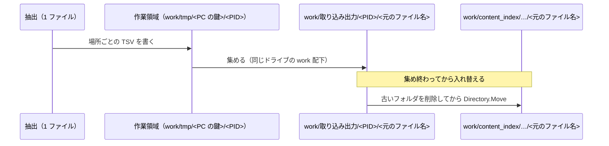
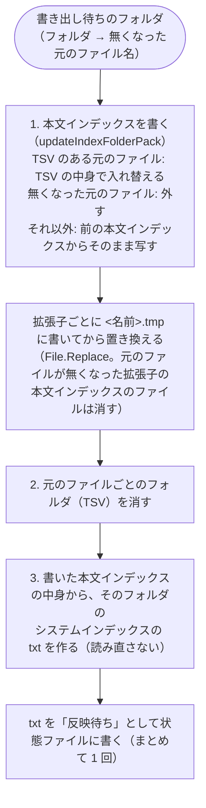
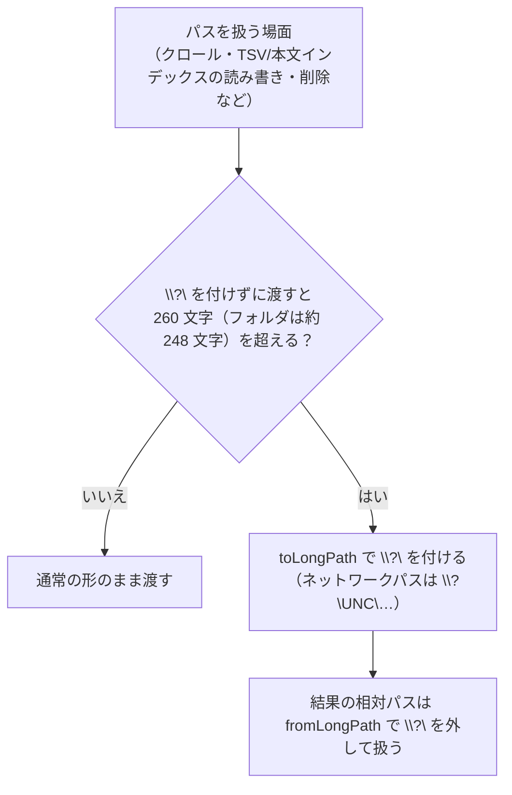

# 入れ替えと書き出し

扱うこと: 取り込んだ TSV をインデックスの一時的な置き場所へ入れ替える手順、フォルダ単位で本文インデックスへ書き出す手順、260 文字を超える長いパスの扱い。扱わないこと: インデックスのファイルの形そのもの（[インデックスのファイルの形](format.md)）。先に読むページ: [インデックスのファイルの形](format.md)、[取り込み一覧](../indexing/ingest-list.md)。

## インデックスへの入れ替え（`publishTsv` / `publishIndexFiles`）

1 ファイルの抽出が終わったら、作業領域（既定は `work/tmp/<PC の鍵>/<PID>`。[データの置き場所とパスの決め方](../structure/data.md)）にできた TSV をインデックスの一時的な置き場所（元のファイル名のフォルダ）へ入れる。このとき、TSV をいったん `work/取り込み出力/<PID>/<元のファイル名>` に集め、**集め終わってから**古い `work/content_index/…/<元のファイル名>` を削除してフォルダごと入れ替える。本文インデックスへは、そのフォルダの取り込みが終わってから入れる（下の「本文インデックスへの書き出し」）。

- 1 件ずつインデックスへ移すと、途中で強制終了されたときに**一部のシートだけが入ったインデックス**が残り、検索しても欠けていることに気付けない。まとめて入れ替えれば、「前回のインデックスがそのまま」か「今回の分がそろった状態」のどちらかになる。
- フォルダごと移す（`Directory.Move`）には同じドライブである必要があるため、集める場所は作業領域とは別に `work` の中に置く。別のドライブで移せない場合は、1 件ずつ移す方法に切り替える。
- 削除は、ウイルス対策ソフト・エクスプローラーが一時的に掴んでいることがあるため、少し待って数回試す（`removeDirectoryRetry`）。

## 本文インデックスへの書き出し（`publishIndexFolders`）

取り込んだファイルのフォルダは「書き出し待ち」として覚えておき（`indexer/pending_publish.ps1` の `PendingPublish.Add`）、**そのフォルダに取り込み中のファイルも、まだ取り込みのスレッドに渡していないファイルも無くなったとき**（結果を 1 つ受け取るたびに調べる。[取り込みの並列化](../indexing/parallel.md)）と、**インデックス作成の終わり**（中止したときも。`finally`）に、それまでのフォルダをまとめて書き出す（`indexer_run.ps1` の `flushPending`（`PendingPublish.TakeFlushable` / `TakeAll`）→ `publishIndexFolders`）。元のファイル 1 つごとに書き出すと、フォルダの大きさ × ファイルの数だけ本文インデックスのファイルを書き直すことになるため。フォルダごとに次を続けて行う。

- **途中で止まったとき**: 本文インデックスは一時ファイルに書き終えてから置き換えるため、書き終える前に止まっても、前の本文インデックスか TSV のどちらかに中身が残る。TSV のフォルダが残ったフォルダは、次のインデックス作成の始めに（取り込み対象を調べる前に）書き出す（`findIndexFoldersWithBooks`。進み具合は `集約ファイルに入れていないインデックスをまとめています…`）。書き出しに失敗したときも、同じく次のインデックス作成でまとめ直す（`インデックスをまとめられませんでした（次のインデックス作成でまとめ直します）`）。
- **元のファイルが無くなったとき**: クロールで無くなったと分かったファイル（`createTargetList` の `Removed`。[クロール対象フォルダと取り込み対象](../indexing/crawl.md)）と、取り込みの直前に無くなっていたファイル（[メインフロー](../indexing/flow.md)）は、そのフォルダを書き出し待ちにして、本文インデックスから外す。取り込むファイルが 0 件のときも書き出す。
- **検索との同時実行**: 本文インデックスは置き換えで書くため、検索は置き換えの前か後のどちらかの中身を読む（読み込みは共有モードで開き、置き換えを妨げない）。

## Windows Search の対象から外す（`NotContentIndexed`）

`work/content_index` は、Windows Search の索引の対象から自動で外す（[高速検索（Windows Search）](../search/fast-search.md)）。フォルダ・ファイルに「内容のインデックスを作成しない」属性（`NotContentIndexed`）を `setNotContentIndexed`（`shared/core/fs.ps1`）で付ける。新しく作った（`File.WriteAllText`・`Directory.CreateDirectory` など）ものは親フォルダの属性を継ぐが、`Directory.Move`・`File.Move` で入れたものは継がない（実測で確かめた）。継ぐかどうかに頼らず、次の 2 段構えで付ける。

- **インデックス作成の始め（1 回・`-Recurse`）**: `content_index` を作った直後（`indexer_run.ps1`）に、フォルダ全体へ付ける。根フォルダに既に付いていれば（前回すべて付け終えて根まで付いたとみなし）下はたどらず、`GetAttributes` 1 回だけで終える。付いていなければ下のすべてに付け、すべて成功したときにだけ最後に根へ付ける（列挙・付与の途中で失敗した回は根に付けず、次回もう一度下からたどり直す）。前の版から続けて使うワークスペース・別のドライブへ写したワークスペース（`copyDirectoryTree` は属性を写さない）・取り込んだワークスペースも、ここで付く。
- **入れた直後（そのつど。インポートだけ `-Recurse`）**: 元のファイルごとのフォルダを入れたとき（`publishIndexFiles`）・本文インデックスを書いたとき（`publishIndexFolders`。フォルダごと）・`元のフォルダ.txt` を書いたとき（`writeSourceFolderFile`。画面からインデックス一覧を保存したときも含む）に、その分だけへ付ける。始めの 1 回だけでは、初回の大きな取り込みの途中で入れたものが Windows Search に索引されてしまうため。インデックスをインポートしたとき（`importIndex`。`Directory.Move` で入れるため）も、入れ替えの直後に `content_index\<名前>` の全体へ `-Recurse` で付ける（根に付いたあとの始めの 1 回では拾えないため。失敗しても止めない）。

根フォルダに付いている・いないだけで「下を全部たどり直すか」を決めるため、根に付いたあとは、始めの 1 回は入れた直後の付けそこねを拾い直す保険にはならない（根が未付与の間だけ、下を全部たどり直して拾い直す）。入れた直後を確実な経路として持つ設計（継ぐかどうかに頼らない）なので、これは割り切りとしている。

`system_index`・ワークスペースのほかのファイル・クロール対象フォルダには付けない。付けられなかったとき（共有フォルダでアクセス権が無いなど）は、インデックス作成を止めず、始めの 1 回だけログに 1 行残す（`content_index を Windows Search の対象から外せませんでした（…）。高速検索が効くまで時間がかかることがあります。`）。入れた直後の付与は、件数が多くログがあふれるため、失敗してもログに出さない。

## 長いパス（260 文字超）の扱い

出力 TSV のパスは、元ファイルのパスより `<ワークスペース>\content_index\<インデックス名>\` と `\<場所>.tsv` の分だけ長くなるため（本文インデックスも `<ワークスペース>\content_index\<インデックス名>\` の分だけ長くなる）、元ファイルが開けても TSV のパスが 260 文字を超えることがある。Windows PowerShell 5.1（.NET Framework 4.6.2 以降）では、パスの先頭に `\\?\` を付けると、OS の設定（LongPathsEnabled）や管理者権限なしで 260 文字を超えるパスを扱えるため、ファイル操作に渡すパスには `toLongPath` で `\\?\` を付ける。

| 場面 | `\\?\` を付けない場合（実測） | 対応 |
|---|---|---|
| クロール（`findTargetFiles`） | パスが約 248 文字を超えるフォルダの中を検索できず、アクセスできないフォルダ扱いになる（そのファイルは取り込まれない） | `\\?\` 付きで検索し、`FullName` から相対パスを求めるときは `fromLongPath` で外す |
| TSV・本文インデックスの保存・移動・削除（`prettyTsv` / `writeUnits` / `publishTsv` / `writePackFile` / `updateIndexFolderPack`） | 260 文字を超えるパスは「パスの一部が見つかりません」で失敗する。`Test-Path` は `$false` を返す | `\\?\` 付きで操作する |
| 設定から削除したフォルダのインデックスの削除（`removeDroppedFolders`） | 中に長いパスがあると `Remove-Item -Recurse` が失敗する | `\\?\` 付きで削除する |
| Excel で開く | 約 256 文字以上（古い版は 218 文字以上）のパスは開けない。`\\?\` 付きのパスも開けない | [Excel の取り込み](../indexing/excel.md#excel-の抽出処理extractworkbook)（常に作業フォルダにコピーしてから開く。コピーは短いパスになる） |

- `Join-Path` は `\\?\` 付きのパスを扱えない（`drive` が null の例外）ため、パスは通常の形のまま組み立て、ファイル操作に渡す直前に `toLongPath` を付ける。
- ネットワークのパス（`\\server\share\…`）は `\\?\UNC\server\share\…` にする。
- ファイル名・フォルダ名 1 つの上限（255 文字）は `\\?\` でも超えられない。
