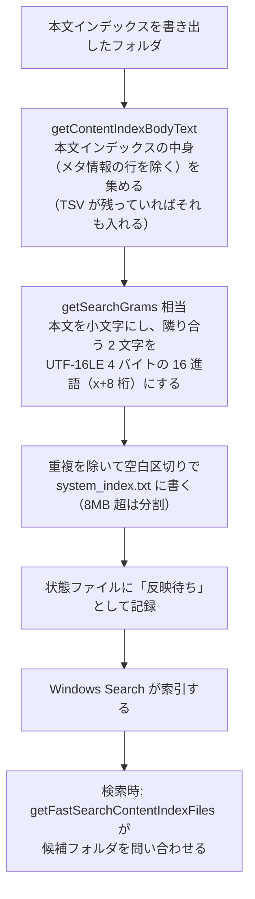

# システムインデックス

扱うこと: システムインデックス（`system_index.txt`）の中身・作り方・状態ファイル。扱わないこと: システムインデックスを使った高速検索そのもの（[高速検索（Windows Search）](../search/fast-search.md)）。先に読むページ: [インデックスのファイルの形](format.md)。

高速検索（[検索](../search/index.md)・[高速検索（Windows Search）](../search/fast-search.md)）のため、インデックス作成は本文インデックスとは別に、Windows Search に索引させる txt（システムインデックス）を作る（`tebunko/index/system_index.ps1`。語の決まりは `tebunko/search/search_gram.ps1`）。



```
work/content_index/<インデックス名>/<相対フォルダ>/content_index.<拡張子>.<番号>.tsv              … 本文インデックス
work/system_index/<インデックス名>/<相対フォルダ>/system_index.txt … システムインデックス
work/system_index_state.tsv                                         … その状態
```

| 項目 | 仕様 |
|---|---|
| 単位 | `work/content_index` の中のフォルダ 1 つにつき 1 つ。中身は、そのフォルダ直下の本文インデックス（拡張子ごとのものすべて）から作る。本文インデックスのメタ情報の行（ファイル名・シート名など）は除く（`getContentIndexBodyText`。入れると、その語で探したときにどのフォルダも候補になるため）。本文インデックスに入れる前の TSV（直下のブックのフォルダ `<ファイル名.xlsx>` の中の TSV）が残っていれば、それも入れる。サブフォルダのブックは、サブフォルダの txt に入る |
| 中身 | 本文を小文字にし、隣り合う 2 文字（UTF-16 の単位）を、UTF-16LE の 4 バイトの 16 進にした語（`x` ＋ 8 桁。例: `ニタ` → `xcb30bf30`）にして、重複を除いて空白区切りの ASCII で書く。空白を含む 2-gram も入るが、問い合わせには使わない |
| 作り方の速さ | `char[]` を `uint32[]` に写して .NET の `HashSet` で重複を除く（1 文字ずつ PowerShell で回さない）。合成データの実測で MB あたり約 0.7 秒（4 スレッド） |
| 大きいとき | 8MB を超える（語 1 つ 10 バイトで約 84 万語）と、語の値の範囲で `system_index_1.txt`・`_2.txt` … に分ける（実測で 16MB までは末尾まで索引された） |
| パスが長いとき | txt のパスが 240 文字以上になるフォルダは作らず、状態ファイルに「対象外」と書く（検索のたびにそのフォルダを照合する） |
| Windows Search への問い合わせ | 候補（分けていない txt）は `System.FileName = 'system_index.txt'`、分けた txt を探すのは `LIKE 'system[_]index[_]%'`、反映の判定は `LIKE 'system[_]index%'`（分けた txt も候補も含む）。SQL の `LIKE` では `_` が「任意の 1 文字」になるため、名前の中の `_` は `[_]` と書く（`newSystemIndexQuery`・`newSystemIndexSplitQuery`・`newSystemIndexStateQuery`） |
| 作る時機 | 本文インデックスを書き出したフォルダは、書き出した直後に、書いた中身から作る（ファイルを読み直さない。[入れ替えと書き出し](publish.md)）。さらにインデックス作成の終わりに、作り直しが要るフォルダ（txt が無い・txt より新しい本文インデックス・TSV がある・反映待ちの日時が txt と合わない・本文インデックスが無くなった）をまとめて作る（`updateSystemIndexes`）。取り込む対象が 0 件のときも作る。中止したとき・クロール対象フォルダが見えなくなったときは、終わりの作り直しは行わない |
| 負荷 | 最大 4 スレッド（物理メモリ 8GB の PC で 4 スレッドのときにメモリが足りなくなったことがあるため）。作るスレッドの優先度を BelowNormal に下げる（`WorkerPool`。画面のプロセス全体の優先度は変えない）。中止を求められていれば（受け渡しの口の `Stop`。`updateSystemIndexes -shouldStop`）、始めていないフォルダは作らない |
| 取り込みのとき | 1 ファイルを取り込んで TSV を入れ替えたら、そのフォルダを「反映待ち（日時 0）」にする。txt を作り直すまで、検索はそのフォルダを必ず照合する（日時 0 は txt の更新日時とも Windows Search の値とも一致しない）。本文インデックスを書き出して txt を作ったら、その txt の日時で「反映待ち」にする |
| 削除・名前変更 | 画面でインデックスを削除・名前変更したら、`work/system_index/<名前>` と状態の行を消す（名前を変えたときは、次のインデックス作成で作り直す）。設定から外したインデックスは、インデックス更新の確認で利用者が［更新を開始］を押してインデックスを削除した回の終わりに消す（削除するまでは本文インデックスが残るため、システムインデックスも検索にも残る） |

**状態ファイル**（`system_index_state.tsv`。BOM 付き UTF-8・CRLF。1 行 `種別<TAB>対象<TAB>値`、パスは `work/system_index` からの相対パス）:

| 種別 | 対象 | 値 | 意味 |
|---|---|---|---|
| `対応済み` | インデックス名 | ― | すべてのフォルダの txt がある（または対象外として記録した）。無いインデックスは、高速検索でもすべてを照合する |
| `反映待ち` | txt | 書いた日時（UTC の Ticks） | Windows Search の `DateModified` がこの日時（秒で切り捨て）と同じで、`GatherTime` が空でなくなれば反映済み（検索がこの行を消す） |
| `対象外` | フォルダ | ― | txt を作らなかった（パスが長い） |

インデクサ（追記・作り直し）と画面（検索のたびの整理）が同時に書かないよう、状態ファイルは排他で開く。開けなければ少し待って数回試し、それでも開けなければ書き換えを次の機会に回す（検索は、読めなければすべてを照合する）。

前の版が作ったシステムインデックスをそのまま読めることの確かめ方は [前の版との互換](format.md#前の版との互換)。
