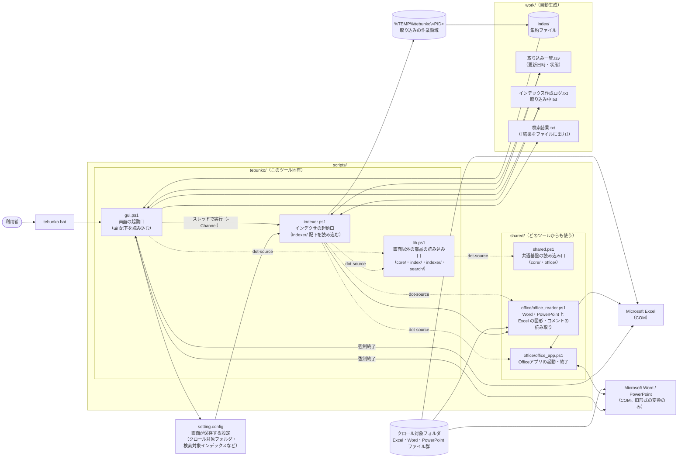
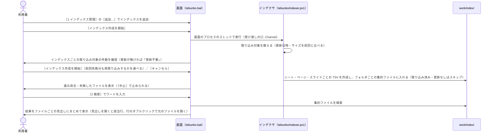

# 設計の概要

設計書は `scripts/*.ps1` および起動用 `tebunko.bat` の実装から仕様を書き起こしたものである。記載内容は**現行実装の挙動**を正とする。

本ツールは画面（`tebunko.bat`）から使う。インデックス作成・検索・プロセス停止はすべて画面から行い、コンソールでの操作（`.bat` の実行・設定ファイルの手編集・キー入力）は前提としない。

## 設計書の構成

- **構成**：[フォルダ構成とデータの置き場所](architecture/layout.md)、[設定ファイル（setting.config）](architecture/settings-file.md)、[共通モジュール](architecture/modules.md)、[プロセスとスレッド](architecture/threads.md)
- **インデックス作成**：[インデックス作成（インデクサ）](indexer/index.md)
- **検索**：[検索](search/index.md)
- **画面**：[画面（GUI）](gui/index.md)
- **テスト**：[テスト](testing/index.md)、[テストの実行と CI](testing/ci.md)
- **安全性**：導入を審査する方向けの説明（何をして何をしないか、その根拠と確かめ方）は、「使い方」の [安全性の要約](../safety/index.md) にある

## 目的

フォルダ配下に大量に存在する Office ファイルに対し、**ファイルを開かずに全文検索**できるようにする。

| 種類 | 拡張子 |
|---|---|
| Excel | `.xlsx` / `.xlsm` / `.xls` / `.xlsb` |
| Word | `.docx` / `.docm` / `.doc` |
| PowerPoint | `.pptx` / `.pptm` / `.ppt` |

## 方式

2 段階方式を採る。先に Office ファイルの文字を書き写した**インデックス**を作っておき（本の巻末の索引にあたる）、検索のときはインデックスだけを読む。こうすると、検索のたびに Office でファイルを開かずに済む。インデックスの中身の具体例は [インデックスとは（はじめて読む方へ）](indexer/index.md#インデックスとははじめて読む方へ) にある。

1. **インデックス作成**（[インデックス作成（インデクサ）](indexer/index.md)）
   各ファイルを取り込み、「場所」（Excel のシート、Word のページ、PowerPoint のスライド等）ごとの TSV（UTF-8）に書き出し、フォルダの取り込みが終わるとフォルダ・拡張子ごとの集約ファイルにまとめて `work/index/` に蓄積する。Excel のセルは COM で操作してテキストを抽出し、Excel の図形・コメントと Word・PowerPoint はファイル（ZIP 内の XML）を直接読む（Word・PowerPoint の旧形式は Word・PowerPoint で新形式に変換してから読む）。2 回目以降は、取り込み済みで更新の無いファイルをスキップする（差分取り込み）。
2. **検索**（[検索](search/index.md)）
   インデックスの集約ファイルを検索し（大文字と小文字の区別・正規表現・対象ファイルの条件はサクラエディタの Grep にならう）、ヒットした「ファイル名（相対フォルダ付き）・場所・該当行」を、元のファイルごとの見出しにまとめて画面の表に表示する。必要なときは `work/検索結果.txt` に出力する。

どちらも画面（[画面（GUI）](gui/index.md)）から行う。インデックス作成は画面のプロセスの中のスレッドで動き、進み具合を画面に表示する（[プロセスとスレッド](architecture/threads.md)）。画面には、インデックス作成を異常終了させた際に残る Excel・Word・PowerPoint のプロセスを強制終了する機能もある。

用語は検索エンジンにならい、画面・設計書・コードで次のようにそろえる。

| 用語 | 意味 | コードでの名前 |
|---|---|---|
| インデックス作成 | クロールから取り込みまでの一連の処理（開始・中止・中断・再開の単位） | `indexing`（画面側）、`indexer.ps1`・`indexer/` |
| インデクサ | インデックス作成を行うプログラム（`indexer.ps1`） | `indexer` |
| クロール | クロール対象フォルダをたどって Office ファイルを列挙し、取り込むファイルを決める | `createTargetList`・`findOfficeFiles` |
| 取り込み | 1 ファイルをインデックスに入れる（コピー → 抽出 → TSV に書き出す → インデックスに置く） | `ingest` |
| 抽出 | Office ファイルからテキストを読み出す | `extract` |
| インデックス | 取り込んだ結果の集約ファイル（フォルダ・拡張子ごとに 1 つ）の集まり（`work/index/<インデックス名>/`） | `index` |
| インデックスの追加 | フォルダをインデックスとして一覧に登録する（中身は取り込まない） | `newIndex` |

「変換」は、旧形式を新形式に保存し直す処理（`.doc` → `.docx` など）のように、形式を変えることだけに使う。検索ワード・件・該当行・元のファイルは検索エンジンの用語に合わせず、そのまま使う。

## 全体構成

## ソースの分け方

ソースは**文脈**（どの機能か）と**層**（何をするか）で分ける。今後ツール（`tebunko_diff` など）を増やしても、共通部分を作り直さずに済むようにするため。

| 分け方 | 内容 |
|---|---|
| 文脈（上位） | `scripts/shared/`（どのツールからも使う）と `scripts/tebunko/`（このツール固有）。その下はドメイン（`core`・`office`・`index`・`indexer`・`search`・`ui`） |
| 層（下位） | 判断層（入力は素の値、出力は素の値）・状態層（ファイル・COM を読み書き）・画面層（`$ui` を触る） |

決まりごとは 3 つ。いずれも `tests/meta/` で機械的に確かめる（[テストの実行と CI](testing/ci.md)）。

1. `shared/` はツールを知らない（依存は一方向）。ツール同士も互いを読み込まない。
2. 判断層は画面に触らない。触らないからテストが書ける。
3. 足したファイルは、必ずどこかの読み込み口から読み込む。

詳細は [共通モジュール](architecture/modules.md)。

## 処理の流れ（利用者視点）

## 動作環境・前提条件

| 項目 | 内容 |
|---|---|
| OS | Windows |
| 実行環境 | Windows PowerShell 5.1（`powershell.exe`） |
| 必須ソフトウェア | Microsoft Excel（`Excel.Application` COM オブジェクトを使用。Excel ファイルの取り込みに必要） |
| 任意のソフトウェア | Microsoft Word・PowerPoint（旧形式 `.doc` `.ppt`、パスワード付き、拡張子と中身が異なる Word・PowerPoint ファイルの取り込みにのみ使用。新形式の `.docx` `.pptx` 等は無くても取り込める） |
| 起動方法 | `tebunko.bat` をダブルクリック。`conhost.exe` を通して `-ExecutionPolicy RemoteSigned -WindowStyle Hidden` で画面を開く（`Bypass` は使わない。PowerShell の窓は残らない）。zip 展開で付く Mark-of-the-Web は、同じ PowerShell が画面のスクリプトを実行する前に消す（`Unblock-File`）ため、RemoteSigned のままスクリプトを実行できる。PowerShell の起動は 1 回だけ。インデクサは画面のプロセスの中のスレッドで動く（別の `powershell.exe` は起動しない）。詳細は [画面の共通仕様](gui/common.md#配布と実行ポリシーmark-of-the-web) |
| スクリプトの文字コード | `scripts/*.ps1`・`tests/*.ps1` は **UTF-8（BOM 付き）**、改行 CRLF。PowerShell 5.1 は BOM なしファイルをシステム既定コードページ（CP932）で読むため、BOM を外すと日本語リテラルが化ける |
| テスト | Pester 5.9.0（版を固定する。入れ方は [CONTRIBUTING](../../.github/CONTRIBUTING.ja.md)）。`.\tests\run.ps1`（詳細は [テストの実行と CI](testing/ci.md)） |
