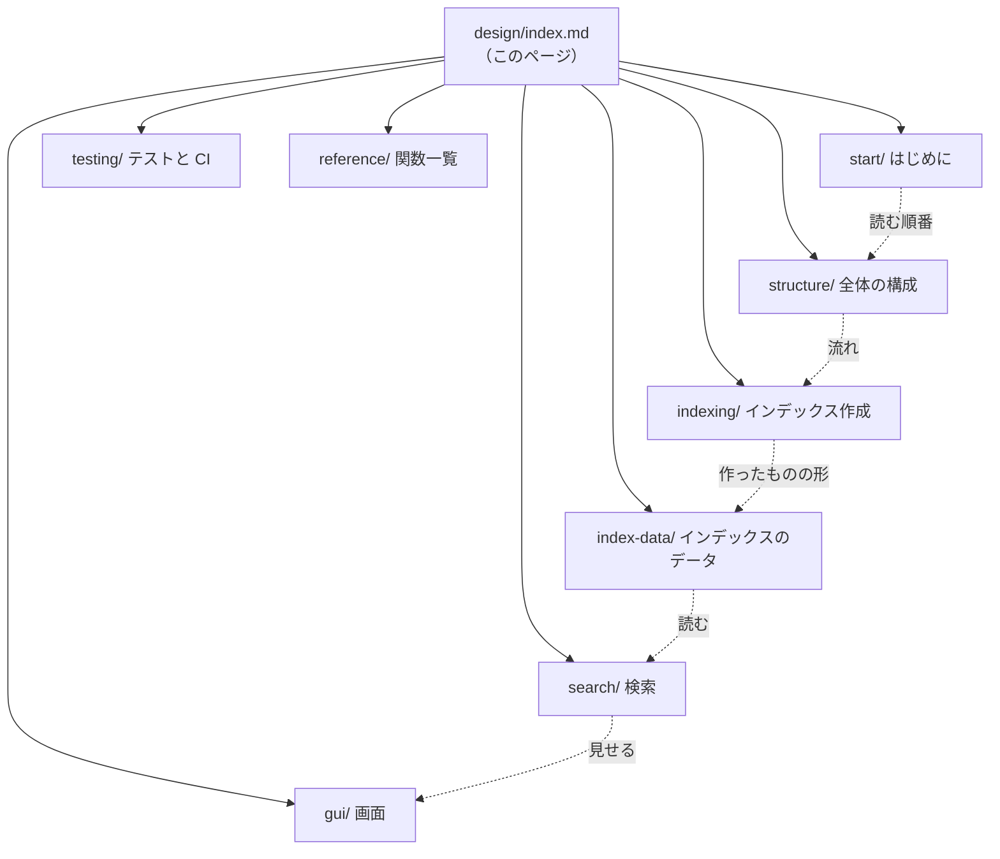
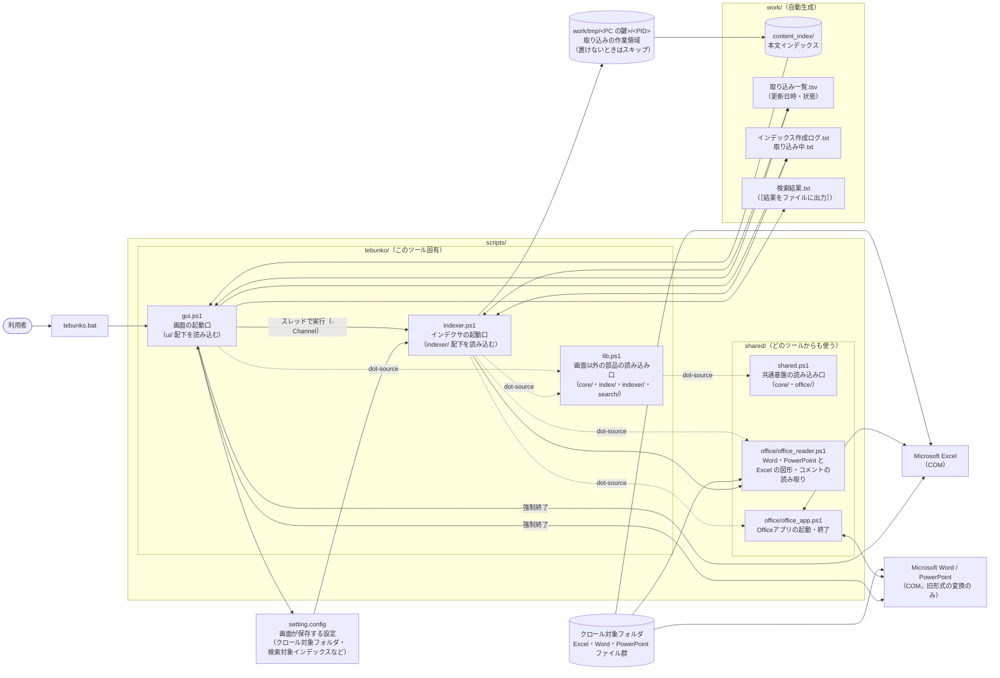

# 設計の概要

扱うこと: 設計書全体の目的・方式（用語）・全体構成・動作環境と、読む人ごとの入口。扱わないこと: 各処理の仕様そのもの（各区分のページで扱う）。先に読むページ: なし（ここが設計書の入口）。

設計書は `scripts/*.ps1` および起動用 `tebunko.bat` の実装から仕様を書き起こしたものである。記載内容は**現行実装の挙動**を正とする。

本ツールは画面（`tebunko.bat`）から使う。インデックス作成・検索・プロセス停止はすべて画面から行い、コンソールでの操作（`.bat` の実行・設定ファイルの手編集・キー入力）は前提としない。

## 設計書の構成

初めて読む・変更に取りかかるときの入口は [はじめに](start/onboarding.md)（読む順番・1 周の流れ）と [変更の種類から見る設計書を引く](start/review-map.md) にある。

```mermaid
flowchart TB
    top["design/index.md<br>（このページ）"]
    top --> start["start/ はじめに"]
    top --> structure["structure/ 全体の構成"]
    top --> indexing["indexing/ インデックス作成"]
    top --> data["index-data/ インデックスのデータ"]
    top --> search["search/ 検索"]
    top --> gui["gui/ 画面"]
    top --> testing["testing/ テストと CI"]
    top --> ref["reference/ 関数一覧"]
    start -. 読む順番 .-> structure
    structure -. 流れ .-> indexing
    indexing -. 作ったものの形 .-> data
    data -. 読む .-> search
    search -. 見せる .-> gui
```

- **はじめに**：[読む順番と 1 周の流れ](start/onboarding.md)、[変更の種類から見る設計書を引く](start/review-map.md)
- **全体の構成**：[ソースの分け方](structure/source.md)、[配布物と開発用のフォルダ構成](structure/folders.md)、[データの置き場所とパスの決め方](structure/data.md)、[どの処理がどのファイルを読み書きするか](structure/io-files.md)、[設定ファイル（setting.config）](structure/settings-file.md)、[プロセスとスレッド](structure/threads.md)、[クラスと関数の使い分け](structure/classes.md)
- **インデックス作成**：[インデックス作成](indexing/index.md)
- **インデックスのデータ**：[インデックスのファイルの形](index-data/format.md)
- **検索**：[検索](search/index.md)
- **画面**：[画面](gui/index.md)
- **テスト**：[テスト](testing/index.md)、[テストの実行](testing/run.md)、[CI](testing/ci.md)
- **関数一覧**：[部品から関数一覧を引く](reference/index.md)
- **安全性**：導入を審査する方向けの説明（何をして何をしないか、その根拠と確かめ方）は、「使い方」の [安全性の要約](../safety/index.md) にある

## 目的

フォルダ配下に大量に存在する Office ファイル・テキストファイルに対し、**ファイルを開かずに全文検索**できるようにする。

| 種類 | 拡張子 |
|---|---|
| Excel | `.xlsx` / `.xlsm` / `.xls` / `.xlsb` |
| Word | `.docx` / `.docm` / `.doc` |
| PowerPoint | `.pptx` / `.pptm` / `.ppt` |
| テキスト | `.txt` / `.csv` / `.tsv` / `.md` / `.log` / `.json` / `.xml` |

## 方式

2 段階方式を採る。Office ファイルから抽出した文字列を索引データ（**インデックス**）として事前に保存し、検索時はインデックスのみを照合する。これにより、検索のたびに Office でファイルを開く処理を省く。インデックスの中身の具体例は [インデックスとは（はじめて読む方へ）](indexing/index.md#インデックスとははじめて読む方へ) にある。

1. **インデックス作成**（[インデックス作成](indexing/index.md)）
   各ファイルを取り込み、「場所」（Excel のシート、Word のページ、PowerPoint のスライド、テキストは「本文」の 1 つ）ごとの TSV（UTF-8）に書き出し、フォルダの取り込みが終わるとフォルダ・拡張子ごとの本文インデックスにまとめて `work/content_index/` に蓄積する。Excel のセルは COM で操作してテキストを抽出し、Excel の図形・コメントと Word・PowerPoint はファイル（ZIP 内の XML）を直接読む（Word・PowerPoint の旧形式は Word・PowerPoint で新形式に変換してから読む）。テキストファイルは文字コードを判定してから行に分けて読む（[テキストファイルの読み取り](indexing/text.md)）。2 回目以降は、取り込み済みで更新の無いファイルをスキップする（差分取り込み）。
2. **検索**（[検索](search/index.md)）
   本文インデックスを検索し（大文字と小文字の区別・正規表現・対象ファイルの条件はサクラエディタの Grep にならう）、ヒットした「ファイル名（相対フォルダ付き）・場所・該当行」を、元のファイルごとの見出しにまとめて画面の表に表示する。必要なときは `work/検索結果.txt` に出力する。

どちらも画面（[画面](gui/index.md)）から行う。インデックス作成は画面のプロセスの中のスレッドで動き、進み具合を画面に表示する（[プロセスとスレッド](structure/threads.md)）。画面には、インデックス作成を異常終了させた際に残る Excel・Word・PowerPoint のプロセスを強制終了する機能もある。

用語は検索エンジンにならい、画面・設計書・コードで次のようにそろえる。

| 用語 | 意味・置き場所 | 画面に出すか | コードでの名前 |
|---|---|---|---|
| インデックス作成 | クロールから取り込みまでの一連の処理（開始・中止・中断・再開の単位） | 出す | `indexing`（画面側）、`indexer.ps1`・`indexer/` |
| インデクサ | インデックス作成を行うプログラム（`indexer.ps1`） | 出す | `indexer` |
| クロール | クロール対象フォルダをたどって Office・テキストのファイルを列挙し、取り込むファイルを決める | 出す | `createTargetList`・`findTargetFiles` |
| 取り込み | 1 ファイルをインデックスに入れる（コピー → 抽出 → TSV に書き出す → インデックスに置く） | 出す | `ingest` |
| 抽出 | Office ファイルからテキストを読み出す | 出さない | `extract` |
| インデックス | 登録したフォルダ 1 件ぶんの索引。本文インデックスとシステムインデックスを合わせたもの | 出す | `index` |
| 本文インデックス | 検索が照合する本体。フォルダ 1 つ・元のファイルの拡張子 1 つにつき、大きさで分けて 1 つ以上。`work/content_index/<インデックス名>/<相対フォルダ>/content_index.<拡張子>.<番号>.tsv`。1 つずつを指すときは「本文インデックスのファイル」 | 出さない | `pack` |
| システムインデックス | 高速検索のために Windows Search に索引させる 2-gram の txt。フォルダ 1 つにつき 1 つ。`work/system_index/<インデックス名>/<相対フォルダ>/system_index.txt`（大きいと `system_index_1.txt` …）。1 つずつを指すときは「システムインデックスの txt」 | 出さない。区別が要るときは「インデックス（高速検索用）」 | `systemIndex` |
| 本文インデックスに入れる前の TSV | 取り込んでから本文インデックスに入れるまでの一時的な TSV。`work/content_index/<インデックス名>/<相対フォルダ>/<元のファイル名>/<場所>.tsv`。インデックス作成が途中で止まったときだけ残る | 出さない | 変えない（無し） |
| 元のフォルダの記録 | `work/content_index/<インデックス名>/元のフォルダ.txt`（インデックス名と登録したフォルダの対応。インデックスを写しても元の場所が分かるようにする） | 出さない | `sourceFolderFileName` |
| 本文インデックスのフォルダ／システムインデックスのフォルダ | ワークスペースの `content_index/`／`system_index/` | 手引き・README ではフォルダの名前として出す | `Workspace.IndexDir`／`Workspace.SystemIndexDir` |
| インデックスの追加 | フォルダをインデックスとして一覧に登録する（中身は取り込まない） | 出す | `newIndex` |

`content_index/` の中身は本文インデックス・入れる前の TSV・元のフォルダの記録の 3 種類で、本文インデックスは `content_index/` の中身すべてではない。コードの名前 `pack`（関数・変数・計測の結果の項目）は、設計書でもそのまま書く。

「変換」は、旧形式を新形式に保存し直す処理（`.doc` → `.docx` など）のように、形式を変えることだけに使う。検索ワード・件・該当行・元のファイルは検索エンジンの用語に合わせず、そのまま使う。

## 全体構成

```mermaid
flowchart LR
    user(["利用者"])

    bat["tebunko.bat"]

    subgraph scripts["scripts/"]
        subgraph tool["tebunko/（このツール固有）"]
            gui["gui.ps1<br>画面の起動口<br>（ui/ 配下を読み込む）"]
            conv["indexer.ps1<br>インデクサの起動口<br>（indexer/ 配下を読み込む）"]
            common["lib.ps1<br>画面以外の部品の読み込み口<br>（core/・index/・indexer/・search/）"]
        end
        subgraph sh["shared/（どのツールからも使う）"]
            shared["shared.ps1<br>共通基盤の読み込み口<br>（core/・office/）"]
            reader["office/office_reader.ps1<br>Word・PowerPoint と<br>Excel の図形・コメントの読み取り"]
            app["office/office_app.ps1<br>Officeアプリの起動・終了"]
        end
    end

    c1["setting.config<br>画面が保存する設定<br>（クロール対象フォルダ・検索対象インデックスなど）"]

    subgraph work["work/（自動生成）"]
        idx[("content_index/<br>本文インデックス")]
        status["取り込み一覧.tsv<br>（更新日時・状態）"]
        ctl["インデックス作成ログ.txt<br>取り込み中.txt"]
        out["検索結果.txt<br>（［結果をファイルに出力］）"]
    end

    tmp[("work/tmp/#lt;PC の鍵#gt;/#lt;PID#gt;<br>取り込みの作業領域<br>（置けないときはスキップ）")]
    src[("クロール対象フォルダ<br>Excel・Word・PowerPoint ファイル群")]
    excel["Microsoft Excel<br>（COM）"]
    office["Microsoft Word / PowerPoint<br>（COM。旧形式の変換のみ）"]

    user --> bat --> gui
    gui -- "スレッドで実行（-Channel）" --> conv
    gui -. "dot-source" .-> common
    conv -. "dot-source" .-> common
    common -. "dot-source" .-> shared
    conv -. "dot-source" .-> reader
    conv -. "dot-source" .-> app

    gui <--> c1
    c1 --> conv
    src --> excel & office & reader
    app <--> excel
    app <--> office
    conv --> reader
    conv <--> status
    gui <--> status
    gui --> ctl
    conv <--> ctl
    conv --> tmp --> idx

    idx --> gui
    gui --> out
    gui -- "強制終了" --> excel & office
```

ソースの分け方（文脈と層）は [ソースの分け方](structure/source.md)、インデックスを作って検索するまでの 1 周の流れは [はじめに](start/onboarding.md) を参照。

## 動作環境・前提条件

| 項目 | 内容 |
|---|---|
| OS | Windows |
| 実行環境 | Windows PowerShell 5.1（`powershell.exe`） |
| 必須ソフトウェア | Microsoft Excel（`Excel.Application` COM オブジェクトを使用。Excel ファイルの取り込みに必要） |
| 任意のソフトウェア | Microsoft Word・PowerPoint（旧形式 `.doc` `.ppt`、パスワード付き、拡張子と中身が異なる Word・PowerPoint ファイルの取り込みにのみ使用。新形式の `.docx` `.pptx` 等は無くても取り込める） |
| 起動方法 | `tebunko.bat` をダブルクリック。`conhost.exe` を通して `-ExecutionPolicy RemoteSigned -WindowStyle Hidden` で画面を開く（`Bypass` は使わない。PowerShell の窓は残らない）。zip 展開で付く Mark-of-the-Web は、同じ PowerShell が画面のスクリプトを実行する前に消す（`Unblock-File`）ため、RemoteSigned のままスクリプトを実行できる。PowerShell の起動は 1 回だけ。インデクサは画面のプロセスの中のスレッドで動く（別の `powershell.exe` は起動しない）。詳細は [画面の共通仕様](gui/common.md#配布と実行ポリシーmark-of-the-web) |
| スクリプトの文字コード | `scripts/*.ps1`・`tests/*.ps1` は **UTF-8（BOM 付き）**、改行 CRLF。PowerShell 5.1 は BOM なしファイルをシステム既定コードページ（CP932）で読むため、BOM を外すと日本語リテラルが化ける |
| テスト | Pester 5.9.0（版を固定する。入れ方は [CONTRIBUTING](../../.github/CONTRIBUTING.ja.md)）。`.\tests\run.ps1`（詳細は [テストの実行と CI](testing/ci.md)） |
