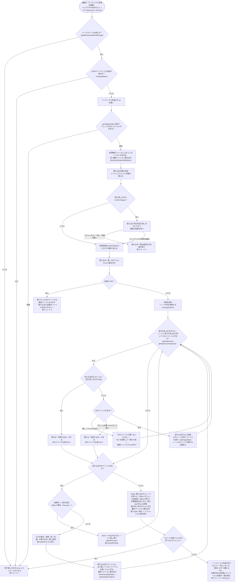
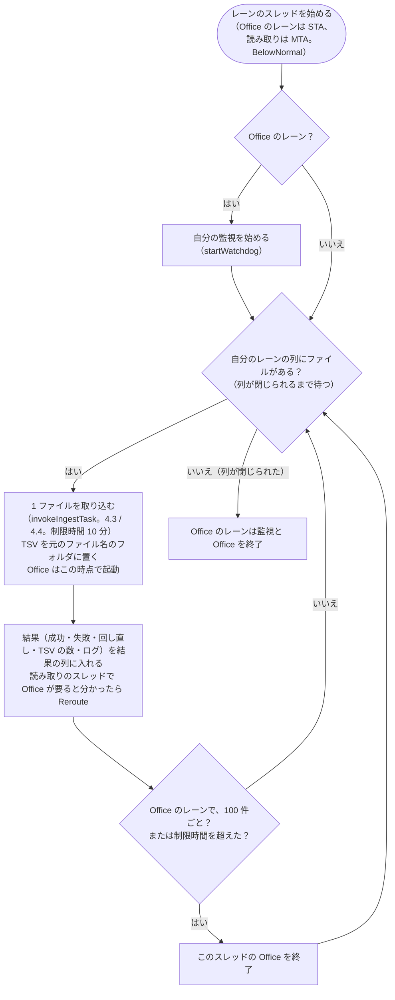
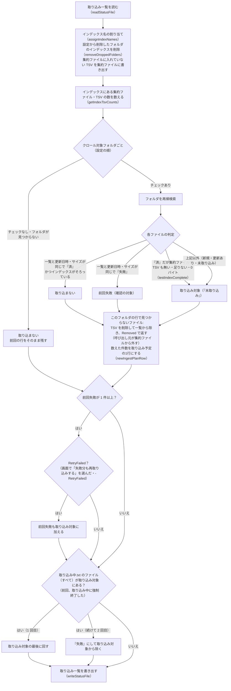
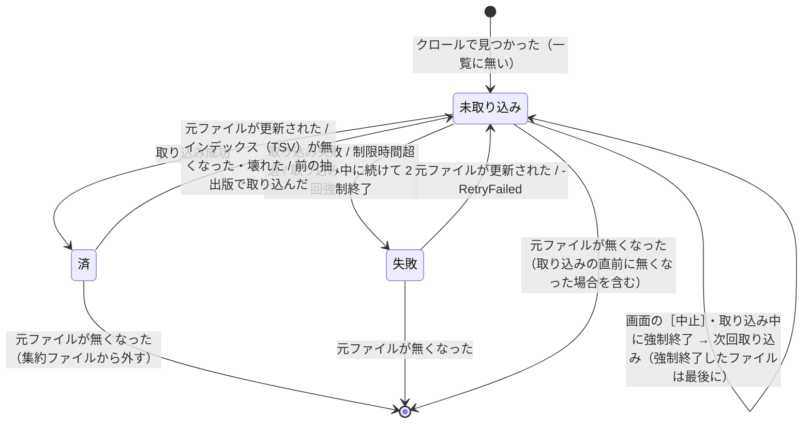

# 処理の流れと取り込み一覧

インデクサの起動から終了までの流れ（[メインフロー](#メインフロー)）と、差分取り込み・中止・強制終了からの再開を支える取り込み一覧（[取り込み一覧と取り込み対象の決定（差分・中断・再試行）](#取り込み一覧と取り込み対象の決定差分中断再試行)）を扱う。

## メインフロー

インデックス作成の本体は `invokeIndexer`（`indexer/indexer_run.ps1`）である。画面は自分のプロセスのスレッド（インデクサの司令。`IndexingSession`）で `indexer.ps1 -Channel` を実行し、`indexer.ps1` は `invokeIndexer` を呼ぶだけである。1 ファイルの取り込みは、ファイルの種類ごとのレーン（Excel・Word・PowerPoint・読み取り）の取り込みのスレッドが並べて行う（[インデックス作成の並列化](../architecture/threads.md#インデックス作成の並列化)）。



取り込みのスレッドの中では、自分のレーンの列から 1 ファイルずつ次を行う（`runIngestWorker`）。Excel・Word・PowerPoint のレーンはスレッド 1 つ（STA）が自分の Office を 1 つ持つ。読み取りのレーンはスレッドを `ingestThreads` の数だけ持ち（MTA）、Office と監視を使わない。



- 利用者の入力を待つ処理（`pause`・`Read-Host`）は無い。画面は受け渡しの口（`newIndexerChannel`）から進み具合を読んで表示する（[［1 インデックス管理］タブ](../gui/index-tab.md)）。
- インデクサは `exit` を使わず、終了コードを返す（`invokeIndexer`。画面のプロセスの中で動くため）。終了コードは受け渡しの口の `ExitCode` にも最後に入れる。画面は `ExitCode` が入ったら終わったとみなす。
- Excel・Word・PowerPoint は、それぞれのレーンのスレッドが必要になったときに 1 つだけ起動し、そのスレッドで使い回す。スレッドごとに 100 ファイルで、および取り込み失敗時に終了し、次に必要になったときに起動し直す（メモリ肥大化・不安定化の対策）。インデックス作成が起動する Office は、種類ごとに最大 1 つである（[Office アプリ（Excel・Word・PowerPoint）の管理](office-apps.md#office-アプリexcelwordpowerpointの管理)）。
- 取り込み一覧・進み具合・ログ・集約ファイルとシステムインデックスは、司令だけが書く。取り込みのスレッドは結果を返すだけである。
- **中止**: 画面の［中止］で受け渡しの口の `Stop` が立つと、司令は次のファイルを渡さず、取り込み中のファイルが終わるのを待つ。取り込み中のファイル（Office のレーンに回し直したものを含む）は最後まで取り込んでから止まる。その後 `finally` で取り込みのスレッドの終了（アプリの終了）・作業領域の削除・集約ファイルへの書き出し・取り込み一覧の書き直しを行って終了コード 2 で終わる。残りのファイルは取り込み一覧で「未取り込み」のまま残り、次回取り込まれる。
- **強制終了**: PC の停止・プロセスの強制終了などで止まった場合は `finally` が実行されないが、取り込み一覧には 1 件ごとに結果を追記しているため、次回は未取り込みのファイルから再開する。強制終了したときに取り込んでいたファイル（レーンに渡していたものすべて）は `work/取り込み中.txt` に残り、次回は最後に回す（[取り込み一覧と取り込み対象の決定（差分・中断・再試行）](#取り込み一覧と取り込み対象の決定差分中断再試行)）。取り込んでいたファイルのインデックスは、TSV を `work/取り込み出力/<PID>/w<番号>` に集めてからフォルダごと入れ替えるため（`publishIndexFiles`）、「前回のインデックスがそのまま」か「今回の分がそろった状態」のどちらかになり、一部のシートだけが入ったインデックスは残らない。集約ファイルに書き出していない TSV は、次回のインデックス作成の始めに書き出す（[配置・命名規則](index-format.md#配置命名規則)「集約ファイルへの書き出し」）。
- **二重に動かさない**: 同じ `work` のインデックス作成は 1 つだけ動かす（`newAppMutex "indexer"`。鍵は `work` のパスから作る）。ミューテックスは司令のスレッドで取り、同じスレッドで放す。ログはミューテックスを取ってから開く（動いているインデックス作成のログを消さないため）。画面は自分が始めたインデックス作成の間は［インデックス作成を開始］を押せないため、ここで止まるのは画面を使わずに起動したものと重なった場合である。既に動いていれば `ほかのインデックス作成が実行中です。インデックス作成が終わってから実行してください。` として終了コード 1 で終わる。取り込み一覧・インデックスを 2 つが同時に書き換えると、状態が食い違うため。ミューテックスはプロセスが終われば解放されるため、強制終了しても残らない。
- **取り込みの直前に元のファイルが無くなった**: 取り込み対象を調べてから実際に取り込むまでの間に、元のファイルが移動・削除されることがある。「失敗」として記録すると、利用者が再取り込みを選ぶまで残ってしまうため、取り込まずに TSV を削除して取り込み一覧から除き、集約ファイルからも外す（`元のファイルが無くなったため、取り込まずに一覧から除きます。`）。次回のクロールでも見つからないため、結果は同じになる。
- **インデックス作成中にクロール対象フォルダごと見えなくなった**: ネットワークの切断・USB メモリの取り外しなどでクロール対象フォルダにアクセスできなくなった場合、そのまま続けると残りのファイルがすべて「失敗」になり、次に再取り込みを選ぶまでインデックスに入らない。そのため、次のファイルを渡すのをやめ、取り込み中のファイルが終わるのを待ってから、残りを「未取り込み」のまま中止し、受け渡しの口の `Error` にメッセージを入れて終了コード 1 で終わる（`finally` は通るため、アプリの終了・取り込み一覧の書き直しは行う）。フォルダを使えるようにしてからインデックス作成を始めると、続きから取り込む。
- **続けられないエラー**: 捕まえていない例外（クロール対象フォルダが無い・チェックの付いたフォルダが無い・設定ファイルを読み込めない・取り込みのスレッドが止まった等）は `invokeIndexer` が受け、メッセージをログと受け渡しの口の `Error` に入れて終了コード 1 で終わる。画面がこのメッセージを表示する。
- **進み具合の受け渡し**: 司令は進み具合（段階・処理済み・残り・失敗・いま行っていること）を受け渡しの口の `Progress` に入れ（`writeIndexingProgress`）、画面は 1 秒ごとに読む（`readIndexingProgress`。[［1 インデックス管理］タブ](../gui/index-tab.md)）。書くのは「ファイルを取り込みのスレッドに渡すとき」「結果を受け取ったとき」「段階が変わるとき」である。
  - 取り込み一覧（数万行になる）を画面が毎秒読み直すと、1 回に数秒かかって画面が固まる（5 万行で約 5.8 秒）ため、進み具合は取り込み一覧と分けている。
  - 段階は `クロール`（取り込み対象を探している。件数はまだ分からない）・`確認`（数え終えて、画面で取り込むかどうかを選ぶのを待っている）・`取り込み`（ファイルを取り込んでいる）・`仕上げ`（Office アプリの終了・集約ファイルへの書き出し・取り込み一覧の書き直し）。**待ち時間が長くなりがちな「クロール」「仕上げ」でも、何をしているか**（どのフォルダをクロールしているか・取り込み一覧を書き直しているか）**を書く**。
  - インデックス作成が終わっても消さない（画面が終わり方（成功・失敗の件数）を読むため）。
- **取り込み前の確認**（受け渡しの口の `ConfirmTargets`。画面から実行したとき）: 取り込み対象を数え終えたところで、インデックスごとの件数を受け渡しの口の `Plan` に入れ、段階を `確認` にして画面の返事を待つ（`waitForIndexingApproval`。`Answered` で待つ）。画面が取り込む返事（`answerIndexingPlan`。`@{RetryFailed}`）を渡せばインデックス作成を始め（`RetryFailed` なら、前回失敗したファイルも対象に加える）、取りやめ（`$null`）か中止（`Stop`）なら 1 件も取り込まずに終了コード 2 で終わる。60 分待っても返事が無ければ取りやめる（画面が返事をしないまま待ち続けないため）。待ち終えたら `Plan` を外す。
  - 取りやめたときは、**取り込み一覧を前回の内容のまま書き直す**（今回の取り込み対象は記録しない）。「未取り込み」で記録すると、画面の表示が［続きから再開］になり、インデックス作成を中断したように見えるため。一方で、元ファイルが無くなった分の削除は済んでいるため、取り込み一覧そのものは書き直す。
- **ログ**: 表示内容は `writeIndexerLog` で `work/インデックス作成ログ.txt`（UTF-8 BOM 付き）に書く（実行ごとに上書き）。取り込みのスレッドは 1 ファイル分のログを貯めて結果と一緒に返し、司令が書く（結果を受け取った順に並ぶ。先頭の `[番号/件数]` が取り込み対象の中の順である）。画面を使わずに実行したときはコンソールにも出す。問題が起きたときはこのログで確認する。

## 取り込み一覧と取り込み対象の決定（差分・中断・再試行）

### 取り込み一覧 `work/取り込み一覧.tsv`

クロール対象フォルダ配下の Office ファイルを 1 ファイル 1 行で記録する。UTF-8（BOM 付き）・タブ区切りで、Excel でそのまま開ける。

```
クロール対象フォルダ	C:\data\営業	営業
クロール対象フォルダ	D:\old\2019年度	2019年度
相対パス	更新日時	サイズ	状態	TSV数	取り込み日時	エラー	抽出版
営業\2024\見積\A社.xlsx	2025/01/10 12:34:56	10420	済	3	2026/09/19 10:00:35		2
営業\空ブック.xlsx	2025/01/10 12:34:56	8578	済	0	2026/09/19 10:00:35		2
営業\秘密.xlsx	2025/01/10 12:34:56	15360	失敗		2026/09/19 10:00:40	読み取りパスワードが設定されているため開けません（パスワード付きのファイルは取り込めません）	
2019年度\新規.docx	2026/09/18 09:00:00	20480	未取り込み				
```

| 列 | 内容 |
|---|---|
| 先頭の行 | `クロール対象フォルダ<TAB><パス><TAB><インデックス名>`。クロール対象フォルダ（チェックなしを含む）ごとに 1 行 |
| 相対パス | `<インデックス名>\<クロール対象フォルダからの相対パス>`（= `work/index` からの相対パス）。大文字・小文字は区別しない |
| 更新日時・サイズ | クロール時の元ファイルの更新日時（`yyyy/MM/dd HH:mm:ss`、`formatFileTime`）とバイト数。次回、これと比べて更新の有無を判定する |
| 状態 | `未取り込み`（取り込み待ち・中断）/ `済` / `失敗` |
| TSV数 | 作成した TSV の数（= 場所の数。`済` のとき）。内容が空のファイルは `0`。集約ファイルに入れた後も値はそのまま（集約する前の TSV が残っているときの確認に使う。[取り込み対象の決定](#取り込み対象の決定createtargetlist)） |
| 取り込み日時 | 取り込んだ（または失敗した）日時 |
| エラー | 失敗の原因（`describeIngestError` で例外から作る。[失敗の原因](office-apps.md#失敗の原因describeingesterror)。タブ・改行はスペースにする） |
| 抽出版 | 取り込んだ（`済`）ときの、その形式の読み取る内容の版（`getExtractVersion`。`indexer_decide.ps1` の `$extractVersions`）。今は `.xlsx` `.xlsm` `.docx` `.docm` `.doc` `.pptx` `.pptm` `.ppt` が 2（図形・コメント等を読む）、`.xls` `.xlsb` は 1。今の版より小さければ、更新が無くても取り込み直す（[処理の流れと取り込み一覧](flow.md)）。空は 1 とみなす |

書き込み方（`writeStatusFile` / `addStatusRow` / `readStatusFile`）:

- クロールの後に全ファイルを書き出す（一時ファイル `取り込み一覧.tsv.tmp` に書いてから置き換える）。
- インデックス作成中は 1 件ごとに結果の行を**末尾に追記**する。読み込み時は同じ相対パスの後の行を優先するため、途中で中断しても取り込み済みの結果は失われない。列数の合わない行（書き込み途中で強制終了した行）は無視する。
- 終了時（`finally`）に 1 ファイル 1 行に書き直す。インデクサが強制終了された場合は追記した行が重複して残るが、次回のクロール時に書き直される。

### 強制終了・時間切れからの再開

大量のファイルを取り込むと、Office アプリが応答しなくなるファイル（壊れたファイル・非常に大きいファイル・表示されないダイアログで止まる等）で止まることがある。COM の呼び出しは応答が無いと戻らず、画面の［中止］（ファイルの切れ目で止まる）も効かないため、次の 2 つで同じファイルで止まり続けないようにする。

| 仕組み | 内容 |
|---|---|
| 1 ファイルの制限時間（`$fileTimeoutMinutes` = 10 分） | Excel・Word・PowerPoint のレーンのスレッドごとに、別のスレッド（監視。`startWatchdog`）で制限時刻を監視する。制限時間を過ぎたら、そのスレッドが自分で起動した Office アプリ（`getApp` で PID を控えたもの。利用者のアプリ・ほかのレーンのアプリは除く）を強制終了する。COM の呼び出しが例外で戻るため、そのファイルは `失敗`（エラー: `10 分以内に取り込みが終わらなかったため中止しました（Officeアプリを強制終了しました）`）とし、次のファイルへ進む。強制終了したアプリはすべて終了扱いにし、次に必要になったときに起動し直す |
| 取り込み中のファイルの記録（`work/取り込み中.txt`） | 取り込み中のファイルを 1 行に 1 つ `<回数><TAB><相対パス>` で書く（`writeIngestingFiles`。取り込みを複数のスレッドで行うため、取り込み中のものすべて）。ファイルを取り込みのスレッドに渡す前に加え、結果を取り込み一覧に追記した後に除く。インデックス作成の終わりには、中止・続けられないエラーの場合も `finally` で削除する（`removeIngestingFile`。回数に数えない）。PC が停止した・プロセスが強制終了された等の場合だけ残る |

次回の実行時（取り込み対象の決定の後、`readIngestingFiles`）:

- `work/取り込み中.txt` のファイルは、**すべて**「前回止まったファイル」として扱う（どのファイルで止まったかは分からないため）。取り込み対象にあれば、取り込み対象の**最後に回す**（`前回、取り込み中に強制終了したファイルは最後に取り込みます: <相対パス>`）。他のファイルの取り込みが先に進む。最後に回したファイルは、取り込みを始めるまで記録を残す（その前にまた止まっても、回数が分かるように）。
- そのファイルの取り込みを始めるときは、回数を 1 増やして記録する。続けて `$interruptLimit`（2）回強制終了したファイルは、応答しなくなるファイルとみなして `失敗`（エラー: `取り込み中に 2 回続けて強制終了されたため、取り込みを中止しました（…）`）とし、取り込み対象から除く。以降は他の失敗と同じく、画面で「失敗分も再取り込みする」を選ぶ（`-RetryFailed`）か元ファイルが更新されたときに取り込み直す。
- 記録のファイルが取り込み対象に無い（取り込み済み・削除された等）場合は、記録を削除する。

## クロール（取り込み対象の決定）

ここでは**クロール**（クロール対象フォルダをたどって Office ファイルを列挙し、取り込み一覧と比べて取り込むファイルを決める処理）を扱う。取り込み一覧・強制終了からの再開は [取り込み一覧と取り込み対象の決定](#取り込み一覧と取り込み対象の決定差分中断再試行) を参照。

### クロール対象フォルダとインデックス名

- **インデックス名**（`assignIndexNames` / `newIndexName`）: クロール対象フォルダごとの `work/index` 直下のフォルダ名。**設定（`setting.config` の `targetFolders[].name`）に持ち、フォルダの置き場所（`path`）とは分けて管理する**。
  - 設定に名前があればそれを使う。**フォルダの場所（`path`）を書き換えても名前は変わらないため、同じインデックスとして扱える**（インデックスも取り込み一覧の行もそのまま使うので、フォルダを移しただけなら再取り込みは起きない）。
  - 名前が無い場合（画面で新しく追加したフォルダ・設定ファイルを直接書き換えた場合）は、前回の取り込み一覧に同じパスがあればその名前を使い、無ければフォルダ名（ドライブ直下はドライブ名、UNC の共有直下は共有名）を `toSafeFileName` したものにする。設定にある名前・前回使われた名前（削除したフォルダの名前を含む）と重なる場合は `名前(2)` `名前(3)` … とする（ファイル名の上限 255 文字に収まるよう、元の名前を切り詰めてから付ける）。
  - 割り当てた名前は、インデックス作成の最初に設定へ保存する（`writeTargetFolders`。`インデックス名を設定に保存しました: …` と表示する）。以後は設定の名前が使われる。
- **フォルダごと移動した場合**: クロール対象フォルダを別のドライブ・共有フォルダへ移した場合は、**画面の［編集…］でそのインデックスの「元のフォルダ」を書き換えるだけでよい**（[［1 インデックス管理］タブ](../gui/index-tab.md)）。インデックス名は変わらないため、インデックス（TSV）と取り込み一覧の行をそのまま使い、**移動しただけで全件再取り込みにならない**（次のインデックス作成では、更新されたファイルだけを取り込む）。フォルダ名を変えて移した場合も同じで、名前はインデックス名として保たれる。
  - インデックスを削除して新しいパスで作り直すと、別のインデックス（新しい名前）になり、全件取り込みになる。移した場合は［編集…］を使う。
  - 検索結果から元のファイルを開くときにフォルダを選んだ場合も、同じ設定（インデックス名に対する場所）が書き換わるため、次のインデックス作成ではそのフォルダを取り込む（[［2 検索］タブ](../gui/search-tab.md#元のファイルが見つからないとき元のフォルダを設定する)）。
- **設定から削除したフォルダ**（`removeDroppedFolders`）: 前回の取り込み一覧にあって、今回どのフォルダにも使われていない**インデックス名**のインデックス（`work/index/<インデックス名>`）を削除する。名前で比べるため、移動を引き継いだインデックスは削除しない。
- **元のフォルダ.txt**（`writeSourceFolderFile`）: 取り込み一覧を書き出した直後（取り込むファイルが無い場合も）、`work/index/<インデックス名>/元のフォルダ.txt`（そのインデックス 1 件分。フォルダがまだ無ければ書かない）に、インデックス名とクロール対象フォルダの対応を書き出す。取り込み一覧は `work/` にあるため、インデックスのフォルダ（`work/index`）だけを別の PC・場所へコピーすると元のフォルダが分からなくなる。これを避けるため、インデックスのフォルダの中にも対応を置く。インデックス 1 件につき 1 ファイルのため、`work/index` ごとでも `<インデックス名>` のフォルダだけでもコピーできる。拡張子を `.tsv` にすると検索対象になるため `.txt` にする。画面での使い方は [元のフォルダの特定（インデックスを別の PC・場所で使う場合）](../gui/search-tab.md#元のフォルダの特定インデックスを別の-pc場所で使う場合) を参照。
  ```
  # 検索結果から元のファイルを開くときに使う、インデックス名とクロール対象フォルダの対応です（インデックス作成のたびに作り直します）
  営業<TAB>C:\data\営業
  D<TAB>D:\
  ```

### 取り込み対象の決定（`createTargetList`）



- **更新の判定**: 更新日時（秒まで）とサイズのどちらかが取り込み一覧と異なれば「更新あり」。古い版に戻した場合も再取り込みされる。
- **前の抽出版で取り込んだファイル**: 更新が無く `済` でも、取り込み一覧の「抽出版」がその形式の今の版（`getExtractVersion`）より小さければ取り込み直す（`getIngestDecision` の `outdated`）。ツールの版を上げて読み取る内容が増えたとき（例: Excel の図形・コメント）、既存のインデックスにも反映するため。件数は「更新あり」に数える。前回 `失敗` のファイルは、抽出版によらず「前回失敗」のまま。
- **一覧に無いファイル**（初回・取り込み一覧を削除した後）は、すべて取り込み対象にする（集約ファイルの中の元のファイルは、中身を読まないと分からないため調べない）。
- **インデックスが無くなった・壊れているファイル**: 取り込み一覧が `済` でも、次のどちらかに当てはまれば取り込み直す（`testIndexComplete`）。一覧だけを見ると `済` のままになり、検索しても出てこない状態が続くため。
  - そのファイルのフォルダ・拡張子の集約ファイル（`work/index/<相対フォルダ>/content.<拡張子>.<番号>.tsv`）が無いか 0 バイトで、集約する前の TSV（`work/index/<相対パス>/*.tsv`）も無い・記録した TSV 数より少ない（`work/index` のフォルダ・ファイルを直接削除した場合）。集約ファイルがあれば（0 バイトでなければ）、そろっているものとする。
  - 集約する前の TSV に 0 バイトのものがある（書き込みの途中で電源が落ちた場合など）。空のシート・ページは保存しない（`prettyTsv` / `writeUnits`）ため、0 バイトの TSV は正常には作られない。
  - 1 ファイルずつ調べると件数の分だけ時間がかかるため、取り込み対象を調べる前に、インデックスのフォルダとファイルをそれぞれ 1 回ずつ列挙して数える（`getIndexTsvCounts`。集約ファイルはそのファイルの相対パス → 1（0 バイトなら壊れている印）、集約する前の TSV はフォルダの相対パス → TSV の数。大きさは列挙のときに分かる）。列挙できない場合（アクセス権が無い等）は確認しない。TSV 数を記録していない行も、集約ファイルが無ければ確認しない。
  - 集約ファイルの**中身の書き換え・一部の欠け**（手で編集した等、0 バイトでないもの）までは分からない（集約ファイルの中の元のファイルごとの場所の数は数えない）。その場合は画面でインデックスを［削除］してから作成し直す（[［1 インデックス管理］タブ](../gui/index-tab.md)）。
- **元ファイルが無くなったファイル**（削除・名前変更・移動）は、そのファイルのインデックスのフォルダ（`work/index/<相対パス>`。集約する前の TSV）があれば削除して一覧から除き、相対パスを `Removed` で返す。インデクサはそのフォルダを書き出し待ちにし、集約ファイルから外す（[配置・命名規則](index-format.md#配置命名規則)「集約ファイルへの書き出し」）。`元ファイルが無くなった N 件は、インデックスから除きます。` を表示する。ただし、クロール中にアクセスできないフォルダがあった場合は、見つからないだけの可能性があるため削除せず一覧に残し、その旨を表示する。
- フォルダごとに `  [<インデックス名>] <パス>` と、クロール後に `  [<インデックス名>] Officeファイル N 件（取り込み済み A 件 / 新規 B 件 / 更新あり C 件 / 前回未完了 D 件 / 前回失敗 E 件）` を表示する。インデックスが無くなった・壊れているファイルがあるときだけ `/ インデックスが無い・壊れている F 件` を付け、続けて `インデックス（TSV）が無くなった・壊れている F 件は取り込み直します。（インデックスを直接削除した・0 バイトのTSVが残っている）` を表示する。チェックなしのフォルダは `… チェックなしのため取り込みません（インデックスはそのまま残します）` と表示する。
- インデックス作成中は `[i/N] <インデックス名>\<相対パス>` を表示する。元ファイルのパスは、相対パスの先頭のインデックス名からクロール対象フォルダを引いて求める。

### 取り込み予定（画面の確認に出す件数）

受け渡しの口の `ConfirmTargets`（画面から実行したとき）なら、取り込み対象を決めた後、インデックスごとの件数を 1 行にし（`newIngestPlanRow`）、受け渡しの口の `Plan` に入れる（`waitForIndexingApproval`）。
画面はこれを読んで確認のダイアログを出す（[インデックス作成の確認ダイアログ](../gui/index-tab.md#インデックス作成の確認ダイアログ)）。返事を受け取ったら `Plan` を外す。次の例は、1 行を列の順にタブで区切って並べたものである。

```
インデックス名	元のフォルダ	区分	ファイル数	取り込み対象	新規	更新あり	前回未完了	インデックスなし	前回失敗
営業	C:\data\営業	取り込み	1234	12	5	7	0	0	3
2019年度	D:\old\2019年度	チェックなし	0	0	0	0	0	0	0
```

- **区分**: `取り込み`（チェックが付いていて元のフォルダもある。数えた結果を書く）/ `チェックなし` / `フォルダなし`。後の 2 つは数えないため、件数はすべて 0。
- **取り込み対象** = 新規 ＋ 更新あり ＋ 前回未完了 ＋ インデックスなし。**前回失敗**は含めない（画面の確認で「失敗分も再取り込みする」を選んだときだけ対象になる）。

取り込み一覧の各ファイルの状態遷移:



クロールで列挙するファイルの条件（`findOfficeFiles`）:

- 拡張子が `.xlsx` `.xlsm` `.xls` `.xlsb` `.docx` `.docm` `.doc` `.pptx` `.pptm` `.ppt`（大文字・小文字を区別しない）。テンプレート（`.xltx` `.dotx` `.potx` 等）は対象外
- ファイル名が `~$` で始まるもの（Office のロックファイル）は除外
- アクセスできないサブフォルダは無視して続行（元ファイルが無くなったかどうかの確認は行わない）
- 相対パスは、実際に列挙したフォルダ（`Resolve-Path` で解決した `Root`。`findOfficeFiles` が返す）から求める。列挙したファイルのパスが `\\?\` 付きの `Root` で始まれば先頭を切り落とし（ファイルが多いときに速い）、そうでなければ `getPathUnderFolder` で求める。
  設定に書かれたパスとは書き方が違うことがあるため（末尾の `\`、`\\?\` 付き、`.` ・ `..` を含む、`/` 区切り）、設定のパスの文字数では切り出さない

各ファイルは拡張子で抽出方法を振り分ける（`ingestFile`）。`.xls*` は [Excel の抽出処理](excel.md#excel-の抽出処理extractworkbook)（Excel、[Excel](excel.md)）、`.doc*` `.ppt*` は [Word・PowerPoint の抽出処理](office-apps.md#wordpowerpoint-の抽出処理extractdocument)（Word・PowerPoint 共通、[Word・PowerPoint の共通処理と Office アプリの管理](office-apps.md)）と [Word の旧形式の変換](word.md#word-の旧形式の変換extractwithword)（Word、[Word](word.md)）・[PowerPoint の旧形式の変換](powerpoint.md#powerpoint-の旧形式の変換extractwithpowerpoint)（PowerPoint、[PowerPoint](powerpoint.md)）。
成功時は `TSV N 件を作成しました。` を表示する。

> **[Excel の抽出処理](excel.md#excel-の抽出処理extractworkbook) Excel の抽出処理（`extractWorkbook`）** → [Excel の抽出処理](excel.md#excel-の抽出処理extractworkbook)
