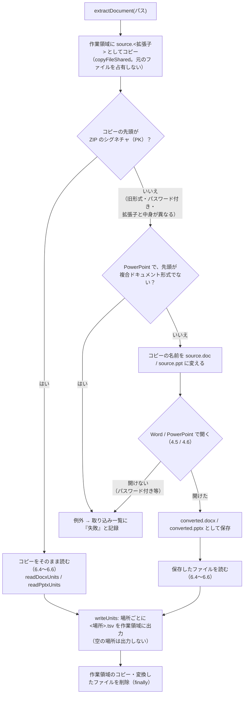
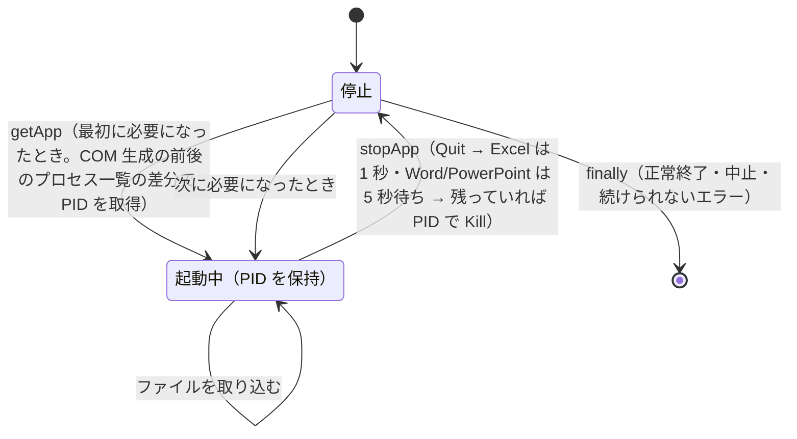

# Word・PowerPoint の共通処理と Office アプリの管理

Word・PowerPoint で共通の抽出処理（[Word・PowerPoint の抽出処理](#wordpowerpoint-の抽出処理extractdocument)）、失敗の原因の言い換え（[失敗の原因](#失敗の原因describeingesterror)）、Office アプリの起動・終了と制限時間の監視（[Office アプリ（Excel・Word・PowerPoint）の管理](#office-アプリexcelwordpowerpointの管理)）を扱う。

## Word・PowerPoint の抽出処理（`extractDocument`）

Word・PowerPoint で共通の処理。旧形式などをアプリで変換する処理は [Word の旧形式の変換](word.md#word-の旧形式の変換extractwithword)（Word）・[PowerPoint の旧形式の変換](powerpoint.md#powerpoint-の旧形式の変換extractwithpowerpoint)（PowerPoint）、ファイルの読み取りは [Word・PowerPoint のテキスト読み取り](#wordpowerpoint-のテキスト読み取りscriptssharedofficeoffice_readerps1)（共通）・[Word のテキスト読み取りと TSV の場所](word.md#word-のテキスト読み取りと-tsv-の場所readdocxunits)（Word）・[PowerPoint のテキスト読み取りと TSV の場所](powerpoint.md#powerpoint-のテキスト読み取りと-tsv-の場所readpptxunits)（PowerPoint）。

- 元のファイルは直接読まず、先に作業領域へコピーする（Excel と同じく `copyFileShared`。[Excel](excel.md) の補足）。ZIP を直接開くと、読んでいる間ほかのアプリの書き込みを拒否するうえ、利用者が編集中（書き込みで開いている）のファイルは共有違反で読めないため。
- コピーに旧形式の拡張子を付けてから開くのは、Word・PowerPoint が拡張子と中身が異なるファイル（中身が `.doc` の `.docx` 等）を開けないため。
- パスワード付きの `.docx` `.pptx` は暗号化されて ZIP ではなくなるため、この経路で Word・PowerPoint に開かせ、例外として取り込み一覧に「失敗」と記録する。

> **[Word の旧形式の変換](word.md#word-の旧形式の変換extractwithword) Word の旧形式の変換（`extractWithWord`）** → [Word の旧形式の変換](word.md#word-の旧形式の変換extractwithword)

> **[PowerPoint の旧形式の変換](powerpoint.md#powerpoint-の旧形式の変換extractwithpowerpoint) PowerPoint の旧形式の変換（`extractWithPowerPoint`）** → [PowerPoint の旧形式の変換](powerpoint.md#powerpoint-の旧形式の変換extractwithpowerpoint)

## Word・PowerPoint のテキスト読み取り（`scripts/shared/office/office_reader.ps1`）

`.docx` `.pptx` を ZIP として開き（`System.IO.Compression`）、XML を `XmlReader` で先頭から順に読む（`readXmlLines`）。Word（WordprocessingML、`w:`）と PowerPoint（DrawingML、`a:`）で同じ処理を使い、名前空間だけを切り替える。

| 要素 | 扱い |
|---|---|
| 段落（`p`） | 1 行。文字（`t`）を連結する。タブ・改行（`tab` `br` `cr`）はスペース、`noBreakHyphen` は `-` |
| 表の行（`tr`） | 1 行。セル（`tc`）をタブ区切りにし、行末の空セルは除く。セル内の複数段落はスペース区切り。入れ子の表は外側のセルの中でスペース区切り |
| テキストボックス | Word の本文（`$objects` を渡したとき）: 本文の行には入れず、段落をスペースでつないで図形 1 つとして集める（[Word のテキスト読み取りと TSV の場所](word.md#word-のテキスト読み取りと-tsv-の場所readdocxunits)の `ページNNN[図形]`）。ヘッダー・フッター・脚注: 中の段落をそれぞれ 1 行とする（アンカーの段落の前に出力される） |
| SmartArt・グラフ・コメントの参照 | `$objects` を渡したとき、`dgm:relIds` の `r:dm`・`c:chart` の `r:id`・`w:commentReference` の `w:id` をページ付きで集める（中身は呼び出し元がリレーションシップの先から読む） |
| 互換用の代替表示（`mc:Fallback`） | 読まない（`mc:Choice` と同じ内容が重複するため） |
| 変更履歴 | 削除された文字（`w:delText`）と移動元（`w:moveFrom`）は読まない。挿入された文字は読む |
| フィールドコード（`w:instrText`） | 読まない（表示される結果の文字は読む） |

- Word・PowerPoint の TSV は、空行を除いて 1 行 = 段落 1 つ、または表の 1 行（セルをタブ区切り）。
- どの XML をどの場所（TSV）として読むかは、[Word のテキスト読み取りと TSV の場所](word.md#word-のテキスト読み取りと-tsv-の場所readdocxunits)（Word）・[PowerPoint のテキスト読み取りと TSV の場所](powerpoint.md#powerpoint-のテキスト読み取りと-tsv-の場所readpptxunits)（PowerPoint）を参照。

> **[Word のテキスト読み取りと TSV の場所](word.md#word-のテキスト読み取りと-tsv-の場所readdocxunits) Word のテキスト読み取りと TSV の場所（`readDocxUnits`）** → [Word のテキスト読み取りと TSV の場所](word.md#word-のテキスト読み取りと-tsv-の場所readdocxunits)

> **[PowerPoint のテキスト読み取りと TSV の場所](powerpoint.md#powerpoint-のテキスト読み取りと-tsv-の場所readpptxunits) PowerPoint のテキスト読み取りと TSV の場所（`readPptxUnits`）** → [PowerPoint のテキスト読み取りと TSV の場所](powerpoint.md#powerpoint-のテキスト読み取りと-tsv-の場所readpptxunits)

> **[Excel の図形・コメントの読み取り](excel.md#excel-の図形コメントの読み取りreadxlsxobjectunits) Excel の図形・コメントの読み取り（`readXlsxObjectUnits`）** → [Excel の図形・コメントの読み取り](excel.md#excel-の図形コメントの読み取りreadxlsxobjectunits)

## 失敗の原因（`describeIngestError`）

取り込みに失敗したファイルは、取り込み一覧のエラー列に**失敗の原因**を記録する。画面の［1 インデックス管理］タブには、失敗したファイルと原因を一覧で表示する（[［1 インデックス管理］タブ](../gui/index-tab.md) No.8）。

Office アプリの例外メッセージはそのままでは分かりにくい（パスワード付きのファイルでも「入力したパスワードが間違っています」と出る、作業領域のコピーのパスが出る、等）。そのため `describeIngestError` で、よくある原因を言い換えて `原因（詳細: 元のメッセージ）` の形にする。

- メソッド呼び出しの例外（`"7" 個の引数を指定して "Open" を呼び出し中に例外が発生しました` 等）は、中の例外（`GetBaseException()`）のメッセージを使う。
- スクリプト自身が `throw` したメッセージは、利用者向けに書いてあるためそのまま使う。
- 判定できない例外は、元のメッセージをそのまま使う（空ならエラーコードを表示する）。

| 判定 | 記録する原因 |
|---|---|
| メッセージに `パスワード` / `password` を含む | `読み取りパスワードが設定されているため開けません（パスワード付きのファイルは取り込めません）`（元のメッセージは誤解を招くため付けない） |
| `FileNotFoundException` / `DirectoryNotFoundException` | `ファイルが見つかりません（取り込み中に移動・削除・名前変更された可能性があります）` |
| `UnauthorizedAccessException`、`0x80070005` | `ファイルを読むアクセス権がありません` |
| `PathTooLongException` | `パスが長すぎるため読めません` |
| `OutOfMemoryException` | `シート・文書が大きすぎて取り込めません（メモリが不足しました）`（整形（[TSV 整形仕様](excel.md#tsv-整形仕様prettytsv--formattsv)）はシート 1 枚分を一度に読み込むため、テキストにして約 1GB を超えるシートで発生する） |
| `0x80070020` / `0x80070021`（共有違反・ロック違反） | `ほかのアプリ・利用者がファイルを使用中のため読めません（ファイルを閉じてから再取り込みしてください）` |
| `0x80040154` / `0x80080005` / `0x800401F3` | `Officeアプリ（Excel・Word・PowerPoint）を起動できませんでした（インストール・ライセンス認証の状態を確認してください）` |
| `0x800706BA` / `0x800706BE` / `0x80010105` / `0x80010108` | `Officeアプリが異常終了したか、内部でエラーが発生しました（ファイルが壊れている、または大きすぎる可能性があります）` |
| `0x80010001` / `0x8001010A` | `Officeアプリが応答しませんでした（Officeアプリでダイアログを表示中などの可能性があります）` |
| `InvalidDataException` / `XmlException`、メッセージに `ファイル形式` `破損` `壊れ` 等を含む | `ファイルが壊れているか、拡張子と中身の形式が一致していません` |

制限時間を超えた場合（[メインフロー](flow.md#メインフロー)）と、取り込み中に続けて強制終了した場合（[取り込み一覧と取り込み対象の決定（差分・中断・再試行）](flow.md#取り込み一覧と取り込み対象の決定差分中断再試行)）は、それぞれ専用のメッセージを記録する。

記録・表示するメッセージの全文と対処は、[エラーメッセージ一覧](errors.md)（[エラーメッセージ一覧](errors.md)）にまとめる。

## Office アプリ（Excel・Word・PowerPoint）の管理

| 項目 | 仕様 |
|---|---|
| 起動 | `getApp <名前>` がアプリごとに 1 つの COM オブジェクトを保持し、最初に必要になったときに起動する。保持はスレッドごとで、Excel・Word・PowerPoint はそれぞれのレーンのスレッド 1 つだけが起動する（Excel のスレッドは Excel だけ、Word のスレッドは Word だけ、PowerPoint のスレッドは PowerPoint だけを持つ。読み取りのスレッドは Office を起動しない）。インデックス作成が起動する Office は、種類ごとに最大 1 つである。スレッドの間で Office を分け合わないため、鍵は使わない（[インデックス作成の並列化](../architecture/threads.md#インデックス作成の並列化)） |
| PID の取得 | COM 生成の前後でプロセス一覧（`EXCEL` / `WINWORD` / `POWERPNT`）を比べ、新しく増えた 1 つを自分が起動したプロセスとする。同じ種類の Office を起動するのはそのレーンのスレッド 1 つだけのため、ほかのスレッドの起動と取り違えない |
| 優先度 | 自分が起動した Office のプロセスも `PriorityClass` を変えない（Normal のまま）。利用者がダブルクリックしたファイルがインデックス作成の Excel・Word で開くことがあり、PowerPoint は利用者と同じプロセスになるため、利用者とプロセスを共有しないと確実には言えない（[スレッドの一覧](../architecture/threads.md#スレッドの一覧)）。PID とプロセス名を受け渡しの口の `OfficePids` に記録する（画面を閉じるときに止まらなければ、これだけを止める。[閉じるときの順番](../architecture/threads.md#閉じるときの順番)） |
| 利用者のアプリとの共用 | 新しいプロセスが増えなかった場合は利用者のアプリとみなし、`Quit()` も強制終了もしない |
| 終了 | `Quit()` と `ReleaseComObject` の後、待ち時間（Excel は 1 秒、Word・PowerPoint は 5 秒）以内にプロセスが終了しなければ PID で強制終了する。Excel の待ち時間が短いのは、抽出で取り出した COM オブジェクトが解放されきらず、インデクサが動いている間は Quit しても終わらない（長く待っても無駄になる）ため。`GC.Collect()` で解放を促して自分で終わらせる方法は、インデクサの終了が COM の解放待ちで約 60 秒止まることがある（実測 25 回中 1〜2 回）ため採らない。`GC.WaitForPendingFinalizers()` も同じ理由で使わない |
| 終了の失敗 | 終了処理中のプロセスへの `Kill()` は「アクセス拒否」になることがあるため無視する。1 つのアプリの終了に失敗しても残りのアプリは終了させる（`stopAllApps`） |
| 制限時間の監視 | 監視のスレッドは Excel・Word・PowerPoint のレーンのスレッドごとに 1 つ（`startWatchdog`。読み取りのスレッドは持たない）。`getApp` / `stopApp` のたびに、そのスレッドが自分で起動したアプリの PID を監視スレッドに渡す（`updateWatchedPids`）。1 ファイルの制限時間を過ぎたら、監視スレッドがそれらを強制終了する（[取り込み一覧と取り込み対象の決定（差分・中断・再試行）](flow.md#取り込み一覧と取り込み対象の決定差分中断再試行)「強制終了・時間切れからの再開」）。ほかのレーンのアプリは止めない。PID が別のプロセスに再利用されている場合に備え、プロセス名が `EXCEL` / `WINWORD` / `POWERPNT` のときだけ終了させる |
| PowerPoint | PowerPoint のレーンのスレッドが、一度起動したら使い回す（旧形式の変換のたびに起動し直さない）。ほかの Office と同じく、100 ファイルごと・取り込み失敗時・制限時間を過ぎたときに終了し、次に必要になったときに起動し直す。インデックス作成が起動した PowerPoint は、そのスレッドが終わるときに終了する（利用者の PowerPoint は終了しない） |

### Word・PowerPoint の起動・終了

Word・PowerPoint では、利用者が同じアプリで作業していることがあるため、次の場合は終了させない。

| 場合 | 仕様 |
|---|---|
| 起動中のアプリに接続された | COM 生成の前後で新しいプロセスが増えなかった場合（PowerPoint は起動中のアプリに接続することがある）は利用者のアプリとみなし、`Quit()` も強制終了もしない |
| インデックス作成中に利用者がファイルを開いた | 終了時に Word の `Documents.Count` / PowerPoint の `Presentations.Count` が 1 以上なら、利用者が使用中とみなして終了させない |
