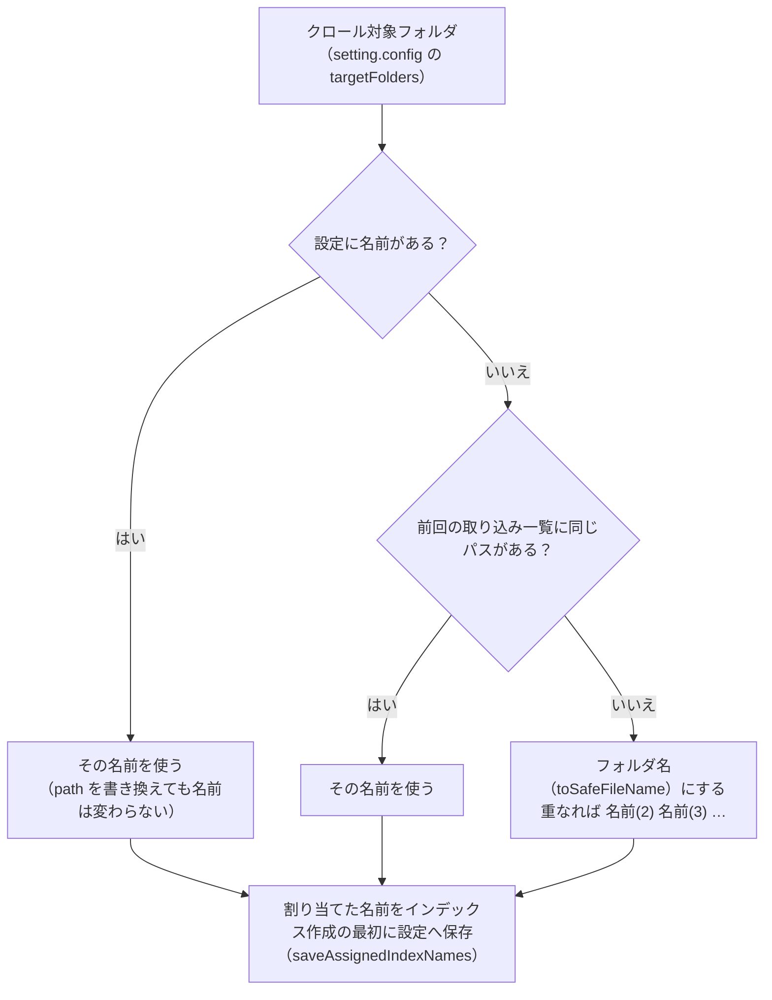

# クロール対象フォルダと取り込み対象

扱うこと: クロール対象フォルダの登録・インデックス名の割り当て・フォルダを移動したときの扱い。扱わないこと: 取り込み対象にするかどうかの判定そのもの（[取り込み対象の決定](target-decision.md)）、取り込み一覧の形式そのもの（[取り込み一覧](ingest-list.md)）、インデックス作成全体の流れ（[インデックス作成のメインフロー](flow.md)）。先に読むページ: [インデックス作成](index.md)。

## クロール対象フォルダ（`getTargetFolders`）

クロール対象フォルダは、画面（`tebunko.bat`）の［1 インデックス管理］でチェックボックス付きの一覧として登録し、`setting.config` の `targetFolders` に保存する（`writeTargetFolders`。形式は [設定ファイル（setting.config）](../structure/settings-file.md)）。チェックを外したフォルダ（`enabled` が `false`）は、登録はしておくが取り込まない。インデクサは開始時にこれを読む。

- パスは 1 つの書き方にそろえる（`normalizeFolderPath`）。エクスプローラーの「パスのコピー」をそのまま貼り付けられる。
  - 前後の空白・`"` と末尾の `\` を取り除く（ドライブ直下は `D:\` のまま、UNC の共有直下は `\\server\share`）。
  - 環境変数（`%USERPROFILE%` など）を展開し、`/` を `\` にそろえ、長いパス用の `\\?\` ・ `\\?\UNC\` を外し、重なった `\` ・ `.` ・ `..` を解決する。
  - 相対パス（`work\content_index` など）は tebunko のフォルダからとみなして絶対パスにする。
  - パスとして解釈できない場合（`*` `?` を含む・共有名の無い `\\server` ・ `\` ひとつで始まる）は、書かれたとおりに扱う（存在しないフォルダになる）。
- 同じフォルダ（大文字・小文字、末尾の `\` の違いを含む）が複数あれば、最初のものだけを使う。
  ネットワークドライブと UNC パス（`Z:\見積` と `\\server\share\見積`）、`subst` のドライブと割り当て元のフォルダのように、
  **書き方が違うだけで同じ場所を指す場合も同じフォルダとみなす**（`testSameFolder`。ドライブの割り当ては CIM（`Win32_LogicalDisk`）で調べる）。
  ファイルサーバーのフォルダを、あるときはドライブ文字、あるときは UNC パスで登録しても、インデックスが二重にならない。
- フォルダが 1 つも無い場合は例外: `クロール対象フォルダがありません。画面でクロール対象フォルダを追加してください。`
- チェックの付いたフォルダが無い場合は例外: `チェックの付いたクロール対象フォルダがありません。画面で取り込むフォルダにチェックを付けてください。`
- チェックの付いたフォルダが存在しない場合は、そのフォルダだけ取り込まずに続行する（`… フォルダが見つからないため取り込みません` と黄色で表示）。ネットワークドライブが切断されている場合などに、既存のインデックスを消さないため。

| 操作 | インデックス作成時の動作 |
|---|---|
| フォルダを追加（チェックあり） | 新しいインデックス名を割り当てて取り込む |
| チェックを外す | 取り込まない。インデックスと取り込み一覧の行はそのまま残る（検索対象にも残る） |
| チェックを付け直す | 前回と同じインデックス名で、更新されたファイルだけ取り込む |
| 一覧から削除 | `work/content_index/<インデックス名>` を丸ごと削除し、取り込み一覧からも除く（`クロール対象から削除されたフォルダ（<パス>）のインデックスを削除しました。`） |

## クロール対象フォルダとインデックス名



- **インデックス名**（`assignIndexNames` / `newIndexName`）: クロール対象フォルダごとの `work/content_index` 直下のフォルダ名。**設定（`setting.config` の `targetFolders[].name`）に持ち、フォルダの置き場所（`path`）とは分けて管理する**。
  - 設定に名前があればそれを使う。**フォルダの場所（`path`）を書き換えても名前は変わらないため、同じインデックスとして扱える**（インデックスも取り込み一覧の行もそのまま使うので、フォルダを移しただけなら再取り込みは起きない）。
  - 名前が無い場合（画面で新しく追加したフォルダ・設定ファイルを直接書き換えた場合）は、前回の取り込み一覧に同じパスがあればその名前を使い、無ければフォルダ名（ドライブ直下はドライブ名、UNC の共有直下は共有名）を `toSafeFileName` したものにする。設定にある名前・前回使われた名前（削除したフォルダの名前を含む）と重なる場合は `名前(2)` `名前(3)` … とする（ファイル名の上限 255 文字に収まるよう、元の名前を切り詰めてから付ける）。
  - 割り当てた名前は、インデックス作成の最初に設定へ保存する（`saveAssignedIndexNames`。設定を読み直して、名前が空の項目にだけ足す。`インデックス名を設定に保存しました: …` と表示する）。以後は設定の名前が使われる。
- **フォルダごと移動した場合**: クロール対象フォルダを別のドライブ・共有フォルダへ移した場合は、**画面の［編集…］でそのインデックスの「元のフォルダ」を書き換えるだけでよい**（[インデックス一覧の管理](../gui/index-tab.md)）。インデックス名は変わらないため、インデックス（TSV）と取り込み一覧の行をそのまま使い、**移動しただけで全件再取り込みにならない**（次のインデックス作成では、更新されたファイルだけを取り込む）。フォルダ名を変えて移した場合も同じで、名前はインデックス名として保たれる。
  - インデックスを削除して新しいパスで作り直すと、別のインデックス（新しい名前）になり、全件取り込みになる。移した場合は［編集…］を使う。
  - 検索結果から元のファイルを開くときにフォルダを選んだ場合も、同じ設定（インデックス名に対する場所）が書き換わるため、次のインデックス作成ではそのフォルダを取り込む（[元のファイルを開く](../gui/open-file.md#元のファイルが見つからないとき元のフォルダを設定する)）。
- **設定から削除したフォルダ**（`removeDroppedFolders`）: 前回の取り込み一覧にあって、今回どのフォルダにも使われていない**インデックス名**の本文インデックスのフォルダ（`work/content_index/<インデックス名>`）を削除する。名前で比べるため、移動を引き継いだインデックスは削除しない。
- **元のフォルダの記録（`source_folder.txt`）**（`writeSourceFolderFile`）: 取り込み一覧を書き出した直後（取り込むファイルが無い場合も）、`work/content_index/<インデックス名>/source_folder.txt`（そのインデックス 1 件分。フォルダがまだ無ければ書かない）に、インデックス名とクロール対象フォルダの対応を書き出す。取り込み一覧は `work/` にあるため、インデックスのフォルダ（`work/content_index`）だけを別の PC・場所へコピーすると元のフォルダが分からなくなる。これを避けるため、インデックスのフォルダの中にも対応を置く。インデックス 1 件につき 1 ファイルのため、`work/content_index` ごとでも `<インデックス名>` のフォルダだけでもコピーできる。拡張子を `.tsv` にすると検索対象になるため `.txt` にする。画面での使い方は [元のフォルダの特定（インデックスを別の PC・場所で使う場合）](../gui/open-file.md#元のフォルダの特定インデックスを別の-pc場所で使う場合) を参照。
  ```
  # 検索結果から元のファイルを開くときに使う、インデックス名とクロール対象フォルダの対応です（インデックス作成のたびに作り直します）
  営業<TAB>C:\data\営業
  D<TAB>D:\
  ```


取り込み対象をどう決めるか（更新の判定・前の抽出版・強制終了からの再開との関係・画面の確認に出す件数）は [取り込み対象の決定](target-decision.md) を参照。
