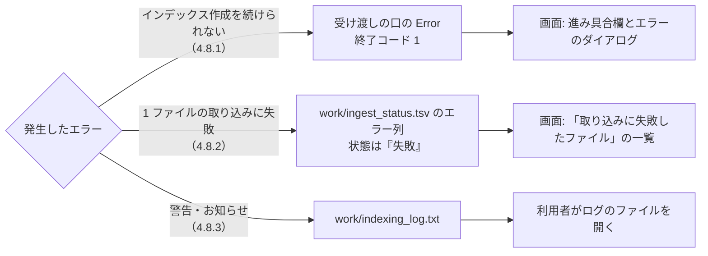

# エラーメッセージ一覧

扱うこと: インデクサが利用者に示すエラー・警告のメッセージ全文・発生条件・対処。扱わないこと: メッセージを起こす処理そのものの詳細（各処理のページ）。先に読むページ: [インデックス作成](index.md)。

インデクサ（`tebunko/indexer.ps1`・`indexer/indexer_run.ps1`）が利用者に示すエラー・警告の一覧。メッセージは種類によって記録先と画面での表示が異なる。



| 種類 | 記録先 | 画面での表示 | インデックス作成の続行 |
|---|---|---|---|
| 続けられないエラー（[続けられないエラー](#続けられないエラー)） | 受け渡しの口の `Error`（終了コード `1`）と `work/indexing_log.txt` | 進み具合欄に `インデックスを作成できませんでした` とメッセージ。エラーのダイアログ `インデックスを作成できませんでした。`＋メッセージ | 中止する |
| ファイルごとの失敗（[ファイルごとの失敗（取り込み一覧のエラー列）](#ファイルごとの失敗取り込み一覧のエラー列)） | `work/ingest_status.tsv` のエラー列（状態は `失敗`） | ［インデックス管理］タブの「取り込みに失敗したファイル」の一覧（[インデックス一覧の管理](../gui/index-tab.md)） | 次のファイルへ進む |
| 警告・お知らせ（[警告・お知らせ（インデックス作成ログ）](#警告お知らせインデックス作成ログ)） | `work/indexing_log.txt` | ワークスペースの `indexing_log.txt` を開いて確認する | 続ける |

メッセージ中の `<…>` は実行時に埋め込む値。

## 続けられないエラー

`invokeIndexer` が例外を受け、例外のメッセージをそのままログと受け渡しの口の `Error` に入れて終了コード `1` で終える（[インデックス作成のメインフロー](flow.md)）。`describeIngestError`（[失敗の原因](office-apps.md#失敗の原因describeingesterror)）は通さない。画面は終わったインデックス作成の `Error` を読んで表示する（`IndexingSession.GetError`）。
インデックス作成中にクロール対象フォルダが見つからなくなった場合だけは、`finally`（アプリの終了・取り込み一覧の書き直し）を確実に通すため、例外にせずに `Error` にメッセージを入れて終了コード `1` で終わる。

| メッセージ | 発生条件 | 対処 |
|---|---|---|
| `クロール対象フォルダがありません。画面でクロール対象フォルダを追加してください。` | 設定にクロール対象フォルダが 1 つも無い | 画面でクロール対象フォルダを追加する |
| `チェックの付いたクロール対象フォルダがありません。画面で取り込むフォルダにチェックを付けてください。` | クロール対象フォルダはあるが、すべてチェックなし | 取り込むフォルダにチェックを付ける |
| `setting.config を読み込めません。（<JSON の解析エラー>）` | 起動した後に `setting.config` が JSON として読めなくなった（手で編集して壊した等）。起動の時に壊れていたものは退避して既定の設定で起動する（[壊れた設定ファイルの退避](../structure/settings-file.md#壊れた設定ファイルの退避)） | `setting.config` を直す。直せなければ tebunko を閉じて `setting.config` を削除し（次の起動で既定の設定になる）、画面で設定し直す |
| `設定ファイルが壊れていたため、既定の設定で起動しました。…` | 画面なしで起動した `indexer.ps1` が、壊れた `setting.config` を退避した（ログの先頭に出る。続けて `クロール対象フォルダがありません。…` で終わる） | ログに出たパスの、退避したファイルを直して `setting.config` に置き換えるか、画面で設定し直す |
| `ほかのインデックス作成が実行中です。インデックス作成が終わってから実行してください。` | 同じ `work` のインデックス作成が既に動いている（`newAppMutex`。画面を使わずに起動したものと重なった場合） | 実行中のインデックス作成が終わるのを待つ。進み具合は画面で確認できる |
| `クロール対象フォルダが見つからなくなったため、インデックス作成を中止しました: <パス>（残り <N> 件は更新せずに残しました。フォルダを使えるようにしてから、もう一度更新してください）` | インデックス作成中にクロール対象フォルダにアクセスできなくなった（ネットワークの切断・USB メモリの取り外し等）。残りのファイルをすべて失敗にしないよう中止する（[インデックス作成のメインフロー](flow.md)） | フォルダを使えるようにしてから、もう一度インデックス作成を始める（続きから取り込む） |
| `取り込みのスレッドが止まりました：<理由>` | 取り込みのスレッドが途中で止まった（部品を読み込めない等。[取り込みの並列化](parallel.md)）。理由が分からなければ `取り込みのスレッドが止まりました。` | メッセージと、`work/indexing_log.txt`（[警告・お知らせ](#警告お知らせインデックス作成ログ)）の内容から原因を取り除き、もう一度インデックス作成を始める |
| （例外のメッセージそのまま） | 上記以外の予期しない例外。例: `work/ingest_status.tsv` をほかのアプリが開いていて書き込めない | メッセージと、`work/indexing_log.txt`（[警告・お知らせ](#警告お知らせインデックス作成ログ)）の内容から原因を取り除き、もう一度インデックス作成を始める |

- `Error` が空の場合（インデクサが入れずにスレッドが止まった等）、画面はスレッドが止まった理由を表示し、それも無ければ `詳しくはログを確認してください。` と表示する。
- 受け渡しの口はインデックス作成 1 回ごとに作るため、前回のエラーは残らない。

## ファイルごとの失敗（取り込み一覧のエラー列）

1 ファイルの取り込みで例外が起きたら、そのファイルの状態を `失敗` にし、エラー列にメッセージを記録して次のファイルへ進む。更新されない限り次回以降はスキップする（再取り込みは画面で「失敗分も再取り込みする」を選ぶ。`-RetryFailed`）。

**(1) インデクサが決まった文面で記録するもの**

| メッセージ | 発生条件 | 対処 |
|---|---|---|
| `10 分以内に更新が終わらなかったため中止しました（Officeアプリを強制終了しました）` | 1 ファイルの取り込みが制限時間（`$fileTimeoutMinutes` = 10 分）を超え、Office アプリを強制終了した | ファイルを Office で開いて確認する（大きすぎる・ダイアログが出る等） |
| `更新中に <N> 回続けて強制終了されたため、更新を中止しました（Officeアプリが応答しなくなる可能性があります）` | 同じファイルの取り込み中に `$interruptLimit`（2）回続けてインデクサが強制終了した（[取り込み一覧](ingest-list.md)） | 同上 |
| `ファイルが壊れているか、PowerPointのファイルではありません（新形式（ZIP）でも旧形式でもない内容です）。` | PowerPoint の拡張子で、中身が ZIP でも複合ドキュメント形式でもない（テキスト・0 バイト等）（[PowerPoint](powerpoint.md)） | 正しいファイルに差し替える。不要なら削除する |
| `Word文書の本文（word/document.xml）がありません。` | `.docx` 等の ZIP の中に本文が無い（壊れている） | 同上 |
| `PowerPointのプレゼンテーション情報（ppt/presentation.xml）がありません。` | `.pptx` 等の ZIP の中にプレゼンテーション情報が無い（壊れている） | 同上 |
| `インデックスのファイル名が長すぎるため保存できません（<N> 文字。上限 255 文字）: <ファイル名>` | インデックスのファイル名 `<場所>.tsv`（場所は符号化する）が 255 文字を超える（`toIndexFileName`） | シート名・スライド名を短くする |
| `ファイルサイズが大きすぎるため更新できません。` | テキストファイル（`.txt` 等）が大きさの上限（10MB）を超える（`readTextFile`。[テキストファイルの読み取り](text.md#大きさの上限)）。または `.docx` `.pptx` `.xlsx` を直接読むとき（Office を使わない）、ZIP の部品 1 つ（展開後）が上限（100MB）、または 1 ファイルで読む合計が上限（300MB）を超える（`readZipEntry`。[Office ファイルを開くときの設定](../../safety/checks.md#office-ファイルを開くときの設定)）。画面・取り込み一覧の文言はこの短いものだけで、部品ごとか合計か・部品名・大きさは出さない（悪用のヒントになるため）が、原因を調べられるよう `work/indexing_log.txt` にはその詳細を書く（`writeZipSizeLimitLog`） | ファイルを分割する。取り込めなくてよいなら、そのままにする |
| `作業領域のコピーを消せませんでした: <元のメッセージ>` | テキストファイルを読み終えたあと、作業領域のコピー（`source.copy`）を消せなかった（ウイルス対策ソフトなどがコピーを開いている、など）。コピーが本文インデックスに混ざらないよう、取り込みの失敗にする（`extractTextFile`。[テキストファイルの読み取り](text.md#テキストファイルの抽出処理extracttextfile)）。残ったコピーは、次のファイルの前と次のインデックス作成の始めに片付けられる | 次のインデックス作成で取り込み直される。続くときは、作業領域（`work/tmp/`）をウイルス対策ソフトの対象から外す |
| `テキストファイルではないため更新できません。` | テキストの拡張子だが、文字コードを判定できない（バイナリ・UTF-32・GBK など、判定できないもの・あいまいなもの）（`detectTextEncoding`。[テキストファイルの読み取り](text.md#文字コードの判定detecttextencoding)） | 拡張子を確かめる。正しいテキストファイルなら、文字コードを UTF-8・Shift_JIS・UTF-16 のどれかで保存し直す |
| `読み取りパスワードが設定されているため開けません（パスワード付きのファイルは更新できません）` | ◎ パスワード付きの `.xlsx` `.docx` `.doc` `.pptx` `.ppt`。新形式（`.docx` `.pptx`）は Word・PowerPoint を起動せずに判定して記録する（[暗号化されたファイルの判定](office-apps.md#暗号化されたファイルの判定office_protectionps1office_protection_viewps1)）。Excel はパスワード付きでも Office に開かせ、下の (2) の言い換えで同じ文言になる | 取り込めない。パスワードを外したコピーを置けば取り込める |
| `IRM・秘密度ラベルで暗号化されているため更新できません。` | IRM・秘密度ラベルの暗号化（[[MS-OFFCRYPTO]](https://learn.microsoft.com/en-us/openspecs/office_file_formats/ms-offcrypto/) の IRMDS）を検出し、Officeを起動せずに判定した（[暗号化されたファイルの判定](office-apps.md#暗号化されたファイルの判定office_protectionps1office_protection_viewps1)。ライセンス取得・サインイン画面が見えないまま出て止まりうるため開かない） | 取り込めない。保護を外したコピーを置けば取り込める |
| `暗号化されているか壊れているため更新できません。` | ZIPでもCFBでもなく、先頭4KBにNULを含む「形式の分からないバイナリ」（透過暗号化の製品の暗号文の見込み）。アプリごとの予備が無効・開けない・出力の確かめに失敗した場合 | 透過暗号化の製品でファイルを復号してから取り込む。製品の設定でPowerShellを許可アプリにできれば取り込めることがある |
| `ファイルを暗号化する製品が一時ファイルを暗号化したため更新できません。` | Officeが保存した一時ファイル（変換した `.docx`・`.pptx`、[Excel](excel.md) のテキスト保存）まで透過暗号化の製品が暗号化した（[暗号化されたファイルの判定](office-apps.md#暗号化されたファイルの判定office_protectionps1office_protection_viewps1)の `testOfficeOutput`） | 同上 |
| `ワークスペースのパスに [ ]（角かっこ）が含まれるため、更新の作業フォルダを置けません。このファイルの取り込みをスキップしました。` | ワークスペースのパス（`work/tmp/<PC の鍵>/<PID>`）に `[` `]` が含まれ、Excel が保存できない（`selectTmpDir`。[データの置き場所とパスの決め方](../structure/data.md)） | ワークスペースのフォルダ名・その親フォルダ名から `[` `]` を外す |
| `ワークスペースのパスが長すぎるため、更新の作業フォルダを置けません。このファイルの取り込みをスキップしました。` | ワークスペースのパスが長く、Office が開けない（`selectTmpDir`） | ワークスペースをより浅い場所に移す |

**(2) 例外から `describeIngestError` が言い換えるもの**（判定条件は [失敗の原因](office-apps.md#失敗の原因describeingesterror)）

| メッセージ | 主な発生例（◎ はテストデータで確認済み） | 対処 |
|---|---|---|
| `読み取りパスワードが設定されているため開けません（パスワード付きのファイルは更新できません）` | ◎ 読み取りパスワード付きの `.xlsx` `.docx` `.doc` `.pptx` `.ppt` | 取り込めない。パスワードを外したコピーを置けば取り込める |
| `ファイルが壊れているか、拡張子と中身の形式が一致していません（詳細: <元のメッセージ>）` | ◎ 中身がテキスト・0 バイトの `.xlsx`、中身が `.xls` の `.xlsx` | 正しい拡張子に直すか、正しいファイルに差し替える |
| `ほかのアプリ・利用者がファイルを使用中のため読めません（ファイルを閉じてから再度更新してください）（詳細: <元のメッセージ>）` | ほかのアプリが読み取りも拒否してファイルを開いている（排他で開いている）ためコピーできない。利用者が Office で通常どおり開いて編集しているだけなら、コピーできるため発生しない | ファイルを閉じてから再取り込みする |
| `ファイルを読むアクセス権がありません（詳細: <元のメッセージ>）` | 読み取り権限の無いファイル | 権限を付けてもらう |
| `ファイルが見つかりません（更新中に移動・削除・名前変更された可能性があります）（詳細: <元のメッセージ>）` | クロールしてから取り込むまでの間にファイルが移動・削除された | 次のインデックス作成で自動的に一覧から除かれる |
| `パスが長すぎるため読めません（詳細: <元のメッセージ>）` | 長いパスに対応していない経路でファイルを扱った | クロール対象フォルダを浅い場所にする |
| `シート・文書が大きすぎて更新できません（メモリが不足しました）（詳細: <元のメッセージ>）` | ◎ 1 枚のシートがテキストにして約 1GB を超える（100 万行 × 30 列など）。整形（`prettyTsv`）でシート 1 枚分を一度に読み込めない | シートを分ける。PC のメモリを増やす |
| `Officeアプリ（Excel・Word・PowerPoint）を起動できませんでした（インストール・ライセンス認証の状態を確認してください）（詳細: <元のメッセージ>）` | Office が入っていない・壊れている・ライセンス認証が必要 | Office の状態を確認する |
| `Officeアプリが異常終了したか、内部でエラーが発生しました（ファイルが壊れている、または大きすぎる可能性があります）（詳細: <元のメッセージ>）` | 取り込み中に Office アプリが落ちた・強制終了された | ファイルを Office で開いて確認する。残ったアプリは、次に画面を起動したときの確認で終了する |
| `Officeアプリが応答しませんでした（Officeアプリでダイアログを表示中などの可能性があります）（詳細: <元のメッセージ>）` | Office アプリがダイアログを表示中・処理中 | 残った Office アプリを終了してから再取り込みする |

**(3) その他**

- 上記に当たらない例外は、Office・.NET の例外メッセージをそのまま記録する（改行・連続する空白は 1 つの空白にする）。メッセージが空なら `エラーコード 0x<8 桁の 16 進>` とする。
- エラー列が空の `失敗` の行は、画面の一覧では `（原因は記録されていません）` と表示する。

## 警告・お知らせ（インデックス作成ログ）

インデックス作成は続けるが、利用者が知っておくべき内容。`work/indexing_log.txt` に記録する（ワークスペースのフォルダから開く）。

| メッセージ | 発生条件 |
|---|---|
| `  [<インデックス名>] <パス> … フォルダが見つからないため取り込みません` | チェックの付いたクロール対象フォルダが存在しない。そのフォルダのインデックスは残す |
| `    アクセスできないフォルダがあったため、元ファイルが無くなったかどうかの確認は行いませんでした。` | クロール対象フォルダの中にアクセスできないフォルダがあった。元ファイルが無くなったインデックスの削除を行わない（[取り込み一覧](ingest-list.md)） |
| `    インデックス（TSV）が無くなった・壊れている <N> 件は取り込み直します。（インデックスを直接削除した・0 バイトのTSVが残っている）` | 取り込み一覧が `済` なのに、インデックスの TSV が無い・足りない・0 バイトのものがある（`testIndexComplete`。[取り込み対象の決定](target-decision.md#取り込み対象の決定createtargetlist)） |
| `  インデックスのフォルダを調べられないため、インデックスが残っているかの確認は行いません。` | `work/content_index` を列挙できなかった（アクセス権が無い等）。取り込み一覧の `済` をそのまま信じる |
| `    元のファイルが無くなったため、取り込まずに一覧から除きます。（移動・削除・名前変更された）` | 取り込み対象を調べてから取り込むまでの間に、元のファイルが無くなった。失敗にはせず、TSV を削除して一覧から除く |
| `取り込みの直前に元のファイルが無くなった <N> 件は、取り込まずに一覧から除きました。` | 同上（インデックス作成の最後にまとめて表示する） |
| `前回取り込みに失敗し、その後更新されていないファイル <N> 件はスキップします。（パスワード付きなど）` | 前回失敗したファイルがあり、「失敗分も再取り込みする」を選ばなかった |
| `前回、取り込み中に強制終了したファイルは最後に取り込みます: <相対パス>` | 前回、このファイルの取り込み中にインデクサが強制終了した（[取り込み一覧](ingest-list.md)） |
| `取り込み中に <N> 回続けて強制終了したファイルは、失敗としてスキップします: <相対パス>` | 同じファイルで続けて強制終了した。[ファイルごとの失敗（取り込み一覧のエラー列）](#ファイルごとの失敗取り込み一覧のエラー列) のメッセージで失敗にする |
| `    <シート名> の使用範囲を縮められませんでした: <メッセージ>` | 使用範囲がデータよりずっと広いシートで、一時シートを作れなかった（ブックの構成が保護されている等。[Excel の抽出処理](excel.md#excel-の抽出処理extractworkbook)）。そのシートはそのまま書き出す（時間切れで失敗することがある） |
| `    図形・コメントを読み取れませんでした: <メッセージ>` | 新形式（ZIP）のブックの図形・コメントを読めなかった（ZIP・XML が壊れている等。[Excel の図形・コメントの読み取り](excel.md#excel-の図形コメントの読み取りreadxlsxobjectunits)）。セルの値は取り込む（図形・コメント・ヘッダー・フッターの文字は検索できない） |
| `    一部を読み取れませんでした: <部品名>` | 1 つの部品を読めなかった（XML が壊れている、「サイズの上限」を超える等）。部品は、図形の中の 1 つのグラフ・SmartArt（`xl/charts/chartN.xml`・`xl/diagrams/dataN.xml`。[グラフ・SmartArt の読み取り](excel.md#グラフsmartart-の読み取り)）か、シートのヘッダー・フッター（`xl/worksheets/sheetN.xml`。[ヘッダー・フッターの読み取り](excel.md#ヘッダーフッターの読み取り)）。その部品だけを空にし、ほかの文字・図形・コメント・セルの値は取り込む |
| `    予備の読み取りに失敗しました: <元のメッセージ>` | 「形式の分からないバイナリ」（[暗号化されたファイルの判定](office-apps.md#暗号化されたファイルの判定office_protectionps1office_protection_viewps1)）を予備でWord・PowerPointに開かせたが失敗した。取り込み一覧には `暗号化されているか壊れているため取り込めません。` に言い換えて記録する |
| `    暗号化の判定: <種類>` | 暗号化されたファイルの判定（[暗号化されたファイルの判定](office-apps.md#暗号化されたファイルの判定office_protectionps1office_protection_viewps1)）で、`Password`（パスワード付き。新形式）・`Rights`（IRM・秘密度ラベル）・`Unknown`（形式の分からないバイナリ）のいずれかと判定した（`logProtectionKind`）。旧形式・ふつうのテキストとして開くもの（`Legacy`・`Text`）は書かない |
| `    取り込みに失敗しました: <原因>` | 1 ファイルの取り込みに失敗した（原因は [ファイルごとの失敗（取り込み一覧のエラー列）](#ファイルごとの失敗取り込み一覧のエラー列) のメッセージ） |
| `中止の要求を受けたため、インデックス作成を中止します。（残り <N> 件は次回取り込みします）` | 画面の［中止］が押された（終了コード `2`） |
| `    <アプリ名> の終了に失敗しました: <メッセージ>` | Excel・Word・PowerPoint を終了できなかった。残ったものは、次に画面を起動したときの確認で終了する。**注**: 今の実装（`shared/office/office_app.ps1` の `Write-Host`）ではログに残らず、取り込みのスレッドからは表示もされない |
| `    作業フォルダを削除できませんでした: <パス>` | 終了時に作業領域（`work/tmp/<PC の鍵>/<PID>`）または `work/publish/<PID>` を削除できなかった。次回のインデックス作成時に削除する |
| `ワークスペースのパスに [ ]（角かっこ）が含まれるため、取り込みの作業フォルダを置けません。取り込みをすべてスキップします。` / `ワークスペースのパスが長すぎるため、取り込みの作業フォルダを置けません。取り込みをすべてスキップします。` | インデックス作成の始め（`initTmpDir`）に、作業フォルダ（`work/tmp/<PC の鍵>/<PID>`）を置けないと分かった（`selectTmpDir`。[データの置き場所とパスの決め方](../structure/data.md)）。どのファイルも中間 TSV などをこのフォルダに作るため、テキストファイルを含めこの回のファイルをすべてスキップし、ファイルごとに上の (1) のメッセージで失敗にする |
| `画面からの返事が 60 分ありませんでした。インデックス作成を取りやめます。` | 取り込み前の確認（受け渡しの口の `ConfirmTargets`）で取り込み対象を画面に出した後、60 分待っても返事が無かった。1 件も取り込まずに終了コード `2` で終わる |
| `画面で取りやめたため、取り込みません。（取り込み一覧は前回のままです）` | 確認で［キャンセル］が押された、または上の返事の待ち時間を過ぎた（終了コード `2`） |

インデックス作成の最後には、失敗したファイルと原因をまとめて記録する（最大 `$failureListLimit` = 50 件。残りは件数だけ）。

```
＜取り込みに失敗したファイルと原因＞
  営業\秘密\顧客リスト.xlsx
    → 読み取りパスワードが設定されているため開けません（パスワード付きのファイルは取り込めません）
  ほか 12 件（一覧の「状態」が「失敗」の行。原因は「エラー」列）

失敗したファイルは、画面で「失敗分も再取り込みする」を選んで取り込むと再取り込みします。
```
