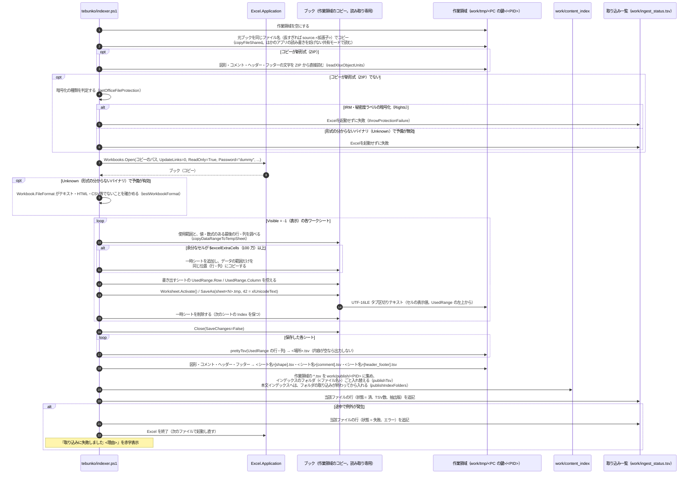
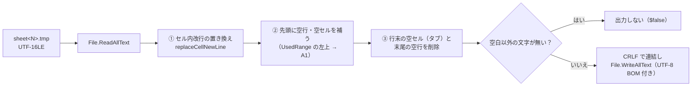

# Excel

扱うこと: Excel ブックのセルの表示値の抽出（COM）、TSV への整形仕様、図形・コメント・ヘッダー・フッターの文字の読み取り（ファイルを直接読む）。扱わないこと: Word・PowerPoint の抽出（[Word・PowerPoint の共通処理と Office アプリの管理](office-apps.md)・[Word](word.md)・[PowerPoint](powerpoint.md)）。先に読むページ: [インデックス作成](index.md)。

Excel ブックから、セルの表示値（Excel の COM で書き出す）と図形・コメント・ヘッダー・フッターの文字（ファイルを直接読む）を抽出して TSV にする処理（[Excel の抽出処理](#excel-の抽出処理extractworkbook)・[Excel の図形・コメントの読み取り](#excel-の図形コメントの読み取りreadxlsxobjectunits)）と、Excel が書き出したテキストの整形仕様（[TSV 整形仕様](#tsv-整形仕様prettytsv--formattsv)）を扱う。

## Excel の抽出処理（`extractWorkbook`）



補足:

- Excel は `Visible` / `DisplayAlerts` / `EnableEvents` / `ScreenUpdating` / `AskToUpdateLinks` を無効にし、`AutomationSecurity = 3`（マクロ無効）で起動する。
- **暗号化されたファイルの判定**（[暗号化されたファイルの判定](office-apps.md#暗号化されたファイルの判定office_protectionps1office_protection_viewps1)）: コピーが ZIP でないとき、開く前に種類を判定する。IRM・秘密度ラベルの暗号化（`Rights`）は Excel を起動せずに失敗にする（サインイン画面を防ぐ）。パスワード付き（`Password`。既定のパスワード（`VelvetSweatshop`）で暗号化されたブックを含む）は、今までどおりダミーのパスワードで `Workbooks.Open` に任せる（Word・PowerPointと違い、Excelは開かせずに失敗にしない。既定のパスワードのブックを開けなくしないため）。「形式の分からないバイナリ」（`Unknown`）は、アプリごとの予備の切り替え（`${officeFallbackEnabled}`）が無効なら Excel を起動せずに失敗にし、有効なら開いた後の `Workbook.FileFormat` がテキスト・HTML・CSV等でないことを確かめる（`testWorkbookFormat`。中身がHTMLの `.xls` 等、`Text` の種類には当てない）。パスワード付きブックはダミーのパスワードを渡して開くため、ダイアログを出さずに例外となり、取り込み一覧に「失敗」と記録される。
- **元のファイルを占有しない**: 元のブックは開かず、常に作業領域へコピーしてからコピーを開く。Excel で開いている間（大きなブックでは数分）、元のファイルを利用者が上書き保存・移動・削除できなくなるのを防ぐため。コピーは `copyFileShared`（`scripts/shared/core/fs.ps1`）で行い、元のファイルを読み取りだけ・共有モード `ReadWrite | Delete` で開く。`File.Copy` と違い、コピー中もほかのアプリ・利用者の書き込みを妨げず、利用者が編集中（書き込みで開いている）のファイルもコピーできる。コピーは通常の属性（読み取り専用を付けない）で作り、ブックを閉じた後に削除する。
- コピーのファイル名は、ファイル名を参照する数式（`CELL("filename")` 等）の表示値が変わらないよう元のブック名と同じにする。Excel は長いパスのファイルを開けない（Microsoft 365 で約 256 文字以上、古い版は 218 文字以上。`\\?\` 付きのパスも不可。いずれも実測では「Workbooks クラスの Open プロパティを取得できません」）ため、作業領域＋ブック名が `$excelMaxPath`（218）文字以上になるときだけ `source.<拡張子>` とする。元のパスが長いファイルも、コピーは短いパスになるため開ける。TSV のファイル名は元のブック名で作る。
- 取り込み中に元のファイルが更新された場合も、抽出はコピー時点の内容で行う。取り込み一覧の更新日時はクロール時点の値を記録するため、次回の取り込みで更新ありとして取り込み直す。
- 対象は `Worksheets`（グラフシートは含まない）のうち `Visible = -1`（`xlSheetVisible`）のシート。`0`（非表示）と `2`（完全に非表示）は除外する。
- Excel は `[` `]` を含むパスに保存できないため、いったん `sheet<シート番号>.tmp` で保存し、`prettyTsv` で最終的なファイル名に書き出す。保存したファイルはブックを閉じるまで Excel がロックするため、整形はブックを閉じた後に行う。
- Excel のテキスト保存は、セルの値そのものではなく **画面に表示されている形（表示値）** を出力する。文字列のセルは入力した文字がそのまま出る（1 セルの上限 32,767 文字まで欠けない。セル内改行・`"` を含むセルも保持される）が、**数値のセルは表示形式に従った文字になる**。列幅が狭く `####` と表示されるセルは、`####` ではなく値が出る。
  - 表示形式が「標準」の数値は 11 文字までで表され、12 桁以上の数値は指数表記になる（`4901234567894` → `4.90123E+12`、`123456789.123` → `123456789.1`）。JAN コード・伝票番号などを数値として入力したセルは、**その番号では検索できない**（[検索](../search/index.md#検索仕様)、[共通](known-issues.md#共通) No.18）。
  - 「0」「#,##0」などの表示形式を設定したセルや、文字列として入力したセルは、見たとおりの文字で出る（`#,##0` なら桁区切り付きで `1,234,568`）。
- **使用範囲が膨らんだシートは、データの範囲だけを一時シートへコピーしてから書き出す**（`copyDataRangeToTempSheet`）。最終行（1,048,576 行目）や右端（XFD 列）のセルに書式だけが残っていると使用範囲がシート全体になり、Excel のテキスト保存が空セルのタブだけを延々と書き出す（実測: 10 分で 6GB を書き出し、終わらない → 制限時間で「失敗」）。
  - 値・数式のある最後の行・列を `Cells.Find("*", A1, xlFormulas, , xlByRows/xlByColumns, xlPrevious)` で調べ、使用範囲がそれより `$excelExtraCells`（100 万）セル以上広いときだけ縮める（普通のシートはそのまま書き出す）。
  - **元のシートの行・列は削除しない**。削除すると、その範囲だけを参照する数式が `#REF!` になり、ほかのシートの表示値まで変わるため。同じブックに一時シートを追加し、**同じ位置（行・列）に**コピーするので、数式の参照先はずれない（実測: `=COUNTA(A200:A300)` は `0` のまま、別シート参照・表示形式も保たれる）。
  - ブックの構成が保護されているなど、一時シートを作れない場合は元のシートをそのまま書き出し、`    <シート名> の使用範囲を縮められませんでした: <メッセージ>` をインデックス作成ログに記録する（[エラーメッセージ一覧](errors.md) [警告・お知らせ（インデックス作成ログ）](errors.md#警告お知らせインデックス作成ログ)）。
  - 一時シートは書き出した直後に削除する（次のシートの `Index` がずれないようにするため。ブックは保存せずに閉じる）。
- Excel のテキスト保存は A1 からではなく **使用範囲（`UsedRange`）の左上のセルから** 出力する（例: 使用範囲が C3 から始まるシートは、1 行目の 1 列目が C3 になる）。TSV の行・列をシートの行・列と一致させるため、保存前に `UsedRange.Row` / `UsedRange.Column` を控えて `prettyTsv` に渡す（[TSV 整形仕様](#tsv-整形仕様prettytsv--formattsv)）。
- **保存した一時ファイルの先頭（UTF-16LEのBOM `FF FE`）も確かめる**（`testOfficeOutput`。[暗号化されたファイルの判定](office-apps.md#暗号化されたファイルの判定office_protectionps1office_protection_viewps1)）。透過暗号化の製品が、この一時ファイルまで暗号化することがあるため、シートの種類によらずすべての保存で確かめる。合わなければ `ファイルを暗号化する製品が一時ファイルを暗号化したため取り込めません。` にする。**この確かめはブックを閉じた後（`prettyTsv` の直前）に行う**。保存した一時ファイルはブックを閉じるまで Excel がロックしており、閉じる前に読もうとすると（開いているだけの正常なファイルでも）読めずに失敗するため（◎ 実機で確認済み）。
- インデックスはファイルごとのフォルダを丸ごと入れ替えるため、シートの削除・名前変更がインデックスに反映される（Word・PowerPoint も同じ）。
- テキスト保存はセルの値しか出さないため、**図形・コメント・ヘッダー・フッターの文字は、コピーを ZIP として直接読む**（[Excel の図形・コメントの読み取り](#excel-の図形コメントの読み取りreadxlsxobjectunits)）。Excel で開く前に読む。旧形式（`.xls`）・パスワード付き・`.xlsb` は読まない（セルの値だけになる）。読み取りに失敗しても（ZIP が壊れている等）セルの値は取り込み、`    図形・コメントを読み取れませんでした: <メッセージ>` をインデックス作成ログに記録する（このときはヘッダー・フッターも読めない）。

## TSV 整形仕様（`prettyTsv` / `formatTsv`）



1. **セル内改行の置き換え**: Excel はセル内改行・`"` を含むセルを `"` で囲んで出力する。正規表現 `"[^"]*"` にマッチする範囲の改行（CRLF・CR・LF。いずれも 1 つの改行として扱う）を **U+2028（LINE SEPARATOR。`$cellNewLine`）** に置き換え、1 セルを 1 行に収める。`Select-String` は U+2028 を行区切りとしないため、1 行 = Excel の 1 行が保たれる。検索結果の出力時に LF へ戻す（[1 行の組み立て](../search/output.md#1-行の組み立て)）。
2. **先頭の空行・空セルの補完**: 引数 `firstRow` / `firstColumn`（使用範囲の左上の行・列番号。既定 1）に合わせて、先頭に `firstRow - 1` 行の空行を加え、各行の先頭に `firstColumn - 1` 個のタブを加える。
3. **行末の空セル・末尾の空行の削除**: 各行の末尾のタブ（空セル）だけを削除する（セル値の末尾の空白は残す）。途中の空行・空白だけの行は、行番号を保つため**残す**。末尾の空白だけの行は削除する。

整形後の TSV は「**N 行目 = シートの N 行目、k 列目 = シートの k 列目**、セルはタブ区切り、セル内改行は U+2028、改行 CRLF」となる。検索では `Select-String` の行番号がそのままシートの行番号になる。

入出力例（`\t` = タブ、`\r\n` = CRLF、`<LS>` = U+2028。使用範囲の左上が B2 の場合）:

```
入力:  a\tb\t\t\r\n\t\t\r\n\r\n"x\ny"\tz\r\n\t\r\n
出力:  \r\n\ta\tb\r\n\r\n\r\n\t"x<LS>y"\tz\r\n
```

## Excel の図形・コメントの読み取り（`readXlsxObjectUnits`）

`.xlsx` `.xlsm` を ZIP として開き（`scripts/shared/office/office_reader.ps1`）、表示シート・表示のグラフシートの図形・コメント・ヘッダー・フッターの文字を、シートとは別の場所（TSV）にする。Excel は使わない。

| 場所 | 読み取り元 | 1 行 |
|---|---|---|
| `<シート名>[図形]` | シートのリレーションシップ（種類 `drawing`）が指す `xl/drawings/drawingN.xml` の図形（`xdr:twoCellAnchor` `oneCellAnchor` `absoluteAnchor`）ごとのテキスト（`a:p`。[Word・PowerPoint のテキスト読み取り](office-apps.md#wordpowerpoint-のテキスト読み取りscriptssharedofficeoffice_readerps1)の `readXmlLines`）と、グラフ（`xdr:graphicFrame` の中の `c:chart`）・SmartArt（`dgm:relIds`）の参照先の文字（`readObjectText`。下の「グラフ・SmartArt の読み取り」） | 図形 1 つ。`<左上のセル番地><TAB><文字>` |
| `<グラフシート名>[図形]` | ブックのリレーションシップの型が `*/chartsheet` の表示シート自身の `drawing` が指す図形の部品（グラフを `absoluteAnchor` で置いたもの） | 図形 1 つ。`A1<TAB><文字>`（位置をセルで持たないため） |
| `<シート名>[コメント]` | 種類 `comments` の `xl/commentsN.xml`（メモ）と、種類 `threadedComment` の `xl/threadedComments/*.xml`（スレッド形式のコメント） | セル 1 つ。`<セル番地><TAB><文字>` |
| `<シート名>[ヘッダー・フッター]`（グラフシートも同じ） | シート（ワークシート・グラフシート）の XML の `headerFooter`（下の「ヘッダー・フッターの読み取り」） | 文字の 1 行。`<文字>`（セル番地は付けない） |

- **場所の名前**: シート名には `[` `]` を使えないため、`売上[図形]` は実在のシートと必ず区別できる（[インデックスのファイルの形](../index-data/format.md#配置命名規則)「図形・コメントの場所」）。
- **文字の形**: 段落・改行はセル内改行（U+2028）にし、改行・`"`・タブを含むときは `"` で囲む（中の `"` は `""`）。Excel のテキスト保存のセルと同じ形なので、検索結果の出力・画面のセルの分け方はセルと同じ処理で扱える。
- **並び順**: 上の行から（同じ行は左から）。図形は左上のセル、コメントはそのセルの位置で並べる。
- **セル番地**: 検索結果の「場所」（`[シート]売上!D5`）に出し、元のファイルを開くときにそのセルを選ぶ（[元のファイルを開く](../gui/open-file.md)）。位置をセルで持たない図形（`absoluteAnchor`）は `A1` とする。
- グループ化した図形は、まとめて 1 つの図形（1 行）とする。グループの中にテキストボックスとグラフ・SmartArt があれば、テキストボックスの段落 → グラフ・SmartArt の文字（XML の順）の順に並べる。互換用の代替表示（`mc:Fallback`）は読まない。文字の無い図形（画像など）は出さない。
- スレッド形式のコメントがあるセルは、その文字（返信を含む）を使い、同じセルのメモは読まない（古い版の Excel 向けの案内文とコメントが重複して入っているため）。
- コメントのふりがな（`rPh`）と作成者名（`authors`）は読まない（メモに Excel が付けた「作成者名:」は本文の一部として読む）。
- 非表示・完全に非表示のシート（`state` が `hidden` `veryHidden`）は、グラフシートも含めてセルと同じく読まない。
- 読まないもの: グラフの項目名（横軸に並ぶ文字。セルの値としては検索できる）・数値、新しい種類のグラフ（じょうご・ツリーマップ・滝など。`cx:chart`）、グラフの中のテキストボックス（`c:userShapes`）、フォームコントロール・ActiveX コントロールの文字、ヘッダー・フッターの画像（`&G`）、ハイパーリンクの URL、入力規則のメッセージ。

TSV の例（シート `見積` の F2 に左上があるテキストボックスと、C2 のコメント）:

```
work/content_index/営業/見積.xlsx/見積.tsv            … セルの値
work/content_index/営業/見積.xlsx/見積[shape].tsv     … F2<TAB>納期は別途ご相談
work/content_index/営業/見積.xlsx/見積[comment].tsv   … C2<TAB>"test:<U+2028>税抜の金額"
work/content_index/営業/見積.xlsx/見積[header_footer].tsv … 社外秘
```

### ヘッダー・フッターの読み取り

`readXlsxSheetHeaderFooter` が、シート（ワークシート・グラフシート）の XML にある `headerFooter` の文字を読む（`readXlsxHeaderFooterLines`・`getHeaderFooterLines`。`scripts/shared/office/office_reader.ps1`）。

- **読み方**: `XmlReader`（DTD は禁止）でシートの XML を先頭から読み、`sheetData`（セルの値。大きい）は `Skip()` で飛ばし、`headerFooter` を読んだところで止める（`sheetData` を文字列にも DOM にも読み込まない）。グラフシートは、すでに読み込んだ文字列から読む。要素は名前とスプレッドシートの名前空間で見るため、接頭辞付き（`x:headerFooter`）でも読める。
- **読む要素と順**: ヘッダー → フッターの順に、それぞれ 先頭ページ（`firstHeader` / `firstFooter`。`differentFirst` が `1`・`true` のときだけ）→ 奇数ページ（`oddHeader` / `oddFooter`）→ 偶数ページ（`evenHeader` / `evenFooter`。`differentOddEven` が `1`・`true` のときだけ）。使われない設定の文字（`differentFirst` が無いのに書かれた `firstHeader` など）は、画面にも印刷にも出ないため読まない。それぞれの中は 左 → 中央 → 右。
- **書式コード**: `&L` `&C` `&R` は左・中央・右の切り替え、`&&` は `&` 1 文字。`&P`（`+`・`-` と数字が続くもの）・`&N` `&D` `&T` `&Z` `&F` `&A` `&G`（ページ番号・日付・ファイル名・シート名・画像などの差し込み。文字ではない）、`&"フォント,スタイル"`、`&` + 1〜3 桁の数字（文字の大きさ）、`&K` + 16 進 6 桁・`&K` + 2 桁 + `+`/`-` + 3 桁（色）、`&B` `&I` `&U` `&E` `&S` `&X` `&Y` `&O` `&H`（太字などの書式）は取り除く。ほかの `&` + 文字は、そのまま残す。
- **1 行の作り方**: 部分（左・中央・右）ごとに改行で分け、タブは空白 1 つにし、前後の空白を削り、空の行は出さない。同じシートで同じ文字の行は 1 つにする（先頭ページと奇数ページで同じ文字を出す設定が多いため）。文字は「文字の形」（`toObjectCellText`。改行・`"`・タブを含むときは `"` で囲む）で 1 行にする。
- **場所とセル番地**: 場所は `<シート名>[ヘッダー・フッター]`、種別は「ヘッダー・フッター」。行にセル番地を持たないため、検索結果の「場所」は `[シート]売上`（番地なし）で、元のファイルを開くときはそのシートを開くだけでセルは選ばない（グラフシートと同じ）。［図形も検索］［コメントも検索］の選択肢は作らず、いつも検索する。
- **読めなかったとき**: そのシートのヘッダー・フッターだけを読まずに続ける（ほかの図形・コメント・セルの値は出す）。読めなかった部品の名前は `readXlsxObjectUnits` の戻り値（`$failures`）に足し、ほかの部品と同じく `    一部を読み取れませんでした: <部品名>` をインデックス作成ログに記録する。
- **名前の重なり**: Word・PowerPoint の場所の名前 `ヘッダー・フッター` は、種類ではなく場所の名前（`[` `]` で囲まない）で、Excel の種類とは区別できる（[インデックスのファイルの形](../index-data/format.md#配置命名規則)）。
- **抽出版**: この読み取りの分、`.xlsx` `.xlsm` の抽出版は 4 である（[取り込み一覧](ingest-list.md)）。

### グラフ・SmartArt の読み取り

図形の部品（`xl/drawings/drawingN.xml`）の中で、グラフ（`xdr:graphicFrame` の中の `a:graphic`/`a:graphicData` の `c:chart`）・SmartArt（`dgm:relIds`）を見つけたら、その `r:id`（グラフ）・`r:dm`（SmartArt）を、図形の部品自身のリレーションシップ（`xl/drawings/_rels/drawingN.xml.rels`）でたどり、`xl/charts/chartN.xml`・`xl/diagrams/dataN.xml` の文字を `readObjectText`・`readChartText`・`readDiagramText`（Word・PowerPoint と共通。[Word・PowerPoint のテキスト読み取り](office-apps.md#wordpowerpoint-のテキスト読み取りscriptssharedofficeoffice_readerps1)）で読む。

- **グラフはタイトル・軸ラベル・系列名だけを読む**（Word・PowerPoint と共通の決まり。2026-09-28 にメンテナが見直した）。項目名（横軸に並ぶ文字。点の数だけある）と数値は読まない。項目名はセルの値としては検索できるが、グラフだけにある項目名（グラフの元データが無い・非表示シートにある等）は検索できない。系列名はふつう同じブックのセルを参照するため、セルの行と重なって出ることがある（重なりが邪魔なら［図形も検索］を外せば消える）。
- **リレーションシップは、参照が 1 つ以上あるときだけ読む**（グラフ・SmartArt の無い図形の部品では読まない）。
- **1 つのグラフ・SmartArt が読めなくても、ほかは捨てない**: 参照の先・リレーションシップが無い、部品が読めない（XML が壊れている、「サイズの上限」を超えるなど）ときは、そのグラフ・SmartArt だけを空にして続ける（同じ図形の中のほかの文字、同じシートのほかの図形・コメント・セルの値は出す）。`shared/` はツールを知らないため、読めなかった部品の名前は `readXlsxObjectUnits` の戻り値（`$failures`）で呼び出し元（`extract_office.ps1`）に返し、そこでインデックス作成ログに黄色で記録する（`    一部を読み取れませんでした: <部品名>`）。
- **グラフシート**: グラフ自体を `absoluteAnchor` で置いた図形の部品を、通常のシートと同じ形で読む。検索結果から開くときは、`Worksheets` にグラフシートが無いため `Charts` から同じ名前のものを探して表示する（セルは選ばない。[元のファイルを開く](../gui/open-file.md)）。
