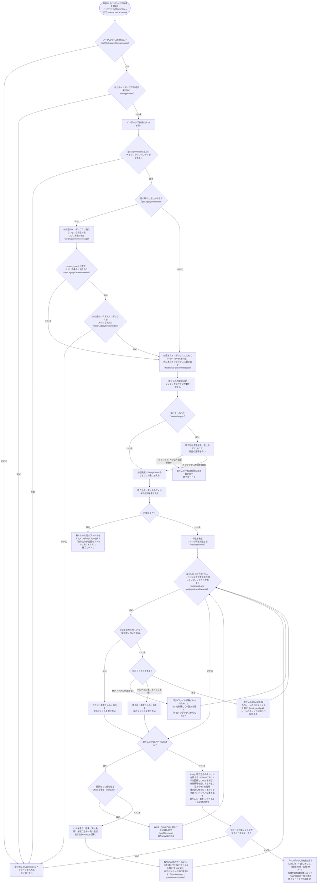
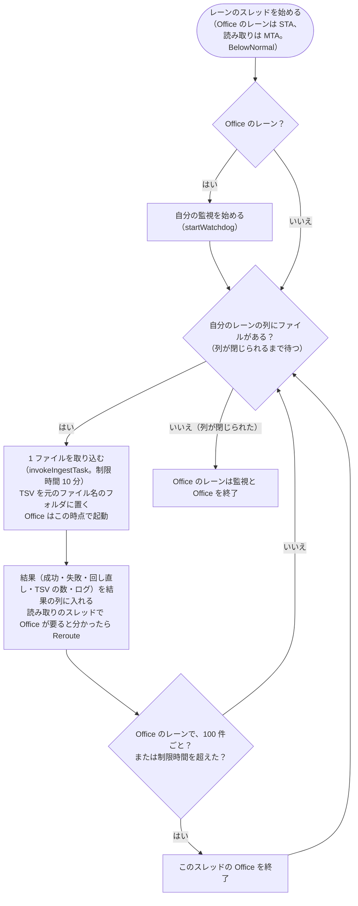

# インデックス作成のメインフロー

扱うこと: インデックス作成の起動から終了までの全体の流れ、レーンごとの取り込み、中止・強制終了・二重起動・エラー・進み具合の受け渡し。扱わないこと: 取り込み一覧の形式と再開の判定（[取り込み一覧](ingest-list.md)）、クロールと取り込み対象の決定（[クロール対象フォルダと取り込み対象](crawl.md)・[取り込み対象の決定](target-decision.md)）、レーンの並列化そのもの（[取り込みの並列化](parallel.md)）。先に読むページ: [インデックス作成](index.md)。

インデックス作成の本体は `invokeIndexer`（`indexer/indexer_run.ps1`）である。画面は自分のプロセスのスレッド（インデクサの司令。`IndexingSession`）で `indexer.ps1 -Channel` を実行し、`indexer.ps1` は `invokeIndexer` を呼ぶだけである。1 ファイルの取り込みは、ファイルの種類ごとのレーン（Excel・Word・PowerPoint・読み取り）の取り込みのスレッドが並べて行う（[取り込みの並列化](parallel.md)）。

取り込みのスレッドの中では、自分のレーンの列から 1 ファイルずつ次を行う（`runIngestWorker`）。Excel・Word・PowerPoint のレーンはスレッド 1 つ（STA）が自分の Office を 1 つ持つ。読み取りのレーンはスレッドを `ingestThreads` の数だけ持ち（MTA）、Office と監視を使わない。

- 利用者の入力を待つ処理（`pause`・`Read-Host`）は無い。画面は受け渡しの口（`newIndexerChannel`）から進み具合を読んで表示する（[インデックス作成の実行](../gui/indexing-run.md)）。
- インデクサは `exit` を使わず、終了コードを返す（`invokeIndexer`。画面のプロセスの中で動くため）。終了コードは受け渡しの口の `ExitCode` にも最後に入れる。画面は `ExitCode` が入ったら終わったとみなす。
- Excel・Word・PowerPoint は、それぞれのレーンのスレッドが必要になったときに 1 つだけ起動し、そのスレッドで使い回す。スレッドごとに 100 ファイルで、および取り込み失敗時に終了し、次に必要になったときに起動し直す（メモリ肥大化・不安定化の対策）。インデックス作成が起動する Office は、種類ごとに最大 1 つである（[Office アプリの管理](office-apps.md#office-アプリexcelwordpowerpointの管理)）。
- 取り込み一覧・進み具合・ログ・本文インデックスとシステムインデックスは、司令だけが書く。取り込みのスレッドは結果を返すだけである。
- **中止**: 画面の［中止］で受け渡しの口の `Stop` が立つと、司令は次のファイルを渡さず、取り込み中のファイルが終わるのを待つ。取り込み中のファイル（Office のレーンに回し直したものを含む）は最後まで取り込んでから止まる。その後 `finally` で取り込みのスレッドの終了（アプリの終了）・作業領域の削除・本文インデックスへの書き出し・取り込み一覧の書き直しを行って終了コード 2 で終わる。残りのファイルは取り込み一覧で「未取り込み」のまま残り、次回取り込まれる。
- **強制終了**: PC の停止・プロセスの強制終了などで止まった場合は `finally` が実行されないが、取り込み一覧には 1 件ごとに結果を追記しているため、次回は未取り込みのファイルから再開する。強制終了したときに取り込んでいたファイル（レーンに渡していたものすべて）は `work/取り込み中.txt` に残り、次回は最後に回す（[強制終了・時間切れからの再開](ingest-list.md#強制終了時間切れからの再開)）。取り込んでいたファイルのインデックスは、TSV を `work/取り込み出力/<PID>/w<番号>` に集めてからフォルダごと入れ替えるため（`publishIndexFiles`）、「前回のインデックスがそのまま」か「今回の分がそろった状態」のどちらかになり、一部のシートだけが入ったインデックスは残らない。本文インデックスに書き出していない TSV は、次回のインデックス作成の始めに書き出す（[入れ替えと書き出し](../index-data/publish.md)「本文インデックスへの書き出し」）。
- **二重に動かさない**: 同じ `work` のインデックス作成は 1 つだけ動かす（`newAppMutex "indexer"`。鍵は `work` のパスから作る）。ミューテックスは司令のスレッドで取り、同じスレッドで放す。ログはミューテックスを取ってから開く（動いているインデックス作成のログを消さないため）。画面は自分が始めたインデックス作成の間は［インデックス作成を開始］を押せないため、ここで止まるのは画面を使わずに起動したものと重なった場合である。既に動いていれば `ほかのインデックス作成が実行中です。インデックス作成が終わってから実行してください。` として終了コード 1 で終わる。取り込み一覧・インデックスを 2 つが同時に書き換えると、状態が食い違うため。ミューテックスはプロセスが終われば解放されるため、強制終了しても残らない。
- **取り込みの直前に元のファイルが無くなった**: 取り込み対象を調べてから実際に取り込むまでの間に、元のファイルが移動・削除されることがある。「失敗」として記録すると、利用者が再取り込みを選ぶまで残ってしまうため、取り込まずに TSV を削除して取り込み一覧から除き、本文インデックスからも外す（`元のファイルが無くなったため、取り込まずに一覧から除きます。`）。次回のクロールでも見つからないため、結果は同じになる。
- **インデックス作成中にクロール対象フォルダごと見えなくなった**: ネットワークの切断・USB メモリの取り外しなどでクロール対象フォルダにアクセスできなくなった場合、そのまま続けると残りのファイルがすべて「失敗」になり、次に再取り込みを選ぶまでインデックスに入らない。そのため、次のファイルを渡すのをやめ、取り込み中のファイルが終わるのを待ってから、残りを「未取り込み」のまま中止し、受け渡しの口の `Error` にメッセージを入れて終了コード 1 で終わる（`finally` は通るため、アプリの終了・取り込み一覧の書き直しは行う）。フォルダを使えるようにしてからインデックス作成を始めると、続きから取り込む。
- **続けられないエラー**: 捕まえていない例外（クロール対象フォルダが無い・チェックの付いたフォルダが無い・設定ファイルを読み込めない・取り込みのスレッドが止まった等）は `invokeIndexer` が受け、メッセージをログと受け渡しの口の `Error` に入れて終了コード 1 で終わる。画面がこのメッセージを表示する。
- **進み具合の受け渡し**: 司令は進み具合（段階・処理済み・残り・失敗・いま行っていること）を受け渡しの口の `Progress` に入れ（`writeIndexingProgress`）、画面は 1 秒ごとに読む（`readIndexingProgress`。[インデックス作成の実行](../gui/indexing-run.md)）。書くのは「ファイルを取り込みのスレッドに渡すとき」「結果を受け取ったとき」「段階が変わるとき」である。
  - 取り込み一覧（数万行になる）を画面が毎秒読み直すと、1 回に数秒かかって画面が固まる（5 万行で約 5.8 秒）ため、進み具合は取り込み一覧と分けている。
  - 段階は `クロール`（取り込み対象を探している。件数はまだ分からない）・`確認`（数え終えて、画面で取り込むかどうかを選ぶのを待っている）・`取り込み`（ファイルを取り込んでいる）・`仕上げ`（Office アプリの終了・本文インデックスへの書き出し・取り込み一覧の書き直し）。**待ち時間が長くなりがちな「クロール」「仕上げ」でも、何をしているか**（どのフォルダをクロールしているか・取り込み一覧を書き直しているか）**を書く**。
  - インデックス作成が終わっても消さない（画面が終わり方（成功・失敗の件数）を読むため）。
- **取り込み前の確認**（受け渡しの口の `ConfirmTargets`。画面から実行したとき）: 取り込み対象を数え終えたところで、インデックスごとの件数を受け渡しの口の `Plan` に入れ、段階を `確認` にして画面の返事を待つ（`IndexingReporter.WaitForApproval`。`Answered` で待つ）。画面が取り込む返事（`answerIndexingPlan`。`@{RetryFailed}`）を渡せばインデックス作成を始め（`RetryFailed` なら、前回失敗したファイルも対象に加える）、取りやめ（`$null`）か中止（`Stop`）なら 1 件も取り込まずに終了コード 2 で終わる。60 分待っても返事が無ければ取りやめる（画面が返事をしないまま待ち続けないため）。待ち終えたら `Plan` を外す。
  - 取りやめたときは、**取り込み一覧を前回の内容のまま書き直す**（今回の取り込み対象は記録しない）。「未取り込み」で記録すると、画面の表示が［続きから再開］になり、インデックス作成を中断したように見えるため。一方で、元ファイルが無くなった分の削除は済んでいるため、取り込み一覧そのものは書き直す。
- **ログ**: 表示内容は `writeIndexerLog` で `work/インデックス作成ログ.txt`（UTF-8 BOM 付き）に書く（実行ごとに上書き）。取り込みのスレッドは 1 ファイル分のログを貯めて結果と一緒に返し、司令が書く（結果を受け取った順に並ぶ。先頭の `[番号/件数]` が取り込み対象の中の順である）。画面を使わずに実行したときはコンソールにも出す。問題が起きたときはこのログで確認する。
