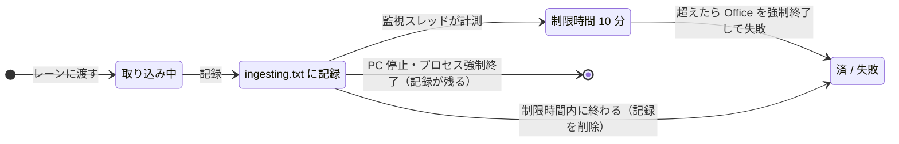
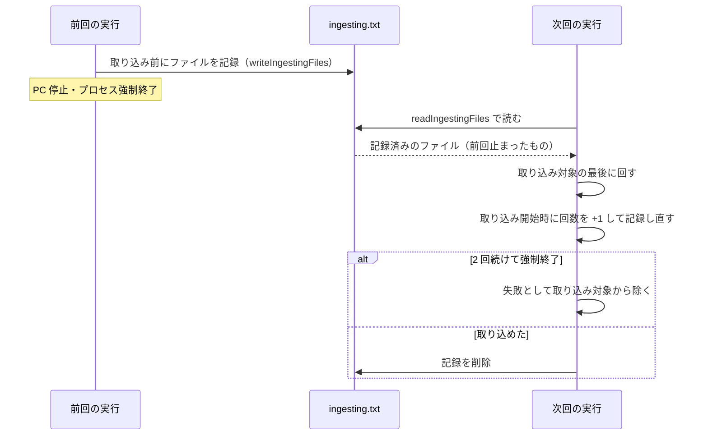

# 取り込み一覧

扱うこと: `work/ingest_status.tsv` の形式と書き込み方、強制終了・時間切れからの再開の仕組み。扱わないこと: インデックス作成全体の流れ（[インデックス作成のメインフロー](flow.md)）、取り込み対象をどう決めるか（[取り込み対象の決定](target-decision.md)）。先に読むページ: [インデックス作成](index.md)、[インデックス作成のメインフロー](flow.md)。

## 取り込み一覧 `work/ingest_status.tsv`

クロール対象フォルダ配下の Office ファイルを 1 ファイル 1 行で記録する。UTF-8（BOM 付き）・タブ区切りで、Excel でそのまま開ける。

```
クロール対象フォルダ	C:\data\営業	営業
クロール対象フォルダ	D:\old\2019年度	2019年度
相対パス	更新日時	サイズ	状態	TSV数	取り込み日時	エラー	抽出版
営業\2024\見積\A社.xlsx	2025/01/10 12:34:56	10420	済	3	2026/09/19 10:00:35		2
営業\空ブック.xlsx	2025/01/10 12:34:56	8578	済	0	2026/09/19 10:00:35		2
営業\秘密.xlsx	2025/01/10 12:34:56	15360	失敗		2026/09/19 10:00:40	読み取りパスワードが設定されているため開けません（パスワード付きのファイルは取り込めません）	
2019年度\新規.docx	2026/09/18 09:00:00	20480	未取り込み				
```

| 列 | 内容 |
|---|---|
| 先頭の行 | `クロール対象フォルダ<TAB><パス><TAB><インデックス名>`。クロール対象フォルダ（チェックなしを含む）ごとに 1 行 |
| 相対パス | `<インデックス名>\<クロール対象フォルダからの相対パス>`（= `work/content_index` からの相対パス）。大文字・小文字は区別しない |
| 更新日時・サイズ | クロール時の元ファイルの更新日時（`yyyy/MM/dd HH:mm:ss`、`formatFileTime`）とバイト数。次回、これと比べて更新の有無を判定する |
| 状態 | `未取り込み`（取り込み待ち・中断）/ `済` / `失敗` |
| TSV数 | 作成した TSV の数（= 場所の数。`済` のとき）。内容が空のファイルは `0`。本文インデックスに入れた後も値はそのまま（本文インデックスに入れる前の TSV が残っているときの確認に使う。[取り込み対象の決定](target-decision.md#取り込み対象の決定createtargetlist)） |
| 取り込み日時 | 取り込んだ（または失敗した）日時 |
| エラー | 失敗の原因（`describeIngestError` で例外から作る。[失敗の原因](office-apps.md#失敗の原因describeingesterror)。タブ・改行はスペースにする） |
| 抽出版 | 取り込んだ（`済`）ときの、その形式の読み取る内容の版（`getExtractVersion`。`indexer_decide.ps1` の `$extractVersions`）。今は `.xlsx` `.xlsm` が 4（グラフ・SmartArt・ヘッダー・フッターを読む・グラフの項目名を読まない）、`.docx` `.docm` `.pptx` `.pptm` が 3（グラフの項目名を読まない）、`.doc` `.ppt` が 2（図形・コメント等を読む）、`.xls` `.xlsb` は 1。今の版より小さければ、更新が無くても取り込み直す（[インデックス作成のメインフロー](flow.md)）。空は 1 とみなす |

書き込み方（`writeStatusFile` / `addStatusRow` / `readStatusFile`）:

- クロールの後に全ファイルを書き出す（一時ファイル `ingest_status.tsv.tmp` に書いてから置き換える）。
- インデックス作成中は 1 件ごとに結果の行を**末尾に追記**する。読み込み時は同じ相対パスの後の行を優先するため、途中で中断しても取り込み済みの結果は失われない。列数の合わない行（書き込み途中で強制終了した行）は無視する。
- 終了時（`finally`）に 1 ファイル 1 行に書き直す。インデクサが強制終了された場合は追記した行が重複して残るが、次回のクロール時に書き直される。

前の版が作った取り込み一覧をそのまま読めることの確かめ方は [前の版との互換](../index-data/format.md#前の版との互換)（列を足すと前の版の行を読めなくなる理由もそこに書く）。

## 強制終了・時間切れからの再開

大量のファイルを取り込むと、Office アプリが応答しなくなるファイル（壊れたファイル・非常に大きいファイル・表示されないダイアログで止まる等）で止まることがある。COM の呼び出しは応答が無いと戻らず、画面の［中止］（ファイルの切れ目で止まる）も効かないため、次の仕組みで同じファイルで止まり続けないようにする。



| 仕組み | 内容 |
|---|---|
| 1 ファイルの制限時間（`$fileTimeoutMinutes` = 10 分） | Excel・Word・PowerPoint のレーンのスレッドごとに、別のスレッド（監視。`startWatchdog`）で制限時刻を監視する。制限時間を過ぎたら、そのスレッドが自分で起動した Office アプリ（`getApp` で PID を控えたもの。利用者のアプリ・ほかのレーンのアプリは除く）を強制終了する。COM の呼び出しが例外で戻るため、そのファイルは `失敗`（エラー: `10 分以内に取り込みが終わらなかったため中止しました（Officeアプリを強制終了しました）`）とし、次のファイルへ進む。強制終了したアプリはすべて終了扱いにし、次に必要になったときに起動し直す |
| 取り込み中のファイルの記録（`work/ingesting.txt`） | 取り込み中のファイルを 1 行に 1 つ `<回数><TAB><相対パス>` で書く（`writeIngestingFiles`。取り込みを複数のスレッドで行うため、取り込み中のものすべて）。ファイルを取り込みのスレッドに渡す前に加え、結果を取り込み一覧に追記した後に除く。インデックス作成の終わりには、中止・続けられないエラーの場合も `finally` で削除する（`removeIngestingFile`。回数に数えない）。PC が停止した・プロセスが強制終了された等の場合だけ残る |
| PowerPoint が要るファイルの後回し（Postponed） | PowerPoint は 1 つのセッションに 1 つのプロセスしか持てないため、利用者が PowerPoint を開いていると接続することになり、固まっても止められない（[Word・PowerPoint の共通処理と Office アプリの管理](office-apps.md#office-アプリexcelwordpowerpointの管理)「PowerPoint」）。そこで、そもそも接続せず、そのファイルを取り込まずに「未取り込み」のまま残す（`indexer_run.ps1` の司令が `Postponed` の結果を受けたとき。取り込み中の記録・取り込み一覧・インデックスは変えない）。後回しにした件数だけ進み具合の「残り」に足し、終わりに件数と案内（`Notice`）をログと受け渡しの口に入れる。利用者が PowerPoint を閉じれば、次のインデックス作成で取り込む（強制終了の回数には数えない。取り込み中に強制終了した場合とは別の扱い） |



次回の実行時（取り込み対象の決定の後、`readIngestingFiles`）:

- `work/ingesting.txt` のファイルは、**すべて**「前回止まったファイル」として扱う（どのファイルで止まったかは分からないため）。取り込み対象にあれば、取り込み対象の**最後に回す**（`前回、取り込み中に強制終了したファイルは最後に取り込みます: <相対パス>`）。他のファイルの取り込みが先に進む。最後に回したファイルは、取り込みを始めるまで記録を残す（その前にまた止まっても、回数が分かるように）。
- そのファイルの取り込みを始めるときは、回数を 1 増やして記録する。続けて `$interruptLimit`（2）回強制終了したファイルは、応答しなくなるファイルとみなして `失敗`（エラー: `取り込み中に 2 回続けて強制終了されたため、取り込みを中止しました（…）`）とし、取り込み対象から除く。以降は他の失敗と同じく、画面で「失敗分も再取り込みする」を選ぶ（`-RetryFailed`）か元ファイルが更新されたときに取り込み直す。
- 記録のファイルが取り込み対象に無い（取り込み済み・削除された等）場合は、記録を削除する。
