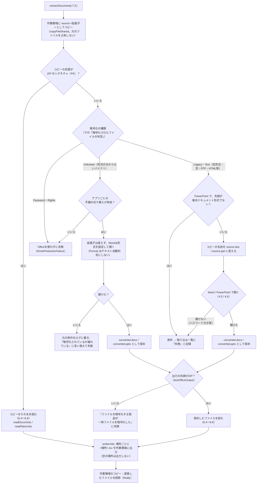
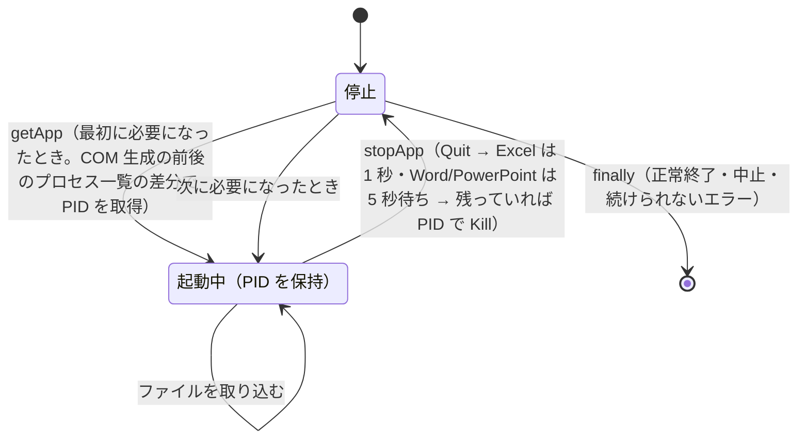

# Word・PowerPoint の共通処理と Office アプリの管理

扱うこと: Word・PowerPoint に共通の抽出処理・テキスト読み取り、失敗の原因の言い換え、Office アプリ（Excel・Word・PowerPoint）の起動・終了・制限時間の監視。扱わないこと: Excel の抽出処理（[Excel](excel.md)）、Word・PowerPoint それぞれの旧形式の変換と場所（[Word](word.md)・[PowerPoint](powerpoint.md)）。先に読むページ: [インデックス作成](index.md)。

Word・PowerPoint で共通の抽出処理（[Word・PowerPoint の抽出処理](#wordpowerpoint-の抽出処理extractdocument)）、失敗の原因の言い換え（[失敗の原因](#失敗の原因describeingesterror)）、Office アプリの起動・終了と制限時間の監視（[Office アプリ（Excel・Word・PowerPoint）の管理](#office-アプリexcelwordpowerpointの管理)）を扱う。

## Word・PowerPoint の抽出処理（`extractDocument`）

Word・PowerPoint で共通の処理。旧形式などをアプリで変換する処理は [Word の旧形式の変換](word.md#word-の旧形式の変換extractwithword)（Word）・[PowerPoint の旧形式の変換](powerpoint.md#powerpoint-の旧形式の変換extractwithpowerpoint)（PowerPoint）、ファイルの読み取りは [Word・PowerPoint のテキスト読み取り](#wordpowerpoint-のテキスト読み取りscriptssharedofficeoffice_readerps1)（共通）・[Word のテキスト読み取りと TSV の場所](word.md#word-のテキスト読み取りと-tsv-の場所readdocxunits)（Word）・[PowerPoint のテキスト読み取りと TSV の場所](powerpoint.md#powerpoint-のテキスト読み取りと-tsv-の場所readpptxunits)（PowerPoint）。

- 元のファイルは直接読まず、先に作業領域へコピーする（Excel と同じく `copyFileShared`。[Excel](excel.md) の補足）。ZIP を直接開くと、読んでいる間ほかのアプリの書き込みを拒否するうえ、利用者が編集中（書き込みで開いている）のファイルは共有違反で読めないため。
- ZIP でないコピーは、開く前に**暗号化の種類**を判定する（下の「暗号化されたファイルの判定」）。パスワード付き（新形式）・IRM は Word・PowerPoint を起動せずに失敗にする。旧形式・テキストらしい内容は今までどおり開く。
- コピーに旧形式の拡張子を付けてから開くのは、Word・PowerPoint が拡張子と中身が異なるファイル（中身が `.doc` の `.docx` 等）を開けないため。「形式の分からないバイナリ」（下記）は拡張子を変えない。
- パスワード付きの `.docx` `.pptx` は、Word・PowerPointを起動せずに失敗にする（下記）。Excel はパスワード付きでもそのまま `Workbooks.Open` に任せる（[Excel](excel.md) の判定）。

## 暗号化されたファイルの判定（`office_protection.ps1`・`office_protection_view.ps1`）

直接読み（ZIP）が開けないファイルを Office で開く前に、ファイルを開かず（Office を使わず）先頭バイト列と、複合ドキュメント形式（CFB。[[MS-CFB]](https://learn.microsoft.com/en-us/openspecs/windows_protocols/ms-cfb/)）のディレクトリのエントリ名だけで種類を見分ける。パスワード付き・IRM・秘密度ラベルの暗号化は、Office を起動するとダイアログ・サインイン画面が見えないまま出て止まりうるため、開く前に見分けて避ける。

判断層（`scripts/shared/office/office_protection_view.ps1`）が種類・文言を決め、状態層（`scripts/shared/office/office_protection.ps1`）がファイルの先頭バイト列（`readFileHead`）と CFB のディレクトリのエントリ名（`readCompoundEntryNames`）を読む。判断層はファイル・COM に触らないためテストが書ける（[単体テスト（Officeまわり）](../testing/unit-office.md)）。

| 種類 | 見分け方（開かずに） | 扱い | 取り込み一覧のエラー列 |
|---|---|---|---|
| `Zip` | 先頭が ZIP のシグネチャ（`PK 03 04`） | 直接読む（今と同じ） | – |
| `Password` | CFB で `StrongEncryptionDataSpace`・`EncryptionInfo` のいずれかを持つ | **Word・PowerPointはOfficeを起動せずに失敗**（Excel は今までどおり `Workbooks.Open` に任せる。既定のパスワードで暗号化されたブックを開けなくしないため） | `読み取りパスワードが設定されているため開けません（パスワード付きのファイルは取り込めません）` |
| `Rights` | CFB で権限保護の名前（下表）のいずれかを持つ。または `\x06DataSpaces`（データスペース）はあるが、権限保護・パスワードの名前を1つも取りこぼした場合（安全側に倒す） | **Officeを起動せずに失敗**（ライセンス取得・サインイン画面を防ぐ） | `IRM・秘密度ラベルで暗号化されているため取り込めません。` |
| `Legacy` | CFB で、上のどれでもない（旧形式 `.doc` `.xls` `.ppt`、CFB のディレクトリが読めなかった壊れたファイルを含む） | 今と同じ（Officeで開く。ダミーのパスワードで失敗） | 今と同じ |
| `Text` | ZIPでもCFBでもなく、先頭4KBにNUL（`0x00`）を含まない（空・RTF・HTML・UTF-8・UTF-16のBOM付きを含む） | 今と同じ（Officeで開く） | – |
| `Unknown` | ZIPでもCFBでもなく、先頭4KBにNULを含む（透過暗号化の製品の暗号文の見込み） | **予備**: アプリごとの切り替え（`${officeFallbackEnabled}`）が有効なら、拡張子を変えずに（Wordは`Format`も拡張子に合わせて固定して）Officeに開かせる。無効・開けない・出力の確かめに失敗したら、Officeを使わず（または使ってしまった分は元の例外をログに書いて）失敗にする | `暗号化されているか壊れているため取り込めません。` |

権限保護（IRM・秘密度ラベル）の CFB のエントリ名（[[MS-OFFCRYPTO]](https://learn.microsoft.com/en-us/openspecs/office_file_formats/ms-offcrypto/) の IRMDS）:

| 形式 | 名前 |
|---|---|
| 新形式 | `DRMEncryptedDataSpace`・`DRMEncryptedTransform`（`\x06DataSpaces` の配下） |
| 旧形式 | `\x09DRMContent`（必須）・`\x09DRMDataSpace`・`\x09DRMTransform`（任意で `\x09DRMViewerContent`・`\x09LZXDRMDataSpace`・`\x09LZXTransform`） |

（`\x06`・`\x09` は制御文字 0x06・0x09 で始まる名前を表す）

- **CFBのディレクトリの読み取り（`readCompoundEntryNames`）は、壊れたファイルでも例外を出さず、決まった時間で戻る**。FATの鎖が輪になる・範囲外のセクターを指す・ディレクトリが途中で切れる、のいずれでも、たどった鎖を打ち切って読めた分だけを返す（読めなければ `$null`。判断層は `$null` を `Legacy` として扱う）。ミニFAT・ストリームの中身は読まない（エントリ名だけが目的のため）。
- **Officeの出力も確かめる**（`testOfficeOutput`）。透過暗号化の製品が、Officeの保存した一時ファイル（変換した `.docx`・`.pptx`、[Excel](excel.md) のテキスト保存）まで暗号化することがあるため、種類によらずすべての出力で先頭バイト列（ZIP・UTF-16のBOM）を確かめる。合わなければ `ファイルを暗号化する製品が一時ファイルを暗号化したため取り込めません。` にする。
- **予備で開くときの守り**（`Unknown` のときだけ。固まらない・暗号文を索引に入れない）:
  - Word: `Documents.Open` の `Format` を拡張子に合う `WdOpenFormat` の値に固定する（`getWordOpenFormat`。自動判定に任せると文字コードを選ぶダイアログが出ることがある）。
  - Excel: 開いた後の `Workbook.FileFormat` がテキスト・HTML・CSV等でないことを確かめる（`testWorkbookFormat`）。`Text`（中身がHTMLの `.xls` 等）には当てない。
  - PowerPoint: 拡張子を変えずに開く（`.ppt` に変えるとアウトラインとして読むため）。
  - 実機で数秒以内に例外にならない・ダイアログが出るアプリは、`${officeFallbackEnabled}` でそのアプリの予備を無効にする（[Word・PowerPointの注意点・既知の問題](known-issues.md)）。
- **判定で失敗にしたときは、Officeの起動し直し（`stopApp`）を呼ばない**（`throwProtectionFailure` が例外の `Data` に印を付け、`invokeIngestTask` がそれを見る）。IRM・パスワード付きのファイルが並んでも、そのたびにOfficeを起動し直さないため。Officeを一度使ってから失敗にしたとき（予備で開けた後に出力が合わない等）は、今までどおり起動し直す。
- Excel は、コピーが ZIP でないときにこの判定を呼ぶ（[Excel の抽出処理](excel.md#excel-の抽出処理extractworkbook)）。読み取りのスレッド（Office を持たない）では、`Password`・`Rights` はその場で失敗にし、`Unknown`（予備が有効なとき）は今の旧形式と同じく Office のレーンに回し直す。

> **[Word の旧形式の変換](word.md#word-の旧形式の変換extractwithword) Word の旧形式の変換（`extractWithWord`）** → [Word の旧形式の変換](word.md#word-の旧形式の変換extractwithword)

> **[PowerPoint の旧形式の変換](powerpoint.md#powerpoint-の旧形式の変換extractwithpowerpoint) PowerPoint の旧形式の変換（`extractWithPowerPoint`）** → [PowerPoint の旧形式の変換](powerpoint.md#powerpoint-の旧形式の変換extractwithpowerpoint)

## Word・PowerPoint のテキスト読み取り（`scripts/shared/office/office_reader.ps1`）

`.docx` `.pptx` を ZIP として開き（`System.IO.Compression`）、XML を `XmlReader` で先頭から順に読む（`readXmlLines`）。Word（WordprocessingML、`w:`）と PowerPoint（DrawingML、`a:`）で同じ処理を使い、名前空間だけを切り替える。

ZIP の部品（エントリ）を読む `readZipEntry` は、展開後の大きさに部品 1 つにつき 100MB・1 ファイルの合計 300MB の上限を設け、超えたら簡潔な文言で例外にする（ヘッダーの大きさを偽って小さく見せた部品も検知する）。`XmlDocument` を作るところ（`newXmlDocument`）はすべて DTD（`<!DOCTYPE>`）の処理を禁止する。どちらも [Office ファイルを開くときの設定](../../safety/checks.md#office-ファイルを開くときの設定) を参照。

| 要素 | 扱い |
|---|---|
| 段落（`p`） | 1 行。文字（`t`）を連結する。タブ・改行（`tab` `br` `cr`）はスペース、`noBreakHyphen` は `-` |
| 表の行（`tr`） | 1 行。セル（`tc`）をタブ区切りにし、行末の空セルは除く。セル内の複数段落はスペース区切り。入れ子の表は外側のセルの中でスペース区切り |
| テキストボックス | Word の本文（`$objects` を渡したとき）: 本文の行には入れず、段落をスペースでつないで図形 1 つとして集める（[Word のテキスト読み取りと TSV の場所](word.md#word-のテキスト読み取りと-tsv-の場所readdocxunits)の `ページNNN[図形]`）。ヘッダー・フッター・脚注: 中の段落をそれぞれ 1 行とする（アンカーの段落の前に出力される） |
| SmartArt・グラフ・コメントの参照 | `$objects` を渡したとき、`dgm:relIds` の `r:dm`・`c:chart` の `r:id`・`w:commentReference` の `w:id` をページ付きで集める（中身は呼び出し元がリレーションシップの先から読む） |
| 埋め込みオブジェクト | `$collect` のとき、`w:objectEmbed`・`o:OLEObject`（`Type="Embed"`）・`p:oleObj` をページ（スライド）付きで集める。中の文字は呼び出し元が `readEmbeddedObjectLines`（`office_embedded.ps1`。[Word](word.md#埋め込みの読み取りreadembeddedobjectlines)）で読む |
| 互換用の代替表示（`mc:Fallback`） | 読まない（`mc:Choice` と同じ内容が重複するため） |
| 変更履歴 | 削除された文字（`w:delText`）と移動元（`w:moveFrom`）は読まない。挿入された文字は読む |
| フィールドコード（`w:instrText`） | 読まない（表示される結果の文字は読む） |

- Word・PowerPoint の TSV は、空行を除いて 1 行 = 段落 1 つ、または表の 1 行（セルをタブ区切り）。
- どの XML をどの場所（TSV）として読むかは、[Word のテキスト読み取りと TSV の場所](word.md#word-のテキスト読み取りと-tsv-の場所readdocxunits)（Word）・[PowerPoint のテキスト読み取りと TSV の場所](powerpoint.md#powerpoint-のテキスト読み取りと-tsv-の場所readpptxunits)（PowerPoint）を参照。

> **[Word のテキスト読み取りと TSV の場所](word.md#word-のテキスト読み取りと-tsv-の場所readdocxunits) Word のテキスト読み取りと TSV の場所（`readDocxUnits`）** → [Word のテキスト読み取りと TSV の場所](word.md#word-のテキスト読み取りと-tsv-の場所readdocxunits)

> **[PowerPoint のテキスト読み取りと TSV の場所](powerpoint.md#powerpoint-のテキスト読み取りと-tsv-の場所readpptxunits) PowerPoint のテキスト読み取りと TSV の場所（`readPptxUnits`）** → [PowerPoint のテキスト読み取りと TSV の場所](powerpoint.md#powerpoint-のテキスト読み取りと-tsv-の場所readpptxunits)

> **[Excel の図形・コメントの読み取り](excel.md#excel-の図形コメントの読み取りreadxlsxobjectunits) Excel の図形・コメントの読み取り（`readXlsxObjectUnits`）** → [Excel の図形・コメントの読み取り](excel.md#excel-の図形コメントの読み取りreadxlsxobjectunits)

## 失敗の原因（`describeIngestError`）

取り込みに失敗したファイルは、取り込み一覧のエラー列に**失敗の原因**を記録する。画面の［インデックス管理］タブには、失敗したファイルと原因を一覧で表示する（[インデックス一覧の管理](../gui/index-tab.md)）。

Office アプリの例外メッセージはそのままでは分かりにくい（パスワード付きのファイルでも「入力したパスワードが間違っています」と出る、作業領域のコピーのパスが出る、等）。そのため `describeIngestError` で、よくある原因を言い換えて `原因（詳細: 元のメッセージ）` の形にする。

- メソッド呼び出しの例外（`"7" 個の引数を指定して "Open" を呼び出し中に例外が発生しました` 等）は、中の例外（`GetBaseException()`）のメッセージを使う。
- スクリプト自身が `throw` したメッセージは、利用者向けに書いてあるためそのまま使う。
- 判定できない例外は、元のメッセージをそのまま使う（空ならエラーコードを表示する）。

| 判定 | 記録する原因 |
|---|---|
| メッセージに `パスワード` / `password` を含む | `読み取りパスワードが設定されているため開けません（パスワード付きのファイルは取り込めません）`（元のメッセージは誤解を招くため付けない） |
| `FileNotFoundException` / `DirectoryNotFoundException` | `ファイルが見つかりません（取り込み中に移動・削除・名前変更された可能性があります）` |
| `UnauthorizedAccessException`、`0x80070005` | `ファイルを読むアクセス権がありません` |
| `PathTooLongException` | `パスが長すぎるため読めません` |
| `OutOfMemoryException` | `シート・文書が大きすぎて取り込めません（メモリが不足しました）`（整形（[TSV 整形仕様](excel.md#tsv-整形仕様prettytsv--formattsv)）はシート 1 枚分を一度に読み込むため、テキストにして約 1GB を超えるシートで発生する） |
| `0x80070020` / `0x80070021`（共有違反・ロック違反） | `ほかのアプリ・利用者がファイルを使用中のため読めません（ファイルを閉じてから再取り込みしてください）` |
| `0x80040154` / `0x80080005` / `0x800401F3` | `Officeアプリ（Excel・Word・PowerPoint）を起動できませんでした（インストール・ライセンス認証の状態を確認してください）` |
| `0x800706BA` / `0x800706BE` / `0x80010105` / `0x80010108` | `Officeアプリが異常終了したか、内部でエラーが発生しました（ファイルが壊れている、または大きすぎる可能性があります）` |
| `0x80010001` / `0x8001010A` | `Officeアプリが応答しませんでした（Officeアプリでダイアログを表示中などの可能性があります）` |
| `InvalidDataException` / `XmlException`、メッセージに `ファイル形式` `破損` `壊れ` 等を含む | `ファイルが壊れているか、拡張子と中身の形式が一致していません` |

制限時間を超えた場合（[インデックス作成のメインフロー](flow.md)）と、取り込み中に続けて強制終了した場合（[取り込み一覧](ingest-list.md#強制終了時間切れからの再開)）は、それぞれ専用のメッセージを記録する。

記録・表示するメッセージの全文と対処は、[エラーメッセージ一覧](errors.md)（[エラーメッセージ一覧](errors.md)）にまとめる。

## Office アプリ（Excel・Word・PowerPoint）の管理

| 項目 | 仕様 |
|---|---|
| 起動 | `getApp <名前>` がアプリごとに 1 つの COM オブジェクトを保持し、最初に必要になったときに起動する。保持はスレッドごとで、Excel・Word・PowerPoint はそれぞれのレーンのスレッド 1 つだけが起動する（Excel のスレッドは Excel だけ、Word のスレッドは Word だけ、PowerPoint のスレッドは PowerPoint だけを持つ。読み取りのスレッドは Office を起動しない）。インデックス作成が起動する Office は、種類ごとに最大 1 つである。スレッドの間で Office を分け合わないため、鍵は使わない（[取り込みの並列化](parallel.md)） |
| PID の取得 | COM 生成の前後でプロセス一覧（`EXCEL` / `WINWORD` / `POWERPNT`）を比べ、新しく増えた 1 つを自分が起動したプロセスとする。比較は自分のセッションのプロセスだけで行う（別の利用者・別の作業フォルダの tebunko など、ほかのセッションのプロセスを自分のものと取り違えない）。同じ種類の Office を起動するのはそのレーンのスレッド 1 つだけのため、ほかのスレッドの起動と取り違えない |
| 優先度 | 自分が起動した Office のプロセスも `PriorityClass` を変えない（Normal のまま）。利用者がダブルクリックしたファイルがインデックス作成の Excel・Word で開くことがあり、利用者とプロセスを共有しないと確実には言えない（[スレッドの一覧](../structure/threads.md#スレッドの一覧)）。PID とプロセス名を受け渡しの口の `OfficePids` に記録する（画面を閉じるときに止まらなければ、これだけを止める。[閉じるときの順番](../structure/closing.md)） |
| 利用者のアプリとの共用（Excel・Word） | 新しいプロセスが増えなかった場合は利用者のアプリとみなし、`Quit()` も強制終了もしない。PowerPoint は、そもそも利用者のアプリに接続しない（下の「PowerPoint」） |
| 終了 | `Quit()` と `ReleaseComObject` の後、待ち時間（Excel は 1 秒、Word・PowerPoint は 5 秒）以内にプロセスが終了しなければ PID で強制終了する。Excel の待ち時間が短いのは、抽出で取り出した COM オブジェクトが解放されきらず、インデクサが動いている間は Quit しても終わらない（長く待っても無駄になる）ため。`GC.Collect()` で解放を促して自分で終わらせる方法は、インデクサの終了が COM の解放待ちで約 60 秒止まることがある（実測 25 回中 1〜2 回）ため採らない。`GC.WaitForPendingFinalizers()` も同じ理由で使わない |
| 終了の失敗 | 終了処理中のプロセスへの `Kill()` は「アクセス拒否」になることがあるため無視する。1 つのアプリの終了に失敗しても残りのアプリは終了させる（`stopAllApps`）。強制終了しても待ち時間内に終わらなかったプロセスが残っていれば、次の `getApp` が利用者のアプリとみなす（下の「PowerPoint」。安全な側に倒れる） |
| 制限時間の監視 | 監視のスレッドは Excel・Word・PowerPoint のレーンのスレッドごとに 1 つ（`startWatchdog`。読み取りのスレッドは持たない）。`getApp` / `stopApp` のたびに、そのスレッドが自分で起動したアプリの PID を監視スレッドに渡す（`updateWatchedPids`）。1 ファイルの制限時間を過ぎたら、監視スレッドがそれらを強制終了する（[取り込み一覧](ingest-list.md#強制終了時間切れからの再開)）。ほかのレーンのアプリは止めない。PID が別のプロセスに再利用されている場合に備え、プロセス名が `EXCEL` / `WINWORD` / `POWERPNT` のときだけ終了させる |
| PowerPoint | PowerPoint は 1 つのセッションに 1 つのプロセスしか持てず、接続すると利用者の設定（`DisplayAlerts`・`AutomationSecurity`）まで書き換えてしまう。そのため `getApp` は、起動する前に自分のセッションに `POWERPNT` が無いかを確かめ、あれば COM を作らずに例外にする。起動した後（COM 生成の前後）に新しいプロセスが増えていなければ、設定を変える前に COM を解放して同じ例外にする。この例外を受けた司令（`indexer_run.ps1`）は、そのファイルを取り込まずに後回し（Postponed）にする（未取り込みのまま次回のインデックス作成に回す。[取り込み一覧](ingest-list.md#強制終了時間切れからの再開)）。それ以外は他の Office と同じく、一度起動したら使い回し（旧形式の変換のたびに起動し直さない）、100 ファイルごと・取り込み失敗時・制限時間を過ぎたときに終了して次に必要になったときに起動し直す。インデックス作成が起動した PowerPoint は、そのスレッドが終わるときに終了する |

### Word の起動・終了

Word では、利用者が同じアプリで作業していることがあるため、次の場合は終了させない（PowerPoint は利用者のアプリに接続しないため、この状態にならない。上の「PowerPoint」）。

| 場合 | 仕様 |
|---|---|
| 起動中のアプリに接続された | COM 生成の前後で新しいプロセスが増えなかった場合は利用者のアプリとみなし、`Quit()` も強制終了もしない |
| インデックス作成中に利用者がファイルを開いた | 終了時に `Documents.Count` が 1 以上なら、利用者が使用中とみなして終了させない |
