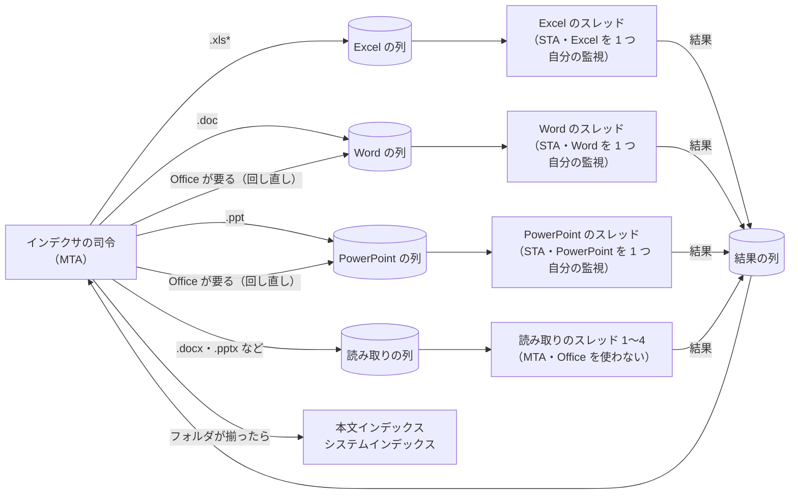
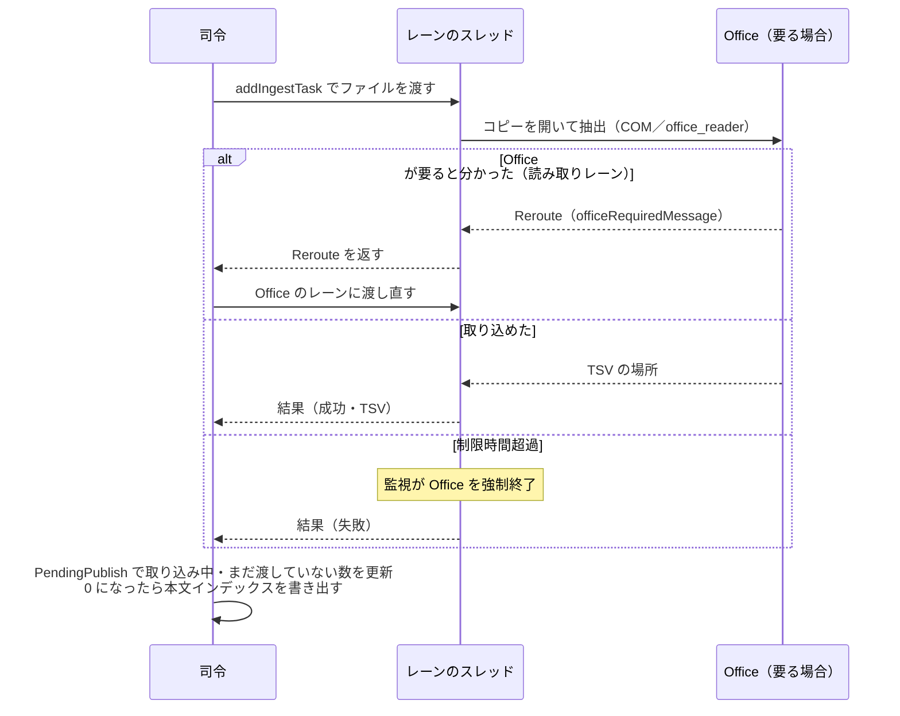

# 取り込みの並列化

扱うこと: ファイルの種類ごとのレーンと、司令・取り込みスレッド・監視の役割分担、Office の起動し直しと制限時間、中止のときの片づけ、実測。扱わないこと: メインフローそのもの（[インデックス作成のメインフロー](flow.md)）、スレッド・プロセス全般の一覧（[プロセスとスレッド](../structure/threads.md)）。先に読むページ: [インデックス作成のメインフロー](flow.md)。

インデクサの司令が取り込み対象を並べ、ファイルの種類ごとの「レーン」に 1 ファイルずつ渡す。レーンごとに列と取り込みスレッドを持つ。取り込みスレッドは結果（成功・失敗・TSV の場所）を返し、書き出しは司令がまとめて行う。

| レーン | 対象（拡張子） | スレッド | Office |
|---|---|---|---|
| Excel | `.xls*`（すべての Excel のファイル。セルの表示値を読むため Excel が要る） | 1（STA） | Excel を 1 つ |
| Word | `.doc` | 1（STA） | Word を 1 つ |
| PowerPoint | `.ppt` | 1（STA） | PowerPoint を 1 つ |
| 読み取り | `.docx`・`.docm`・`.pptx`・`.pptm` | 設定 `ingestThreads`（1〜4。0 はコア数 − 1 で 1〜4。取り込むファイルの数より多くはしない）（MTA） | 使わない |

- **レーンは拡張子で決める**（`getIngestLane`。判断層の `indexer_decide.ps1`）。Excel のファイルはセルの表示値を読むため、すべて Excel のレーンにする。Word・PowerPoint は、旧形式（`.doc`・`.ppt`）だけ Office のレーンにし、新形式は読み取りのレーンにする。テキストの拡張子（`.txt` 等）は、どの分岐にも当たらないため既定の読み取りのレーンになる（Office を使わずに読む。[テキストファイルの読み取り](text.md)）。
- **Office は種類ごとに 1 つだけ起動する。** Excel・Word・PowerPoint のレーンは、それぞれスレッド 1 つが自分の Office を 1 つ持つ。インデックス作成が起動する Office は、Excel・Word・PowerPoint がそれぞれ最大 1 つになる。3 つのレーンは互いに並べて動く。PowerPoint も、自分のスレッドが一度起動したら使い回す（変換のたびに起動し直さない）。同じ種類の Office を複数のスレッドが同時に起動しないため、起動の前後のプロセスの一覧の差で PID を取り違えない。起動した Office の優先度は変えない（[スレッドの一覧](../structure/threads.md#スレッドの一覧)）。起動した Office の PID は受け渡しの口（`OfficePids`）に記録する。
- **レーンのスレッドは、そのレーンのファイルを初めて渡すときに始める**（`addIngestTask`）。渡すファイルが無いレーンは、スレッドも Office も作らない。列は `newIngestPool` がレーンごとに作る（`BlockingCollection`）。
- **読み取りのスレッドは Office を使わない。** `.docx`・`.pptx` などの ZIP（XML）の形式を `office_reader` で直接読む。監視も持たない。
- **Office が要ると分かったファイルは、Office のレーンに回し直す。** 新形式の拡張子でも、中身が ZIP でない（パスワード付き・中身が旧形式）ことがある。読み取りのスレッドでは、`extractDocument` が `${officeRequiredMessage}`（`このファイルの取り込みには Word・PowerPoint が要ります。`）の例外を投げ、`invokeIngestTask` が `Reroute` を返す。司令は同じファイルを Word または PowerPoint のレーン（`getOfficeLane`）に渡し直す。回し直す間も取り込み中のまま扱う。ZIP でも旧形式でもない PowerPoint のファイル（壊れている）は、回し直さずに失敗にする。パスワード付き（新形式）・IRM・秘密度ラベルの暗号化（[暗号化されたファイルの判定](office-apps.md#暗号化されたファイルの判定office_protectionps1office_protection_viewps1)）も、回し直さずにその場で失敗にする（Officeが要らないため）。「形式の分からないバイナリ」は、アプリごとの予備が有効なときだけ今の旧形式と同じく回し直す。
- **判定でOfficeにまだ触れていない失敗は、`stopApp` を呼ばない。** パスワード付き・IRM・「形式の分からないバイナリ」（予備が無効）の失敗は、例外の `Data` に印（`throwProtectionFailure`）を付け、`invokeIngestTask` がそれを見て、そのレーンのOfficeを終了し直さずに次のファイルへ進む。IRM・パスワード付きのファイルが並んでも、そのたびにOfficeを起動し直して遅くならないため。
- **並びの先を見て、空いているレーンに渡す。** 司令は、まだ渡していない最初のファイルから `${ingestLookAhead}`（200 件）先までを見て、レーンに空きがあるファイルを渡す。レーンに渡しておける数（`getIngestLaneCapacity`）は、Office のレーンが 2（取り込み中の 1 件と次の 1 件）、読み取りのレーンが読み取りのスレッドの数 × 2 である。Excel のファイルが続いても、読み取りのスレッドを遊ばせない。取り込む順は取り込み一覧の順と変わることがあるが、結果（取り込み一覧・本文インデックス）は同じになる。
- **監視は Office のスレッドごとに持つ。** Office のレーンのスレッドは、始めるときに自分の監視のスレッドを作る（`startWatchdog`）。監視は、そのスレッドの制限時間だけを見て、そのスレッドが起動した Office だけを PID で止める。
- **Office の起動し直しと制限時間は、Office のスレッドごとに数える。** スレッドごとに 100 ファイルで起動し直す。1 ファイルの制限時間は 10 分。
- **一時フォルダはスレッドごとに分ける。** `%TEMP%\tebunko\<PID>\w<番号>` と、取り込み出力の `w<番号>` を使う。
- **本文インデックスはフォルダが揃ってから書く。** 司令は、はじめにフォルダごとのファイルの数を `PendingPublish.AddPending` で数えておき、ファイルを渡すたびに `Dispatch`、結果を受け取るたびに `Complete`（または渡さずに済ませるとき `Skip`）を呼ぶ。結果を受け取るたびに、取り込み中の数・まだ渡していない数がどちらも 0 になったフォルダの本文インデックスとシステムインデックスを書き出す（`indexer_run.ps1` の `flushPending` が `PendingPublish.TakeFlushable` を呼ぶ）。
- **取り込み一覧と進み具合は司令だけが書く。** 取り込みスレッドは結果を結果の列（`BlockingCollection`）に入れるだけで、取り込み一覧（`addStatusRow`）・進み具合・システムインデックスの変更の印（`markSystemIndexChanged`）は司令が書く。ログも、取り込みスレッドが 1 ファイル分を貯めて結果と一緒に返し、司令が書く。
- **取り込み中のファイルは、取り込み中のものをすべて記録する**（`取り込み中.txt`。1 行に 1 ファイル）。強制終了の後は、記録にあるファイルすべてを「前回止まったファイル」として扱う。
- **中止。** 司令は振り分けをやめ、取り込み中のファイル（回し直したものを含む）が終わるのを待ってから、書き出しと Office の片づけを行う。各レーンのスレッドは、列が閉じられたら自分の Office を終了して終わる（`stopIngestWorkers`）。
- **取り込みスレッドが止まったら。** 取り込みスレッドが途中で止まった（読み込めない等）ときは、インデックス作成を続けられないエラー `取り込みのスレッドが止まりました：<理由>` にする。

`setting.config` の `ingestThreads` で変えられるのは、読み取りのスレッドの数だけである。Excel・Word・PowerPoint のレーンは、いつもスレッド 1 つ・Office 1 つにする。

取り込みのスレッドを使うときは、はじめにログに `N 件のファイルを取り込みます。（Excel・Word・PowerPoint はそれぞれ 1 つずつ、Office を使わずに読むファイルは R 個のスレッドで並べて取り込みます。…）` と出す。

テストでは受け渡しの口の `Workers` を 0 にし、すべてのファイルの取り込みを司令のスレッドで行う（途中に割り込むため）。テストデータ（300 ファイル）で、スレッド 1 つと 4 つの結果（本文インデックスと取り込み一覧）が同じになることを確かめた。

速さは、空いている CPU の量で決まる。1 ファイルの取り込みには、Excel と PowerShell で約 1 コアを使う。スレッドと Office の両方の優先度を下げていたときは、ほかのアプリが約 2 コアを使っている PC で、変更前より 1〜2 割遅くなった（性能データ 1,080 ファイル。変更前 414 秒、取り込みのスレッド 1 つ 518 秒、3 つ 456 秒。両方 Normal では 398 秒）。PowerPoint を変換のたびに起動し直していたときは、旧形式 1 件に約 7 秒かかった（使い回すと約 0.25 秒）。
