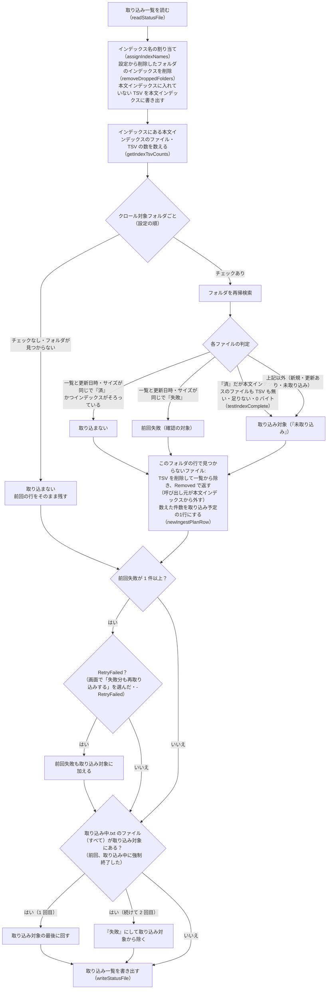
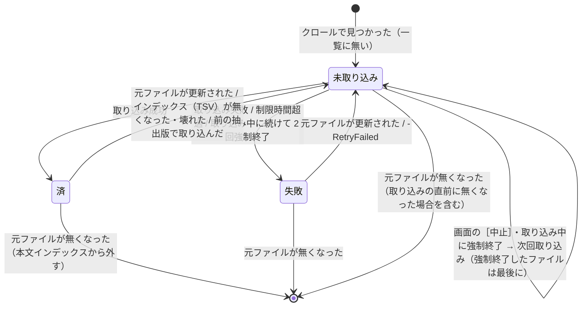

# 取り込み対象の決定

扱うこと: クロールで見つけたファイルを取り込み対象にするかどうかの判定（更新の判定・前の抽出版・インデックスが無くなった・壊れている場合・元ファイルが無くなった場合）、画面の確認に出す取り込み予定と件数。扱わないこと: クロール対象フォルダの登録・インデックス名（[クロール対象フォルダと取り込み対象](crawl.md)）、強制終了・時間切れからの再開そのもの（[取り込み一覧](ingest-list.md#強制終了時間切れからの再開)）。先に読むページ: [クロール対象フォルダと取り込み対象](crawl.md)。

## 取り込み対象の決定（`createTargetList`）



- **更新の判定**: 更新日時（秒まで）とサイズのどちらかが取り込み一覧と異なれば「更新あり」。古い版に戻した場合も再取り込みされる。
- **前の抽出版で取り込んだファイル**: 更新が無く `済` でも、取り込み一覧の「抽出版」がその形式の今の版（`getExtractVersion`）より小さければ取り込み直す（`getIngestDecision` の `outdated`）。ツールの版を上げて読み取る内容が増えたとき（例: Excel の図形・コメント）、既存のインデックスにも反映するため。件数は「更新あり」に数える。前回 `失敗` のファイルは、抽出版によらず「前回失敗」のまま。
- **一覧に無いファイル**（初回・取り込み一覧を削除した後）は、すべて取り込み対象にする（本文インデックスの中の元のファイルは、中身を読まないと分からないため調べない）。
- **インデックスが無くなった・壊れているファイル**: 取り込み一覧が `済` でも、次のどちらかに当てはまれば取り込み直す（`testIndexComplete`）。一覧だけを見ると `済` のままになり、検索しても出てこない状態が続くため。
  - そのファイルのフォルダ・拡張子の本文インデックスのファイル（`work/content_index/<相対フォルダ>/content_index.<拡張子>.<番号>.tsv`）が無いか 0 バイトで、本文インデックスに入れる前の TSV（`work/content_index/<相対パス>/*.tsv`）も無い・記録した TSV 数より少ない（`work/content_index` のフォルダ・ファイルを直接削除した場合）。本文インデックスのファイルがあれば（0 バイトでなければ）、そろっているものとする。
  - 本文インデックスに入れる前の TSV に 0 バイトのものがある（書き込みの途中で電源が落ちた場合など）。空のシート・ページは保存しない（`prettyTsv` / `writeUnits`）ため、0 バイトの TSV は正常には作られない。
  - 1 ファイルずつ調べると件数の分だけ時間がかかるため、取り込み対象を調べる前に、インデックスのフォルダとファイルをそれぞれ 1 回ずつ列挙して数える（`getIndexTsvCounts`。本文インデックスのファイルはそのファイルの相対パス → 1（0 バイトなら壊れている印）、本文インデックスに入れる前の TSV はフォルダの相対パス → TSV の数。大きさは列挙のときに分かる）。列挙できない場合（アクセス権が無い等）は確認しない。TSV 数を記録していない行も、本文インデックスのファイルが無ければ確認しない。
  - 本文インデックスのファイルの**中身の書き換え・一部の欠け**（手で編集した等、0 バイトでないもの）までは分からない（本文インデックスのファイルの中の元のファイルごとの場所の数は数えない）。その場合は画面でインデックスを［削除］してから作成し直す（[インデックス一覧の管理](../gui/index-tab.md)）。
- **元ファイルが無くなったファイル**（削除・名前変更・移動）は、そのファイルのインデックスのフォルダ（`work/content_index/<相対パス>`。本文インデックスに入れる前の TSV）があれば削除して一覧から除き、相対パスを `Removed` で返す。インデクサはそのフォルダを書き出し待ちにし、本文インデックスから外す（[入れ替えと書き出し](../index-data/publish.md)「本文インデックスへの書き出し」）。`元ファイルが無くなった N 件は、インデックスから除きます。` を表示する。ただし、クロール中にアクセスできないフォルダがあった場合は、見つからないだけの可能性があるため削除せず一覧に残し、その旨を表示する。
- フォルダごとに `  [<インデックス名>] <パス>` と、クロール後に `  [<インデックス名>] 対象ファイル N 件（取り込み済み A 件 / 新規 B 件 / 更新あり C 件 / 前回未完了 D 件 / 前回失敗 E 件）` を表示する。インデックスが無くなった・壊れているファイルがあるときだけ `/ インデックスが無い・壊れている F 件` を付け、続けて `インデックス（TSV）が無くなった・壊れている F 件は取り込み直します。（インデックスを直接削除した・0 バイトのTSVが残っている）` を表示する。チェックなしのフォルダは `… チェックなしのため取り込みません（インデックスはそのまま残します）` と表示する。
- インデックス作成中は `[i/N] <インデックス名>\<相対パス>` を表示する。元ファイルのパスは、相対パスの先頭のインデックス名からクロール対象フォルダを引いて求める。

## 取り込み予定（画面の確認に出す件数）

受け渡しの口の `ConfirmTargets`（画面から実行したとき）なら、取り込み対象を決めた後、インデックスごとの件数を 1 行にし（`newIngestPlanRow`）、受け渡しの口の `Plan` に入れる（`IndexingReporter.WaitForApproval`）。
画面はこれを読んで確認のダイアログを出す（[インデックス作成の確認ダイアログ](../gui/indexing-run.md#インデックス作成の確認ダイアログ)）。返事を受け取ったら `Plan` を外す。次の例は、1 行を列の順にタブで区切って並べたものである。

```
インデックス名	元のフォルダ	区分	ファイル数	取り込み対象	新規	更新あり	前回未完了	インデックスなし	前回失敗
営業	C:\data\営業	取り込み	1234	12	5	7	0	0	3
2019年度	D:\old\2019年度	チェックなし	0	0	0	0	0	0	0
```

- **区分**: `取り込み`（チェックが付いていて元のフォルダもある。数えた結果を書く）/ `チェックなし` / `フォルダなし`。後の 2 つは数えないため、件数はすべて 0。
- **取り込み対象** = 新規 ＋ 更新あり ＋ 前回未完了 ＋ インデックスなし。**前回失敗**は含めない（画面の確認で「失敗分も再取り込みする」を選んだときだけ対象になる）。

取り込み一覧の各ファイルの状態遷移:



クロールで列挙するファイルの条件（`findTargetFiles`）:

- 拡張子が `.xlsx` `.xlsm` `.xls` `.xlsb` `.docx` `.docm` `.doc` `.pptx` `.pptm` `.ppt`（Office、10 個）または [対象の拡張子](text.md#対象の拡張子)（テキスト、75 個）（大文字・小文字を区別しない）。テンプレート（`.xltx` `.dotx` `.potx` 等）は対象外
- ファイル名が `~$` で始まるもの（Office のロックファイル）は除外
- アクセスできないサブフォルダは無視して続行（元ファイルが無くなったかどうかの確認は行わない）
- 相対パスは、実際に列挙したフォルダ（`Resolve-Path` で解決した `Root`。`findTargetFiles` が返す）から求める。列挙したファイルのパスが `\\?\` 付きの `Root` で始まれば先頭を切り落とし（ファイルが多いときに速い）、そうでなければ `getPathUnderFolder` で求める。
  設定に書かれたパスとは書き方が違うことがあるため（末尾の `\`、`\\?\` 付き、`.` ・ `..` を含む、`/` 区切り）、設定のパスの文字数では切り出さない
- tebunko が作ったファイル（今のワークスペースの中身・`取り込み一覧.tsv` の印があるほかのワークスペースの中身・名前で分かる本文インデックスやシステムインデックス）は対象に含めない（テキストの拡張子（`.tsv` 等）でこれらを拾わないため。詳細は [テキストファイルの読み取り](text.md#tebunko-が作ったファイルの除外)）

各ファイルは拡張子で抽出方法を振り分ける（`ingestFile`）。`.xls*` は [Excel の抽出処理](excel.md#excel-の抽出処理extractworkbook)（Excel、[Excel](excel.md)）、`.doc*` `.ppt*` は [Word・PowerPoint の抽出処理](office-apps.md#wordpowerpoint-の抽出処理extractdocument)（Word・PowerPoint 共通、[Word・PowerPoint の共通処理と Office アプリの管理](office-apps.md)）と [Word の旧形式の変換](word.md#word-の旧形式の変換extractwithword)（Word、[Word](word.md)）・[PowerPoint の旧形式の変換](powerpoint.md#powerpoint-の旧形式の変換extractwithpowerpoint)（PowerPoint、[PowerPoint](powerpoint.md)）。テキストの拡張子は [テキストファイルの抽出処理](text.md#テキストファイルの抽出処理extracttextfile)（`extractTextFile`）。
成功時は `TSV N 件を作成しました。` を表示する。
