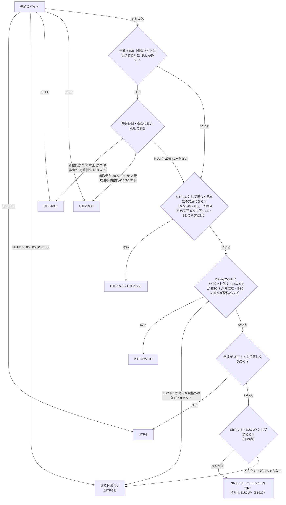

# テキストファイルの読み取り

扱うこと: テキストファイル（`.txt` `.csv` `.tsv` `.md` `.log` `.json` `.xml`）の対象の拡張子、文字コードの判定、行への分け方、大きさの上限、tebunko が作ったファイルの除外。扱わないこと: Office ファイルの取り込み（[クロール対象フォルダと取り込み対象](crawl.md)・[Excel](excel.md)・[Word・PowerPoint の共通処理と Office アプリの管理](office-apps.md)）、検索時の長い行の扱い（[検索結果の出力](../search/output.md#長い行を切る)）。先に読むページ: [クロール対象フォルダと取り込み対象](crawl.md)、[取り込み対象の決定](target-decision.md)。

## 対象の拡張子

`${textExtensions}`（`shared/core/text_file.ps1`）に固定する 7 つ。大文字・小文字は区別しない。

```
.txt  .csv  .tsv  .md  .log  .json  .xml
```

`setting.config` で拡張子を足す仕組みは無い（`tests/meta/safety.Tests.ps1` が、Office の拡張子と合わせて 1 つの固定の一覧ちょうどであることを確かめる。開くと実行される種類（`.bat` `.js` `.vbs` 等）を対象に入れないための歯止め）。PDF・RTF・HTML など読み方が別に要る形式は対象外。

## 文字コードの判定（`detectTextEncoding`）

バイト列だけを見て判定する（画面にもファイルにも触らない判断層の関数）。上から順に、最初に当たったものを使う。**判定できないもの（あいまいなものを含む）は取り込まない**（誤った文字コードで読んで化けたまま検索対象にしない）。



- **BOM**: `EF BB BF` → UTF-8、`FF FE` → UTF-16LE、`FE FF` → UTF-16BE。UTF-32 の BOM（`FF FE 00 00`・`00 00 FE FF`）は UTF-16 の BOM と見間違えないよう先に確かめ、取り込まない。
- **NUL の偏りによる BOM の無い UTF-16 の判定**: 先頭 64KB（偶数バイトに切り詰める）を 2 バイトの組として数え、組の数を N、偶数の位置（0, 2, …）の NUL の数を E、奇数の位置（1, 3, …）の NUL の数を O とする。ASCII の文字は UTF-16LE で奇数の位置が NUL になるため、O が多ければ LE、E が多ければ BE と判定する。
  - `O ≥ N × 20%` かつ `E ≤ O ÷ 10` → UTF-16LE
  - `E ≥ N × 20%` かつ `O ≤ E ÷ 10` → UTF-16BE
  - それ以外（NUL が 20% に届かない） → 次の「NUL の無い日本語の UTF-16」と同じ判定に回す（日本語の UTF-16 は、改行（CRLF）や全角スペース・「一」など下位バイトが 00 の文字だけが NUL になり、偶数・奇数の両側に NUL が出ることもあるため）
  - 閾値（20%・1/10）は `${textUtf16NulRatioThreshold}`・`${textUtf16NulSkewDivisor}` の定数
- **NUL の無い（または改行の分しか無い）日本語の UTF-16**（`detectJapaneseUtf16WithoutNul`）: ひらがな・カタカナ・漢字は NUL を含まないため、上の判定に掛からない。先頭 64KB（8 バイト以上）を LE・BE それぞれで読み、**ひらがな・カタカナが 20% 以上**で、日本語の文章に出る文字（ASCII・句読点・かな・漢字・全角）**以外が 5% 以下**のとき、その向きの UTF-16 とする。LE・BE の両方が当たるときは判定しない。7 ビットだけ（ASCII の範囲）のバイト列は、ひらがなの UTF-16 と ASCII の文字列（`0a0a…` など）の見分けが付きにくいため、かなの割合を 90% 以上にする。閾値は `${textJpUtf16KanaRatio}`・`${textJpUtf16AsciiKanaRatio}`・`${textJpUtf16OtherRatio}`・`${textJpUtf16MinBytes}`。
- **ISO-2022-JP**（`testIso2022JpBytes`）: 7 ビットだけのバイト列で、漢字への切り替え（`ESC $ B`・`ESC $ @`）を含み、ESC の並びがすべて規格のもの（`ESC $ B`・`ESC $ @`・`ESC ( B`・`ESC ( J`・`ESC ( I`（半角カナ。コードページ 50221 で読む））のとき。`ESC $ B` があるのに 8 ビットのバイトや規格外の ESC の並びがあるものは、JIS のつもりの壊れたものとして取り込まない（UTF-8 として読むと化ける）。ASCII だけで表せるため UTF-8 として読めてしまう（化ける）ので、UTF-8 より先に確かめる。`ESC [` などの端末の制御の並び（色つきのログ）や `ESC ( B` だけのものは対象にせず、UTF-8 になる。
- **UTF-8**: 不正なバイト列で例外にするデコーダー（`DecoderExceptionFallback`）で全体を読めれば UTF-8（ASCII だけのファイルもここに当たる）。
- **Shift_JIS・EUC-JP**（`detectLegacyJapaneseEncoding`）: 上のどれにも当たらなければ、次の条件で決める。決まらなければ取り込まない。

  | | Shift_JIS（コードページ 932） | EUC-JP（コードページ 51932） |
  |---|---|---|
  | 読み方 | 不正なバイト列があれば失敗にして読む | 同じ |
  | 自然さ | 制御文字（TAB・LF・FF・CR 以外）・私用領域・U+FFFD が出ない（外字 F040〜F9FC は私用領域に読まれるため取り込まない） | 同じ |
  | そのほか | 半角カナが「ASCII 以外の文字」の 30% 以下（`${textLegacyHalfKanaRatio}`）。超えるとき（半角カナの多い CSV など）は、濁点・半濁点が付けられるカナの直後にしか来ないなど、半角カナの並びとして自然なものだけ（`testHalfWidthKanaNatural`）。GBK・Big5 を Shift_JIS として読むと崩れる | ひらがな・カタカナを含む（かなの無い漢字だけの文章は、GBK・EUC-KR と構造が同じで見分けが付かない） |

  片方だけ当たればその文字コード。両方当たるときは、Shift_JIS として読むと半角カナばかりになる（EUC-JP のかなの見え方）なら EUC-JP、そうでなければ取り込まない。どちらも当たらなければ取り込まない。読んだ結果の数え（半角カナの割合）は最初の ASCII 以外の文字から `${textLegacySampleChars}` 文字だけで行い、大きなファイルで遅くならないようにしている。NUL の無いバイナリは制御文字が出るため、ここで取り込まない。

### 分かっている限界

- **取り込まないもの**: UTF-32・GBK・Big5・EUC-KR・かなの無い EUC-JP・NUL の無いバイナリ・NUL が偏らない UTF-16 などは、文字コードを判定できないとして取り込まない（`テキストファイルではないため取り込めません。`）。UTF-8・Shift_JIS・UTF-16 で保存し直せば取り込める。
- **短い Shift_JIS の並び**（半角カナの一部など。例: `ﾃｽ` = `C3 BD`）は、UTF-8 としても正しく読めることがあり、その場合は UTF-8 と判定されて化ける。
- **BOM の無い UTF-16 で、かなが 20% に届かないもの**（漢字だけの文章など）は、バイナリと見分けが付かないため取り込まない。
- **Shift_JIS の外字（F040〜F9FC）を含むファイル**は、外字が私用領域に読まれるため取り込まない。
- **半角カナの Shift_JIS と GBK・Big5**は、構造だけでは完全には見分けられない。半角カナの並びとして自然か（濁点・半濁点の位置）で見分けるため、濁点・半濁点を含まない短い GBK・Big5・EUC-KR が半角カナの Shift_JIS として誤って取り込まれ、半角カナの化けとして索引に入る（害は検索の雑音）。誤って取り込まれるのは、Big5・EUC-KR は 20 文字前後まで、GBK は 10 文字未満のとき（測定: Big5 8 文字で 71%・16 文字で 57%・32 文字で 7%、EUC-KR 8 文字で 66%・24 文字で 18%・32 文字で 0%、GBK 2 文字で 56%・8 文字で 5%・12 文字以上で 0%）。
- **半角カナだけの行で、･ や ､ を含み、半角カナの並びがすべて偶数の長さのもの**（例 `ﾔﾏﾀﾞ･ﾀﾛｳ`）は、EUC-JP としても正しく読めるため EUC-JP と判定され、化ける。
- **かなをほとんど含まない BOM 無し UTF-16（漢字だけ・ASCII だけの短い文）**は、UTF-16 とは判定しない（漢字だけの文は、ほかの文字コードとの区別が付かないため）。
- GBK・EUC-KR などがたまたま Shift_JIS・EUC-JP の条件を満たす偶然（ごく短い文や、かなに当たる並びを含む場合）は、判定の対象外で、誤って取り込まれうる。

## 行への分け方（`splitTextLines`）

行の分け方は `StreamReader.ReadLine` と同じ（CRLF・LF・CR のどれでも 1 行）。途中の空の行も捨てない（1 行目 = ファイルの 1 行目。本文インデックスの行番号がそのまま元のファイルの行番号になる）。行末の空白は取り除き（`TrimEnd`）、末尾の空の行は捨てる。

## 大きさの上限

元のファイルが `${textFileMaxBytes}`（10MB）を超えるものは、読まずに `ファイルサイズが大きすぎるため取り込めません。` の失敗にする（Office のファイルのサイズの上限と同じ文言にそろえた）。バイナリと判定したものは `テキストファイルではないため取り込めません。` の失敗にする。読み取り中の例外も、Office のファイルと同じく失敗にする（[ファイルごとの失敗](errors.md#ファイルごとの失敗取り込み一覧のエラー列)）。

空のファイル・空の行だけのファイルは、TSV 0 個の「済」とし、次のインデックス作成で「インデックスが無い」として取り込み直さない（中身が空の Office のファイルと同じ扱い）。

## テキストファイルの抽出処理（`extractTextFile`）

`shared/core/text_file.ps1` の `readTextFile`（ファイルを開いて読む状態層の関数。共有は `copyFileShared` と同じ `FileShare.ReadWrite | Delete`。コピーは作らず、読んで閉じる）が返す行の並びを、`tebunko/indexer/extract_text.ps1` の `extractTextFile` が場所「本文」の TSV 1 つに書き出す（`writeUnits` と違い、途中の空の行を捨てない）。取り込み（`ingestFile`。`tebunko/indexer/extract_office.ps1`）は、対象の拡張子ならここに回し、Excel・Word・PowerPoint を使わない読み取りのレーン（`Reader`）で取り込む（[取り込みのレーン](parallel.md)）。

本文インデックスへは、今の形式（版 1）のまま、種類 `テキスト`・場所 1 つ（部分 = 本文・対象 = 本文）で入る（[本文インデックスの形式](../index-data/format.md)）。

## tebunko が作ったファイルの除外

`.tsv` `.txt` などを取り込み対象にすると、tebunko 自身が作るファイル（本文インデックス・システムインデックス・取り込み一覧・ログ・検索結果ファイル）まで取り込んでしまい、すべての語が二重にヒットする。`findTargetFiles`（`tebunko/indexer/indexer_plan.ps1`）は、クロール対象の拡張子で列挙した後、次のいずれかに当たるファイルを除く。

1. **今のワークスペース**: `$workspace.Entries()`（`content_index`・前の版の `index`・`system_index`・取り込み一覧・ログ等）の下・そのもの。拡張子にかかわらない。
2. **ほかの tebunko のワークスペース**: 列挙したファイルの中に取り込み一覧（`$workspace.StatusFile` と同じ名前）があれば、そのフォルダをワークスペースとみなし、`Entries()` の下も同じく除く（以前の既定の場所・切り替える前のワークスペース・ほかの人のワークスペースに対応）。
3. **名前で分かる tebunko のファイル**: 本文インデックス（`content_index.*.tsv`）・前の版の集約ファイル（`content.*.tsv`）・システムインデックス（`system_index*.txt`・前の版の `システムインデックス*.txt`）は、どこにあっても除く。
4. **`~$` で始まる一時ファイル**（既存の除外をそのまま続ける）。

既定でない場所のワークスペースに利用者が置いた `.xlsx`・`.txt` は、1〜3 のどれにも当たらないため今までどおり取り込む。判定はファイルごとに重くしないよう、除外するフォルダの `\\?\` 付きの前方一致の文字列を先に作ってから `StartsWith` で比べる（ファイルごとにドライブの割り当てをたどる処理は呼ばない）。
