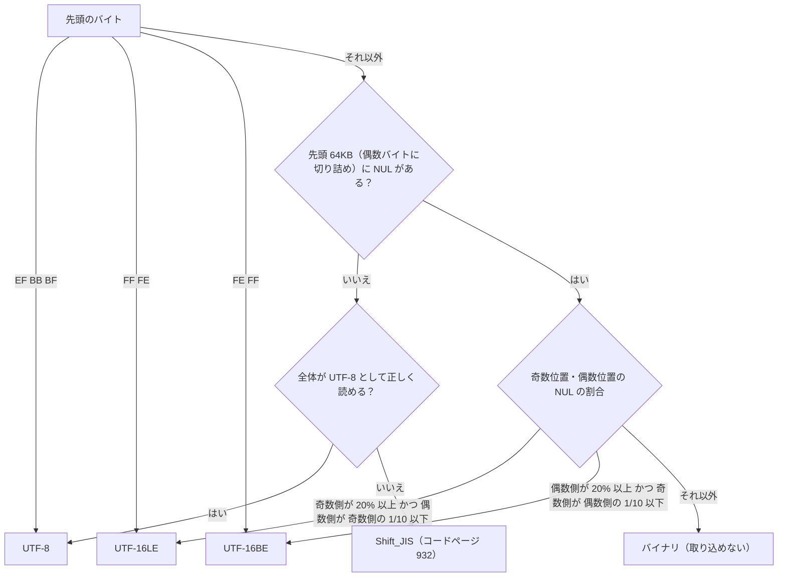

# テキストファイルの読み取り

扱うこと: テキストファイル（`.txt` `.csv` `.tsv` `.md` `.log` `.json` `.xml`）の対象の拡張子、文字コードの判定、行への分け方、大きさの上限、tebunko が作ったファイルの除外。扱わないこと: Office ファイルの取り込み（[クロール対象フォルダと取り込み対象](crawl.md)・[Excel](excel.md)・[Word・PowerPoint の共通処理と Office アプリの管理](office-apps.md)）、検索時の長い行の扱い（[検索結果の出力](../search/output.md#長い行を切る)）。先に読むページ: [クロール対象フォルダと取り込み対象](crawl.md)、[取り込み対象の決定](target-decision.md)。

## 対象の拡張子

`${textExtensions}`（`shared/core/text_file.ps1`）に固定する 7 つ。大文字・小文字は区別しない。

```
.txt  .csv  .tsv  .md  .log  .json  .xml
```

`setting.config` で拡張子を足す仕組みは無い（`tests/meta/safety.Tests.ps1` が、Office の拡張子と合わせて 1 つの固定の一覧ちょうどであることを確かめる。開くと実行される種類（`.bat` `.js` `.vbs` 等）を対象に入れないための歯止め）。PDF・RTF・HTML など読み方が別に要る形式は対象外。

## 文字コードの判定（`detectTextEncoding`）

バイト列だけを見て判定する（画面にもファイルにも触らない判断層の関数）。上から順に、最初に当たったものを使う。



- **BOM**: `EF BB BF` → UTF-8、`FF FE` → UTF-16LE、`FE FF` → UTF-16BE。
- **BOM の無い UTF-16 の判定**: 先頭 64KB（偶数バイトに切り詰める）を 2 バイトの組として数え、組の数を N、偶数の位置（0, 2, …）の NUL の数を E、奇数の位置（1, 3, …）の NUL の数を O とする。ASCII の文字は UTF-16LE で奇数の位置が NUL になるため、O が多ければ LE、E が多ければ BE と判定する。
  - `O ≥ N × 20%` かつ `E ≤ O ÷ 10` → UTF-16LE
  - `E ≥ N × 20%` かつ `O ≤ E ÷ 10` → UTF-16BE
  - それ以外（NUL はあるが、どちらの位置にも偏っていない） → バイナリと判定し、取り込まない
  - 閾値（20%・1/10）は `${textUtf16NulRatioThreshold}`・`${textUtf16NulSkewDivisor}` の定数
- **UTF-8**: 不正なバイト列で例外にするデコーダー（`DecoderExceptionFallback`）で全体を読めれば UTF-8（ASCII だけのファイルもここに当たる）。
- **Shift_JIS**: 上のどれにも当たらなければ、コードページ 932 として読む。

### 分かっている限界

- **NUL を含まない BOM の無い UTF-16**（日本語だけの文章など）は判定できず、Shift_JIS または UTF-8 として読まれて化ける。
- **短い Shift_JIS の並び**（半角カナの一部など。例: `ﾃｽ` = `C3 BD`）は、UTF-8 としても正しく読めることがあり、その場合は UTF-8 と判定されて化ける。
- EUC-JP・JIS（ISO-2022-JP）・UTF-32 は判定しない。

## 行への分け方（`splitTextLines`）

行の分け方は `StreamReader.ReadLine` と同じ（CRLF・LF・CR のどれでも 1 行）。途中の空の行も捨てない（1 行目 = ファイルの 1 行目。本文インデックスの行番号がそのまま元のファイルの行番号になる）。行末の空白は取り除き（`TrimEnd`）、末尾の空の行は捨てる。

## 大きさの上限

元のファイルが `${textFileMaxBytes}`（10MB）を超えるものは、読まずに `ファイルサイズが大きすぎるため取り込めません。` の失敗にする（Office のファイルのサイズの上限と同じ文言にそろえた）。バイナリと判定したものは `テキストファイルではないため取り込めません。` の失敗にする。読み取り中の例外も、Office のファイルと同じく失敗にする（[ファイルごとの失敗](errors.md#ファイルごとの失敗取り込み一覧のエラー列)）。

空のファイル・空の行だけのファイルは、TSV 0 個の「済」とし、次のインデックス作成で「インデックスが無い」として取り込み直さない（中身が空の Office のファイルと同じ扱い）。

## テキストファイルの抽出処理（`extractTextFile`）

`shared/core/text_file.ps1` の `readTextFile`（ファイルを開いて読む状態層の関数。共有は `copyFileShared` と同じ `FileShare.ReadWrite | Delete`。コピーは作らず、読んで閉じる）が返す行の並びを、`tebunko/indexer/extract_text.ps1` の `extractTextFile` が場所「本文」の TSV 1 つに書き出す（`writeUnits` と違い、途中の空の行を捨てない）。取り込み（`ingestFile`。`tebunko/indexer/extract_office.ps1`）は、対象の拡張子ならここに回し、Excel・Word・PowerPoint を使わない読み取りのレーン（`Reader`）で取り込む（[取り込みのレーン](parallel.md)）。

本文インデックスへは、今の形式（版 1）のまま、種類 `テキスト`・場所 1 つ（部分 = 本文・対象 = 本文）で入る（[本文インデックスの形式](../index-data/format.md)）。

## tebunko が作ったファイルの除外

`.tsv` `.txt` などを取り込み対象にすると、tebunko 自身が作るファイル（本文インデックス・システムインデックス・取り込み一覧・ログ・検索結果ファイル）まで取り込んでしまい、すべての語が二重にヒットする。`findTargetFiles`（`tebunko/indexer/indexer_plan.ps1`）は、クロール対象の拡張子で列挙した後、次のいずれかに当たるファイルを除く。

1. **今のワークスペース**: `$workspace.Entries()`（`content_index`・前の版の `index`・`system_index`・取り込み一覧・ログ等）の下・そのもの。拡張子にかかわらない。
2. **ほかの tebunko のワークスペース**: 列挙したファイルの中に取り込み一覧（`$workspace.StatusFile` と同じ名前）があれば、そのフォルダをワークスペースとみなし、`Entries()` の下も同じく除く（以前の既定の場所・切り替える前のワークスペース・ほかの人のワークスペースに対応）。
3. **名前で分かる tebunko のファイル**: 本文インデックス（`content_index.*.tsv`）・前の版の集約ファイル（`content.*.tsv`）・システムインデックス（`system_index*.txt`・前の版の `システムインデックス*.txt`）は、どこにあっても除く。
4. **`~$` で始まる一時ファイル**（既存の除外をそのまま続ける）。

既定でない場所のワークスペースに利用者が置いた `.xlsx`・`.txt` は、1〜3 のどれにも当たらないため今までどおり取り込む。判定はファイルごとに重くしないよう、除外するフォルダの `\\?\` 付きの前方一致の文字列を先に作ってから `StartsWith` で比べる（ファイルごとにドライブの割り当てをたどる処理は呼ばない）。
