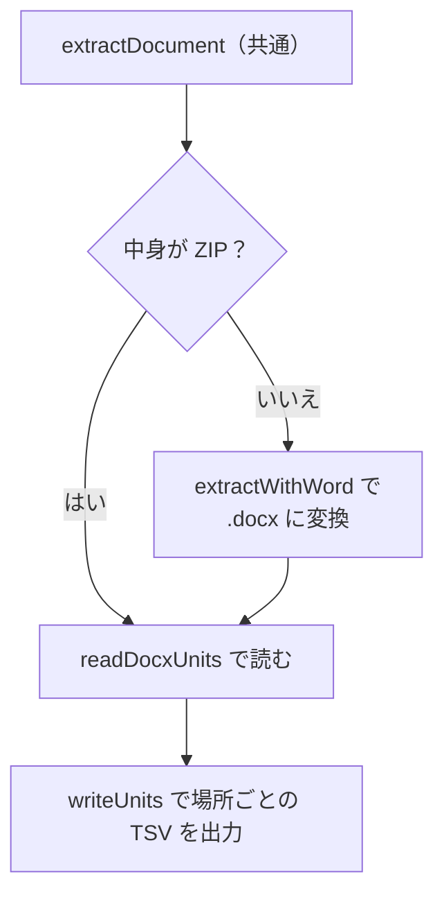

# Word

扱うこと: Word 文書の旧形式（`.doc` 等）の変換、ページ・ヘッダー/フッター・脚注・図形・コメントごとの読み取りと TSV の場所。扱わないこと: Word・PowerPoint に共通の処理（[Word・PowerPoint の共通処理と Office アプリの管理](office-apps.md)）、PowerPoint 固有の処理（[PowerPoint](powerpoint.md)）。先に読むページ: [Word・PowerPoint の共通処理と Office アプリの管理](office-apps.md)。

Word・PowerPoint で共通の処理（抽出の流れ・起動と終了・ファイルの読み取り）は [Word・PowerPoint の共通処理と Office アプリの管理](office-apps.md) を参照。

Word 文書の旧形式（`.doc` 等）の変換（[Word の旧形式の変換](#word-の旧形式の変換extractwithword)）、本文のページ・ヘッダー/フッター・脚注・図形・コメントごとの読み取り（[Word のテキスト読み取りと TSV の場所](#word-のテキスト読み取りと-tsv-の場所readdocxunits)）、Word に固有の注意点（[Word の注意点・既知の問題](known-issues.md#word-の注意点既知の問題)）を扱う。

## Word の旧形式の変換（`extractWithWord`）

[Word・PowerPoint の抽出処理](office-apps.md#wordpowerpoint-の抽出処理extractdocument)で ZIP ではないと判定したファイル（`.doc`、パスワード付き（Word は開かせずに失敗）、拡張子と中身が異なるもの、暗号化の種類が「形式の分からないバイナリ」（[暗号化されたファイルの判定](office-apps.md#暗号化されたファイルの判定office_protectionps1office_protection_viewps1)）で予備を使うもの）を、Word で `.docx` に変換する。

| 項目 | 仕様 |
|---|---|
| 開き方 | `Documents.Open(パス, ConfirmConversions=False, ReadOnly=True, AddToRecentFiles=False, パスワード類="dummy", ..., Format=省略時は自動判定, ..., Visible=False)` |
| パスワード付きファイル（新形式） | [暗号化されたファイルの判定](office-apps.md#暗号化されたファイルの判定office_protectionps1office_protection_viewps1)で判定し、開かずに失敗にする（今までの「ダミーのパスワードで開いて失敗」はしない）。旧形式（`.doc`）のパスワード付きは今までどおりダミーのパスワードにより「パスワードが正しくありません」の例外 |
| `Format`（「形式の分からないバイナリ」のときだけ） | 拡張子に合う `WdOpenFormat` の値に固定する（`getWordOpenFormat`。例: `.docx` → 9 = `wdOpenFormatXMLDocument`、`.doc` → 1 = `wdOpenFormatDocument`）。自動判定（既定値）に任せると、文字コードを選ぶダイアログが出たり、暗号文をテキストとして読んだりすることがあるため |
| 保存 | `Repaginate()` でページ割りを確定させてから `SaveAs2(converted.docx, 12 = wdFormatXMLDocument)`。保存した `.docx` の先頭が ZIP でなければ「一時ファイルを暗号化した」に失敗にする（[暗号化されたファイルの判定](office-apps.md#暗号化されたファイルの判定office_protectionps1office_protection_viewps1)の `testOfficeOutput`） |
| アプリの設定 | `Visible = False`、`DisplayAlerts = 0`（wdAlertsNone）、`AutomationSecurity = 3` |

- `Repaginate()` を呼ぶのは、保存時に記録されるページ区切り（[Word のテキスト読み取りと TSV の場所](#word-のテキスト読み取りと-tsv-の場所readdocxunits) のページの目安）を確定させるため。呼ばないと、同じ内容の文書でも変換のたびにページ区切りの位置が変わることがある（◎）。
- 「形式の分からないバイナリ」は、コピーの拡張子を元のまま開く（旧形式のように `source.doc` へ付け替えない）。開けなかったとき・保存の出力が ZIP でないときは、元の例外をインデックス作成ログに書き、`暗号化されているか壊れているため取り込めません。` に言い換える。

## Word のテキスト読み取りと TSV の場所（`readDocxUnits`）

`.docx` は [Word・PowerPoint のテキスト読み取り](office-apps.md#wordpowerpoint-のテキスト読み取りscriptssharedofficeoffice_readerps1)の共通の読み取り（`readXmlLines`、WordprocessingML の名前空間 `w:`）で読み、次の場所ごとに TSV にする。

| 場所 | 読み取り元 |
|---|---|
| `ページNNN` | `word/document.xml`（本文） |
| `ヘッダー・フッター` | `word/header*.xml` → `word/footer*.xml` の順。セクションごとに同じ内容が並ぶため、重複する行は除く |
| `脚注` | `word/footnotes.xml`・`word/endnotes.xml`（区切り線は文字が無いため出力されない） |
| `ページNNN[図形]` | 本文のテキストボックス・図形内の文字（`w:txbxContent`）、SmartArt（`dgm:relIds` の `r:dm` が指す `word/diagrams/dataN.xml`）、グラフ（`c:chart` の `r:id` が指す `word/charts/chartN.xml` のタイトル・軸ラベル・系列名。項目名・数値は読まない）。図形 1 つを 1 行にし、段落はスペースでつなぐ。ページは図形を置いた段落のページ |
| `ページNNN[埋め込みN]` | 本文に埋め込んだ Office のファイル（.xlsx・.docx・.pptx など）の中の文字。読み方は下の「埋め込みの読み取り」 |
| `ページNNN[コメント]` | `word/comments.xml` のコメント（返信も 1 件ずつ）。ページは本文の `w:commentReference` の位置。本文に参照の無いコメント（ヘッダー・脚注に付けたもの等）は `文書[コメント]` にまとめる。作成者名は読まない |

- 図形・コメントの場所の決まりは [インデックスのファイルの形](../index-data/format.md#配置命名規則)の「図形・コメントの場所」。SmartArt は描画用の `diagrams/drawingN.xml` に同じ文字があるが、重複するため読まない。
- ヘッダー・フッター・脚注の中のテキストボックスは、`[図形]` に分けずにその場所の行にする。
- 埋め込みは本文だけから探す。ヘッダー・フッター・脚注に埋め込んだものは読まない。
- **ページ番号は目安**。ファイルにはページの情報が無いため、以下で数える。
  - Word が保存時に記録したページ区切り（`w:lastRenderedPageBreak`）。本文にこれが 1 つも無い（Word 以外で作られた）文書では使わない。
  - 手動の改ページ（`w:br w:type="page"`）・段落前で改ページ（`w:pageBreakBefore`）・セクション区切り（種類が「連続」以外）。これらの直後、本文が出る前にある `w:lastRenderedPageBreak` は同じ区切りなので数えない（Word は手動の改ページの後に `w:lastRenderedPageBreak` を記録する場合としない場合がある ◎）。
  - 段落・表の行は、最初の文字があるページに属する。

### 埋め込みの読み取り（`readEmbeddedObjectLines`）

`scripts/shared/office/office_embedded.ps1`。本文の埋め込みオブジェクト（`w:objectEmbed`、`o:OLEObject` の `Type="Embed"`）のうち、リレーションシップの種類が `package` のもの（OOXML の `word/embeddings/*.xlsx` `*.docx` `*.pptx`）の中の文字を、その埋め込みがあるページの `ページNNN[埋め込みN]` に入れる。COM は使わない。

- **形式は中身で決める。** ZIP の先頭（`PK`）を確かめ、`xl/workbook.xml` があれば Excel、`word/document.xml` なら Word、`ppt/presentation.xml` なら PowerPoint として読む。どれでもなければ、何も出さず読み飛ばす（失敗にしない）。
- **Excel のブック**: 表示のシートの文字のセル（共有文字列・インライン文字列・数式の文字）を、1 行 1 行、セルをタブでつないで出す。数値・非表示のシートは読まない。**埋め込みのブックは、表示範囲の外のセルや、埋め込んだときに見えていない別の表示シートの文字も検索される**（見えている範囲だけが検索結果に出るわけではない）。
- **Word・PowerPoint の文書**: 本文の文字を読む。その中にさらに埋め込んだものは読まない（深さは 1 段まで）。
- **番号 N**: 1 ファイルの中の通し番号。同じ部品を指す参照は 1 回だけ読み、参照の順に 1 から振る（読む前に振るので、読めなかったものは欠番になる）。
- **サイズの上限**: 埋め込んだファイルは、部品ごと・合計の上限（[安全のための検査](../../safety/checks.md)）の中で読む。埋め込んだ部品の大きさをヘッダーの申告だけで信じず、読んだ量でも数える（埋め込みのシートも `readZipEntryBytes` で読む）。埋め込みから出す行の文字数にも、親の 1 ファイルの全埋め込みの合計で上限（32M 文字）を付ける。部品ごとの上限・出す量の上限や壊れた XML・壊れた ZIP は、その埋め込みだけ読めなかったことにして記録し（インデックス作成ログに `埋め込みを読み取れませんでした`）、本文とほかの埋め込みは読む。合計の上限は、ほかの部品と同じくファイル全体を失敗にする。
- 旧形式（`.doc`）は Word が新形式に変換して保存したあとに読む。実機で、Excel のブックを埋め込んだ `.doc` を `.docx` に変換すると `package` として残り、`[埋め込みN]` で読めることを確かめた。旧形式の `.ppt` は、変換後の `.pptx` に埋め込みが `package` として残らず、読めない。

TSV の例（配置・命名の規則は [インデックスのファイルの形](../index-data/format.md#配置命名規則)。クロール対象フォルダが `C:\data\営業`（インデックス名 `営業`）の場合）:

| 元ファイル（クロール対象フォルダからの相対パス） | 場所 | 出力 TSV |
|---|---|---|
| `報告書.docx` | 2 ページ目 | `work/content_index/営業/報告書.docx/page_002.tsv` |
| `報告書.docx` | ヘッダー・フッター | `work/content_index/営業/報告書.docx/header_footer.tsv` |
| `報告書.docx` | 脚注・文末脚注 | `work/content_index/営業/報告書.docx/doc_footnotes.tsv` |

- ページ番号は 3 桁以上の 0 埋め（ファイル名の順 = ページの順）。
