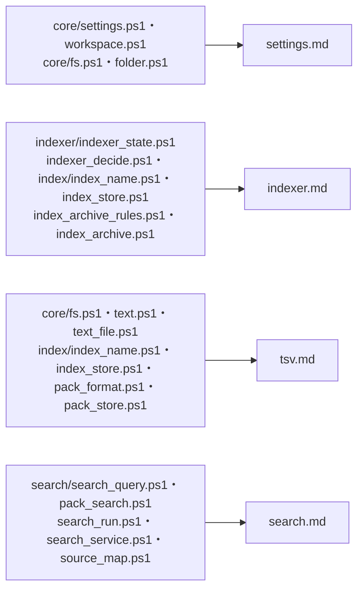
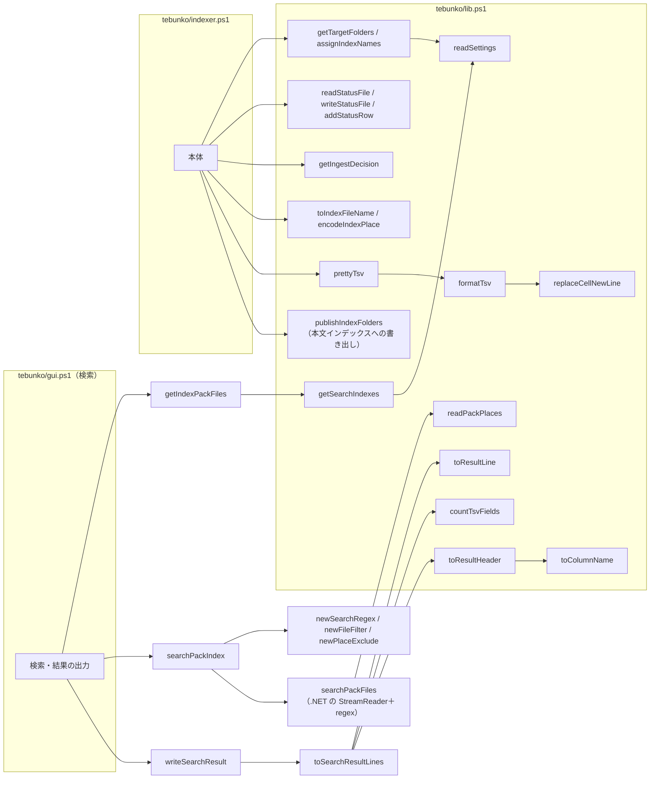
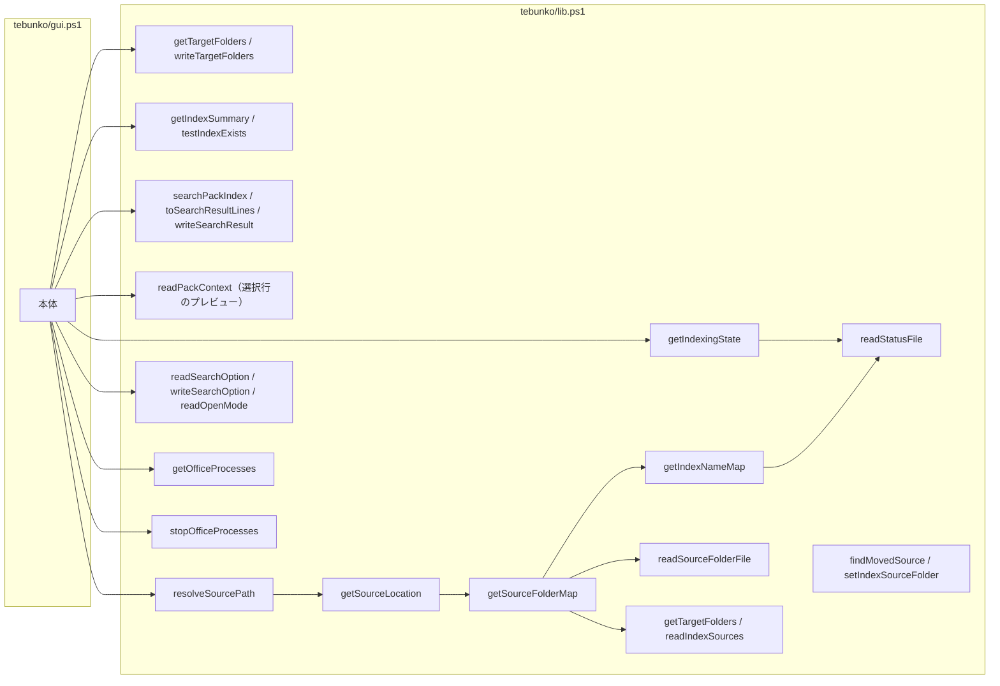

# 部品から関数一覧を引く

扱うこと: どの部品（ファイル）の関数がどのページに載っているかの索引、インデクサ・画面の本体がどの関数を使うかの全体図。扱わないこと: 関数それぞれの入力・出力・概要そのもの（[設定・ファイル](settings.md)・[インデックス作成](indexer.md)・[TSV と本文インデックス](tsv.md)・[検索・スレッド・元のファイル・画面](search.md)）。先に読むページ: [設計の概要](../index.md)。

関数は用途ごとに次の 4 つのページに分けて記載する。

- [部品ごとの関数（設定・ファイル）](settings.md)（設定ファイル・ワークスペース・ファイルとフォルダの操作）
- [部品ごとの関数（インデックス作成）](indexer.md)（取り込み一覧・状態ファイル・取り込み直すかの判断・インデックス名とインデックスの管理）
- [部品ごとの関数（TSV と本文インデックス）](tsv.md)（インデックスの TSV の名前・作成・配置、本文インデックスの形式・読み書き、テキストファイルの読み取り。`shared/core/fs.ps1`・`text.ps1`・`text_file.ps1`、`tebunko/index/`）
- [部品ごとの関数（検索・スレッド・元のファイル・画面）](search.md)（検索、スレッドとプール、検索結果から元のファイルを特定する処理、画面が使う集計・設定・Office プロセスの関数。`tebunko/search/`）

## lib.ps1 から読み込まれない部品

`lib.ps1` から読み込まれない部品の関数は、それぞれの設計書に記載する。

| ファイル | 主な関数 | 記載先 |
|---|---|---|
| `tebunko/ui/shell/nav_view.ps1`（判断層） | `getScreenOrder` / `isScreenName` / `getNextScreen` / `getShortcutAction` | [画面の実装構成](../gui/implementation.md#実装構成) |
| `tebunko/ui/shell/status_bar_view.ps1`（判断層） | `getIndexingStatusLine` | [画面の実装構成](../gui/implementation.md#実装構成) |
| `tebunko/ui/shell/nav.ps1` | `getCurrentScreen` / `selectScreen` / `invokeShortcutAction` | [画面の実装構成](../gui/implementation.md#実装構成) |
| `shared/office/office_embedded.ps1` | `readEmbeddedObjectLines`（埋め込んだ Office のファイルの文字）/ `readEmbeddedPackageLines` / `readXlsxCellLines` / `readXlsxSheetCellLines` / `readXlsxSharedStrings` / `newEmbeddedState` / `addEmbeddedOutputChars` | [Word の埋め込みの読み取り](../indexing/word.md#埋め込みの読み取りreadembeddedobjectlines)、[PowerPoint](../indexing/powerpoint.md) |
| `shared/office/office_reader.ps1` | `isZipFile` / `isCompoundFile` / `readZipEntryBytes` / `readDocxUnits` / `readDocxUnitsFromZip` / `readPptxUnits` / `readPptxUnitsFromZip` / `readXlsxObjectUnits`（ヘッダー・フッターは `readXlsxSheetHeaderFooter` / `readXlsxHeaderFooterLines` / `getHeaderFooterLines`） / `writeUnits` | [Word・PowerPoint の共通処理と Office アプリの管理](../indexing/office-apps.md#wordpowerpoint-のテキスト読み取りscriptssharedofficeoffice_readerps1)、[Excel](../indexing/excel.md)、[Word](../indexing/word.md)、[PowerPoint](../indexing/powerpoint.md) |
| `shared/office/office_protection_view.ps1`（判断層） | `getOfficeProtectionKind` / `getProtectionFailureText` / `testOfficeOutput` / `testWorkbookFormat` / `getWordOpenFormat` | [暗号化されたファイルの判定](../indexing/office-apps.md#暗号化されたファイルの判定office_protectionps1office_protection_viewps1) |
| `shared/office/office_protection.ps1` | `readFileHead` / `readCompoundEntryNames` / `getOfficeFileProtection` | [暗号化されたファイルの判定](../indexing/office-apps.md#暗号化されたファイルの判定office_protectionps1office_protection_viewps1) |
| `shared/office/office_app.ps1` | `getApp` / `getOwnSessionProcessIds` / `stopApp` / `stopAllApps` / `startWatchdog` / `stopWatchdog` | [Word・PowerPoint の共通処理と Office アプリの管理](../indexing/office-apps.md#office-アプリexcelwordpowerpointの管理) |
| `tebunko/indexer/indexer_plan.ps1` | `findTargetFiles` / `createTargetList` / `selectOnlyNames`（選んだインデックス名を、更新できるものとできないものに分ける） | [取り込み対象の決定](../indexing/target-decision.md#取り込み対象の決定createtargetlist)、[インデックス作成のメインフロー](../indexing/flow.md) |
| `tebunko/indexer/extract_office.ps1` | `ingestFile` / `extractWorkbook` / `extractDocument` | [Excel](../indexing/excel.md)、[Word・PowerPoint の共通処理と Office アプリの管理](../indexing/office-apps.md#wordpowerpoint-の抽出処理extractdocument) |
| `tebunko/indexer/extract_text.ps1` | `extractTextFile` | [テキストファイルの読み取り](../indexing/text.md#テキストファイルの抽出処理extracttextfile) |
| `tebunko/indexer/index_migrate.ps1` | `publishTsv` / `initTmpDir` / `newWorkerTmpDir` / `removeStaleTmpDirs` / `removeDroppedFolders` | [クロール対象フォルダと取り込み対象](../indexing/crawl.md)、[インデックスのファイルの形](../index-data/format.md#配置命名規則) |
| `tebunko/indexer/pending_publish.ps1` | `PendingPublish`（`Add` / `MarkFolder` / `AddPending` / `Dispatch` / `Skip` / `Complete` / `TakeFlushable` / `TakeAll`） | [入れ替えと書き出し](../index-data/publish.md)「本文インデックスへの書き出し」、[取り込みの並列化](../indexing/parallel.md) |
| `tebunko/indexer/indexing_reporter.ps1` | `IndexingReporter`（`Progress` / `WaitForApproval`） | [インデックス作成のメインフロー](../indexing/flow.md)、[取り込み対象の決定](../indexing/target-decision.md#取り込み予定画面の確認に出す件数) |
| `tebunko/indexer/indexer_run.ps1` | `invokeIndexer` / `invokeIndexerBody` / `getIngestWorkerCount` / `getIngestLaneCapacity` / `newIngestPool` / `addIngestTask` / `receiveIngestResult` / `stopIngestWorkers` / `runIngestWorker` / `invokeIngestTask` / `flushPending` | [インデックス作成のメインフロー](../indexing/flow.md)、[取り込みの並列化](../indexing/parallel.md) |
| `shared/ui/*`・`tebunko/ui/*` | 画面の部品（`showConfirm`・`selectFolder` など） | [画面の実装構成](../gui/implementation.md#実装構成) |

## インデクサ・画面（検索）が使う関数

インデクサ（`tebunko/indexer.ps1`）と、画面の検索（`tebunko/gui.ps1`）は次の関数を使う。

画面（`tebunko/gui.ps1`）は、ほかに次の関数を使う。

