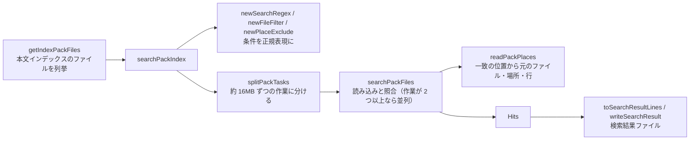

# 部品ごとの関数（検索・スレッド・元のファイル・画面）

扱うこと: 検索（`search_query.ps1`・`pack_search.ps1`・`search_run.ps1`）、スレッドとプール（`worker_pool.ps1`・`search_service.ps1`・`indexing_session.ps1`）、元のファイルの特定（`source_map.ps1`）、画面が使う集計・設定・Office プロセスの関数一覧。扱わないこと: TSV・本文インデックスそのものの関数（[部品ごとの関数（TSV と本文インデックス）](tsv.md)）。先に読むページ: [部品から関数一覧を引く](index.md)。

## 検索（`tebunko/search/search_query.ps1`・`pack_search.ps1`・`search_run.ps1`）

| 関数 | 入力 | 出力 | 概要 | 詳細 | 使用元 |
|---|---|---|---|---|---|
| `isValidRegex` | pattern | bool | 正規表現として正しいか | – | 検索・画面 |
| `newSearchRegex` | word, simpleMatch, caseSensitive | `@{Regex; SimpleMatch; TextRegex; ScanMode}` | 検索条件から照合用の正規表現を作る（文字どおりならエスケープ、大文字と小文字を区別しないなら IgnoreCase、正規表現として不正なら文字どおりにする）。1 行の照合は 5 秒で時間切れ。TextRegex は本文インデックスの全文にかける正規表現（Multiline）、ScanMode はそれを全文にかけてよいか（`getRegexScanMode`） | [検索](../search/index.md#検索条件サクラエディタの-grep-にならう) | 検索・画面（一致箇所の強調） |
| `getRegexScanMode` | pattern | string（`lines` / `filter` / `scan`） | 正規表現を全文にかけて、1 行ずつの照合と同じ結果になるかを判定する。`lines` は全文での一致の位置から行が分かる、`filter` は全文で一致しない本文インデックスのファイルを読み飛ばせる、`scan` は 1 行ずつ照合する。分からない書き方は安全側（`filter` か `scan`）に倒す | [検索を速くする仕組み](../search/speed.md) | newSearchRegex |
| `newFileFilter` | filter | `@{Include; Exclude}` | 対象ファイルの指定（`*.xlsx;見積;!*old*`）を、元のファイル名に対する正規表現にする（無い側は `$null`） | [検索](../search/index.md#検索条件サクラエディタの-grep-にならう) | `searchPackIndex` |
| `newPlaceExclude` | includeShapes, includeComments | regex / `$null` | 検索から外す図形・コメントの場所（名前の末尾 `[図形]` `[コメント]`）の正規表現。どちらも検索するなら `$null` | 同上 | `searchPackIndex` |
| `truncateHitLine` | line, matchIndex（既定 -1） | string | 長い行（テキストのヒットの行・プレビューの前後の行）を、一致の位置（`matchIndex`。分からなければ -1 で先頭から）から前後 `hitLineMaxChars`（1,000 文字）に切る。切った側に `…` を付ける。`hitLineMaxChars` 以下ならそのまま | [長い行を切る](../search/output.md#長い行を切る) | searchPackFiles, readPackContext |
| `getIndexPackFiles` | folders（既定 `$workspace.IndexDir`。フォルダの文字列、または `@{Root; RelPath; Recurse}`（画面のツリーで選んだ範囲。`Recurse` が `$false` なら直下だけ）の配列）, onProgress（フォルダを 1 つ数えるたびに `{ param($count) }` を呼ぶ） | `@{Folders; Packs}` | 検索対象の本文インデックスのファイルを列挙する（`getPackFiles`）。結果の相対パスは `Root` から求める。Folders はフォルダごとの `@{Path; Root; Exists; Count}`、Packs は `getPackFiles` の要素をつないだもの（フォルダの順・名前の順、重複なし） | [検索を速くする仕組み](../search/speed.md) | 検索・画面、getFastSearchPackFiles |
| `testIndexExists` | folders | bool | 本文インデックスのファイルが 1 件でもあるか（最初の 1 件で打ち切る） | – | 画面 |
| `getIndexSummary` | folders | `@{Count; LastWrite; Missing}` | 本文インデックスのファイルの件数・最新の更新日時・存在しないフォルダ | – | 画面 |
| `splitPackTasks` | packs, taskBytes（既定 16MB） | `@{Start; Count}` の並び | 本文インデックスのファイルの並びを、大きさの合計がおよそ taskBytes になるまでまとめて、1 つのスレッドに渡す作業に分ける | 同上 | searchPackIndex |
| `searchPackFiles` | packs, start, count, regex, max, textRegex, scanMode, cache, include, exclude, excludePlace | ヒットの一覧 | packs の start から count 件を読み、regex に一致する行を返す（1 行に複数一致しても 1 件）。`ScanMode` に応じて全文に 1 回照合し、一致しない本文インデックスのファイルは飛ばす。一致の位置から場所・行を求める（`readPackPlaces`）。元のファイルがテキストの拡張子（`getPackFileKind`）なら、ヒットの行を `truncateHitLine` で切る（Excel・Word・PowerPoint は切らない）。インデックス作成中の本文インデックスのファイルも読めるよう共有して開き、読めないものは飛ばす | 同上 | searchPackIndex（並列検索のスレッドでも動く） |
| `searchPackIndex` | word, packs, simpleMatch, limit, shouldStop, caseSensitive, fileFilter, workerCount（並列のスレッド数。0 は自動で最大 4）, cache（`newTsvTextCache`）, includeShapes, includeComments（図形・コメントの場所も検索するか。`newPlaceExclude`）, taskBytes, onProgress（`{ param($done, $total, $newHits) }`。done・total は本文インデックスのファイルの数）, pool（照合のプール `newPackWorkerPool`。`$null` なら並列にするときだけ作って最後に閉じる） | `@{Hits; SimpleMatch; Total; Truncated; Cancelled}` | 本文インデックスを検索する（照合は `searchPackFiles`＝.NET の `StreamReader`＋`[regex]`）。Hits は PSCustomObject（Root・RelPath（本文インデックスのファイル）・RelDir・FileName・Book・Location・LineNumber・Line）。Total は本文インデックスのファイルの数。作業（約 16MB）ごとに進捗を知らせ、上限・中止に対応する。作業が 2 つ以上なら複数スレッドで並行して検索する（結果の順は変わらない）。照合が時間切れになれば例外にする | [検索](../search/index.md) | 検索・画面 |
| `newTsvTextCache` | maxChars（既定 6,400 万文字） | `@{Texts; Chars; MaxChars; Generation}` | 検索で読んだ本文インデックスのファイルの内容と場所の一覧を次の検索・プレビューで使い回す入れ物（パス → 更新日時・サイズ・内容・場所の一覧・最後に使った世代）。更新日時・サイズが変わった本文インデックスのファイルは読み直す。追い出しは `trimTsvTextCache` | [検索を速くする仕組み](../search/speed.md) | 画面 |
| `newPackWorkerPool` | workers（既定 `getWorkerCount`） | `WorkerPool` | 本文インデックスの照合のプールを作る（各スレッドには照合に要る関数と値だけを読み込む。`searchPackFiles`・`readPackPlaces`・`convertPackMetaToPlace`・`decodePackValue`・`getPackFileKind`・`testTextExtension`・`truncateHitLine` と、`textExtensions`・`hitLineMaxChars`・`hitLineBeforeMatchChars` などの定数。優先度は Normal） | [プロセスとスレッド](../structure/threads.md#寿命) | 検索の司令（`SearchService`）、searchPackIndex |
| `trimTsvTextCache` | cache, keepRatio（既定 0.9） | 追い出した数 | 検索 1 回の後に呼ぶ。上限の keepRatio を超えていたら、今の世代で使わなかったものを古い世代から追い出し、世代を 1 つ進める | [閉じるときの順番と GC](../structure/closing.md#gc-とメモリ) | 検索の司令 |
| `newSearchRequest` | word, simpleMatch, folders, limit, option, useFast | 検索の要求（`[hashtable]::Synchronized`） | 検索 1 回分の要求を作る。画面が条件と `Stop`（取り消し）を書き、検索の司令がヒット（`Queue`）・進み具合・`Finished` を書く | [プロセスとスレッド](../structure/threads.md#寿命) | 画面 |
| `invokeSearchRequest` | request, pool, cache | – | 検索の要求を実行し、ヒットと進み具合を要求に少しずつ入れる。例外は投げずに `Error` に入れる。始める前に取り消されていたら何もせずに `Cancelled` にする | 同上 | 検索の司令 |
| `toResultLine` | book, location, lineNumber, line | string | `ファイル名<TAB>場所<TAB>種別<TAB>行番号<TAB>該当行` を返す（場所・種別は `describePlace` の表記）。Excel はセル内改行を LF に戻し、Word・PowerPoint は `"` で始まるセルを `"` で囲む。場所のタブ・改行（Excel のシート名に付けられる）はスペースにする | [検索結果ファイル](../search/output.md#1-行の組み立て) | 検索 |
| `toResultHeader` | columnCount | string | 見出し行 `ファイル名<TAB>場所<TAB>種別<TAB>行<TAB>A<TAB>B…` を返す | [検索結果ファイル](../search/output.md#出力フォーマットworksearch_resultstxt) | 検索 |
| `toSearchResultLines` | hits | `@{Header; Lines}` | 検索結果ファイルの見出し行と各行（相対フォルダ付き `toResultLine`、最大セル数の `toResultHeader`） | 同上 | 検索・画面 |
| `writeSearchResult` | writer, word, hits | – | 1 ワード分の `【検索文字列　X】 N 件`・見出し行・各行・空行を書き出す | 同上 | 検索・画面 |

## スレッドとプール（`shared/core/worker_pool.ps1`・`tebunko/search/search_service.ps1`・`tebunko/indexer/indexing_session.ps1`）

設計は [プロセスとスレッド](../structure/threads.md)。クラスは作ったランスペースのスレッドだけから呼ぶ（`SearchService`・`BackgroundQueue`・`IndexingSession` は画面のスレッドで作る。`WorkerPool` はプールを持つ側のスレッドで作る。`Workspace` は各スレッドで作り直す）（[クラスと関数の使い分け](../structure/classes.md)）。

| 関数・クラス | 入力 | 出力 | 概要 | 使用元 |
|---|---|---|---|---|
| `newWorkerState` | functions, variables | `InitialSessionState` | プールの各スレッドに読み込む関数・値だけを入れた状態を作る（lib.ps1 全体を読み込むと、スレッドを用意するだけで時間がかかるため） | newPackWorkerPool, writeSystemIndexFolders |
| `getWorkerCount` | max（既定 4）, processors | int | プールのスレッドの数の既定（コア数 − 1。1〜max） | 検索・インデックス作成 |
| `WorkerPool` | size, state, host, priority | – | ランスペースと PowerShell のインスタンスを使い回すプール。`Submit`（仕事を始める）・`Receive`（終わりを待って出力を返す）・`Cancel`・`Close`。`Priority` は仕事を始めるたびにスレッドに設定する。`Prelude` は各スレッドで最初の仕事の前に 1 回だけ実行する | 照合のプール・システムインデックスのプール・BackgroundQueue |
| `BackgroundQueue` | size, prelude, host | – | 画面から頼まれる短い仕事のスレッド（画面は 2 つで作る）。`Post`（仕事を始める）・`Poll`（終わった仕事の onDone を画面のスレッドで呼び、残りの数を返す）・`Close` | startJob（`shell.ps1`） |
| `newSearchService` / `SearchService` | libPath, cache, workers | `SearchService` | 検索の司令のスレッド（画面を開いている間 1 つ）。`Request`（前の要求を取り消して新しい要求を渡す。スレッドが止まっていれば作り直す）・`Cancel`・`IsRunning`・`GetFailure`・`Close`（5 秒待って止まらなければスレッドを止める） | 画面 |
| `newIndexingSession` / `IndexingSession` | indexerPath, channel | `IndexingSession` | インデックス作成 1 回分のスレッド（MTA・BelowNormal）を作り、`indexer.ps1 -Channel <channel>` を実行する。`IsRunning`・`Stop`・`Wait`・`GetExitCode`（終了コードが無ければ 1）・`GetError`・`GetNotice`（終わりの案内。無ければ空）・`GetPostponed`（後回しにした件数。無ければ 0）・`KillOffice`（`OfficePids` に記録した Office だけを、プロセス名を確かめて止める）・`Close` | 画面 |

### 元のファイルの特定・画面

## 元のファイルの特定（`tebunko/search/source_map.ps1`）

| 関数 | 入力 | 出力 | 概要 | 詳細 | 使用元 |
|---|---|---|---|---|---|
| `writeSourceFolderFile` | folders（`@{Path; Name}` の配列）, dir（既定 `$workspace.IndexDir`） | – | 各インデックスのフォルダ（`dir\<インデックス名>`）に元のフォルダの記録（`インデックス名<TAB>クロール対象フォルダ`）を書き出す | [取り込み一覧](../indexing/ingest-list.md) | インデックス作成 |
| `readSourceFolderFile` | dir | Dictionary（インデックス名 → フォルダパス） | `dir` 直下の元のフォルダの記録を読む。無ければ空（`dir` の下は探さない。インデックスのフォルダの下は元のファイル 1 つにつき 1 フォルダになるため） | 同上 | getSourceFolderMap |
| `getSourceFolderMap` | dir, statusPath（既定 `$workspace.StatusFile`）, settingsPath（既定 `$settingsFile`） | Dictionary（インデックス名 → 元のフォルダ） | インデックス名に対する元のフォルダ。`dir` 直下の元のフォルダの記録 → （既定のインデックスなら）取り込み一覧 → **設定（`targetFolders` / `indexSources`）** の順に上書きするため、設定の「今の置き場所」が最も優先される | [元のファイルを開く](../gui/open-file.md#元のフォルダの特定インデックスを別の-pc場所で使う場合) | getSourceLocation |
| `getSourceLocation` | hit, maps（フォルダ → 対応 のキャッシュ） | `@{Name; Folder; Rest; Known}` | 検索結果のインデックス名・元のフォルダ・その下の相対フォルダ。検索対象フォルダの対応 → その下の `<インデックス名>` のフォルダのもの → 検索対象フォルダ自身・その親のもの（インデックス名のフォルダを直接指定した場合）の順に使う。分からなければ Known = `$false`・Folder = 空（Name は返すため、フォルダを選んでもらえば設定に記録できる） | 同上 | resolveSourcePath, 画面 |
| `joinSourcePath` | folder, rest, name | string | フォルダ・相対フォルダ・ファイル名をつなぐ（ドライブ直下でも `\` を重ねない） | – | 画面 |
| `findMovedSource` | picked, rest, book | `@{Path; Root}` / `$null` | 選んだフォルダの中から元のファイルを探す。選んだフォルダを元のフォルダ、その下のフォルダ…の順に当てはめて試し、見つかったファイルと、元のフォルダに当たるフォルダ（Root）を返す | [元のファイルを開く](../gui/open-file.md#元のファイルが見つからないとき元のフォルダを設定する) | 画面 |
| `resolveSourcePath` | hit, maps | string / `$null` | 検索結果の元のファイルのパス（ファイルがあるかは確かめない）。元のフォルダが分からなければ `$null` | [元のファイルを開く](../gui/open-file.md#元のフォルダの特定インデックスを別の-pc場所で使う場合) | 画面 |

## 画面が使う集計・設定・Office プロセス

| 関数 | 入力 | 出力 | 概要 | 詳細 | 使用元 |
|---|---|---|---|---|---|
| `readSearchOption` / `writeSearchOption` | path（既定 `$settingsFile`） / option（`@{UseRegex; CaseSensitive; FileFilter; IncludeShapes; IncludeComments}` のうち変える項目）, path | `@{UseRegex; CaseSensitive; FileFilter; IncludeShapes; IncludeComments}` / – | 画面の検索条件（`setting.config` の `useRegex` / `caseSensitive` / `fileFilter` / `includeShapes` / `includeComments`。無ければオフ・空、図形とコメントはオン）。保存は option にある項目だけを変える | [設定ファイル（setting.config）](../structure/settings-file.md) | 画面 |
| `getIndexingState` | since, path | `@{Exists; Folders; Total; Pending; Failed; Done; IngestedSince; Updated; FailedRows; IndexStats}` | 取り込み一覧の状態ごとの件数、since 以降に取り込んだ件数、失敗したファイルの行（FailedRows。取り込み日時の新しい順）、インデックス名ごとの集計（IndexStats。`getIndexStats`。取り込み一覧を読み直さずに済むよう同じ読み込みから作る） | [状態と操作の流れ](../gui/state-flow.md) | 画面 |
| `getOfficeProcesses` | – | プロセス情報の配列 | 実行中の Excel・Word・PowerPoint（Id・ProcessName・AppName・Background・StartTime・MemoryMB・Title）。`MainWindowHandle` が 0 ならバックグラウンド | [［9 プロセス停止］タブ](../gui/process-tab.md) | 画面 |
| `stopOfficeProcesses` | ids | `@{Id; Stopped; Message}` の配列 | `Stop-Process -Force` で終了し、成否と理由を返す | 同上 | 画面 |
