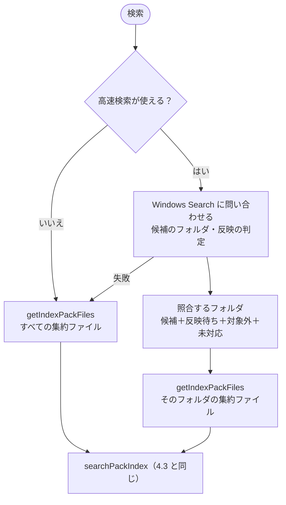

# 高速検索（Windows Search）

インデックスが大きいと、すべての集約ファイルを読んで照合するのに時間がかかる（1GB で初回 38 秒・2 回目以降 16〜18 秒。[検索の実装（速度）](index.md#検索の実装速度)）。そこで、Windows Search に「検索語を含みうるフォルダ」を先に絞らせ、その中の集約ファイルだけを [検索の実装（速度）](index.md#検索の実装速度) の方式で照合する（`tebunko/search/fast_search.ps1` の `getFastSearchPackFiles`）。照合と結果の組み立ては [検索の実装（速度）](index.md#検索の実装速度) と同じため、**結果（行・行番号・順番・上限で切る位置）は、すべての集約ファイルを照合したときと同じ**になる。

**システムインデックス**: インデックス作成が、`work/index` の中のフォルダごとに、直下の集約ファイルの中身（メタ情報の行を除く）から、文字の 2-gram を英数字の語にした txt を `work/system_index` の同じ相対パスに作る（[システムインデックス（system_index）](../indexer/index-format.md#システムインデックスsystem_index) [システムインデックス（system_index）](../indexer/index-format.md#システムインデックスsystem_index)）。Windows Search は語単位でしか一致を取らないため、本文をそのまま索引させると語の途中からの一致（`ニター` など）を落とす。2-gram の語なら、ワードを含む本文の txt には、ワードのすべての 2-gram が必ず入っている。

| 項目 | 仕様 |
|---|---|
| 使える条件（画面の「高速検索：使用可」） | Windows Search を開けて `work/system_index` が索引の対象であり、［正規表現を使う］がオフで、ワードに 2 文字以上の部分がある（`testFastSearchUsable`・`getFastSearchView`）。使えないときは [検索の実装（速度）](index.md#検索の実装速度) のとおりすべてを照合する |
| 語の作り方 | ワードを空白で区切り、2 文字以上の部分の隣り合う 2 文字を小文字にし、UTF-16LE の 4 バイトを 16 進にした語（`x` ＋ 8 桁）にする（`getSearchGrams`）。最大 16 個（多いときは均等に間引く。間引いても候補が増えるだけ） |
| 候補 | `CONTAINS(System.Search.Contents, '"x…" AND "x…"')` で、検索対象のフォルダの中の txt を探す。語の範囲で分けた txt（`システムインデックス_1.txt` …）は語ごとに問い合わせ、すべての語がどれかで見つかったフォルダを候補にする |
| 反映の判定 | txt が Windows Search に反映済み ⇔ `System.Search.GatherTime` が空でない（本文を読み終えた）かつ `System.DateModified` が txt の更新日時（UTC）を秒で切り捨てた値と同じ（Windows Search は秒未満を切り捨てて持つ。`testSystemIndexReflected`） |
| 照合するフォルダ | 候補、反映されていないフォルダ（状態ファイルの「反映待ち」）、対象外のフォルダ、対応済みでないインデックスの全体。これらのフォルダの集約ファイルを `getIndexPackFiles` で集め、`searchPackIndex` で照合する |
| すべてを照合する場合 | 使える条件を満たさない、状態ファイルを読めない、Windows Search への問い合わせに失敗した（時間切れ 10 秒を含む）、インデックス全体（ツリーの一番上より上）・別の場所のインデックス・無いフォルダを検索対象にした |
| 状態の整理 | 反映済みになった「反映待ち」の行は、検索のたびに状態ファイルから消す（書けなければ次の機会に回す） |

**`work/index` を Windows Search の対象から外す（推奨）**: 集約ファイル（`.tsv`）も索引の対象になっていると、Windows Search はその処理に時間を取られ、システムインデックスが索引されるまで（高速検索が効くまで）1 日以上かかることがある。外しても検索の結果は変わらない（集約ファイルは [検索の実装（速度）](index.md#検索の実装速度) の方式で読む）。ツールは Windows Search の設定を変えないため、利用者が［インデックスのオプション］で `work/index` を外す（README の「高速検索」）。

実測（合成データ: ブック 5.4 万・TSV 16 万・1GB、物理メモリ 8GB の PC。結果はすべて一致。集約ファイルにする前の版で、TSV を照合したとき。集約ファイルでは、すべてを照合しても初回 38 秒（[検索の実装（速度）](index.md#検索の実装速度)））:

| 検索 | すべてを照合 | 高速検索 |
|---|---|---|
| 0 件 | 650 秒 | 0.49 秒 |
| まれな語（3 件） | 602 秒 | 29.9 秒 |

よく出る語はほとんどのフォルダが候補になるため、速くならない（上限の 1 万件で打ち切るのは [検索の実装（速度）](index.md#検索の実装速度) と同じ）。
