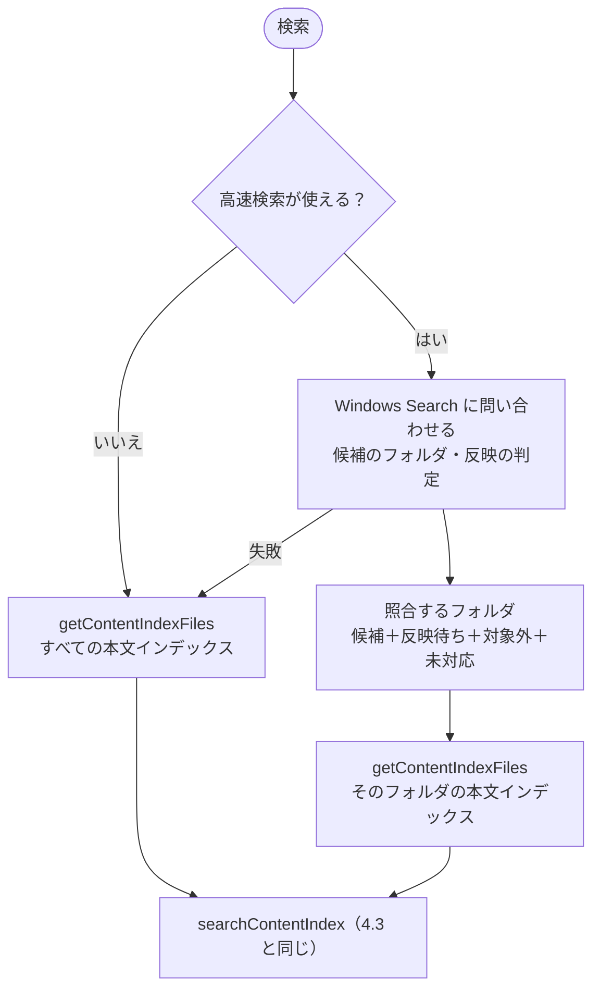

# 高速検索（Windows Search）

扱うこと: Windows Search に検索語を含みうるフォルダを先に絞らせる仕組み、システムインデックス（2-gram）の使い道、使える条件と使えないときの扱い、実測。扱わないこと: 本文インデックスそのものの照合の速さ（[検索を速くする仕組み](speed.md)）、システムインデックスの作り方（[システムインデックス](../index-data/system-index.md)）。先に読むページ: [検索](index.md)、[検索を速くする仕組み](speed.md)。

インデックスが大きいと、すべての本文インデックスを読んで照合するのに時間がかかる（1GB で初回 38 秒・2 回目以降 16〜18 秒。[検索を速くする仕組み](speed.md)）。そこで、Windows Search に「検索語を含みうるフォルダ」を先に絞らせ、その中の本文インデックスだけを [検索を速くする仕組み](speed.md) の方式で照合する（`tebunko/search/fast_search.ps1` の `getFastSearchContentIndexFiles`）。照合と結果の組み立ては [検索を速くする仕組み](speed.md) と同じため、**結果（行・行番号・順番・上限で切る位置）は、すべての本文インデックスを照合したときと同じ**になる。

**システムインデックス**: インデックス作成が、`work/content_index` の中のフォルダごとに、直下の本文インデックスの中身（メタ情報の行を除く）から、文字の 2-gram を英数字の語にした txt を `work/system_index` の同じ相対パスに作る（[システムインデックス](../index-data/system-index.md)）。Windows Search は語単位でしか一致を取らないため、本文をそのまま索引させると語の途中からの一致（`ニター` など）を落とす。2-gram の語なら、ワードを含む本文の txt には、ワードのすべての 2-gram が必ず入っている。

| 項目 | 仕様 |
|---|---|
| 使える条件（画面の「高速検索：使用可」） | Windows Search を開けて `work/system_index` が索引の対象であり、［正規表現を使う］がオフで、ワードに 2 文字以上の部分がある（`testFastSearchUsable`・`getFastSearchView`）。使えないときは [検索を速くする仕組み](speed.md) のとおりすべてを照合する |
| インデックスごとの反映の進み具合 | ［インデックス管理］の一覧の「高速検索」列で、インデックスごとに Windows Search への反映がどこまで進んだかを確かめられる（`確認中…` / `－` / `不可` / `反映待ち` / `反映中 N%` / `可`。[一覧の列](../gui/index-tab.md#一覧の列)）。`不可` のときは、接続できない・ワークスペースが索引の対象外・そのインデックスに高速検索用のデータが無い、のいずれかで、理由をツールヒントに出す（`getFastSearchRowView`） |
| 語の作り方 | ワードを空白で区切り、2 文字以上の部分の隣り合う 2 文字を小文字にし、UTF-16LE の 4 バイトを 16 進にした語（`x` ＋ 8 桁）にする（`getSearchGrams`）。最大 16 個（多いときは均等に間引く。間引いても候補が増えるだけ） |
| 候補 | `CONTAINS(System.Search.Contents, '"x…" AND "x…"')` で、検索対象のフォルダの中の txt を探す。語の範囲で分けた txt（`system_index_1.txt` …）は語ごとに問い合わせ、すべての語がどれかで見つかったフォルダを候補にする |
| 反映の判定 | txt が Windows Search に反映済み ⇔ `System.Search.GatherTime` が空でない（本文を読み終えた）かつ `System.DateModified` が txt の更新日時（UTC）を秒で切り捨てた値と同じ（Windows Search は秒未満を切り捨てて持つ。`testSystemIndexReflected`） |
| 照合するフォルダ | 候補、反映されていないフォルダ（状態ファイルの「反映待ち」）、対象外のフォルダ、対応済みでないインデックスの全体。これらのフォルダの本文インデックスを `getContentIndexFiles` で集め、`searchContentIndex` で照合する |
| すべてを照合する場合 | 使える条件を満たさない、状態ファイルを読めない、Windows Search への問い合わせに失敗した（時間切れ 10 秒を含む）、インデックス全体（ツリーの一番上より上）・別の場所のインデックス・無いフォルダを検索対象にした |
| 状態の整理 | 反映済みになった「反映待ち」の行は、検索のたびに状態ファイルから消す（書けなければ次の機会に回す） |

```mermaid
flowchart TD
    S(["検索"]) --> U{"高速検索が使える？"}
    U -- いいえ --> ALL["getContentIndexFiles<br>すべての本文インデックス"]
    U -- はい --> Q["Windows Search に問い合わせる<br>候補のフォルダ・反映の判定"]
    Q -- 失敗 --> ALL
    Q --> T["照合するフォルダ<br>候補＋反映待ち＋対象外＋未対応"]
    T --> F["getContentIndexFiles<br>そのフォルダの本文インデックス"]
    ALL --> R["searchContentIndex（4.3 と同じ）"]
    F --> R
```

**`work/content_index` を Windows Search の対象から外す（自動）**: 本文インデックス（`.tsv`）も索引の対象になっていると、Windows Search はその処理に時間を取られ、システムインデックスが索引されるまで（高速検索が効くまで）1 日以上かかることがある。外しても検索の結果は変わらない（本文インデックスは [検索を速くする仕組み](speed.md) の方式で読む）。ツールは Windows Search の設定そのものは変えないが、`content_index` に入れたフォルダ・ファイルに「内容のインデックスを作成しない」属性（`NotContentIndexed`）を自分で付け、管理者の権限なしに索引の対象から外す（[入出力先とワークスペース](../index-data/publish.md)）。管理者の権限が要る方法（検索の設定の API・グループポリシー）は採らない。属性で外れない環境（ワークスペースが FAT のドライブなど）では、利用者が［インデックスのオプション］で手で外す（README の「高速検索」）。

実測（合成データ: ブック 5.4 万・TSV 16 万・1GB、物理メモリ 8GB の PC。結果はすべて一致。場所ごとの TSV を照合する方式で測ったとき。本文インデックスでは、すべてを照合しても初回 38 秒（[検索を速くする仕組み](speed.md)））:

| 検索 | すべてを照合 | 高速検索 |
|---|---|---|
| 0 件 | 650 秒 | 0.49 秒 |
| まれな語（3 件） | 602 秒 | 29.9 秒 |

よく出る語はほとんどのフォルダが候補になるため、速くならない（上限の 1 万件で打ち切るのは [検索を速くする仕組み](speed.md) と同じ）。
