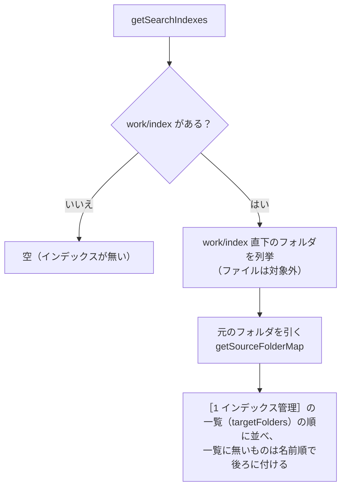
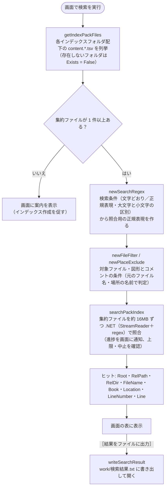

# 検索

| 項目 | 内容 |
|---|---|
| 画面 | ［2 検索］タブ（[［2 検索］タブ](../gui/search-tab.md)） |
| スクリプト | `scripts/tebunko/search/search_query.ps1`（検索条件）・`pack_search.ps1`（集約ファイルの列挙と検索）・`search_run.ps1`（結果の組み立て）。`scripts/tebunko/lib.ps1` から読み込み、画面 `scripts/tebunko/gui.ps1` から呼ぶ |
| 使用する共通関数 | `getFastSearchPackFiles`（高速検索。[高速検索（Windows Search）](fast-search.md)）/ `getIndexPackFiles` / `getSearchIndexes` / `searchPackIndex` / `writeSearchResult`（→ `toSearchResultLines` → `toResultLine` / `toResultHeader`）（[共通モジュール](../architecture/modules.md)） |

全体構成・動作環境・フォルダ構成は [設計の概要](../index.md) を参照。インデックス（集約ファイル）の作り方は [インデックス作成（インデクサ）](../indexer/index.md) を参照。画面の操作・表示は [［2 検索］タブ](../gui/search-tab.md) を参照。

## 概要

画面の［2 検索］タブで入力したワードで、`work/index/` 配下のうち、画面の検索対象のツリーでチェックしたインデックス・フォルダの集約ファイル（[配置・命名規則](../indexer/index-format.md#配置命名規則)）を検索する処理と、［結果をファイルに出力］で書き出す `work/検索結果.txt` の形式を定める。

## 入出力

| 区分 | パス | 内容 |
|---|---|---|
| 入力 | 画面で入力したワード | 1 回の検索で 1 ワード |
| 入力 | `setting.config` の `searchExcludes` | 画面の検索対象のツリーでチェックを外したフォルダ（[インデックスの一覧](#インデックスの一覧getsearchindexes)、省略可） |
| 入力 | `work/index/**/content.*.tsv` | インデックス作成で書き出した集約ファイル（フォルダ・元のファイルの拡張子ごとに 1 つ） |
| 入力 | `work/system_index/**/システムインデックス*.txt`・`work/システムインデックスの状態.tsv` | 高速検索に使う システムインデックスとその状態（[高速検索（Windows Search）](fast-search.md)。Windows Search に問い合わせる） |
| 出力 | `work/検索結果.txt` | 画面の［結果をファイルに出力］で書き出す検索結果（[検索結果ファイル](output.md)）。出力ごとに上書き |

## インデックスの一覧（`getSearchIndexes`）

検索対象は `work/index` に固定し、その直下のフォルダ 1 つをインデックス 1 つとして扱う。設定で場所を指定することはしない（［1 インデックス管理］で作ったインデックスは、すべてこの一覧に並ぶ）。

- 1 件を `@{ Name（インデックス名）; Path（インデックスのフォルダ）; SourcePath（元のフォルダ。分からなければ空） }` で返す。
- 別の場所・PC で作ったインデックスは、そのフォルダを `work/index` 直下に置けば一覧に並ぶ（[処理の流れと取り込み一覧](../indexer/flow.md)）。
- `work/index` が無ければ空を返す。`setting.config` は作成しない。
- 画面では、インデックス 1 件を一番上にしたツリーで、検索するインデックス・フォルダを選ぶ（[［2 検索］タブ](../gui/search-tab.md) [検索対象のツリー（No.13）](../gui/search-tab.md#検索対象のツリーno13)）。選んだ範囲は `getIndexPackFiles` に `@{ Root（インデックスのフォルダ `work/index`）; RelPath（`<インデックス名>` またはその下のフォルダ）; Recurse }` の配列で渡す。`Recurse` が `$false` なら、そのフォルダ直下の集約ファイルだけを列挙する。結果の相対パス（`RelPath`・`RelDir`）は `Root` から求めるため、フォルダを絞っても結果の形は変わらない。
- チェックを外したフォルダは `searchExcludes`（`@{ path（フルパス）; subfolders（$false は直下のファイルだけ） }` の配列）に保存する（`readSearchExcludes` / `writeSearchExcludes`）。無ければすべてを検索する。

- 集約ファイルはフルパスをキーにまとめるため、入れ子のフォルダを指定しても同じ集約ファイルを二重に検索しない。
- 検索は画面の別スレッドで行い、1 つの作業（集約ファイル約 16MB 分。[検索の実装（速度）](#検索の実装速度)）を照合するたびに進捗を通知する。画面の中止ボタン（`shouldStop`）で中止でき、件数の上限（`limit`）に達したら打ち切る（上限・表示は [［2 検索］タブ](../gui/search-tab.md)）。

## 検索仕様

| 項目 | 仕様 |
|---|---|
| 検索対象 | 各インデックスフォルダ配下（再帰）のうち、画面のツリーでチェックしたフォルダの集約ファイル `content.*.tsv`（[インデックスの一覧](#インデックスの一覧getsearchindexes)）。フォルダの順、フォルダの中は集約ファイルの名前（拡張子・番号）の順、集約ファイルの中は入れた順に検索する |
| 対象ファイル | 画面の「対象ファイル」（`setting.config` の `fileFilter`）を指定すると、**元のファイル名**（[ファイル名・場所の求め方](output.md#ファイル名場所の求め方readpackplaces) の Book。集約ファイルの `ファイル名=` の値）が一致する元のファイルだけを検索する（[検索条件（サクラエディタの Grep にならう）](#検索条件サクラエディタの-grep-にならう)）。空ならすべて |
| 図形・コメント | 既定は検索する。画面の［図形も検索］［コメントも検索］（`setting.config` の `includeShapes` / `includeComments`）をオフにすると、場所が `<元の場所>[図形]` / `<元の場所>[コメント]`（集約ファイルのメタ情報 `対象=図形` / `対象=コメント`）の中を検索しない（`newPlaceExclude`。Excel・Word・PowerPoint で共通の決まり。[インデックスの形式](../indexer/index-format.md) [配置・命名規則](../indexer/index-format.md#配置命名規則)「図形・コメントの場所」） |
| 長いパス | 列挙と検索（.NET の `DirectoryInfo`・`StreamReader`）には `\\?\` を付けたパスを渡す（`toLongPath`）。付けないと、約 248 文字を超えるフォルダの中を列挙できず、260 文字を超える集約ファイルを読めない。結果の相対パスは `\\?\` の無い形で扱う（[長いパス（260 文字超）の扱い](../indexer/index-format.md#長いパス260-文字超の扱い)） |
| 読み込み文字コード | UTF-16LE（BOM があれば BOM に従う） |
| 読めない集約ファイル | 列挙した後に読めなくなった集約ファイル（インデックス作成中に削除された等）は飛ばして、検索を続ける。読み込み中の集約ファイルは、インデクサの置き換え・削除を妨げないよう共有モードで開く |
| 検索単位 | 集約ファイルの中身の 1 行（= 元の TSV の 1 行 = Excel の 1 行）。1 行に複数ヒットしても 1 件。メタ情報の行（先頭が RS）は検索しない。行番号は場所ごとに数え、Excel では場所のメタ情報の後の N 行目がシートの N 行目になる。行の区切りは LF（集約ファイルを書くときに CRLF・CR を LF にそろえる） |
| 数値のセル | Excel の数値は、シートで**表示されている形**でインデックスに入る。表示形式が「標準」の 12 桁以上の数値は指数表記（`4.90123E+12`）、「#,##0」のセルは桁区切り付き（`1,234,568`）のため、元の番号（`4901234567894`・`1234568`）では見つからない（[Excel の抽出処理](../indexer/excel.md#excel-の抽出処理extractworkbook)） |
| セル内改行 | インデックスでは U+2028 になっているため、正規表現の `.` や `\s` にマッチする（例: `1行目.2行目`）。改行をはさんだ文字列をそのまま連結したワード（`1行目2行目`）はヒットしない |
| マッチ方式 | 画面の［正規表現を使う］がオフなら文字どおり、オンなら正規表現として検索する。どちらも `newSearchRegex` で 1 つの正規表現にして照合し、画面の一致箇所の強調にも同じ正規表現を使う（[検索条件（サクラエディタの Grep にならう）](#検索条件サクラエディタの-grep-にならう)） |
| 大文字と小文字 | 既定は区別しない。画面の［大文字と小文字を区別］がオンなら区別する（全角の英字も同じ） |
| 不正な正規表現 | ［正規表現を使う］がオンでも、正規表現として不正なワード（`(` 単独など）は文字どおりの検索に切り替える（`searchPackIndex` の戻り値 `SimpleMatch` が `$true` になる） |
| 照合の時間切れ | 1 行の照合に 5 秒を超えた（正規表現によっては終わらなくなる）場合は、`正規表現の照合に時間がかかりすぎるため、検索を中止しました。正規表現を見直してください。` として検索を止める。集約ファイルの全文への照合が時間切れになったときは、その集約ファイルを 1 行ずつ照合し直す（[検索の実装（速度）](#検索の実装速度)） |
| 複数フォルダ | 全フォルダの集約ファイルをまとめて検索する |

## 検索条件（サクラエディタの Grep にならう）

条件の考え方はサクラエディタの Grep（「英大文字と小文字を区別する」「正規表現」「ファイル」）にならう。インデックスは Office ファイルから作った集約ファイルなので、「ファイル」は集約ファイルの名前ではなく**元のファイル名**で判定する。

| 条件 | 実装（`newSearchRegex` / `newFileFilter`） | 例 |
|---|---|---|
| 文字どおり（既定） | ワードを `[regex]::Escape` して照合する | `(株)` は「(株)」だけに一致 |
| 正規表現 | ワードをそのまま正規表現として照合する | `見積.*確定` |
| 大文字と小文字を区別 | オフのときは `RegexOptions.IgnoreCase` を付ける。`CultureInvariant` も付ける（区別しないときの照合が 2 倍程度速くなる。日本語の照合結果は変わらない） | オンなら `ID` は `id` `Id` に一致しない |
| 対象ファイル | `;`（全角の `；` も可）で区切ったワイルドカード。`!`（全角の `！` も可）で始まるものは除外。`*` は任意の文字列、`?` は任意の 1 文字。`*` も `?` も無いものは部分一致。大文字と小文字は区別しない | `*.xlsx;見積;!*old*` は、.xlsx か名前に「見積」を含むファイルのうち、「old」を含まないもの |

## 検索の実装（速度）

集約ファイル（[配置・命名規則](../indexer/index-format.md#配置命名規則)）の読み込みと照合、結果 1 件の作成は PowerShell から .NET を直接呼ぶ（`tebunko/search/pack_search.ps1` の `searchPackIndex`／`searchPackFiles`。`FileStream`＋`StreamReader`＋`[regex]`。`Select-String` で 1 件ずつ結果を作ると件数が多いときに遅いため）。資産管理・EDR に注目されやすい実行時コンパイル（`Add-Type`／csc.exe）は使わない（[画面の実装](../gui/implementation.md#実行時コンパイルcscexeを使わない)。実測: 50 万行で約 0.6 秒）。

1 行ずつ PowerShell で照合すると、行数に比例して時間がかかる（1 行あたり十数マイクロ秒）。このため集約ファイルを丸ごと読み（改行は書くときに LF にそろえてある）、正規表現を全文に 1 回かける（.NET の中で走る）。**全文で一致しない集約ファイルは、そのまま飛ばす。** 一致したときだけ、メタ情報の行から場所ごとの範囲（元のファイル名・場所の名前・中身の先頭と終わりの位置）の一覧を作り（`readPackPlaces`）、一致の位置から元のファイル・場所・行番号を求める（[ファイル名・場所の求め方](output.md#ファイル名場所の求め方readpackplaces)）。全文にかけてよいかは `getRegexScanMode` が正規表現の書き方から判定する。

| 判定 | 正規表現の例 | 照合のしかた |
|---|---|---|
| `lines` | 文字どおりのワード、`見積.*確定`、`^顧客`、`\d+-\w+` | 一致は必ず 1 行に収まるため、全文での一致の位置から行を切り出す（1 行ずつの照合はしない）。メタ情報の行の中の一致は捨てる |
| `filter` | `見積\s確定`、`[^,]+`、`a(?=b)`（改行に一致しうる・行の外を見る） | 全文で一致しない集約ファイルは読み飛ばし、一致したものだけ場所ごとに 1 行ずつ照合する |
| `scan` | `\Aabc`、`a(?!b)`、`(?i)abc`（全文では 1 行と結果が変わりうる） | 場所ごとに 1 行ずつ照合する |

- `^` `$` は全文用の正規表現に `Multiline` を付けて行の先頭・末尾に一致させる。判定は安全側に倒し、どの照合でも検索結果（行・行番号）は、元の TSV を 1 行ずつ照合したときと同じになる（`pack_search.Tests.ps1` で改行の種類・照合のしかたごとに突き合わせている）。
- 全文への照合が時間切れになった集約ファイルは、1 行ずつ照合し直す。
- 対象ファイル（`newFileFilter`）・図形とコメント（`newPlaceExclude`）の条件は、場所ごとに元のファイル名・場所の名前で判定し、当てはまらない場所の一致は結果に入れない（1 行ずつ照合するときは、その場所を照合しない）。

さらに、次の 4 つで待ち時間を減らしている。

| しくみ | 内容 |
|---|---|
| 並列検索 | 集約ファイルを、大きさの合計がおよそ 16MB になるまでまとめて 1 つの作業にし（`splitPackTasks`）、作業が 2 つ以上なら照合のプール（`WorkerPool`。コア数 − 1、1〜4）で並行して照合する。各スレッドには照合に要る関数（`searchPackFiles`・`readPackPlaces` など）と値だけを読み込む。結果は作業の順に取り込み、上限・中止・進み具合（1 つの作業を照合するたびに通知。件数は集約ファイルの数）の扱いは 1 スレッドのときと同じ |
| スレッドの使い回し | 画面は、検索の司令のスレッド（`SearchService`）を画面を開いている間 1 つだけ動かす。lib.ps1 の読み込みと照合のプールの用意（`newPackWorkerPool`）は、司令のスレッドを始めたときに 1 回だけ行い、検索のたびに行わない。検索 1 回は要求（`newSearchRequest`）として渡し、`invokeSearchRequest` が実行する。新しい要求を渡すと、前の要求の `Stop` を立てて取り消す（[寿命](../architecture/threads.md#寿命)） |
| 列挙 | 集約ファイルの列挙（`getIndexPackFiles` → `getPackFiles`）は、.NET（`DirectoryInfo.GetFiles`）で `content.*.tsv` を 1 回で集め、更新日時・サイズも列挙のときに得る |
| 読んだ内容の使い回し | 画面は `newTsvTextCache` を 1 つ持ち、検索で読んだ集約ファイルの内容と場所の一覧を残す（上限 6,400 万文字＝約 128MB）。次の検索では、更新日時・サイズが列挙したときと同じ集約ファイルはファイルを開かない。書き直した集約ファイルは更新日時・サイズが変わるため読み直す。選択行のプレビュー（`readPackContext`）も同じ内容を使う。検索 1 回が終わるたびに、上限の 9 割を超えていれば、その検索で使わなかった内容を古いものから追い出す（`trimTsvTextCache`。[GC とメモリ](../architecture/threads.md#gc-とメモリ)） |

**集約ファイルにする理由**: 検索の時間は、読むファイルの数でほぼ決まる。Microsoft Defender は、ファイルを初めて開くたびに検査し（実測で 1 ファイル約 11 ミリ秒）、検査済みとして覚えておけるのはおよそ 2 万ファイルまで。元のファイルの場所ごとの TSV を読んでいた前の版では、TSV が数万件になると初回の検索に数分〜10 分以上かかった。

実測（Windows PowerShell 5.1、4 コア・物理メモリ 8GB、Microsoft Defender は有効。画面と同じく、列挙から検索の終わりまで）:

| インデックス | 検索 | TSV（前の版） | 集約ファイル |
|---|---|---|---|
| 7,000 ファイル規模（TSV 6,412 件 → 集約ファイル 20 件・46MB） | 初回 | 30.0 秒 | 2.1 秒 |
| 同上 | 2 回目以降 | 1.3 秒 | 0.29 秒 |
| TSV 16 万件・1GB（→ 集約ファイル 502 件・1.1GB） | 初回 | 10 分超 | 38 秒 |
| 同上 | 2 回目以降 | – | 16〜18 秒 |

- 1GB の 2 回目以降は、読んだ内容の使い回しの上限（約 128MB）を超え、物理メモリ 8GB では OS のファイルキャッシュにも収まりきらないため、ディスクの読み込みの速さで決まる。
- 同じ形のデータを使った pack の作成・検索の速さとリソースの推移は、GitHub Actions の `perf.yml`（手動で起動）でも測れる。計測スクリプトは `tools/measure_perf.ps1`（[テスト](../testing/index.md) の「CI」）。

## 実装上の注意点・既知の問題

確度: ◎ = 動作確認済み、○ = コード上明らか、△ = 推定。

| # | 内容 | 確度 |
|---|---|---|
| 1 | 高速検索を使えないとき（[高速検索（Windows Search）](fast-search.md)）は、検索のたびにすべての集約ファイルを照合するため、インデックス量に比例して時間がかかる（集約ファイル 46MB で初回 2.1 秒・2 回目以降 0.29 秒、1.1GB で初回 38 秒・2 回目以降 16〜18 秒。読んだ内容の使い回しは約 128MB まで。[検索の実装（速度）](#検索の実装速度)） | ◎ |
| 1-2 | 初めて作った大きなインデックスは、Windows Search が システムインデックスを索引し終えるまで高速検索が効かない（その間は反映待ちのフォルダを照合するため、結果は欠けない）。`work/index` を Windows Search の対象から外すと早く終わる（[高速検索（Windows Search）](fast-search.md)） | ◎ |
| 1-3 | ワードによく出る 2-gram しか無いときは、ほとんどのフォルダが候補になり、高速検索でも速くならない（[高速検索（Windows Search）](fast-search.md)） | ◎ |
| 2 | 結果ファイルを Excel で開いたまま［結果をファイルに出力］すると、ファイルがロックされて書き込めない（画面に `検索結果.txt に書き込めません。…` と表示する） | ◎ |
