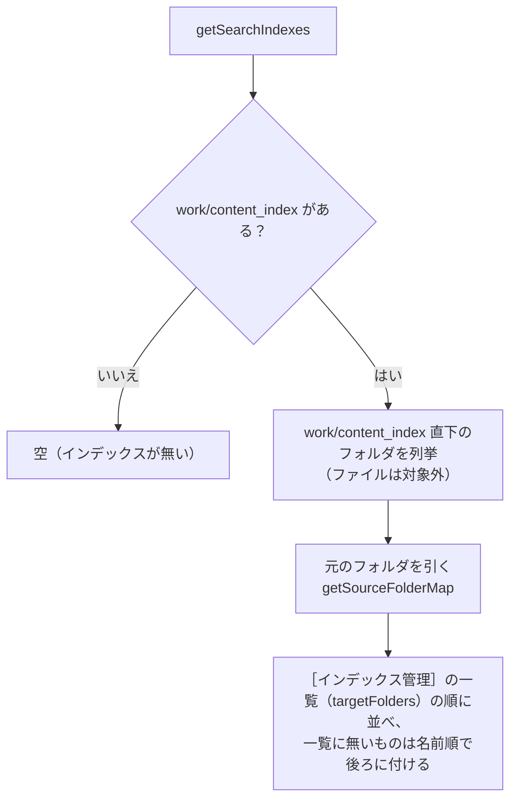
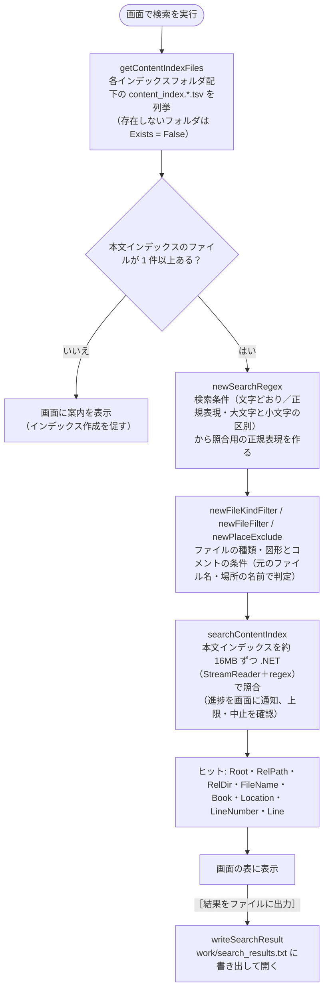

# 検索

扱うこと: 検索の仕様（検索対象・ファイルの種類・図形とコメント・長いパス など）、検索条件（文字どおり・正規表現・大文字と小文字）、検索対象インデックスの一覧の作り方、既知の問題。扱わないこと: 検索を速くする実装（[検索を速くする仕組み](speed.md)）、Windows Search を使う高速検索（[高速検索（Windows Search）](fast-search.md)）、検索結果ファイルの形式（[検索結果ファイル](output.md)）。先に読むページ: [設計の概要](../index.md)、[インデックスのファイルの形](../index-data/format.md)。

| 項目 | 内容 |
|---|---|
| 画面 | ［検索］タブ（[検索タブ](../gui/search-tab.md)） |
| スクリプト | `scripts/tebunko/search/search_query.ps1`（検索条件）・`content_index_search.ps1`（本文インデックスの列挙と検索）・`search_run.ps1`（結果の組み立て）。`scripts/tebunko/lib.ps1` から読み込み、画面 `scripts/tebunko/gui.ps1` から呼ぶ |
| 使用する共通関数 | `getFastSearchContentIndexFiles`（高速検索。[高速検索（Windows Search）](fast-search.md)）/ `getContentIndexFiles` / `getSearchIndexes` / `searchContentIndex` / `writeSearchResult`（→ `toSearchResultLines` → `toResultLine` / `toResultHeader`）（[部品ごとの関数](../reference/search.md)） |

全体構成・動作環境・フォルダ構成は [設計の概要](../index.md) を参照。インデックス（本文インデックス）の作り方は [インデックス作成](../indexing/index.md) を参照。画面の操作・表示は [検索タブ](../gui/search-tab.md) を参照。

## 概要

画面の［検索］タブで入力したワードで、`work/content_index/` 配下のうち、画面の検索対象のツリーでチェックしたインデックス・フォルダの本文インデックス（[インデックスのファイルの形](../index-data/format.md#配置命名規則)）を検索する処理と、［結果をファイルに出力］で書き出す `work/search_results.txt` の形式を定める。

## 入出力

| 区分 | パス | 内容 |
|---|---|---|
| 入力 | 画面で入力したワード | 1 回の検索で 1 ワード |
| 入力 | `setting.config` の `searchExcludes` | 画面の検索対象のツリーでチェックを外したフォルダ（[インデックスの一覧](#インデックスの一覧getsearchindexes)、省略可） |
| 入力 | `work/content_index/**/content_index.*.tsv` | インデックス作成で書き出した本文インデックス（フォルダ・元のファイルの拡張子ごとに 1 つ） |
| 入力 | `work/system_index/**/system_index*.txt`・`work/system_index_state.tsv` | 高速検索に使う システムインデックスとその状態（[高速検索（Windows Search）](fast-search.md)。Windows Search に問い合わせる） |
| 出力 | `work/search_results.txt` | 画面の［結果をファイルに出力］で書き出す検索結果（[検索結果ファイル](output.md)）。出力ごとに上書き |

## インデックスの一覧（`getSearchIndexes`）

検索対象は `work/content_index` に固定し、その直下のフォルダ 1 つをインデックス 1 つとして扱う。設定で場所を指定することはしない（［インデックス管理］で作ったインデックスは、すべてこの一覧に並ぶ）。

```mermaid
flowchart TD
    A["getSearchIndexes"] --> B{"work/content_index がある？"}
    B -- いいえ --> Z["空（インデックスが無い）"]
    B -- はい --> C["work/content_index 直下のフォルダを列挙<br>（ファイルは対象外）"]
    C --> D["元のフォルダを引く<br>getSourceFolderMap"]
    D --> E["［インデックス管理］の一覧（targetFolders）の順に並べ、<br>一覧に無いものは名前順で後ろに付ける"]
```

- 1 件を `@{ Name（インデックス名）; Path（インデックスのフォルダ）; SourcePath（元のフォルダ。分からなければ空） }` で返す。
- 別の場所・PC で作ったインデックスは、そのフォルダを `work/content_index` 直下に置けば一覧に並ぶ（[クロール対象フォルダと取り込み対象](../indexing/crawl.md)）。
- `work/content_index` が無ければ空を返す。`setting.config` は作成しない。
- 画面では、インデックス 1 件を一番上にしたツリーで、検索するインデックス・フォルダを選ぶ（[［検索］タブ](../gui/search-tab.md) [検索対象のツリー](../gui/search-tree.md)）。選んだ範囲は `getContentIndexFiles` に `@{ Root（インデックスのフォルダ `work/content_index`）; RelPath（`<インデックス名>` またはその下のフォルダ）; Recurse }` の配列で渡す。`Recurse` が `$false` なら、そのフォルダ直下の本文インデックスのファイルだけを列挙する。結果の相対パス（`RelPath`・`RelDir`）は `Root` から求めるため、フォルダを絞っても結果の形は変わらない。
- チェックを外したフォルダは `searchExcludes`（`@{ path（フルパス）; subfolders（$false は直下のファイルだけ） }` の配列）に保存する（`readSearchExcludes` / `writeSearchExcludes`）。無ければすべてを検索する。

```mermaid
flowchart TD
    S(["画面で検索を実行"]) --> C["getContentIndexFiles<br>各インデックスフォルダ配下の content_index.*.tsv を列挙<br>（存在しないフォルダは Exists = False）"]
    C --> D{"本文インデックスのファイルが 1 件以上ある？"}
    D -- いいえ --> E1["画面に案内を表示<br>（インデックス作成を促す）"]
    D -- はい --> M["newSearchRegex<br>検索条件（文字どおり／正規表現・大文字と小文字の区別）<br>から照合用の正規表現を作る"]
    M --> F["newFileKindFilter / newFileFilter / newPlaceExclude<br>ファイルの種類・図形とコメントの条件（元のファイル名・場所の名前で判定）"]
    F --> SS["searchContentIndex<br>本文インデックスを約 16MB ずつ .NET（StreamReader＋regex）で照合<br>（進捗を画面に通知、上限・中止を確認）"]
    SS --> R["ヒット: Root・RelPath・RelDir・FileName・<br>Book・Location・LineNumber・Line"]
    R --> G["画面の表に表示"]
    G -- "［結果をファイルに出力］" --> W["writeSearchResult<br>work/search_results.txt に書き出して開く"]
```

- 本文インデックスのファイルはフルパスをキーにまとめるため、入れ子のフォルダを指定しても同じ本文インデックスのファイルを二重に検索しない。
- 検索は画面の別スレッドで行い、1 つの作業（本文インデックス約 16MB 分。[検索を速くする仕組み](speed.md)）を照合するたびに進捗を通知する。画面の中止ボタン（`shouldStop`）で中止でき、件数の上限（`limit`）に達したら打ち切る（上限・表示は [［検索］タブ](../gui/search-tab.md)）。

## 検索仕様

| 項目 | 仕様 |
|---|---|
| 検索対象 | 各インデックスフォルダ配下（再帰）のうち、画面のツリーでチェックしたフォルダの本文インデックス `content_index.*.tsv`（[インデックスの一覧](#インデックスの一覧getsearchindexes)）。フォルダの順、フォルダの中は本文インデックスのファイルの名前（拡張子・番号）の順、本文インデックスのファイルの中は入れた順に検索する |
| ファイルの種類 | 画面の種類のチップ（`setting.config` の `fileKinds`。選んだ種類の拡張子の条件を `newFileKindFilter` が作る）を絞ると、**元のファイル名**（[ファイル名・場所の求め方](output.md#ファイル名場所の求め方readcontentindexplaces) の Book。本文インデックスの `ファイル名=` の値）が一致する元のファイルだけを検索する（[検索条件（サクラエディタの Grep にならう）](#検索条件サクラエディタの-grep-にならう)）。空ならすべて |
| 図形・コメント | 既定は検索する。画面の［図形も検索］［コメントも検索］（`setting.config` の `includeShapes` / `includeComments`）をオフにすると、場所が `<元の場所>[図形]`（と `<元の場所>[埋め込みN]`。埋め込みは図形と一緒に切り替える）/ `<元の場所>[コメント]`（本文インデックスのメタ情報 `対象=図形` / `対象=コメント`）の中を検索しない（`newPlaceExclude`。Excel・Word・PowerPoint で共通の決まり。[インデックスのファイルの形](../index-data/format.md#配置命名規則)「図形・コメントの場所」） |
| Excel の図形・コメントの行 | 行は `<セル番地><TAB><文字>` の形のため、**区切りのタブ（行の最初のタブ）より後から始まる一致だけ**をヒットにする（`searchContentIndexFiles`。セル番地だけには一致しない。文字の中のタブは文字として検索の対象。除いた行は件数・上限に数えない）。セル番地から文字まで続く正規表現（`C2\t納期`）と、区切りのタブに当たる `\t` は一致しない。Word・PowerPoint の図形・コメント、Excel のセル・ヘッダー・フッターの行は行全体を照合する |
| 長いパス | 列挙と検索（.NET の `DirectoryInfo`・`StreamReader`）には `\\?\` を付けたパスを渡す（`toLongPath`）。付けないと、約 248 文字を超えるフォルダの中を列挙できず、260 文字を超える本文インデックスのファイルを読めない。結果の相対パスは `\\?\` の無い形で扱う（[入れ替えと書き出し](../index-data/publish.md#長いパス260-文字超の扱い)） |
| 読み込み文字コード | UTF-16LE（BOM があれば BOM に従う） |
| 読めない本文インデックスのファイル | 列挙した後に読めなくなった本文インデックスのファイル（インデックス作成中に削除された等）は飛ばして、検索を続ける。読み込み中の本文インデックスのファイルは、インデクサの置き換え・削除を妨げないよう共有モードで開く |
| 検索単位 | 本文インデックスの中身の 1 行（= 元の TSV の 1 行 = Excel の 1 行）。1 行に複数ヒットしても 1 件。メタ情報の行（先頭が RS）は検索しない。行番号は場所ごとに数え、Excel では場所のメタ情報の後の N 行目がシートの N 行目になる。行の区切りは LF（本文インデックスを書くときに CRLF・CR を LF にそろえる） |
| 数値のセル | Excel の数値は、シートで**表示されている形**でインデックスに入る。表示形式が「標準」の 12 桁以上の数値は指数表記（`4.90123E+12`）、「#,##0」のセルは桁区切り付き（`1,234,568`）のため、元の番号（`4901234567894`・`1234568`）では見つからない（[Excel の抽出処理](../indexing/excel.md#excel-の抽出処理extractworkbook)） |
| セル内改行 | インデックスでは U+2028 になっているため、正規表現の `.` や `\s` にマッチする（例: `1行目.2行目`）。改行をはさんだ文字列をそのまま連結したワード（`1行目2行目`）はヒットしない |
| マッチ方式 | 画面の［正規表現を使う］がオフなら文字どおり、オンなら正規表現として検索する。どちらも `newSearchRegex` で 1 つの正規表現にして照合し、画面の一致箇所の強調にも同じ正規表現を使う（[検索条件（サクラエディタの Grep にならう）](#検索条件サクラエディタの-grep-にならう)） |
| 大文字と小文字 | 既定は区別しない。画面の［大文字と小文字を区別］がオンなら区別する（全角の英字も同じ） |
| 不正な正規表現 | ［正規表現を使う］がオンでも、正規表現として不正なワード（`(` 単独など）は文字どおりの検索に切り替える（`searchContentIndex` の戻り値 `SimpleMatch` が `$true` になる）。画面は、不正なワードでは検索を始めない（吹き出しで知らせる。[検索タブ](../gui/search-tab.md#エラーの吹き出し)） |
| 照合の時間切れ | 1 行の照合に 5 秒を超えた（正規表現によっては終わらなくなる）場合は、`正規表現の照合に時間がかかりすぎるため、検索を中止しました。正規表現を見直してください。` として検索を止める。本文インデックスのファイルの全文への照合が時間切れになったときは、その本文インデックスのファイルを 1 行ずつ照合し直す（[検索を速くする仕組み](speed.md)） |
| 複数フォルダ | 全フォルダの本文インデックスをまとめて検索する |

## 検索条件（サクラエディタの Grep にならう）

条件の考え方はサクラエディタの Grep（「英大文字と小文字を区別する」「正規表現」「ファイル」）にならう。インデックスは元のファイルから作った本文インデックスなので、「ファイル」は本文インデックスのファイルの名前ではなく**元のファイル名**で判定する。

| 条件 | 実装（`newSearchRegex` / `newFileFilter`） | 例 |
|---|---|---|
| 文字どおり（既定） | ワードを `[regex]::Escape` して照合する | `(株)` は「(株)」だけに一致 |
| 正規表現 | ワードをそのまま正規表現として照合する | `見積.*確定` |
| 大文字と小文字を区別 | オフのときは `RegexOptions.IgnoreCase` を付ける。`CultureInvariant` も付ける（区別しないときの照合が 2 倍程度速くなる。日本語の照合結果は変わらない） | オンなら `ID` は `id` `Id` に一致しない |
| ファイルの種類 | 種類のチップから作った、`;` 区切りのワイルドカード（`newFileKindFilter`。例: `*.xlsx;*.xlsm;*.xls`。すべて選んでいるときは空）。内部では `newFileFilter` が、`;`（全角の `；` も可）で区切ったワイルドカード。`!`（全角の `！` も可）で始まるものは除外。`*` は任意の文字列、`?` は任意の 1 文字。`*` も `?` も無いものは部分一致。大文字と小文字は区別しない | `*.xlsx;見積;!*old*` は、.xlsx か名前に「見積」を含むファイルのうち、「old」を含まないもの |

## 実装上の注意点・既知の問題

確度: ◎ = 動作確認済み、○ = コード上明らか、△ = 推定。

| # | 内容 | 確度 |
|---|---|---|
| 1 | 高速検索を使えないとき（[高速検索（Windows Search）](fast-search.md)）は、検索のたびにすべての本文インデックスを照合するため、インデックス量に比例して時間がかかる（本文インデックス 46MB で初回 2.1 秒・2 回目以降 0.29 秒、1.1GB で初回 38 秒・2 回目以降 16〜18 秒。読んだ内容の使い回しは約 128MB まで。[検索を速くする仕組み](speed.md)） | ◎ |
| 1-2 | 初めて作った大きなインデックスは、Windows Search が システムインデックスを索引し終えるまで高速検索が効かない（その間は反映待ちのフォルダを照合するため、結果は欠けない）。`work/content_index` は自動で Windows Search の対象から外れ、早く終わる（[高速検索（Windows Search）](fast-search.md)） | ◎ |
| 1-3 | ワードによく出る 2-gram しか無いときは、ほとんどのフォルダが候補になり、高速検索でも速くならない（[高速検索（Windows Search）](fast-search.md)） | ◎ |
| 2 | 結果ファイルを Excel で開いたまま［結果をファイルに出力］すると、ファイルがロックされて書き込めない（画面に `search_results.txt に書き込めません。…` と表示する） | ◎ |
| 3 | Excel の図形・コメントの行頭の `^` は、文字の先頭には一致しない（行の先頭はセル番地のため。開始位置つきの照合でも `^` は文字列の先頭にだけ一致する。直すには、インデックスの形式の変更か照合の作り直しが要る） | ○ |
