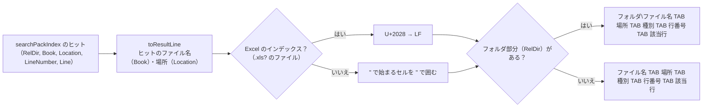
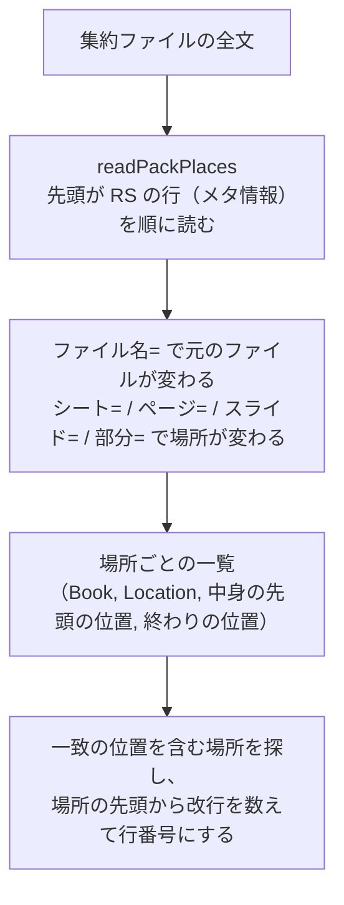

# 検索結果ファイル

## 出力フォーマット（`work/検索結果.txt`）

画面の［結果をファイルに出力］で、表示中の結果（絞り込み後）を書き出す。UTF-8（BOM 付き）、改行は CRLF。

```
【検索文字列　<ワード>】 <件数> 件
ファイル名<TAB>場所<TAB>種別<TAB>行<TAB>A<TAB>B<TAB>…（該当行の最大セル数分の列名）
<相対フォルダ\><ファイル名><TAB><場所><TAB><種別><TAB><行番号><TAB><該当行>
...

```

- `【検索文字列　…】` の空白は全角スペース。ブロックの後に空行を 1 行出力する。
- ファイル名は、インデックスフォルダからの相対フォルダ（= クロール対象フォルダからの相対フォルダ）付き。直下のファイルはフォルダ部分なし。
- **場所・種別** は、ヒットの `Location`（場所の名前。集約ファイルのメタ情報から組み立てる。[ファイル名・場所の求め方](#ファイル名場所の求め方readpackplaces)）を画面と同じ表示にしたもの（`describePlace`）。

  | 場所の名前（`Location`） | 場所 | 種別 |
  |---|---|---|
  | `売上`（Excel のシート） | `[シート] 売上` | セル |
  | `売上[図形]` | `[シート] 売上` | 図形 |
  | `売上[コメント]` | `[シート] 売上` | コメント |
  | `ページ003`（Word） | `[ページ] 3（目安）` | 本文 |
  | `ページ003[図形]` `ページ003[コメント]` | `[ページ] 3（目安）` | 図形 / コメント |
  | `文書[コメント]`（本文に参照の無い Word のコメント） | `[文書]` | コメント |
  | `スライド002[図形]` `スライド002[コメント]` | `[スライド] 2` | 図形 / コメント |
  | `ヘッダー・フッター` `脚注` | `[ヘッダー・フッター]` `[脚注]` | 本文 |
  | `スライド002（非表示）`（PowerPoint） | `[スライド] 2（非表示）` | 本文 |
  | `スライド002_ノート` | `[スライド] 2` | ノート |

  - Word のページは、Word が保存したときのページ区切りから数えた目安のため「（目安）」を付ける（[Word](../indexer/word.md) [Word の注意点・既知の問題](../indexer/known-issues.md#word-の注意点既知の問題)）。
  - Excel の図形・コメントは、該当行の 1 列目が図形の左上・コメントのセル番地、2 列目が文字（[Excel の図形・コメントの読み取り](../indexer/excel.md#excel-の図形コメントの読み取りreadxlsxobjectunits) [Excel の図形・コメントの読み取り](../indexer/excel.md#excel-の図形コメントの読み取りreadxlsxobjectunits)）。
  - シート名にタブ・改行が入っている場合（Excel は付けられる）は、列・行が分かれないようスペースにする。
- **行番号** は場所の中の行番号（`searchPackIndex` の `LineNumber`。元の TSV の行番号と同じ）。Excel ではシートの行番号、Word・PowerPoint では場所（ページ・スライド等）の中で何行目か。
- **該当行** は、結果をすべて選択して Excel に貼り付けたとき、5 列目以降に元の列の順（5 列目 = A 列）でセルが並ぶように出力する。見出しの列名（A, B, C…）と行番号で、元のセル位置が分かる。
  - Excel: TSV の行をそのまま出力し、セル内改行（U+2028）だけを LF に戻す。改行を含むセルは Excel の出力時点で `"` で囲まれているため、貼り付けても 1 セル内の改行となり、右隣のセル・後続の行はずれない。このため結果ファイルをテキストエディタで開くと、改行を含むセルは複数行に見える。
  - Word・PowerPoint: 行（段落、または表の 1 行をタブ区切りにしたもの）は `"` で囲まれていない。Excel は `"` で始まるセルを囲みの `"` と解釈して後続がずれるため、`"` で始まるセルだけを `"` で囲み、中の `"` を `""` にする。途中に `"` を含むセルはそのままで、貼り付けても文字どおりになる。
- 見出しの列名の数は、ヒット行を Excel に貼り付けたときの最大セル数（`countTsvFields`。`"` で始まるセルは閉じる `"` までを 1 セルとする）。ヒットが 0 件のときは `ファイル名<TAB>場所<TAB>種別<TAB>行` と件数の見出し 2 行のみとなる。
- 画面の［コピー］も同じ形式（`toSearchResultLines`）でクリップボードに入れる。

出力例（`⏎` はセル内改行の LF）:

```
【検索文字列　りんご】 3 件
ファイル名	場所	種別	行	A	B	C	D
sub dir\old.xls	[シート] Sheet1	セル	3	古い形式 りんご
見積[確定].xlsx	[シート] 一覧	セル	12		りんご	100	"青森産⏎ふじ"
報告書.docx	[ページ] 2（目安）	本文	5	"""りんご""の出荷"
```

## 1 行の組み立て



## ファイル名・場所の求め方（`readPackPlaces`）

ヒット 1 件の元のファイル名（Book）・場所（Location: シート名・ページ・スライド）・元のファイルのあるフォルダ（RelDir）は、次のように求める。

| 値 | 求め方 |
|---|---|
| RelDir | 集約ファイルのあるフォルダの、インデックスのフォルダ（`Root`）からの相対パス（`getPackFiles`） |
| Book | 一致した位置より前の、いちばん近い `ファイル名=` の値 |
| Location | 一致した位置を含む場所のメタ情報（`シート` / `ページ` / `スライド` / `部分`・`対象`・`非表示`）から組み立てた場所の名前（`convertPackMetaToPlace`。`見積[図形]`・`ページ001`・`スライド002（非表示）`・`スライド001_ノート` など。[配置・命名規則](../indexer/index-format.md#配置命名規則) [配置・命名規則](../indexer/index-format.md#配置命名規則)「集約ファイルの形式」） |
| LineNumber | 場所の中身の先頭から数えた行番号（場所のメタ情報の後の最初の行が 1） |



- 場所の一覧は、全文で一致したとき（と、読んだ内容を使い回すために残すとき）だけ作る。一致しない集約ファイルでは作らない（[検索の実装（速度）](index.md#検索の実装速度)）。
- 画面の選択行のプレビュー（`readPackContext`）も同じ一覧で、Book・Location が一致する場所の中から前後の行を取り出す（[［2 検索］タブ](../gui/search-tab.md) [選択行のプレビュー](../gui/search-tab.md#選択行のプレビュー)）。
- 検索では TSV の相対パスを分解しない。TSV の名前（フォルダ名 = 元のファイル名、ファイル名 = 場所）は、集約ファイルに入れるとき（`getIndexFolderBooks`）だけに使う。

場所の付け方は [インデックス作成（インデクサ）](../indexer/index.md) の [配置・命名規則](../indexer/index-format.md#配置命名規則)・[場所の符号化](../indexer/index-format.md#場所の符号化encodeindexplace--decodeindexplace) を参照。
