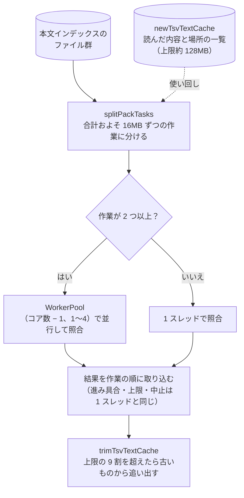

# 検索を速くする仕組み

扱うこと: 本文インデックスの読み込みと照合の実装、正規表現の判定（`lines`/`filter`/`scan`）、並列検索・スレッドの使い回し・読んだ内容の使い回しによる速さの実測。扱わないこと: 検索の仕様そのもの（[検索](index.md)）、Windows Search による高速検索（[高速検索（Windows Search）](fast-search.md)）。先に読むページ: [検索](index.md)。

本文インデックス（[インデックスのファイルの形](../index-data/format.md#配置命名規則)）の読み込みと照合、結果 1 件の作成は PowerShell から .NET を直接呼ぶ（`tebunko/search/pack_search.ps1` の `searchPackIndex`／`searchPackFiles`。`FileStream`＋`StreamReader`＋`[regex]`。`Select-String` で 1 件ずつ結果を作ると件数が多いときに遅いため）。資産管理・EDR に注目されやすい実行時コンパイル（`Add-Type`／csc.exe）は使わない（[画面の実装](../gui/implementation.md#実行時コンパイルcscexeを使わない)。実測: 50 万行で約 0.6 秒）。

1 行ずつ PowerShell で照合すると、行数に比例して時間がかかる（1 行あたり十数マイクロ秒）。このため本文インデックスのファイルを丸ごと読み（改行は書くときに LF にそろえてある）、正規表現を全文に 1 回かける（.NET の中で走る）。**全文で一致しない本文インデックスのファイルは、そのまま飛ばす。** 一致したときだけ、メタ情報の行から場所ごとの範囲（元のファイル名・場所の名前・中身の先頭と終わりの位置）の一覧を作り（`readPackPlaces`）、一致の位置から元のファイル・場所・行番号を求める（[ファイル名・場所の求め方](output.md#ファイル名場所の求め方readpackplaces)）。全文にかけてよいかは `getRegexScanMode` が正規表現の書き方から判定する。

| 判定 | 正規表現の例 | 照合のしかた |
|---|---|---|
| `lines` | 文字どおりのワード、`見積.*確定`、`^顧客`、`\d+-\w+` | 一致は必ず 1 行に収まるため、全文での一致の位置から行を切り出す（1 行ずつの照合はしない）。メタ情報の行の中の一致は捨てる |
| `filter` | `見積\s確定`、`[^,]+`、`a(?=b)`（改行に一致しうる・行の外を見る） | 全文で一致しない本文インデックスのファイルは読み飛ばし、一致したものだけ場所ごとに 1 行ずつ照合する |
| `scan` | `\Aabc`、`a(?!b)`、`(?i)abc`（全文では 1 行と結果が変わりうる） | 場所ごとに 1 行ずつ照合する |

- `^` `$` は全文用の正規表現に `Multiline` を付けて行の先頭・末尾に一致させる。判定は安全側に倒し、どの照合でも検索結果（行・行番号）は、元の TSV を 1 行ずつ照合したときと同じになる（`pack_search.Tests.ps1` で改行の種類・照合のしかたごとに突き合わせている）。
- 全文への照合が時間切れになった本文インデックスのファイルは、1 行ずつ照合し直す。
- ファイルの種類（`newFileKindFilter` から作る `newFileFilter`）・図形とコメント（`newPlaceExclude`）の条件は、場所ごとに元のファイル名・場所の名前で判定し、当てはまらない場所の一致は結果に入れない（1 行ずつ照合するときは、その場所を照合しない）。

さらに、次の 4 つで待ち時間を減らしている。

| しくみ | 内容 |
|---|---|
| 並列検索 | 本文インデックスのファイルを、大きさの合計がおよそ 16MB になるまでまとめて 1 つの作業にし（`splitPackTasks`）、作業が 2 つ以上なら照合のプール（`WorkerPool`。コア数 − 1、1〜4）で並行して照合する。各スレッドには照合に要る関数（`searchPackFiles`・`readPackPlaces` など）と値だけを読み込む。結果は作業の順に取り込み、上限・中止・進み具合（1 つの作業を照合するたびに通知。件数は本文インデックスのファイルの数）の扱いは 1 スレッドのときと同じ |
| スレッドの使い回し | 画面は、検索の司令のスレッド（`SearchService`）を画面を開いている間 1 つだけ動かす。lib.ps1 の読み込みと照合のプールの用意（`newPackWorkerPool`）は、司令のスレッドを始めたときに 1 回だけ行い、検索のたびに行わない。検索 1 回は要求（`newSearchRequest`）として渡し、`invokeSearchRequest` が実行する。新しい要求を渡すと、前の要求の `Stop` を立てて取り消す（[寿命](../structure/threads.md#寿命)） |
| 列挙 | 本文インデックスのファイルの列挙（`getIndexPackFiles` → `getPackFiles`）は、.NET（`DirectoryInfo.GetFiles`）で `content_index.*.tsv` を 1 回で集め、更新日時・サイズも列挙のときに得る |
| 読んだ内容の使い回し | 画面は `newTsvTextCache` を 1 つ持ち、検索で読んだ本文インデックスのファイルの内容と場所の一覧を残す（上限 6,400 万文字＝約 128MB）。次の検索では、更新日時・サイズが列挙したときと同じ本文インデックスのファイルはファイルを開かない。書き直した本文インデックスのファイルは更新日時・サイズが変わるため読み直す。選択行のプレビュー（`readPackContext`）も同じ内容を使う。検索 1 回が終わるたびに、上限の 9 割を超えていれば、その検索で使わなかった内容を古いものから追い出す（`trimTsvTextCache`。[GC とメモリ](../structure/closing.md#gc-とメモリ)） |

**本文インデックスにする理由**: 検索の時間は、読むファイルの数でほぼ決まる。Microsoft Defender は、ファイルを初めて開くたびに検査し（実測で 1 ファイル約 11 ミリ秒）、検査済みとして覚えておけるのはおよそ 2 万ファイルまで。元のファイルの場所ごとの TSV を読む方式では、TSV が数万件になると初回の検索に数分〜10 分以上かかった。

実測（Windows PowerShell 5.1、4 コア・物理メモリ 8GB、Microsoft Defender は有効。画面と同じく、列挙から検索の終わりまで）:

| インデックス | 検索 | 場所ごとの TSV | 本文インデックス |
|---|---|---|---|
| 7,000 ファイル規模（TSV 6,412 件 → 本文インデックスのファイル 20 件・46MB） | 初回 | 30.0 秒 | 2.1 秒 |
| 同上 | 2 回目以降 | 1.3 秒 | 0.29 秒 |
| TSV 16 万件・1GB（→ 本文インデックスのファイル 502 件・1.1GB） | 初回 | 10 分超 | 38 秒 |
| 同上 | 2 回目以降 | – | 16〜18 秒 |

- 1GB の 2 回目以降は、読んだ内容の使い回しの上限（約 128MB）を超え、物理メモリ 8GB では OS のファイルキャッシュにも収まりきらないため、ディスクの読み込みの速さで決まる。
- 同じ形のデータを使った `pack の作成`・検索の速さとリソースの推移は、GitHub Actions の `perf.yml`（手動で起動）でも測れる。計測スクリプトは `tools/measure_perf.ps1`（[性能とリソースの計測のしかた](../testing/perf.md)）。
- 検索の速さが落ちていないことは、回帰テスト（`tests/tools/perf_search.Tests.ps1`）が語ごとの中央値を上限と比べて確かめる。PR にラベル `perf-check` を付けたときと main への push で `perf-check.yml` が流す（[速さの回帰テストと上限の決め方](../testing/perf-check.md)）。
