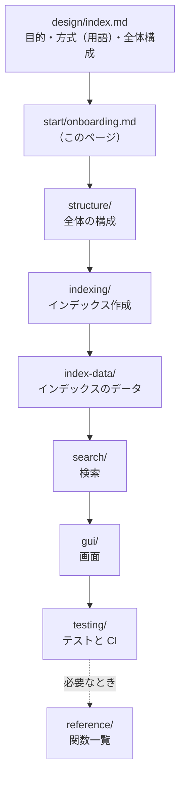
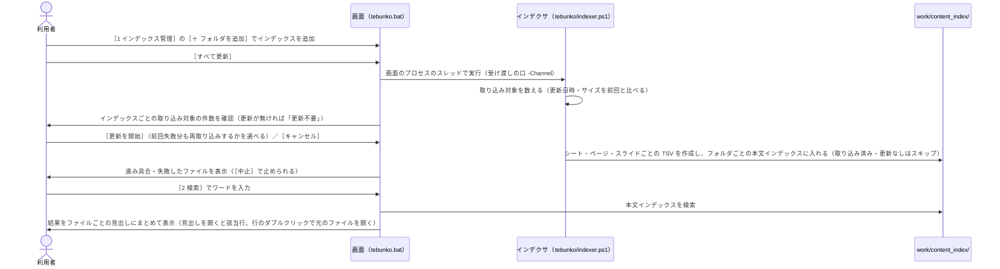

# はじめに（設計書を読む順番と全体の 1 周）

扱うこと: 設計書を読む順番、インデックスを作って検索するまでの 1 周の流れ。扱わないこと: 各処理の仕様の詳細（各区分のページで扱う）。先に読むページ: [設計の概要](../index.md)。

初めて設計書を読む開発者が、どこから読めばよいかと、インデックス作成から検索までの流れを 1 度でつかめるようにする。

## 読む順番

- 変えたいファイルが決まっているときは、[変更の種類から見る設計書を引く](review-map.md) を使うと、この順番どおりに読まなくてよい。
- 用語（インデックス作成・インデクサ・取り込み・抽出 など）は [設計の概要「方式」](../index.md#方式) にそろえてあるので、先に一読する。

## インデックスを作って検索するまでの 1 周

利用者が画面を開いてから、インデックスを作り、検索して元のファイルにたどり着くまでの一連の流れ。各矢印の詳しい中身（取り込みの並列化・本文インデックスへの書き出し・検索の絞り込みなど）は、対応する区分のページで扱う。

- インデックス作成の詳細: [インデックス作成](../indexing/index.md)
- 検索の詳細: [検索](../search/index.md)
- 画面の詳細: [画面](../gui/index.md)
