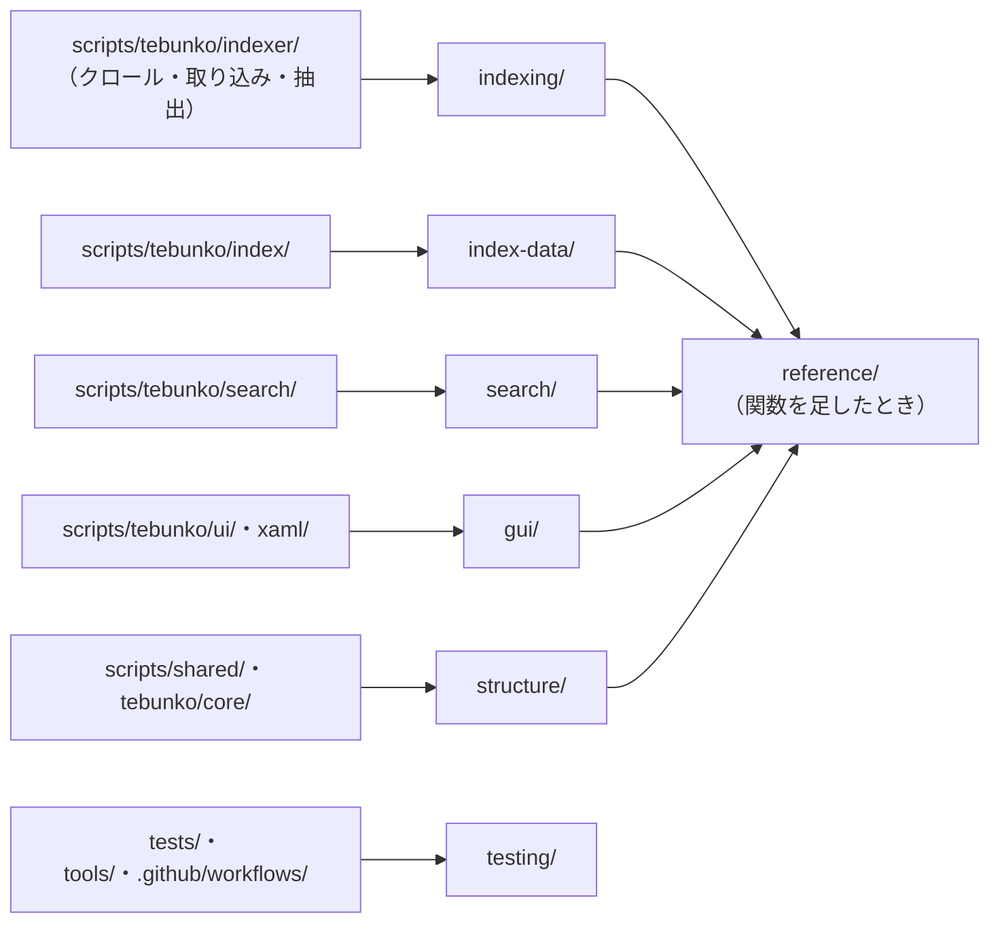

# 変更の種類から見る設計書を引く

扱うこと: 変えたフォルダ・ファイルから、確かめ・直すべき設計書・テスト・決まりを逆引きする対応表。扱わないこと: 設計書の中身（仕様そのもの）、決まり（`AGENTS.md` など）の全文。先に読むページ: [設計の概要](../index.md)。

コードやテストを変えるとき、どの設計書を確かめ・直せばよいかを、変えたフォルダ・ファイルから逆引きする。

## 変更の種類 → 見る設計書・テスト・決まり

| 変えたもの（フォルダ・ファイル） | 見る設計書 | 見るテスト | 見る決まり |
|---|---|---|---|
| `scripts/tebunko/indexer/`（クロール・取り込み一覧・並列化・ファイル種別ごとの抽出） | [indexing/](../indexing/index.md) | `tests/tebunko/indexer/` | `AGENTS.md`「ソースの分け方」 |
| `scripts/tebunko/index/`（インデックスの形・場所・入れ替え） | [index-data/](../index-data/format.md) | `tests/tebunko/index/` | `AGENTS.md`「ドキュメントの図」（形式を変えたら移行の手順も） |
| `scripts/tebunko/search/` | [search/](../search/index.md) | `tests/tebunko/search/` | 同上 |
| `scripts/tebunko/ui/`・`scripts/tebunko/xaml/` | [gui/](../gui/index.md) | `tests/tebunko/ui/` | `AGENTS.md`「ソースの分け方」（画面層は判断層・状態層に触らない） |
| `scripts/shared/`・`scripts/tebunko/core/` | [structure/](../structure/source.md) | `tests/shared/`・`tests/tebunko/core/` | `AGENTS.md`「ソースの分け方」 |
| `setting.config` の読み書き（`architecture/settings-file.md` の後継） | [structure/settings-file.md](../structure/settings-file.md) | `tests/tebunko/core/` | 前の版と互換が無くなるときは PR タイトルに `!` |
| `tests/`・`tools/`・`.github/workflows/` | [testing/](../testing/index.md) | `tests/meta/` | `AGENTS.md`「コミット前の検査と CI」「テストカバレッジの方針」 |
| 関数を足した・消した | [reference/](../reference/index.md) | — | `docs/design/architecture/modules.md`「関数一覧」の後継（部品ごとのページ） |

- 表にない変更（`README.md`・`.github/` の英語版など）は、そのファイルの決まり（`AGENTS.md`「言語」）に従う。
- 前の版と互換が無くなる変更（設定ファイル・インデックスの形式・起動の仕方・配布物の構成）は、直した設計書に移行の手順も書く（`AGENTS.md`「GitHub の運用」）。
