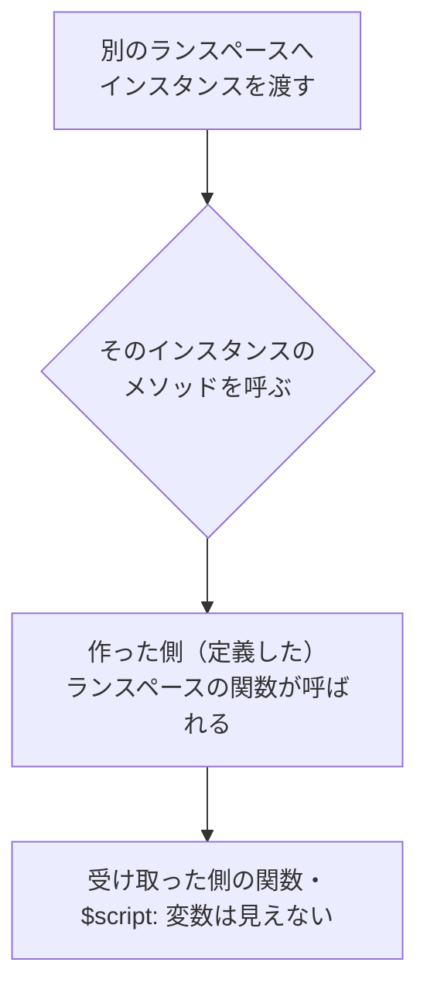
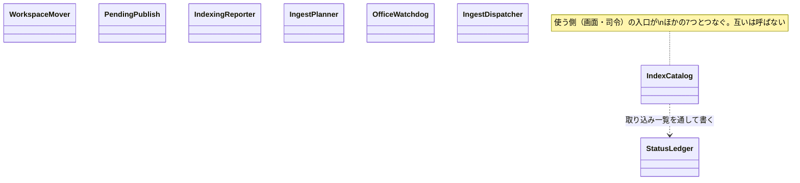

# クラスと関数の使い分け

扱うこと: PowerShell 5.1 でクラスを使ってよいところ・使ってはいけないところ（試した結果と決まり）、目的ごとのクラス設計（refactor で作る予定）とそのつなぎ方。扱わないこと: スレッド・プロセスの一覧そのもの（[プロセスとスレッド](threads.md)）。先に読むページ: [プロセスとスレッド](threads.md)。

## クラスと関数の使い分け

PowerShell 5.1 のクラスのメソッドは、別のランスペースへ渡したインスタンスから呼んでも、作った側（定義したランスペース）の関数を呼ぶ（試し c）。作った側のランスペースが同時に実行中のときにどう動くかは試していない。次の 3 つを Windows で試し、その結果をもとに使い分けを決める。

**試したこと**（環境: Windows 11、PowerShell 5.1.26100.9549、main 79065aa、2026-09-26。個人のパスは書かない）

- a. クラスのメソッドから、同じランスペースのスクリプトの関数・`$script:` 変数が見えるか。ランスペースの無い .NET のスレッドからクラスのメソッドを呼べるか
- b. 関数の呼び出し・インスタンスのメソッドの呼び出し・静的メソッドの呼び出し・`$script:` 変数の読み・クラスのプロパティの読み・hashtable の読みの、1 回あたりの速さ（下の「速さ」）
- c. `CreateRunspace` で作ったランスペースの中でクラスを dot-source して使えるか。別のランスペースへ渡したインスタンスのメソッドは、どちらのランスペースの関数を呼ぶか
- d.（#147 で追加）Pester の `BeforeAll` で `lib.ps1` を dot-source したとき、テストファイルのトップレベルで定義したクラスのメソッドから、`lib.ps1` の関数と `$script:` 変数が見えるか

**決まり**

| 決まり | 理由（試した結果） |
|---|---|
| クラスは、使うランスペースの中で定義のファイルを dot-source して作り、そのランスペースの中だけで使う | `CreateRunspace` で作ったランスペースの中で dot-source したクラスは使えた（c） |
| クラスのインスタンスを別のスレッド（別のランスペース）へ渡さない。別のスレッドには素の値（例 `Workspace` の `Dir` の文字列）を渡し、そこで作り直す | 渡したオブジェクトのメソッドは、**作った側のランスペースの関数**を呼んだ。作った側が実行中のときに別スレッドから呼んだときの動きは試していない（c）。また、同じ名前のクラスでも dot-source したランスペースごとに別の型になるとみられ、型付きの引数や `-is` が合わないおそれがある（試していない） |
| スレッドをまたいで使うもの（受け渡しの口・取り込みの結果・キャッシュ）は、今までどおり .NET のコレクション（`ConcurrentQueue`・`ConcurrentDictionary`・`[hashtable]::Synchronized` など）と hashtable・関数で作る。クラスはそれを持って読み書きしてよい | 同上 |
| クラスのメソッドから使ってよい関数・変数は、**スクリプトのトップのスコープ（または global）で dot-source したファイルの関数と `$script:` 変数**だけにする（関数の定義がクラスより前でも後でもよい） | 見えた（a）。試したのはスクリプトのトップで dot-source した場合だけ。PS のクラスのメソッドは、呼んだ側ではなく定義したスコープから関数を引くので、関数やスクリプトブロックの中（Pester の `BeforeAll`・`It` を含む）で定義した関数・変数、`Mock` で差し替えた関数はメソッドから見えないことがある（`tests/tebunko/indexer/extract_office.Tests.ps1` の先頭のコメントはこの場合に当たる）。関数の中で dot-source した場合・テストでの差し替えは試していない |
| **クラスのメソッドの本体で、`$script:` 変数（`${stateDone}` などの定数）を直接読まない。** 必要なら、その値を（司令などの普通の関数から）引数かコンストラクタで渡す。関数の呼び出し（引数の既定値が `$script:` 変数を読むものを含む）はそのまま使ってよい | Pester の `BeforeAll` で `. lib.ps1` した場合、テストファイルのトップレベルのクラスのメソッドから**関数は呼べた**が、**`$script:` 変数の読みは空になった**（`$script:stateDone` と書いても、`BeforeAll` の外の `$stateDone` とは値が食い違う。d）。関数の呼び出しなら、その関数自身のスコープ（呼んだ側ではなく定義側）で `$script:` 変数を読むため問題ない（`newStatusRow` の既定値 `${stateNew}` は読めた）。本番（`indexer.ps1` がトップレベルで `indexer_lib.ps1` を dot-source する経路）では問題にならないと見られるが、テストと本番で動きが食い違う原因になるため、クラスの本体では読まない決まりにする |
| テストで差し替えたいもの（ファイル・COM・時刻などの I/O）は、メソッドの中で関数を呼んで `Mock` で差し替える形にせず、コンストラクタの引数かプロパティで受け取る（スクリプトブロックや部品のオブジェクト） | 上の行のとおり、メソッドの中の関数は `Mock` で差し替えられるとは限らない |
| ランスペースの無い .NET のスレッド（`[System.Threading.Thread]` に渡したデリゲート・`System.Threading.Timer` のコールバックなど）から、クラスのメソッドやスクリプトブロックを呼ばない | try/catch でも捕まらずにプロセスごと終わった（a。クラスとデリゲートのどちらが原因かは切り分けていない。今のコードにこの使い方は無い） |
| 引数なしで作れるクラスは、既定のコンストラクタを明示する | `tests/meta/classes.Tests.ps1`（既にある決まり。ここから参照する） |
| メソッドの中のローカル変数の名前は、プロパティの名前と大文字・小文字だけの違いにしない（`$Channel` プロパティがあれば `$channel` をローカル変数に使わない） | PS のクラスは、プロパティと同名（大文字・小文字を区別しない）のローカル変数への代入を、`$this.` を付けないプロパティへの代入と見なし、パースエラーになる（`Cannot assign property, use '$this.Xxx'.`。#147 で見つかった） |
| メソッドのパラメータに既定値（`$x = 60` など）を書いても、呼ぶ側が省略するとエラーになる（関数と違い、既定値は使われない） | `[T]::new().M(1)` が `Cannot find an overload` になった（#147 で確かめた）。呼ぶ側で必ず全部の引数を渡す |
| スレッドやプールの寿命を持つクラスは `Open`（または最初の使用）でスレッドを作り、`Close` で止めて片づける。`Close` は何度呼んでもよい | 今の決まりのまま |

**今のクラスと使う場所**

| クラス | 作って使うスレッド |
|---|---|
| `SearchService`・`BackgroundQueue`・`IndexingSession` | 画面のスレッド |
| `WorkerPool` | プールを持つ側のスレッドで作り、そのスレッドから使う: 画面のスレッド（`BackgroundQueue` の中。`shared/core/worker_pool.ps1`）・検索の司令のスレッド（`newPackWorkerPool`。`tebunko/search/pack_search.ps1`）・インデクサの司令のスレッド（`writeSystemIndexFolders`。`tebunko/index/system_index.ps1`） |
| `Workspace`（`tebunko/core/workspace.ps1`） | `lib.ps1` を読む各ランスペース（画面・インデクサの司令・取り込み・検索のスレッド）で、それぞれ作る。別のスレッドへは `Dir` の文字列を渡し、そこで作り直す（`workspace.ps1` の先頭のコメント・`core/paths.ps1`・`indexer/indexer_run.ps1`・`search/search_run.ps1`）。新しい決まり「作ったランスペースで使い、渡さない」の先例として書く |

refactor で作るクラス（`IndexCatalog` など）は下の「目的ごとのクラス」へ。

画面層のクラス（`shared/ui/types.ps1` の `NotifyBase`・`ConfirmFact`、`tebunko/ui/types.ps1` の WPF に渡す型）は、上の表と決まりの外（画面のスレッドだけで使う）。

**速さ**（1 回あたりの時間。10 万回 × 3 回の中央値、空ループ 0.64μs を含む）

| 操作 | 時間 |
|---|---|
| 関数の呼び出し | 40.5μs（ばらつきがあり、初回が大きい） |
| インスタンスのメソッドの呼び出し | 4.33μs |
| 静的メソッドの呼び出し | 3.56μs |
| `$script:` 変数の読み | 0.63μs |
| クラスのプロパティの読み | 0.86μs |
| hashtable の読み | 1.06μs |

- 読み取り方: 変数・プロパティ・hashtable の読みは、どれも空ループ（0.64μs）と区別できないほど小さく、差は無いものとみる。比べるのは関数とメソッドの呼び出しの差だけで、メソッドは関数の約 10 分の 1。**クラスにしても呼び出しは遅くならない。** ただしメソッドの中から関数を呼べば関数の時間がそのまま足される。取り込みの 1 ファイルごとに通る経路（`IngestDispatcher`・`OfficeWatchdog`）では、書き直しで関数の呼び出しの段を増やさない。1 ファイル 1 回増えると 1,000 ファイルで約 40ms で、1 ファイルの取り込み（Office を使えば数百 ms 以上）に比べれば小さいが、段を重ねると積み上がるため。
- 性能を落としていないかの判断は、この表ではなく取り込みの計測（[性能とリソースの計測のしかた](../testing/perf.md) の「計測の口」）で、同じ日に main と比べて行う。

## 目的ごとのクラス

refactor で作る予定の設計。作ったら、この節を実装に合わせて直す。`StatusLedger`・`PendingPublish`・`IndexingReporter` は実装ずみ（#147）。残り 5 つは予定のまま。

| クラス | 目的（1 つに絞る。凝集） | 作って使うスレッド | 層 | 置くファイル（案） | 今ある場所 | 依存してよい相手 |
|---|---|---|---|---|---|---|
| `IndexCatalog` | インデックスの追加・改名・削除・名前の割り当て。保存先（`targetFolders`・取り込み一覧・元のフォルダの記録・`searchExcludes`・`system_index`）を漏れなく書き換える手順と順番、途中で失敗したときの扱い（戻す・残す）だけを持つ。保存先の形式は知らない。`Workspace` と設定ファイルの場所を受け取って作る（場所を暗黙に使わない） | 画面のスレッド。インデクサが名前を引くときは司令のスレッドで別に作る | 状態層 | `tebunko/index/index_catalog.ps1`（`lib.ps1`） | `index_store.ps1`、`ui/index_tab.ps1` の `editIndex`・`loadTargets`・`saveTargets`・`updateIndexSourceFile`、`core/settings.ps1` の `saveAssignedIndexNames`・`removeSearchExcludesUnder`（`renameIndex`・`removeIndex` から呼ぶ） | 保存先ごとの読み書きの部品（既存の関数でよい。設定は `invokeSettingsLocked`・`saveAssignedIndexNames`、元のフォルダの記録・`system_index` はその読み書きの関数）、`searchExcludes` の読み書きの部品（`core/settings.ps1` の `readSearchExcludes`・`writeSearchExcludes`・`removeSearchExcludesUnder`。`WorkspaceMover` と同じものを通す）、取り込み一覧は作る側から渡された `StatusLedger`、`index_name.ps1`（判断層）、`Workspace` |
| `WorkspaceMover` | ワークスペースの切り替え（移す・`searchExcludes` の付け替え・保存・失敗したら戻す） | 画面のスレッド | 状態層 | `tebunko/core/workspace_mover.ps1`（`lib.ps1`） | `core/workspace.ps1`、`ui/settings_tab.ps1` | 設定の読み書きの部品（`invokeSettingsLocked`）、`searchExcludes` の読み書きの部品（`core/settings.ps1` の `readSearchExcludes`・`writeSearchExcludes`。`IndexCatalog` と同じものを通す）、ファイルの移動の部品（`fs.ps1`）、`Workspace` |
| `StatusLedger` | 取り込み一覧・取り込み中のファイル・今回の失敗と消えたファイルの記録。改名・削除の書き換えもラップする。列と状態の定義（`core/paths.ps1`）は判断層・`index_store.ps1` なども読むため動かさない | インデクサの司令のスレッド。画面が取り込み一覧を読むときは画面のスレッドで別に作る | 状態層 | `tebunko/indexer/indexer_state.ps1`（`lib.ps1`） | 実装ずみ。`ReadStatus`・`WriteStatus`・`AddRow`・`ReadIngestingFiles`・`WriteIngestingFiles`・`RemoveIngestingFile`・`RenameIndexName`・`RemoveIndexName`・`Failures`（プロパティ）・`DroppedRows`（プロパティ）。`getIndexNameMap`・`getIndexStats`（`index_store.ps1`）は読むだけの部品として外に残す | 取り込み一覧・状態ファイルの読み書きの部品（`indexer_state.ps1` の関数）、コンストラクタで受け取った `Workspace`（場所を暗黙に使わない） |
| `PendingPublish` | フォルダごとの取り込み中の数（Busy）とまだ渡していない数（Pending）を数え、どちらも 0 になったフォルダを本文インデックスに書き出してよいと決める | 司令のスレッド | 状態層 | `tebunko/indexer/pending_publish.ps1`（`indexer_lib.ps1`） | 実装ずみ。`Add`・`MarkFolder`（書き出し待ちの記録）・`AddPending`・`Dispatch`・`Skip`・`Complete`（数える）・`TakeFlushable`・`TakeAll`（取り出す） | ファイルの相対パスからフォルダを決める `getBookDir`（`indexer_plan.ps1`）。書き出し（`publishIndexFolders`）は `TakeFlushable` / `TakeAll` が返した結果を見て司令（`invokeIndexerBody` の中の `flushPending`）が呼ぶ |
| `IndexingReporter` | 進み具合の書き込みと、画面の確認を待つこと。受け渡しの口（hashtable のまま）を持って書く | 司令のスレッド | 状態層 | `tebunko/indexer/indexing_reporter.ps1`（`indexer_lib.ps1`） | 実装ずみ。`Progress`・`WaitForApproval`（`waitForIndexingApproval` だった処理）。段階（`${indexingPhase*}`）はクラスの本体で読まず、呼び出し元（司令）から引数で受け取る。ログ（`writeIndexerLog`・`$script:indexerLog`）は部品のまま、`IndexingReporter` には入れない | 受け渡しの口（hashtable）、ログの書き込みの部品 |
| `IngestPlanner` | 対象フォルダ・名前・クロール・前回失敗・強制終了の回数から、取り込む順番を決める。取り込み直すかの判断は `indexer_decide.ps1`（判断層の関数）のまま呼ぶ | 司令のスレッド | 状態層 | `tebunko/indexer/indexer_plan.ps1`（`indexer_lib.ps1`） | `invokeIndexerBody` の前半、`indexer_plan.ps1`・`indexer_decide.ps1` | `indexer_decide.ps1`（判断層）、クロールの部品。前回の失敗・強制終了の回数は、司令が `StatusLedger` から取り出したデータで受け取る |
| `OfficeWatchdog` | Office の制限時間を見張り、止まったら止める。見張りのスレッド（`startWatchdog` が `[PowerShell]::Create()` で作る別のランスペース）へは、今のまま `[hashtable]::Synchronized` を渡す（クラスにしない）。Office が使えなくなったこと（`$script:officeUnavailable`）はツールの判断なので、クラスには入れず今の場所に残す | 取り込みのスレッド（Office のレーンごとに、そのスレッドで作る） | 状態層（`shared/`） | `shared/office/office_app.ps1`（`indexer_lib.ps1` から今と同じく読む）。どのツールからも使う Office の部品なので `shared/` に置き、ツールを知らない | `shared/office/office_app.ps1` の `$script:watchdog`・`$script:watchdogThread`・`startWatchdog`・`stopWatchdog`・`updateWatchedPids`（`ingestWorkerScript` は呼ぶだけ）。`$script:officeUnavailable` は `tebunko/indexer/extract_office.ps1`・`indexer_run.ps1` | `shared/office/` の部品（`office_process.ps1` など）だけ。ツールのものに依存しない |
| `IngestDispatcher` | プール・レーン・先読み・取り込み中の管理（性能に効く経路）。取り込みのスレッドとは今までどおり hashtable と .NET のコレクションで受け渡す | 司令のスレッド | 状態層 | `tebunko/indexer/indexer_run.ps1`（`indexer_lib.ps1`） | `invokeIndexerBody` の取り込みの繰り返し、`newIngestPool` など | 取り込みのスレッド（レーンごとに `CreateRunspace` で作る STA・MTA のランスペース。今の `newIngestPool`・`addIngestTask`）と `BlockingCollection`、取り込みのスレッドのスクリプト。`WorkerPool` には寄せない（今の形を変えない）。終わった取り込みの結果は hashtable で司令に返す |

**クラスのつなぎ方**

- **目的ごとのクラス（この表の 8 つ）どうしは、互いを直接呼ばない。** 8 つを作ってつなぐのは、使う側の入口だけにする（インデクサでは司令役の `invokeIndexerBody`、画面では呼ぶ側の `editIndex` など、取り込みのスレッドでは `ingestWorkerScript`）。8 つの間はデータ（hashtable・PSCustomObject）で受け渡す。8 つは、ほかの 7 つを自分で作らない・探さない。
- この 8 つの間の例外は 1 つだけにする: `IndexCatalog` は取り込み一覧を `StatusLedger` を通して書く。その `StatusLedger` は、`IndexCatalog` を作る側（画面・司令）が作ってコンストラクタで渡す（依存の向きは `IndexCatalog` → `StatusLedger` の一方向）。
- 8 つのほかのクラスは次のように扱う。値だけを持つクラス（`Workspace`）は、受け取って使ってよい。基盤のクラス（`WorkerPool` など。今の `BackgroundQueue` が中で `WorkerPool` を作るように）は、受け取って使うか、持ち主として作って片づけてよい。
- **`searchExcludes` を書き換えるのは `IndexCatalog`（改名・削除のとき）と `WorkspaceMover`（切り替えのとき）の 2 つ。どちらも同じ `searchExcludes` の読み書きの部品（`core/settings.ps1` の `readSearchExcludes`・`writeSearchExcludes`・`removeSearchExcludesUnder`）を通す**（インデックスの改名・削除で `searchExcludes` の記録が残った不具合（#125）は、書き換える保存先の一覧が散っていて漏れたことが原因。2 か所で別の書き方をしない）。
- **画面は `IndexCatalog`・`WorkspaceMover` を呼ぶだけ**にし、「呼ぶ → 結果を出す」にする（`editIndex` などの手順を画面に残さない）。
- **`IndexCatalog` は保存先の形式を直接知らない。** 保存先ごとの読み書きは小さな部品（既存の関数でよい）に任せ、`IndexCatalog` は書き換える手順と順番、途中で失敗したときの扱いだけを持つ。
- 取り込みの 1 ファイルごとに司令を通るのは、`IngestDispatcher` が返した結果（hashtable）を `StatusLedger`・`PendingPublish`・`IndexingReporter` のメソッドに渡すところだけにする。増えるのはメソッドの呼び出しで、関数の呼び出しの段は増やさない（上の「速さ」のとおり）。

置くファイルは案。refactor で変えたときは、この表と [ソースの分け方](source.md) の表・図を同じ PR で直す。

**refactor で守ること**

- スレッドをまたいでクラスのインスタンスを渡さない（上の「クラスと関数の使い分け」の決まり）。
- **計測の口を変えない。** 変えるなら先に計測を直し、main で測り直す。口の一覧は [性能とリソースの計測のしかた](../testing/perf.md) の「計測の口」の表を正とする（`StatusLedger` の列と状態、`IndexingReporter` の段階の値は、この口に含まれる。名前と値は変えない）。
- 設定ファイルの読む → 変える → 書くは、`core/settings.ps1` の `invokeSettingsLocked` の中で行う。`IndexCatalog`・`WorkspaceMover` の書き込みもそうする（名前の割り当ての保存は `saveAssignedIndexNames` を使う）。
- 性能は、同じ PC・同じデータ・同じ引数で、同じ日に main → refactor のブランチ → main と続けて測った数字どうしで比べる。
- 取り込みの 1 ファイルごとの経路で、関数の呼び出しの段を増やさない。
