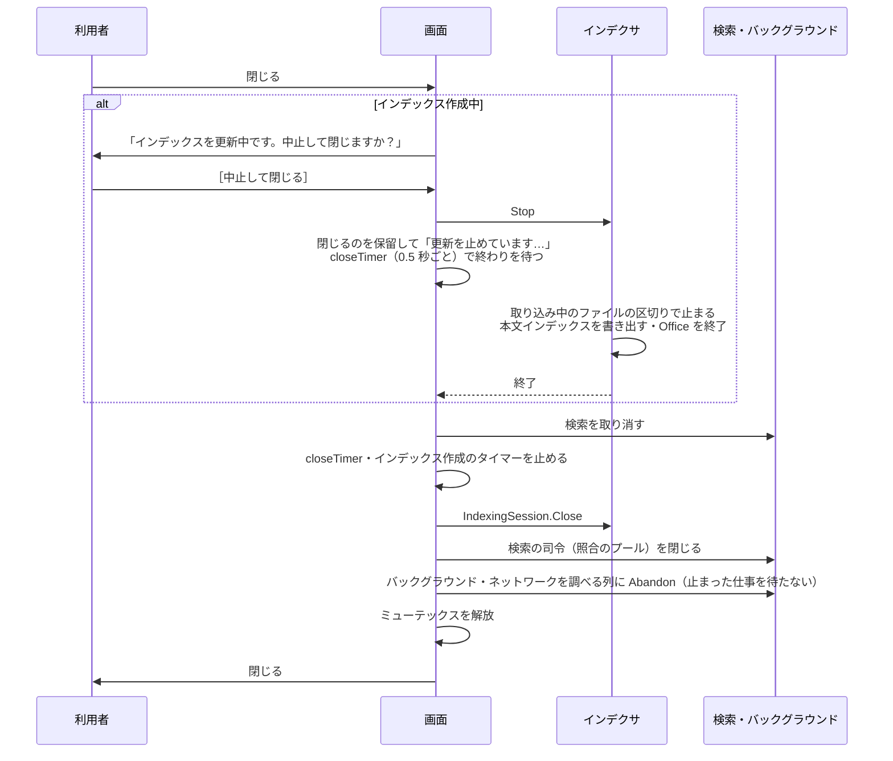

# 閉じるときの順番と GC

扱うこと: 画面を閉じるときの手順（インデックス作成中の確認・スレッドの片づけ順）、GC がスレッドを止める問題とその対策。扱わないこと: プロセス・スレッドの一覧・寿命そのもの（[プロセスとスレッド](threads.md)）。先に読むページ: [プロセスとスレッド](threads.md)。

## 閉じるときの順番

- 確認の選択肢は［中止して閉じる］と［閉じない］だけである。インデックス作成を続けたまま画面を閉じることはできない。確認している間にインデックス作成が終わっていれば、そのまま閉じる。
- Office が固まってインデクサが戻らないときは、まず監視が制限時間で Office を止める。画面は 60 秒待っても終わらなければ、インデックス作成が起動した Office を PID で止め（`IndexingSession.KillOffice`）、さらに 15 秒待つ。それでも終わらなければ、そのまま閉じる（スレッドは `IndexingSession.Close` で止める）。
- 止めるのは、インデックス作成が起動して PID を記録した Office（`OfficePids`）だけである。PID が別のプロセスに使い回されていないよう、記録したプロセス名と同じかも確かめる。利用者が開いていた Office は止めない。
- 止めるのを待っている間にもう一度閉じようとしても、何もしない。
- **バックグラウンド・ネットワークを調べる列は、`Close` ではなく `BackgroundQueue.Abandon` で片づける。** 届かない共有の `Test-Path` など、OS の呼び出しで戻らない仕事があると、`Close`（`WorkerPool.Cancel` → `PowerShell.Stop()` → `Dispose()`）は止まるまで待ってしまう。`Abandon` は、終わった仕事は片づけ、終わっていない仕事には止める依頼（`BeginStop`）だけを出してすぐ戻る。終わっていない仕事の `PowerShell` とランスペースのプールは `Dispose` せず、後始末はプロセスの終わりに任せる。`WorkerPool.Cancel`・`BackgroundQueue.Close` 自体の動き（止まるまで待つ）は変えない。中止した検索がその後にヒットや件数を書かないことが、検索の中止（[取り込みの並列化](../indexing/parallel.md)ではなく `pack_search.ps1` の中止）で前提になっているため。
- **多重起動の鍵（ミューテックス）は、止まった裏の仕事を待たずにすぐ放す。** 画面はすぐ消え、前のプロセスは止まった呼び出しが戻った後（OS の呼び出しの分だけ）に自分で終わる。次の起動は、鍵が放たれていれば数秒以内にできる。
- 閉じる処理の途中で予期しない例外が起きたら、知らせたうえで、インデックス作成中なら確認を出さずに止める流れに入り、そうでなければそのまま閉じる。

## インデックスの削除・名前の変更の途中で閉じるとき

削除・名前の変更は裏の列で動く（[ネットワークのワークスペース](../gui/network.md)）。途中で閉じると、設定への反映が抜けて、設定とインデックスのフォルダの名前が食い違うため、次のように待つ。

1. 1 回目の閉じる操作は閉じずに、「インデックスの変更が終わってから閉じます…」をステータスに出し、終わってから閉じる。複数削除の結果のダイアログは、この間は出さずに閉じる（失敗があればステータスに残す）。
2. 待っている間にもう一度閉じようとしたら、［待たずに閉じる］／［終わるまで待つ］の確認を出す。［終わるまで待つ］なら、1. のまま終わりを待つ。確認を出している間に仕事が終わったときは、答えにかかわらず、確認から戻ったときに閉じる。
3. ［待たずに閉じる］で閉じたときは、仕事は途中で止まる。次の起動で見えるのは次のとおり。
   - 名前の変更: フォルダだけが新しい名前に変わり、設定は古い名前のまま、になり得る。一覧には設定の古い名前が出て、そのインデックスは無いものとして扱われる。もう一度同じ名前の変更をすると、旧名のフォルダが無いのでフォルダは移さず、設定と記録だけが新しい名前になる（`renameIndex`）。
   - 削除: インデックスのフォルダが一部だけ消え、設定には残り得る。もう一度削除すれば、残りを消して設定からも外れる。

## GC とメモリ

スレッドは同じプロセスのヒープを使うため、インデクサや検索が大量にメモリを使うと、GC で画面のスレッドも止まる。

実測（画面の代わりに 5ms ごとに起きるスレッドを動かし、遅れを測った。ヒープ 300MB、20 秒）では、次のとおりだった。

| 負荷 | 遅れの最大 | 50ms を超えた回数 |
|---|---|---|
| なし | 27.0ms | 0 |
| 同じプロセスのスレッドで本文インデックスの読み書き | 45.0ms | 0 |
| 別のプロセスで同じ負荷 | 18.8ms | 0 |
| 同じプロセス＋`SustainedLowLatency` | 33.2ms | 0 |

Windows のタイマーの刻み（約 15.6ms）を考えると、どれも画面の操作で気づく止まりではない。そのうえで、次を守る。

- 起動時に `GCSettings.LatencyMode` を `SustainedLowLatency` にする（重い全体の GC を後回しにする）。
- 読んだ内容のキャッシュに予算（文字数）を決め、超えたら使われていないものから追い出す。追い出しは検索の司令のスレッドで、検索の後に行う（`trimTsvTextCache`）。
  - キャッシュの各内容には、最後に使った世代を付ける。世代は検索 1 回ごとに 1 つ進める。
  - 予算の 90% を超えていたら、今の世代（いま終わった検索）で使わなかったものを、古い世代から追い出す。今の世代で使ったものは残す（毎回同じ本文インデックスのファイルを順に読むため、使った順だけで追い出すと、予算より大きいインデックスでは何も残らない）。
- 画面のスレッドで大きな文字列を作らない。プレビューの読み込み（`readPackContext`）はバックグラウンドのスレッドで行い、表示する分だけを受け取る。
- 検索の結果は、時間で区切って少しずつ画面に移す（`pumpSearch`）。

実装を変えたときは、画面の心拍（画面のスレッドの `DispatcherTimer` の遅れ）を、インデックス作成と検索を同時に動かして測る。100ms を超える止まりが出るようなら、インデクサだけを別のプロセスに戻すことを検討する。

