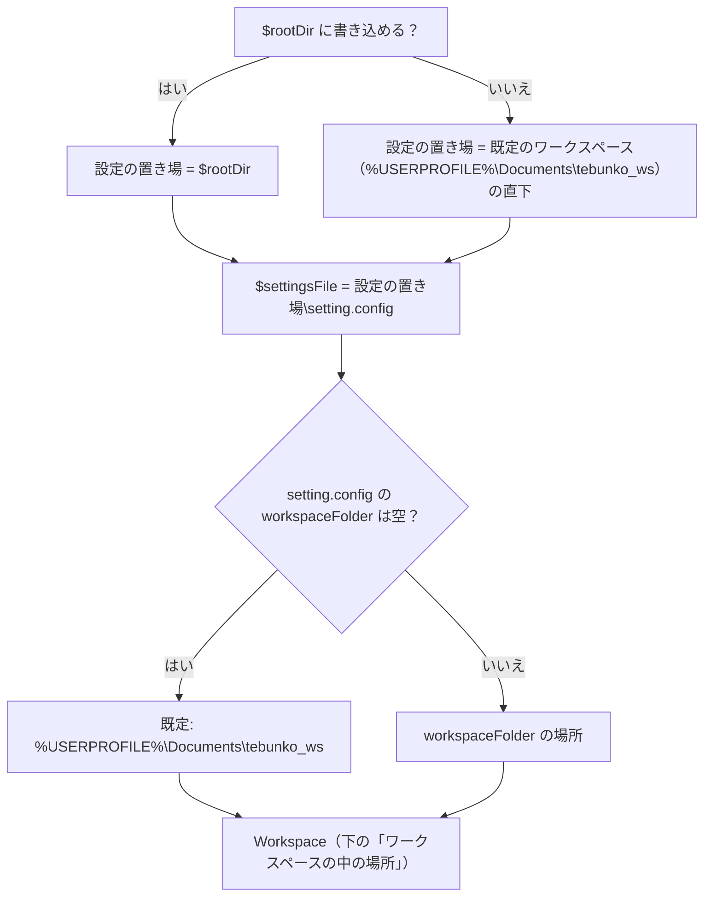
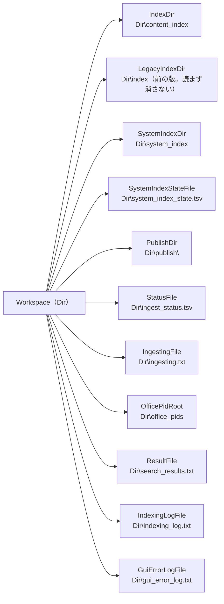

# データの置き場所とパスの決め方

扱うこと: `work/` の中身（自動生成）、`setting.config`・ワークスペースの置き場所の決め方、パスの定数、ワークスペースの中の場所（`Workspace` クラス）。扱わないこと: `scripts/` の配置そのもの（[配布物と開発用のフォルダ構成](folders.md)）、どの処理がどのファイルを読み書きするか（[どの処理がどのファイルを読み書きするか](io-files.md)）。先に読むページ: [設計の概要](../index.md)。

!!! note "設計書の `work/` の書き方"
    設計書では、ワークスペース（インデックス・取り込み一覧・ログを置くフォルダ）を `work/` と書く。実際の場所は、既定では `%USERPROFILE%\Documents\tebunko_ws`、［設定］で変えたときはその場所である（下の「データの置き場所」）。開発用のリポジトリ直下の `work/`（`work/test/`・`work/release/`・`work/site/` など、git 管理外）は別のもの。

## 自動生成（`work/`）

| パス | 説明 |
|---|---|
| `work/content_index/` | インデックス。クロール対象フォルダごとに `work/content_index/<インデックス名>/` に分かれ、その下はクロール対象フォルダと同じフォルダ構成で、各フォルダに元のファイルの拡張子ごとの本文インデックス（`content_index.xlsx.001.tsv` など）を置く。取り込み中だけ、元のファイル 1 つにつき 1 フォルダの TSV（`<ファイル名.xlsx>/<場所>.tsv`）ができ、フォルダの取り込みが終わると本文インデックスに入れて消す（[インデックスのファイルの形](../index-data/format.md#配置命名規則)） |
| `work/content_index/<インデックス名>/source_folder.txt` | インデックス名と元のフォルダ（クロール対象フォルダ）の対応。インデックス 1 件につき 1 ファイル。`work/content_index` ごとでも `<インデックス名>` のフォルダだけでも、別の PC・場所へコピーすれば検索結果から元のファイルを開ける |
| `work/system_index/` | システムインデックス（高速検索用。`work/content_index` の中のフォルダごとの 2-gram の txt。[システムインデックス](../index-data/system-index.md)）。Windows Search に索引させる |
| `work/system_index_state.tsv` | システムインデックスの状態（対応済み・反映待ち・対象外。[システムインデックス](../index-data/system-index.md)） |
| `work/ingest_status.tsv` | 取り込み対象のファイルごとの更新日時・サイズ・状態（未取り込み・済・失敗） |
| `work/ingesting.txt` | 取り込み中のファイル（取り込みのスレッドごとに 1 行）。取り込み中に強制終了したときだけ残る |
| `work/office_pids/<PC の鍵>/<PID>.txt` | インデックス作成が起動した Office の記録（起動時の確認で、残ったものだけを終了するため。[前回残った Office の確認](../gui/leftover-office.md#記録)） |
| `work/publish/<PID>/` | 1 ファイル分の TSV を、インデックスに入れる直前に集めるフォルダ（インデックス作成の終了時に削除する） |
| `work/tmp/<PC の鍵>/<PID>/` | 取り込みの作業領域（下の説明） |
| `work/indexing_log.txt` | インデクサの表示内容の記録（実行ごとに上書き） |
| `work/gui_error_log.txt` | 画面で起きた予期しないエラーの記録（追記） |
| `work/search_results.txt` | 画面の［結果をファイルに出力］で書き出す検索結果 |
| `work/test/`・`work/release/`・`work/site/`・`work/cache/` | 開発用の出力（テスト結果とカバレッジ・配布物・設計書のサイト・サイトを作るときのキャッシュ） |

取り込みの作業領域は、既定では `work/tmp/<PC の鍵>/<PID>/` に置く（`Workspace` の `TmpRoot`。`tebunko/core/workspace.ps1` の `selectTmpDir`）。`<PC の鍵>` はコンピューター名から作る 8 文字の鍵（`getMachineKey`）で、ワークスペースを複数の PC から共有しても、互いの作業フォルダを衝突・削除させない（プロセス ID だけでは PC をまたいで重なりうるため）。その下は、取り込みのスレッド（Excel・Word・PowerPoint・読み取りのレーンのスレッド）ごとに `w<番号>` のフォルダに分ける（`newWorkerTmpDir`。`work/publish/<PID>` も同じ。[取り込みの並列化](../indexing/parallel.md)）。

ワークスペースのパスに `[` `]` が含まれる（Excel が保存できない）・パスが長すぎる（Office が開けない）ときは、作業フォルダを作らず、取り込みをすべてスキップする（どのファイルも中間 TSV などをこの作業領域に作るため、テキストファイルを含めすべての取り込みが対象になる。`%TEMP%` には逃がさない。理由をログに 1 行残し、スキップした各ファイルは取り込みの失敗として取り込み一覧に残る。[エラーメッセージ](../indexing/errors.md)）。インデックス作成の始め（`initTmpDir`）に、強制終了などで残った前回までの作業フォルダ（`work/tmp/` 配下・`work/publish/` 配下・前の版（`%TEMP%\tebunko\`）が残したものがあればそれも）を片付けてから、今回の場所を決める。作れたときは、Windows Search の索引対象から外す属性（`NotContentIndexed`）も付ける。

できた TSV をインデックス（本文インデックスに入れる前の置き場所）に入れるときは、`work/publish/<PID>` にいったん集めてからフォルダごと入れ替える（`publishIndexFiles`）。途中で強制終了しても作りかけのインデックスが残らない。フォルダごと移すには同じドライブである必要があるため、作業領域とは別に `work` の中に置く。どちらのフォルダも、終了時と次回の開始時（終了済みのプロセスの分）に削除する。

## データの置き場所（`setting.config`・`work/`）

ツールを書き込めない場所（`C:\Program Files`、読み取り専用の共有フォルダ）に置いても動くよう、また、インデックス（元の文書の本文を持つ。[安全性の要約](../../safety/index.md) の [インデックスが元文書の本文を保持する（情報の集約）](../../safety/disclosure.md#インデックスが元文書の本文を保持する情報の集約)）をアクセス権を絞ったフォルダや容量のあるドライブに置けるよう、データの置き場所をツールのフォルダと分けられるようにしている。

| 変数 | 決め方 | 定義 |
|---|---|---|
| 設定の置き場 | ツールのフォルダ（`$rootDir`）にファイルを作れればそこ。作れなければ、呼び出し側が渡す代わりのフォルダ（tebunko では既定のワークスペース `getDefaultWorkDir`）の直下。`%LOCALAPPDATA%` と `%TEMP%` には置かない | `scripts/shared/core/data_dir.ps1` の `getDataDir`（書き込めるかは `testWritableFolder`。試しに作ったファイルは閉じると消える）、`scripts/tebunko/core/settings.ps1` の `getSettingsFilePath` |
| `$settingsFile` | 設定の置き場の `setting.config` | `scripts/tebunko/core/settings.ps1` |
| `$workspace.Dir` | `setting.config` の `workspaceFolder`（[設定ファイル（setting.config）の形式](settings-file.md#形式)）。空なら既定の `%USERPROFILE%\Documents\tebunko_ws`（`getDefaultWorkDir`。OneDrive にリダイレクトされた「ドキュメント」ではなく、プロファイルの直下の Documents） | `scripts/tebunko/core/settings.ps1`（`getWorkDir`） |

- 既定の場所をドキュメントにするのは、高速検索（[検索](../search/index.md)・[高速検索（Windows Search）](../search/fast-search.md)）で Windows Search に システムインデックスを索引させるため（ドキュメントは既定で索引の対象）。既定の場所にほかのファイルが置いてあると、インデックスのファイルと混ざるため使わせない。ただし設定ファイル（`setting.config`・保存途中の `setting.config.tmp`・壊れた設定の退避 `setting.config.broken-<日時>[-<番号>]`。`testSettingsFileName`）は、ツールのフォルダに書けないときにここへ置くので、ワークスペースの中身として数えない（移す・消す対象にもならない。`Workspace.Entries` に入らない）（`testDefaultWorkspace`・`getWorkspaceBlockMessage`。起動時・インデックス作成の開始・［既定に戻す］・インデクサで確かめ、`「…」は空のフォルダではありません。…` と出す）。無い・空・前から使っているワークスペース（`content_index`・前の版の `index`・`ingest_status.tsv` のどれかがある）なら使える。以前の既定（設定ファイルと同じフォルダの `work`）からは移さない（使い続けるときは［設定］の［変更…］で選ぶ）。
- `$workspace.Dir` のフォルダを画面では**ワークスペース**と呼ぶ。［設定］で表示し、［変更…］で空のフォルダに変えられる（[［設定］タブ](../gui/settings-tab.md)）。
- `work/` の中身（インデックス・取り込み一覧・ログ・取り込みの出力）はまとめて動く。取り込みの出力（`work/publish/<PID>`）はインデックスとフォルダごと入れ替えるため、インデックスと同じ `work` の中に置く。
- 置き場所を変えると、今の `work/` の中身（tebunko が作るファイル・フォルダだけ。`Workspace.Entries`）を新しい場所へ移す（`moveWorkspace`）。新しい場所に同じ名前があれば移さずに止め、途中で移せなければ移した分を戻す。検索対象のツリーでチェックを外したフォルダ（`searchExcludes`）も、移した先のインデックスに付け替える（`moveSearchExcludes`）。ただし新しい場所にすでにインデックスなどがあるとき（ほかの人が共有したワークスペースなど）は、それを使う（今の中身は移さず、インデックスの一覧をそのワークスペースの取り込み一覧に合わせる）か、消して最初からやり直す（消してから今の中身を移す）かを利用者が選ぶ（[［設定］タブ](../gui/settings-tab.md)）。
- 同じ `work` を複数の PC・利用者から同時に使うことは考えない（取り込み一覧・インデックスが食い違う）。同じ PC の中では、インデックス作成の二重起動の鍵を `$workspace.Dir` から作るため、別のツールのフォルダから同じ `work` を指しても二重には動かない。
- `$rootDir` が書き込めるかは読み込むたびに調べる。書き込めない場所から書き込める場所に戻すと、設定は `$rootDir` 直下のものに戻る。

## パス定義

パスと定数は、どのツールからも使うもの（`shared/`）と tebunko 固有のもの（`tebunko/core/paths.ps1`・`settings.ps1`）に分かれる。

| 変数 | 値 | 定義 |
|---|---|---|
| `$rootDir` | リポジトリ直下 | `shared/core/paths.ps1` |
| `$utf8Bom` | BOM 付き UTF-8 の `System.Text.Encoding` | `shared/core/paths.ps1` |
| `$cellNewLine` | インデックス TSV でセル内改行の代わりに使う文字（U+2028 LINE SEPARATOR） | `shared/core/text.ps1` |
| `$maxFileNameLength` | ファイル名 1 つの長さの上限（255） | `shared/core/fs.ps1` |
| `$officeExtensions` | 取り込み対象の拡張子（`.xlsx` `.xlsm` `.xls` `.xlsb` `.docx` `.docm` `.doc` `.pptx` `.pptm` `.ppt`） | `shared/office/office_files.ps1` |
| `$officeProcessNames` | 強制終了の対象のプロセス名 → 表示名（`EXCEL` → `Excel`、`WINWORD` → `Word`、`POWERPNT` → `PowerPoint`） | `shared/office/office_process.ps1` |
| `$workspace` | 今のワークスペース（`Workspace`。下の「ワークスペースの中の場所」）。設定 `workspaceFolder` から決める（`getWorkDir`） | `tebunko/core/paths.ps1` |
| `$tmpDir` | 取り込みの作業フォルダ（`work/tmp/<PC の鍵>/<PID>`。`initTmpDir` が決める。置けないときは空で、取り込みのスレッドは、その下の `w<番号>` を使う） | 同上 |
| `$tmpDirReason` | `$tmpDir` を置けなかった理由（`Brackets` / `TooLong`）。置けたときは空 | 同上 |
| `${legacyTmpParent}` | 前の版（`%TEMP%\tebunko\<PID>` に一時ファイルを置いていた版）が残した作業フォルダの片付け専用。今の版はここに書き込まない | 同上 |
| `$sourceFolderFileName` | 各インデックスのフォルダに置く元のフォルダの記録のファイル名（`source_folder.txt`） | 同上 |
| `$indexingPhaseCrawl` / `$indexingPhaseConfirm` / `$indexingPhaseIngest` / `$indexingPhaseFinish` | インデックス作成の進み具合の段階（`クロール` / `確認` / `取り込み` / `仕上げ`） | 同上 |
| `$ingestPlanColumns` | 取り込み予定の列名（`インデックス名` `元のフォルダ` `区分` `ファイル数` `取り込み対象` `新規` `更新あり` `前回未完了` `インデックスなし` `前回失敗`） | 同上 |
| `$planKindIngest` / `$planKindUnchecked` / `$planKindMissing` | 取り込み予定の区分（`取り込み` / `チェックなし` / `フォルダなし`） | 同上 |
| `$statusColumns` | 取り込み一覧の列名（`相対パス` `更新日時` `サイズ` `状態` `TSV数` `取り込み日時` `エラー` `抽出版`） | 同上 |
| `$statusFolderKey` | 取り込み一覧の先頭のクロール対象フォルダの行の見出し（`クロール対象フォルダ`） | 同上 |
| `$stateNew` / `$stateDone` / `$stateFailed` | 取り込み一覧の状態（`未取り込み` / `済` / `失敗`） | 同上 |
| `$appId` | ツールの ID（`tebunko`。ミューテックスの名前に使う） | `tebunko/core/settings.ps1`（起動口が `lib.ps1` より先に `settings.ps1` だけを読み込んで設定を確かめるため、ここで決める） |
| `$settingsFile` | 設定の置き場の `setting.config`（上の「データの置き場所」。画面が保存する設定。内容は JSON。[設定ファイル（setting.config）](settings-file.md)） | `tebunko/core/settings.ps1` |
| `$openModeNormal` / `$openModeReadOnly` / `$openModeNew`・`$openModes` | 元のファイルの開き方（設定 `openMode` の値 `normal` / `readOnly` / `new`）と、その一覧 | 同上 |

## ワークスペースの中の場所（Workspace）

`tebunko/core/workspace.ps1` の `Workspace` クラスは、ワークスペースのフォルダ（`Dir`）から中の場所を組み立てる。設定は読まない。

- 関数は、ワークスペースの中の場所を既定値で `$workspace` から取る（例 `[string]$path = $workspace.StatusFile`）。既定値は呼んだときに決まるため、`$workspace` を差し替えれば、読み込み直さずに別のワークスペースを使う。
- 別のスレッド（画面の裏の仕事・検索の司令・取り込み）は `lib.ps1` を読み込んだときの `$workspace` を持つ。そのため画面は、場所を引数で渡すか、`Dir`（文字列）を渡してそのスレッドで `Workspace` を作り直す。オブジェクトはスレッドをまたいで渡さない。
- 取り込みのスレッドは `PublishDir` を、その下の `w<番号>` に差し替える。
- ワークスペースを変えるときは、今のワークスペースの中身を移す。移すのは `Entries()`（tebunko が作るファイル・フォルダ）だけで、利用者のほかのファイルは移さない。`getWorkspaceEntries`（あるものだけ）・`getWorkspaceMoveConflicts`（移し先に同じ名前があるもの）・`moveWorkspace`（移す。移し先に同じ名前があれば何も移さず、途中で失敗したら移した分を戻す。別のドライブのフォルダは `copyDirectoryTree` で写してから消す）・`moveSearchExcludes`（`searchExcludes` を移した先のインデックスに付け替える）。選んだフォルダにすでにインデックスなどがあれば、`useWorkspaceTargets`（そのワークスペースの取り込み一覧のクロール対象フォルダを、インデックスの一覧にする）で使うか、`removeWorkspaceEntries`（tebunko のファイル・フォルダだけを削除する）で消してから移す。
- **前の版の `index\` の扱い**（[前の版の index\ の扱い](../index-data/format.md#前の版の-index-の扱いgetlegacyindexstateclearlegacysystemindex)）: `getLegacyIndexState`（dir → `@{HasLegacyIndex; ContentEmpty; HasLegacySystemIndex}`。前の版のしるし・`content_index\` が空か・前の名前の txt が残っているかを調べる）・`testLegacyCleanupNeeded`（`getLegacyIndexState` の結果 → bool。片付けの条件を引数だけで判定する）・`getLegacyIndexMessage`（dir, hasLegacyIndex → 知らせの文言。しるしが無ければ空）・`clearLegacySystemIndex`（dir → `@{Ok; Reason}`。`system_index\` の削除と状態ファイルの初期化。失敗したら理由を返す）。インデクサ（`invokeIndexerBody`）が `content_index\` を作る前に呼び、画面の判断層（`indexing_view.ps1` の `getReingestConfirm`。hasLegacyIndex, contentEmpty → 確かめの文言）は［すべて更新］で使う（[更新し直しの確かめ](../gui/indexing-run.md#更新し直しの確かめ)）。

| プロパティ | 値 |
|---|---|
| `Dir` | ワークスペースのフォルダ |
| `IndexDir` | `<Dir>\content_index` |
| `LegacyIndexDir` | `<Dir>\index`（前の版が使っていた場所。読まず、消しもしない） |
| `SystemIndexDir` | `<Dir>\system_index`（システムインデックス） |
| `SystemIndexStateFile` | `<Dir>\system_index_state.tsv` |
| `PublishDir` | `<Dir>\publish\<PID>`（TSV をインデックスに入れる直前に集めるフォルダ） |
| `StatusFile` | `<Dir>\ingest_status.tsv` |
| `IngestingFile` | `<Dir>\ingesting.txt` |
| `ResultFile` | `<Dir>\search_results.txt` |
| `IndexingLogFile` | `<Dir>\indexing_log.txt`（インデクサの表示内容の記録。実行ごとに上書き） |
| `GuiErrorLogFile` | `<Dir>\gui_error_log.txt`（画面で起きた予期しないエラーの記録。追記。共通基盤の `writeErrorLog` は、画面が定義する `getGuiErrorLogFile` からこの場所を得る） |
