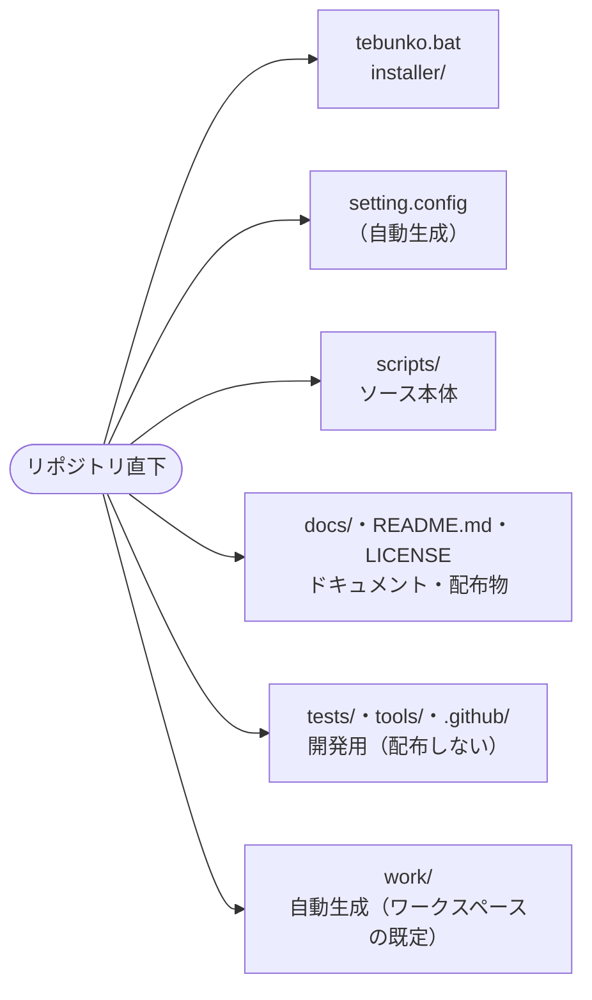

# 配布物と開発用のフォルダ構成

扱うこと: 利用者が使うもの・ドキュメント配布物・開発用（配布しない）フォルダの一覧。扱わないこと: `scripts/` の中の文脈・層による分け方（[ソースの分け方](source.md)）、データの置き場所（[データの置き場所](data.md)）。先に読むページ: [設計の概要](../index.md)。

スクリプトの場所は `scripts/shared/core/paths.ps1` の `$rootDir`（= リポジトリ直下。このファイルから 3 つ上）を基準に決まる。`setting.config` は、ふつうは `$rootDir` の直下に置く（ツールのフォルダに書き込めないときは利用者ごとの場所）。インデックス・取り込み一覧・ログ（ワークスペース）は、既定で `%USERPROFILE%\Documents\tebunko_ws` に置き、利用者が画面で置き場所を変えられる（[データの置き場所](data.md)）。**カレントディレクトリには依存しない。**
ファイル操作は `-LiteralPath` または .NET の `System.IO` を使い、`[` `]` を含むファイル名・フォルダ名を扱える。

## 利用者が使うもの

| パス | 種別 | 説明 |
|---|---|---|
| `tebunko.bat` | 起動用バッチ | 画面を開く（インデックス作成・検索）。利用者が起動するのはこれだけ。`conhost.exe` 経由で PowerShell（PATH からではなく `%SystemRoot%` からの絶対パス）を `-ExecutionPolicy RemoteSigned -WindowStyle Hidden` で 1 回起動し、その中で `scripts` の中のファイルから Mark-of-the-Web を外して（`Unblock-File`。[安全性の要約](../../safety/index.md) の [Mark-of-the-Web の解除](../../safety/disclosure.md#mark-of-the-web-の解除tebunkobat)）から `gui.ps1` を開く。既定のターミナルが Windows Terminal だと `-WindowStyle Hidden` が効かず、PowerShell の窓が残るため `conhost.exe` を通す。画面が開く前に失敗したときは、記録を残して Notepad で理由を示す（[起動に失敗したときの知らせ](../../safety/disclosure.md#起動に失敗したときの知らせtebunkobat)） |
| `setting.config` | 設定 | 画面が保存する設定（JSON。無ければ既定値で動き、画面で設定を保存したときに作成する。git 管理外。[設定ファイル（setting.config）](settings-file.md)）。ツールのフォルダに書き込めないときは利用者ごとの場所に置く（[データの置き場所](data.md)） |
| `work/` | 自動生成 | インデックス・状態ファイル・ログ（[どの処理がどのファイルを読み書きするか](io-files.md)）。git 管理外。削除すると全件取り込み直しになる。置き場所は画面で変えられる（[データの置き場所](data.md)） |

## ドキュメント・配布物

| パス | 種別 | 説明 |
|---|---|---|
| `README.md` | ドキュメント | 使い方の入口。配布 zip に同梱する（相対リンクと画像は、その版の GitHub の URL に書き換える） |
| `LICENSE` | ドキュメント | ライセンス（MIT）。配布 zip に同梱する |
| `.github/SECURITY.md`・`.github/SECURITY.ja.md` | ドキュメント | 安全性の説明の入口と、脆弱性の連絡先・対応方針（英語版が正、`.ja.md` が日本語版）。配布 zip には入れず、リリースの説明からリンクする |
| `sbom.cdx.json` | 配布用 | 部品表（CycloneDX 1.6）の雛形。本体の説明・ライセンス・前提ソフトウェア・注記だけを持つ。ファイルごとの一覧とハッシュは、配布物を作るときに `tools/new_sbom.ps1` が足す。第三者のコードを含まない（同梱するフォントとアイコンの形の 2 件は `tools/new_sbom.ps1` が足す）ことを示す（[安全性の要約](../../safety/index.md) の [供給網（サプライチェーン）とライセンス](../../safety/supply-chain.md)）。配布 zip と並べてリリースに載せる |
| `installer/tebunko.iss` | 配布用 | インストーラー（`tebunko-setup-<バージョン>.exe`）を作る Inno Setup 7 のスクリプト。管理者権限なしで `%LOCALAPPDATA%\Programs\tebunko` に入れ、スタートメニューとアンインストールに登録する（[安全性の要約](../../safety/index.md) の [インストーラー版](../../safety/disclosure.md#インストーラー版)）。BOM 付き UTF-8・CRLF |
| `installer/tebunko.cs` | 配布用 | インストーラー版の起動口 `tebunko.exe` のソース（C# 5）。`tebunko.bat` と同じく `gui.ps1` を `-ExecutionPolicy RemoteSigned` で起動する。窓を作らずに起動し、起動できなかったときは PowerShell のエラーをメッセージで出す。zip 版には入れない |
| `docs/` | ドキュメント | 利用者向けの使い方・安全性の説明・設計書（MkDocs のサイトの元）。`docs/images/` に図・画面の画像・ロゴ（`logo.svg`）を置く。配布 zip には入れない。リリースに載せる 1 本の `.ps1` の設計は [単一 PowerShell のビルド](single-script.md) |
| `.github/CONTRIBUTING.md`・`.github/SUPPORT.md`・`.github/CODE_OF_CONDUCT.md`（と、それぞれの `.ja.md`） | ドキュメント | 開発に参加する手順・使い方の質問の窓口・行動規範。英語版が正で、`.ja.md` が日本語版。GitHub は `.github/` に置いた英語版の名前のファイルを認識する |

## 開発用（配布しない）

| パス | 種別 | 説明 |
|---|---|---|
| `tests/` | テスト | Pester テスト（`scripts/` と同じ構成。[テスト](../testing/index.md)） |
| `tools/check_commit.ps1` | 開発用 | 公開してはいけない内容（利用者名を含むパス・メールアドレス・Office ファイルの作成者名など）・`.ps1` と `.xaml` の文字コード・長すぎるファイル名を検査する。pre-commit フックと CI が使う（[コミット前に動く検査](../testing/pre-commit.md)） |
| `tools/check_commit_message.ps1` | 開発用 | コミットメッセージの 1 行目・PR と Issue のタイトルが Conventional Commits の形かを確かめる。commit-msg フックと CI（`title.yml`）が使う |
| `tools/check_signoff.ps1` | 開発用 | コミットに作者の `Signed-off-by` があるかを確かめる。commit-msg フックと CI（`test.yml`）が使う |
| `tools/check_markdown_links.ps1` | 開発用 | git で管理している `.md` の相対リンクの先（ファイル・見出し）があるかを確かめる。`tests/meta/links.Tests.ps1` が使う（[テストの実行](../testing/run.md)） |
| `tools/hooks/pre-commit`・`tools/hooks/commit-msg`・`tools/install_hooks.ps1` | 開発用 | コミット時の検査。clone 後に `install_hooks.ps1` を 1 回実行して有効にする（[コミット前に動く検査](../testing/pre-commit.md)） |
| `tools/new_release_files.ps1` | 配布用 | 配布物のカタログ（`tebunko.cat`）とハッシュ一覧（`SHA256SUMS.txt`）を作る（既定の出力先は `work/release/`）。ハッシュ一覧は zip に入れたバイト列から計算し、見出しの時刻はコミットの時刻にする。受け取った側が改ざんの有無を確認できる（[安全性の要約](../../safety/index.md) の [配布物の完全性（カタログ・ハッシュ一覧・来歴の署名）](../../safety/scans.md#配布物の完全性カタログハッシュ一覧来歴の署名)） |
| `tools/new_sbom.ps1` | 配布用 | 配布物の部品表（CycloneDX 1.6）を作る。雛形の `sbom.cdx.json` に、版・`serialNumber`・`timestamp`・zip に入る全ファイルのパスと SHA-256 を足す |
| `tools/new_release_package.ps1` | 配布用 | 配布する zip（`tebunko-<バージョン>.zip`。本体・README・LICENSE・VERSION.txt）と、zip と並べてリリースに載せるカタログ・ハッシュ一覧・SBOM を `work/release/` に作る。同じコミット・同じ版の名前なら、zip の中身・ハッシュ一覧・部品表が同じになる（ファイルの時刻はコミットの時刻、一覧は `git ls-files`、改行は CRLF）。`v` で始まるタグを push すると `.github/workflows/release.yml` が実行し、GitHub Release に載せる（[CI](../testing/ci.md)） |
| `tools/check_release_package.ps1` | 開発用 | 公開する前に、配布 zip の中身を検査する。zip のファイルが `git ls-files scripts` と固定のファイルに過不足なく一致するか・読み込み口から dot-source でたどれる先が存在するか・`.ps1` の構文と `.xaml` の XML・カタログ（`Test-FileCatalog`）・`SHA256SUMS.txt` と部品表のハッシュ・`VERSION.txt` のタグ名と SHA を確かめ、通らなかった項目をすべて列挙して止める。`release.yml` が、インストーラーを作った後・来歴に署名する前に実行する（[安全性の要約](../../safety/index.md) の [配布物の完全性（カタログ・ハッシュ一覧・来歴の署名）](../../safety/scans.md#配布物の完全性カタログハッシュ一覧来歴の署名)） |
| `tools/check_release_tag.ps1` | 開発用 | リリースのタグの検査。タグが `v<メジャー>.<マイナー>.<パッチ>` の形で、指すコミットが `origin/main` の履歴にあるかを確かめる。`release.yml` の最初の `guard` ジョブが実行する |
| `tools/new_installer.ps1` | 配布用 | インストーラー（`tebunko-setup-<バージョン>.exe`）を `work/release/` に作る。起動口 `tebunko.exe` を Windows 標準の `csc.exe`（.NET Framework）でビルドし、`scripts/`・`LICENSE`・`VERSION.txt` と並べて Inno Setup 7 の `ISCC.exe` に渡す。`release.yml` が実行する。手元で作るときは Inno Setup 7 を入れておく（`-Iscc` で場所を指定できる） |
| `tools/install_inno_setup.ps1` | 配布用 | Inno Setup 7 を、版を固定して公式のリリースから取り、SHA256 を確かめてから、持ち運び版（レジストリに書かない）でランナーの一時フォルダに入れる。`release.yml` の `shell: powershell` の `run` は ASCII だけで書く決まりのため、日本語のメッセージが要るこの手順だけを分けている |
| `tools/new_version_text.ps1` | 配布用 | 配布物に入れる `VERSION.txt` の中身（タグ名とコミットの SHA の2行。BOM 付き UTF-8・CRLF）を作る。`new_release_package.ps1`・`new_installer.ps1` が共通で呼ぶ。`VERSION.txt` は zip のエントリー・インストーラーのステージにだけ作り、リポジトリの作業ツリーには書かない（開発中に git のチェックアウトから起動すると「開発版」と出る） |
| `tools/new_icon.ps1` | 開発用 | 画面のアイコンを元データの `docs/images/logo.svg` から作る。1 つ目は画面が読むベクターの絵（`scripts/tebunko/xaml/app_icon.xaml`。SVG の `path` をそのまま写す。変換と受け付ける SVG の形は `tools/icon_xaml.ps1`）。2 つ目は `tebunko.ico`（インストーラー・ショートカット用）で、Windows に入っている Microsoft Edge（ヘッドレス）で SVG を描き、.NET の `System.Drawing` で 16〜256 px の 8 サイズに縮小して、PNG 形式の `.ico` にまとめる。第三者のツールは使わない。図柄を変えたら実行し、SVG・`app_icon.xaml`・`.ico` を同じコミットに入れる |
| `tools/make_social_preview.ps1` | 開発用 | GitHub の social preview 用の画像（`docs/images/social_preview.png`）を作る。登録はリポジトリの設定から手で行う |
| `tools/mkdocs/` | 開発用 | 設計書の Web サイトを作る設定（`mkdocs.yml`）・フック（`hooks.py`）・使うパッケージ（`requirements.txt`）（[CI](../testing/ci.md)） |
| `tools/pr_checks_comment.ps1` | 開発用 | 動いたワークフロー自身の結果（成功・失敗など）と実行へのリンクを、そのワークフローの PR コメント（ワークフローごとに 1 件）に書く・書き換える。`.github/actions/pr-comment`（複合アクション）から、test・title・docs・codeql・gui・perf-check の各ワークフローの `pr-comment` ジョブが呼ぶ（[CI](../testing/ci.md)） |
| `.github/actions/pr-comment/` | 開発用 | 上の `tools/pr_checks_comment.ps1` を呼ぶ共有の複合アクション。呼び出し側のジョブ（`pr-comment`）だけに `pull-requests: write` を持たせる（[CI](../testing/ci.md)） |
| `.github/workflows/` | 開発用 | CI（`test.yml`・`title.yml`・`docs.yml`・`codeql.yml`・`scorecard.yml`）、画面のスモークテスト（`gui.yml`）、性能の計測（`perf.yml`）・速さの回帰テスト（`perf-check.yml`）と配布物の公開（`release.yml`）（[CI](../testing/ci.md)） |
| `.github/codecov.yml` | 開発用 | Codecov の設定。ASCII の文字だけで書く（[CI](../testing/ci.md)） |
| `.github/dependabot.yml`・`.github/release.yml` | 開発用 | 依存（GitHub Actions・MkDocs のパッケージ）の更新 PR の設定と、リリースノートを PR のラベルで分ける設定 |
| `.github/ISSUE_TEMPLATE/`・`.github/pull_request_template.md`・`.github/title_comment.md` | 開発用 | Issue・PR のテンプレートと、形の違う Issue のタイトルに付けるコメント |
| `.gitattributes` | 開発用 | `.ps1`・`.xaml`・`.bat`・`.iss`・`.cs` を CRLF、`tools/hooks/*` を LF に固定する |
| `AGENTS.md`・`.claude/CLAUDE.md` | 開発用 | コーディングエージェント向けの決まり。`CLAUDE.md` は `AGENTS.md` を読み込む |
