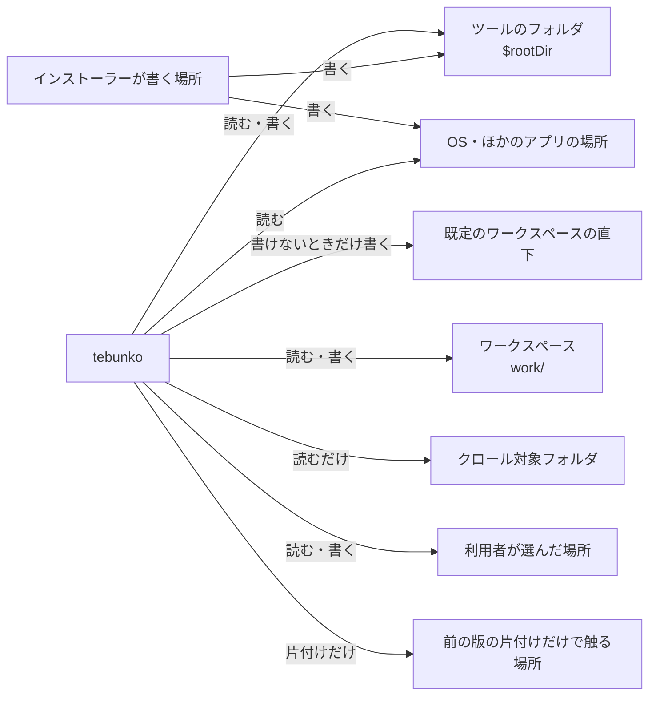
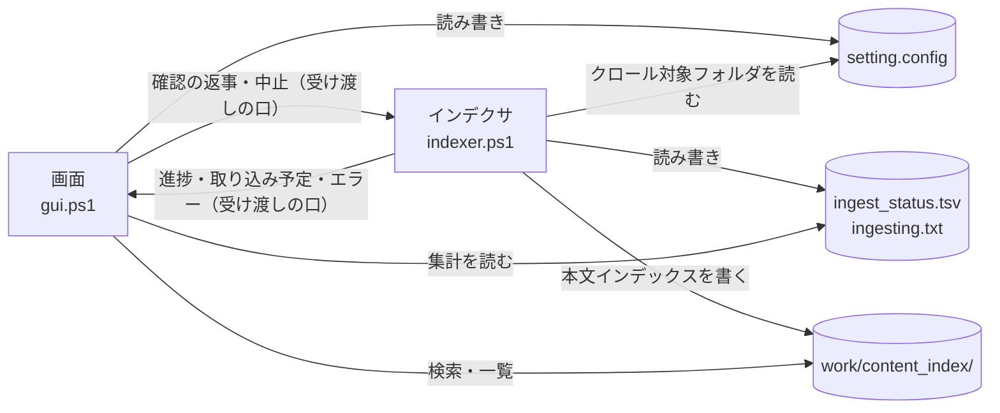

# どの処理がどのファイルを読み書きするか

扱うこと: tebunko が読み書きするファイルとフォルダの全部（置き場ごとの一覧・配布形ごとの置き場・読まない書かない場所）と、画面とインデクサが読み書きするファイルの表（作成・使用・文字コード・内容）。扱わないこと: 各ファイルの形式そのものの詳細（各ファイルのページ）、データの置き場所の決め方（[データの置き場所とパスの決め方](data.md)）。先に読むページ: [データの置き場所とパスの決め方](data.md)。

tebunko が読み書きするファイルとフォルダは、このページの「置き場ごとの一覧」にすべて載せる。書けない・読めないときの振る舞い（パスに `[` `]` がある・長すぎる・共有に届かない）は [データの置き場所とパスの決め方](data.md) が正本で、ここには写さない。

## 置き場ごとの一覧

置き場は次の 8 つに分かれる。「読む」「書く」は、tebunko 本体（画面とインデクサ）とインストーラーがするものに限る。.NET・WPF・PowerShell の本体が読むもの、Office が自分で読み書きするもの、テストと `tools/` が使う一時ファイルは含めない（Office 自身が元のファイルの隣に作る一時ファイル `~$*.xlsx` などは、クロール対象フォルダの中にできることがある）。

### ツールのフォルダ（`$rootDir`）

zip 版は展開したフォルダ、インストーラー版は `{app}`（既定 `%LOCALAPPDATA%\Programs\tebunko`）、単一 `.ps1` 版はその `.ps1` を置いたフォルダ。カレントディレクトリには依存しない。

| パス | 読む／書く | 内容 |
|---|---|---|
| `scripts/`（`gui.ps1`・`shared/`・`tebunko/` の下の `.ps1`・`.xaml`・`shared/fonts/` のフォント・`tebunko.ico`） | 読む | 起動のたびに読み込む。画面の XAML とフォント（Rethink Sans）・アイコンもここから読む（単一 `.ps1` 版は XAML を埋め込み、フォントは持たない） |
| `scripts/tebunko/startup/*.txt` | 読む | 起動に失敗したときに示す理由の文章（`tebunko.bat`。Notepad で開く） |
| `scripts/` の下のすべてのファイル | 書く（Mark-of-the-Web の解除） | `tebunko.bat`（zip 版）と `gui.ps1`（単一 `.ps1` 版以外）が `Unblock-File` で、ダウンロードの印（Zone.Identifier）を外す（[Mark-of-the-Web の解除](../../safety/disclosure.md#mark-of-the-web-の解除tebunkobat)）。印が無ければ何も変わらない |
| `VERSION.txt` | 読む | 版とコミット（画面の［バージョン情報］・エクスポートの目録）。配布物にだけある。単一 `.ps1` 版は埋め込み、開発中は無く「開発版」になる |
| `setting.config` | 読む・書く | 設定（[設定ファイル（setting.config）](settings-file.md)）。ツールのフォルダに書けるときだけここに置く。書けないときは「既定のワークスペースの直下」 |
| `setting.config.tmp` | 書く | 設定を保存する途中の一時ファイル。書き終えたら `setting.config` に置き換える（`writeTextLinesAtomic`） |
| `setting.config.broken-<日時>[-<番号>]` | 書く | JSON として読めない設定の退避（`repairBrokenSettings`。起動のとき 1 回だけ） |
| `startup_error.txt` | 書く | 起動そのものに失敗したときの記録。`tebunko.bat` は上書き、`gui.ps1` は追記（`writeStartupErrorFile`）。ツールのフォルダの直下にだけ書き、書けなければ残さない。インストーラー版のアンインストールで消える |
| `.tebunko_write_test_<GUID>.tmp` | 書く（すぐ消える） | ツールのフォルダに書けるかを、ファイルを作って調べる（`testWritableFolder`。閉じると消える `DeleteOnClose`）。EDR・DLP の記録に、この名前の作成が出る |
| `tebunko.exe`（インストーラー版） | 読む | 起動口。`scripts/tebunko/gui.ps1` を PowerShell で起動する |
| `tebunko.bat`（zip 版） | 読む | 起動口 |

### 既定のワークスペースの直下

`%USERPROFILE%\Documents\tebunko_ws`（`getDefaultWorkDir`）。ツールのフォルダに書けないときだけ、設定の置き場になる。

| パス | 読む／書く | 内容 |
|---|---|---|
| `setting.config`・`setting.config.tmp`・`setting.config.broken-<日時>[-<番号>]` | 読む・書く | 上の表と同じ。ツールのフォルダに書けないときの逃げ先。ワークスペースを別の場所に移しても、設定はここに残る。ワークスペースの中身としては数えない（`testSettingsFileName`） |
| `.tebunko_write_test_<GUID>.tmp` | 書く（すぐ消える） | 設定の置き場に書けるかを調べる（`testWritableFolder`） |
| フォルダ自体 | 作る | 設定を置くときと、ワークスペースが既定のとき |

### ワークスペース

既定は `%USERPROFILE%\Documents\tebunko_ws`。［設定］で変えられる（`workspaceFolder`）。設計書では `work/` と書く。中の場所は `Workspace` クラス（[ワークスペースの中の場所](data.md)）が決める。

| パス | 読む／書く | 内容 |
|---|---|---|
| `work/content_index/`（`<インデックス名>/…/content_index.<拡張子>.<番号>.tsv`・`source_folder.txt`） | 読む・書く | 本文インデックス。インデックス作成が書き、検索・一覧が読む。インポートで置き換え、クロール対象から外したフォルダの分は消す。`<名前>.tmp` に書いてから置き換える（`writePackFile`）。改名のときは `<名前>_rename_<PID>` を経由する |
| `work/system_index/<インデックス名>/…/system_index.txt` | 読む・書く | システムインデックス（2-gram の txt）。Windows Search が読む（[システムインデックス](../index-data/system-index.md)） |
| `work/system_index_state.tsv` | 読む・書く | システムインデックスの状態。排他で開いて書き換える |
| `work/ingest_status.tsv`（`.tmp` を経由して置き換える） | 読む・書く | 取り込み一覧 |
| `work/ingesting.txt` | 読む・書く | 取り込み中のファイル |
| `work/publish/<PID>/`（`import/new/`・`import/previous/` を含む） | 読む・書く | 本文インデックスに入れる直前の TSV と、インポートの展開先 |
| `work/tmp/<PC の鍵>/<PID>/w<番号>/` | 読む・書く | 取り込みの作業領域。元のファイルのコピー・抽出途中のファイル。`NotContentIndexed` 属性を付ける（`SetAttributes`） |
| `work/office_pids/<PC の鍵>/<PID>.tmp`→`<PID>.txt` | 読む・書く | このツールが起動した Office の記録（`office_process.ps1`。`.tmp` に書いてから `.txt` に改名）。起動時の確認で読む |
| `work/indexing_log.txt` | 書く | インデクサの表示内容（実行ごとに上書き。`writeIndexerLog`）。［ログを開く］で Notepad が開く |
| `work/gui_error_log.txt` | 書く | 画面の予期しないエラー（追記。`writeErrorLog`）。起動に失敗したときも、ここに書けるならここに書く |
| `work/search_results.txt` | 書く | 検索結果の出力 |
| `work/index/`（前の版の本文インデックス）・`work/system_index/` の前の版の txt | 読む・消す | 前の版のしるしの調べ・知らせ・［設定］の「移す」「消して最初から」のときだけ。新しい版は書かない |
| `work/release/`・`work/test/`・`work/site/`・`work/cache/` | – | 開発用（`tools/` が書く。配布物には入らない）。tebunko 本体は触らない |

ワークスペースを移すとき（`moveWorkspace`）は、`Workspace.Entries()` のものだけを新しい場所へ移す・写す。

### クロール対象フォルダ

利用者が登録した元のファイルのフォルダ。**読むだけで、書かない。**

| 読むもの | いつ |
|---|---|
| フォルダの中身の一覧（再帰） | インデックス作成の取り込み予定を作るとき（`Get-ChildItem`）。フォルダ・設定画面のツリーを開くとき |
| 取り込み対象のファイル（`.xlsx` `.xlsm` `.xls` `.xlsb` `.docx` `.docm` `.doc` `.pptx` `.pptm` `.ppt` とテキストファイル） | 取り込むとき。元のファイルを占有しないよう、作業領域へコピーしてから読む（`copyFileShared`）。保護の判定のため先頭を読む（`office_protection.ps1`） |
| 元のファイル | 検索結果から開くとき（Office・既定のアプリ・Notepad・エクスプローラー）。tebunko は書かない |

### 利用者が選んだ場所

| パス | 読む／書く | 内容 |
|---|---|---|
| エクスポートの保存先（`<インデックス名>_インデックス_<yyyyMMdd>.zip`）と `<保存先>.tmp` | 書く | 1 つのインデックスの zip（[インデックスのエクスポート・インポート](../index-data/format.md#インデックスのエクスポートインポート)） |
| インポートする zip | 読む | ファイル選択ダイアログで選んだ zip |
| フォルダを選ぶダイアログ・ドラッグしたフォルダ | 読む（存在の確認・一覧） | ワークスペース・クロール対象フォルダの選択。ワークスペースを選んだときは、書けるかを試すファイルを作って消す |
| 検索結果の［コピー］ | – | クリップボードに書くだけで、ファイルは作らない |

### インストーラーが書く場所

`installer/tebunko.iss`（Inno Setup）。管理者権限なしで入れるのが既定。

| 場所 | 書く内容 |
|---|---|
| `{app}`（既定 `%LOCALAPPDATA%\Programs\tebunko`。管理者は Program Files も選べる） | `tebunko.exe`・`scripts\`・`LICENSE`・`VERSION.txt`。更新のとき、先に `scripts\` を消してから入れる |
| `{app}\uninstall` | アンインストーラー（`unins000.exe` など） |
| スタートメニュー（`{autoprograms}\tebunko`）・デスクトップ（選んだときだけ） | ショートカット |
| レジストリのアンインストールの情報（`AppId` の鍵） | Windows のインストーラーが必ず書くものだけ。`[Registry]` は使わない |
| アンインストールで消すもの | 入れたファイルと `{app}\setting.config`・`{app}\startup_error.txt`。**ワークスペース（インデックス）は消さず**、残っている場所を知らせる |

### OS・ほかのアプリの場所

| 場所 | 読む／書く | 使うところ |
|---|---|---|
| `%USERPROFILE%`（`GetFolderPath("UserProfile")`） | 読む（パスを組み立てる） | 既定のワークスペースの場所（`getDefaultWorkDir`） |
| `%SystemRoot%\System32\notepad.exe` | 起動する | ログ・拡張子が危ないファイルを開く（`openWithNotepad`・［ログを開く］） |
| `%SystemRoot%\System32\WindowsPowerShell\v1.0\powershell.exe` | 起動する | 起動口（`tebunko.bat`・`tebunko.exe`）。PATH からは探さない |
| `explorer.exe` | 起動する | ［フォルダを開く］・フォルダの選択 |
| Windows Search（`Search.CollatorDSO`） | 読む（SELECT だけ） | 高速検索。システムインデックスを索引させ、問い合わせる |
| Excel・Word・PowerPoint のプロセス | 起動・終了 | 古い形式の変換・元のファイルを開く。起動した PID は `work/office_pids/` に記録する |
| 設定値の `%…%`（`ExpandEnvironmentVariables`） | 読む | クロール対象フォルダ・ワークスペースに環境変数があれば展開する（`folder.ps1`・`settings.ps1`） |
| カレントドライブ | 読む | `\server\share` のように `\` ひとつで始まる、ドライブ名の無いパス（今のドライブのパスには直さず、書かれたとおりに扱う）。ドライブ名だけ（`D:`）はドライブ直下とする |
| `TEBUNKO_GUI_LEFTOVER_FILE`（環境変数） | 読む | 画面のテスト用。残った Office の確認の行に偽の行を差し込むファイルの場所（利用者は使わない） |

### 前の版の片付けだけで触る場所

| 場所 | 触り方 | 内容 |
|---|---|---|
| `%TEMP%\tebunko\<PID>`（`legacyTmpParent`） | 消すだけ | 前の版が一時ファイルを置いていた場所。インデックス作成の始めに、終わったプロセスの分を消す。今の版は書かない |
| `<ワークスペース>\index\`（前の版の本文インデックス）と、前の名前の `system_index\` の txt | 読む・消す | 上の「ワークスペース」の最後から 2 行目のとおり |

## 配布形ごとの置き場

| 配布形 | ツールのフォルダ | ツールのフォルダに書けるか | 設定（`setting.config`）の置き場 | 起動口が読むもの |
|---|---|---|---|---|
| zip を展開した版 | 展開したフォルダ | 展開先による。自分のフォルダなら書ける。読み取り専用の共有・Program Files に置くと書けない | 書ければツールのフォルダ。書けなければ既定のワークスペースの直下 | `tebunko.bat` → `scripts/tebunko/startup/*.txt`（失敗時）・`gui.ps1`・`scripts/` 全体・`VERSION.txt`・XAML・フォント・アイコン。起動のたびに `scripts/` の Mark-of-the-Web を外す（`tebunko.bat` と `gui.ps1`） |
| インストーラー（利用者ごと） | `%LOCALAPPDATA%\Programs\tebunko` | 書ける | ツールのフォルダ（`{app}\setting.config`） | `tebunko.exe` → `scripts/tebunko/gui.ps1` 以下・`VERSION.txt`。`gui.ps1` が `scripts/` の Mark-of-the-Web を外す（インストーラーが書いたファイルには付かないので、何も変わらない） |
| インストーラー（Program Files・管理者が選ぶ） | `C:\Program Files\tebunko` | 普通の利用者は書けない | 既定のワークスペースの直下（`%USERPROFILE%\Documents\tebunko_ws\setting.config`）。アンインストールでは消えないため、不要なら手で消す | 利用者ごとの版と同じ |
| 単一 `.ps1` | その `.ps1` を置いたフォルダ | 置き場による | 書ければその `.ps1` と同じフォルダ。書けなければ既定のワークスペースの直下 | その `.ps1` 自身だけ。`scripts/`・`VERSION.txt`・フォント・XAML のファイルは読まない（埋め込み）。Mark-of-the-Web は外さない（動き始めた後に外しても効かないため） |

どの配布形も、インデックス・取り込み一覧・ログ（ワークスペース）は、既定または［設定］で選んだ場所に置く。設定の置き場は `$rootDir` に書けるかを起動のたびに調べて決まる（[データの置き場所とパスの決め方](data.md)）。`startup_error.txt` は、どの配布形でもツールのフォルダの直下にだけ書く。

## 読まない・書かない場所

次の場所には、今の版は書かない。

- `%LOCALAPPDATA%\tebunko`: 設定の逃げ先と起動失敗の記録に使っていたが、やめた。読みも書きもしない（インストーラー版の `%LOCALAPPDATA%\Programs\tebunko` は別で、ツールのフォルダ）。
- `%TEMP%`: 一時ファイルはワークスペースの `tmp\` の下にだけ置く。前の版の `%TEMP%\tebunko\` の片付けのほかは触らない。
- レジストリ: インストーラーが書くアンインストールの情報を除き、読みも書きもしない。
- クロール対象フォルダ・元のファイル: 書かない（読むだけ）。

## 処理ごとのファイルの表

画面（`gui.ps1`）とインデクサ（`indexer.ps1`）は同じプロセスの別のスレッドで動き、進み具合・取り込み予定・確認の返事・中止・エラーはメモリ上の受け渡しの口（`newIndexerChannel`）で受け渡す（[画面とインデクサの受け渡し](threads.md#画面とインデクサの受け渡し)）。ファイルに残すのは、このページの表のとおりである（ここまでの一覧の「処理ごとのファイルの表」は、画面とインデクサが使うファイルに絞った表）。

| パス | 種別 | 作成 | 使用 | 文字コード | 内容 |
|---|---|---|---|---|---|
| `setting.config` | 設定 | 画面 | 画面・インデックス作成 | UTF-8（BOM なし）、JSON | クロール対象フォルダ・検索対象のツリーでチェックを外したフォルダ・元のフォルダ・検索条件・開き方（[設定ファイル（setting.config）](settings-file.md)）。PC ごとの設定 |
| `work/ingest_status.tsv` | インデックス作成の状態 | インデックス作成 | インデックス作成・画面 | UTF-8（BOM 付き）、タブ区切り | 先頭にクロール対象フォルダの行、以降 1 ファイル 1 行で相対パス・更新日時・サイズ・状態・TSV 数・取り込み日時・エラー・抽出版（[取り込み一覧](../indexing/ingest-list.md)） |
| `work/ingesting.txt` | インデックス作成の状態 | インデックス作成 | インデックス作成 | UTF-8（BOM 付き） | 取り込み中のファイルごとに `<回数><TAB><相対パス>` の 1 行（取り込みを複数のスレッドで行うため、取り込み中のものすべて。`readIngestingFiles` / `writeIngestingFiles` / `removeIngestingFile`）。取り込みが終わったファイルの行は消し、インデックス作成が終われば削除する。残っていれば、書かれたファイルの取り込み中に強制終了した（[取り込み一覧](../indexing/ingest-list.md#強制終了時間切れからの再開)） |
| `work/publish/<PID>/` | 作業領域 | インデックス作成 | インデックス作成 | – | 1 ファイル分の TSV（`<元のファイル名>/<場所>.tsv`）。集め終わったら `work/content_index` の中へフォルダごと移す（`publishIndexFiles`） |
| `work/tmp/<PC の鍵>/<PID>/`（ワークスペースのパスに `[` `]` があるか長すぎるときは作らない。どのファイルも中間 TSV などをこのフォルダに作るため、テキストファイルを含めすべての取り込みをスキップする） | 作業領域 | インデックス作成 | インデックス作成 | – | 取り込み中の元ファイルのコピー（Excel は元と同じファイル名、長すぎれば `source.<拡張子>`。Word・PowerPoint は `source.<拡張子>`。元のファイルを占有しないため）、抽出途中の `sheet<N>.tmp`（UTF-16LE）/ `*.tsv`、旧形式の変換用の `source.doc` `source.ppt` / `converted.docx` `converted.pptx`（[データの置き場所とパスの決め方](data.md)「自動生成（`work/`）」） |
| `work/indexing_log.txt` | 記録 | インデックス作成 | 利用者 | UTF-8（BOM 付き） | インデクサの表示内容（`writeIndexerLog`。実行ごとに上書き） |
| `work/gui_error_log.txt` | 記録 | 画面 | 利用者 | UTF-8（BOM 付き） | 画面で起きた予期しないエラーの内容（`writeErrorLog`。追記） |
| `work/content_index/` | インデックス | インデックス作成 | 検索 | 本文インデックスは UTF-16LE（BOM 付き）、LF。本文インデックスに入れる前の TSV は UTF-8（BOM 付き）、CRLF | フォルダ・拡張子ごとの本文インデックス（`content_index.<拡張子>.<番号>.tsv`。元のファイルごと・場所（シート・ページ・スライド、図形・コメント・ヘッダー・フッター）ごとに、メタ情報の行と TSV の中身を並べる）。取り込み中だけ、シート・ページ・スライドごとの TSV と図形・コメント・ヘッダー・フッターの TSV（`<元の場所>[shape]`・`<元の場所>[comment]`・`<元の場所>[header_footer]`） |
| `work/content_index/<インデックス名>/source_folder.txt` | インデックス | インデックス作成 | 画面 | UTF-8（BOM 付き）、タブ区切り | 1 行目は説明、2 行目は `<インデックス名><TAB><元のフォルダ>`（[クロール対象フォルダと取り込み対象](../indexing/crawl.md#クロール対象フォルダとインデックス名)）。`.tsv` にすると検索対象になるため `.txt` |
| `work/search_results.txt` | 出力 | 画面 | 利用者 | UTF-8（BOM 付き）、CRLF | 検索結果（[検索結果ファイル](../search/output.md)） |
| 利用者が選んだ保存先（既定 `<インデックス名>_インデックス_<yyyyMMdd>.zip`）と `<保存先>.tmp` | 出力 | 画面（`exportIndex`） | 利用者 | zip（エントリー名は UTF-8） | 1 つのインデックスの目録（`tebunko-index.json`）・取り込み一覧の行・本文インデックスのファイル（[インデックスのエクスポート・インポート](../index-data/format.md#インデックスのエクスポートインポート)） |
| `work/publish/<PID>/import/` | 作業領域 | 画面（`importIndex`） | 画面 | – | インポートで zip を展開する作業フォルダ（`new/`）と、上書きのとき前のインデックスを一時的に退避する `previous/`。インポートが終われば消す |

各設定の意味は、使用する処理の設計書に記載する（クロール対象フォルダ → [インデックス作成](../indexing/index.md)、検索対象インデックス → [検索](../search/index.md)、画面での扱い → [設定ファイル（setting.config）](settings-file.md#画面での読み書き)）。
