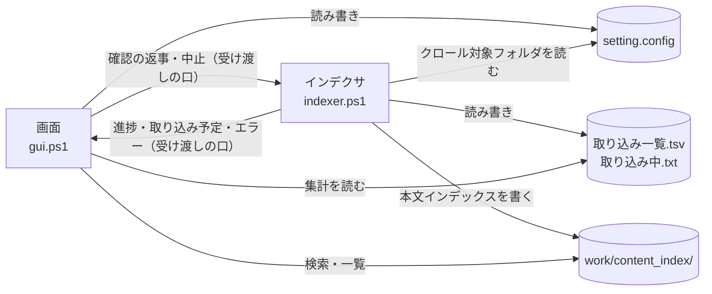

# どの処理がどのファイルを読み書きするか

扱うこと: 画面とインデクサが読み書きするファイルの一覧（作成・使用・文字コード・内容）。扱わないこと: 各ファイルの形式そのものの詳細（各ファイルのページ）、データの置き場所の決め方（[データの置き場所とパスの決め方](data.md)）。先に読むページ: [データの置き場所とパスの決め方](data.md)。

画面（`gui.ps1`）とインデクサ（`indexer.ps1`）は同じプロセスの別のスレッドで動き、進み具合・取り込み予定・確認の返事・中止・エラーはメモリ上の受け渡しの口（`newIndexerChannel`）で受け渡す（[画面とインデクサの受け渡し](threads.md#画面とインデクサの受け渡し)）。ファイルに残すのは、取り込み一覧・取り込み中のファイル・ログだけである。

| パス | 種別 | 作成 | 使用 | 文字コード | 内容 |
|---|---|---|---|---|---|
| `setting.config` | 設定 | 画面 | 画面・インデックス作成 | UTF-8（BOM なし）、JSON | クロール対象フォルダ・検索対象のツリーでチェックを外したフォルダ・元のフォルダ・検索条件・開き方（[設定ファイル（setting.config）](settings-file.md)）。PC ごとの設定 |
| `work/取り込み一覧.tsv` | インデックス作成の状態 | インデックス作成 | インデックス作成・画面 | UTF-8（BOM 付き）、タブ区切り | 先頭にクロール対象フォルダの行、以降 1 ファイル 1 行で相対パス・更新日時・サイズ・状態・TSV 数・取り込み日時・エラー・抽出版（[取り込み一覧](../indexing/ingest-list.md)） |
| `work/取り込み中.txt` | インデックス作成の状態 | インデックス作成 | インデックス作成 | UTF-8（BOM 付き） | 取り込み中のファイルごとに `<回数><TAB><相対パス>` の 1 行（取り込みを複数のスレッドで行うため、取り込み中のものすべて。`readIngestingFiles` / `writeIngestingFiles` / `removeIngestingFile`）。取り込みが終わったファイルの行は消し、インデックス作成が終われば削除する。残っていれば、書かれたファイルの取り込み中に強制終了した（[取り込み一覧](../indexing/ingest-list.md#強制終了時間切れからの再開)） |
| `work/取り込み出力/<PID>/` | 作業領域 | インデックス作成 | インデックス作成 | – | 1 ファイル分の TSV（`<元のファイル名>/<場所>.tsv`）。集め終わったら `work/content_index` の中へフォルダごと移す（`publishIndexFiles`） |
| `%TEMP%\tebunko\<PID>\` | 作業領域 | インデックス作成 | インデックス作成 | – | 取り込み中の元ファイルのコピー（Excel は元と同じファイル名、長すぎれば `source.<拡張子>`。Word・PowerPoint は `source.<拡張子>`。元のファイルを占有しないため）、抽出途中の `sheet<N>.tmp`（UTF-16LE）/ `*.tsv`、旧形式の変換用の `source.doc` `source.ppt` / `converted.docx` `converted.pptx` |
| `work/インデックス作成ログ.txt` | 記録 | インデックス作成 | 利用者 | UTF-8（BOM 付き） | インデクサの表示内容（`writeIndexerLog`。実行ごとに上書き） |
| `work/画面エラー.txt` | 記録 | 画面 | 利用者 | UTF-8（BOM 付き） | 画面で起きた予期しないエラーの内容（`writeErrorLog`。追記） |
| `work/content_index/` | インデックス | インデックス作成 | 検索 | 本文インデックスは UTF-16LE（BOM 付き）、LF。本文インデックスに入れる前の TSV は UTF-8（BOM 付き）、CRLF | フォルダ・拡張子ごとの本文インデックス（`content_index.<拡張子>.<番号>.tsv`。元のファイルごと・場所（シート・ページ・スライド、図形・コメント）ごとに、メタ情報の行と TSV の中身を並べる）。取り込み中だけ、シート・ページ・スライドごとの TSV と図形・コメントの TSV（`<元の場所>[図形]`・`<元の場所>[コメント]`） |
| `work/content_index/<インデックス名>/元のフォルダ.txt` | インデックス | インデックス作成 | 画面 | UTF-8（BOM 付き）、タブ区切り | 1 行目は説明、2 行目は `<インデックス名><TAB><元のフォルダ>`（[クロール対象フォルダと取り込み対象](../indexing/crawl.md#クロール対象フォルダとインデックス名)）。`.tsv` にすると検索対象になるため `.txt` |
| `work/検索結果.txt` | 出力 | 画面 | 利用者 | UTF-8（BOM 付き）、CRLF | 検索結果（[検索結果ファイル](../search/output.md)） |
| 利用者が選んだ保存先（既定 `<インデックス名>_インデックス_<yyyyMMdd>.zip`）と `<保存先>.tmp` | 出力 | 画面（`exportIndex`） | 利用者 | zip（エントリー名は UTF-8） | 1 つのインデックスの目録（`tebunko-index.json`）・取り込み一覧の行・本文インデックスのファイル（[インデックスのエクスポート・インポート](../index-data/format.md#インデックスのエクスポートインポート)） |
| `work/取り込み出力/<PID>/import/` | 作業領域 | 画面（`importIndex`） | 画面 | – | インポートで zip を展開する作業フォルダ（`new/`）と、上書きのとき前のインデックスを一時的に退避する `previous/`。インポートが終われば消す |

各設定の意味は、使用する処理の設計書に記載する（クロール対象フォルダ → [インデックス作成](../indexing/index.md)、検索対象インデックス → [検索](../search/index.md)、画面での扱い → [設定ファイル（setting.config）](settings-file.md#画面での読み書き)）。
