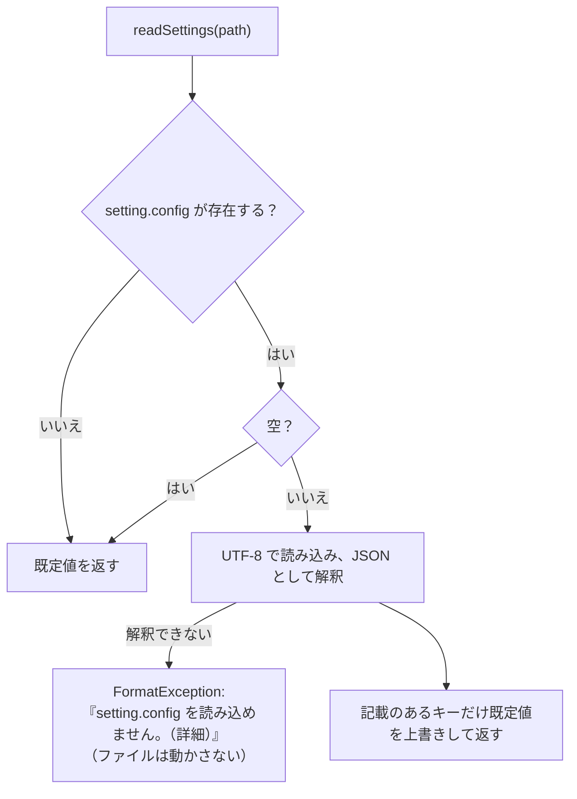

# 設定ファイル（setting.config）

扱うこと: `setting.config` の形式（キーの一覧）、読み込み・保存の流れ、壊れた設定ファイルの退避、画面での読み書きのタイミング。扱わないこと: データの置き場所の決め方そのもの（[データの置き場所とパスの決め方](data.md)）。先に読むページ: [データの置き場所とパスの決め方](data.md)。

設定は、ツール直下（書き込めなければ既定のワークスペースの直下。[データの置き場所とパスの決め方](data.md)）の `setting.config`（内容は JSON）の 1 ファイルにまとめ、画面が読み書きする。利用者が手で編集する前提にはしない。インデクサ（画面のプロセスの別のスレッド、または画面を使わずに起動した `indexer.ps1`）は、画面が保存したクロール対象フォルダとワークスペースの場所をこのファイルから読む。読み書きの関数は `scripts/tebunko/core/settings.ps1` にある。

## 形式

```json
{
    "targetFolders": [
        { "name": "見積", "path": "C:\\データ\\見積", "enabled": true },
        { "name": "報告書", "path": "D:\\old\\報告書", "enabled": false }
    ],
    "indexSources": [
        { "name": "営業", "path": "\\\\server\\営業" }
    ],
    "searchExcludes": [],
    "useRegex": false,
    "caseSensitive": false,
    "fileKinds": [],
    "includeShapes": true,
    "includeComments": true,
    "openMode": "normal",
    "workspaceFolder": "",
    "ingestThreads": 0
}
```

| キー | 型 | 既定値 | 内容 | 読み書きする関数 |
|---|---|---|---|---|
| `targetFolders` | `{name, path, enabled}` の配列 | 空 | クロール対象フォルダ（記載順）。`name` は**インデックス名**（`<ワークスペース>\content_index` 直下のフォルダ名）、`path` は**そのフォルダが今置かれている場所**。名前と置き場所を分けて持つため、フォルダを移したときは `path` の値を書き換えるだけでよい（インデックスは作り直さない。[クロール対象フォルダと取り込み対象](../indexing/crawl.md#クロール対象フォルダとインデックス名)）。`name` が空ならインデックス作成時に割り当てて保存する。`enabled` が `false` はチェックなし（登録のみで取り込まない）。`enabled` が無ければチェックあり（[クロール対象フォルダと取り込み対象](../indexing/crawl.md#クロール対象フォルダgettargetfolders)） | `getTargetFolders` / `writeTargetFolders` |
| `indexSources` | `{name, path}` の配列 | 空 | インデックス作成の対象にしないインデックスの元のフォルダ（インデックス名 → 今の置き場所）。別の PC・場所で作ったインデックスを検索するとき、元のファイルを開くために使う（[元のフォルダの特定](../gui/open-file.md#元のフォルダの特定インデックスを別の-pc場所で使う場合)） | `readIndexSources` / `writeIndexSources` / `setIndexSourceFolder` |
| `searchExcludes` | `{path, subfolders}` の配列 | 空 | 画面の検索対象のツリーでチェックを外したフォルダ（フルパス）。`subfolders` が `false` はフォルダ直下のファイルだけを外す。利便性のための一時的な記録で、インデックスの名前を変えたり削除したりするとそのインデックスの下の記録は消える（外したフォルダは検索対象に戻る）。空ならすべてを検索する（[検索](../search/index.md#インデックスの一覧getsearchindexes)） | `readSearchExcludes` / `writeSearchExcludes` / `removeSearchExcludesUnder` |
| `useRegex` | true / false | false | ［正規表現を使う］の状態 | `readSearchOption` / `writeSearchOption` |
| `caseSensitive` | true / false | false | ［大文字と小文字を区別］の状態（[検索](../search/index.md#検索条件サクラエディタの-grep-にならう)） | `readSearchOption` / `writeSearchOption` |
| `fileKinds` | 文字列の配列 | 空 | 検索する種類のチップ（`excel` `word` `powerpoint` `text`）。空・無い・知らない値だけならすべて。前の版の `fileFilter`（対象ファイルの指定）は読まず、書き直しのときに消える | `readFileKinds` / `writeFileKinds` |
| `includeShapes` | true / false | true | ［図形も検索］の状態。オフなら図形の場所（`<元の場所>[図形]`）と埋め込みの場所（`<元の場所>[埋め込みN]`）を検索しない（同上） | `readSearchOption` / `writeSearchOption` |
| `includeComments` | true / false | true | ［コメントも検索］の状態。オフならコメントの場所（`<元の場所>[コメント]`）を検索しない（同上） | `readSearchOption` / `writeSearchOption` |
| `openMode` | `normal` / `readOnly` / `new` | `normal` | ［開き方］の状態。検索結果の元のファイルを、通常（編集する）・読み取り専用・新規（元のファイルを基にした無題の文書。占有しない）のどれで開くか（[元のファイルを開く](../gui/open-file.md)）。知らない値は `normal` とする | `readOpenMode` / `writeOpenMode` |
| `workspaceFolder` | 文字列 | 空 | ワークスペース（インデックス・取り込み一覧・ログを置くフォルダ）。空なら既定の `%USERPROFILE%\Documents\tebunko_ws`（[データの置き場所とパスの決め方](data.md)）。既定の場所を選んだときも空で保存する。手で書いた相対パスは設定ファイルのフォルダから、`%変数%` は展開して読む | `getWorkDir` / `writeWorkspaceFolder` |
| `ingestThreads` | 数値 | 0 | インデックス作成で、Office を使わずに読むファイル（`.docx`・`.pptx` など）を並べて取り込む読み取りのスレッドの数（1〜4。4 より大きい値は 4 にする）。0 はコア数 − 1（1〜4）にする。取り込むファイルの数より多くはしない。Excel・Word・PowerPoint のファイルは、この値にかかわらず種類ごとにスレッド 1 つ・Office 1 つで取り込む。画面には出さない（手で書き換える）（[取り込みの並列化](../indexing/parallel.md)） | `readSettings`（インデクサの `getIngestWorkerCount`） |

## 読み込み・保存



- ファイルが無くても作成しない（既定値で動く）。ファイルを作るのは画面が設定を保存したときだけ。
- 記載の無いキー・未知のキー・値が `null` のキーは無視する（キーが増えても古い設定ファイルをそのまま読める）。
- 真偽値のキーは、手で `"false"` のような文字列に書き換えても `true` / `false` として読む（`toSettingBool`）。読めない値は既定値にする。
- 数値のキー（`ingestThreads`）は、手で `"2"` のような文字列に書き換えても数値として読む。数値にできない値は既定値にする。
- 保存（`updateSettings`）は、保存のたびにファイルを読み直し、変えたキーだけを書き換える。ほかのキーは、ほかの画面・処理が保存した内容を保つ。UTF-8（BOM なし）。
- 保存は、書き込みの途中で止まっても設定ファイルが壊れないよう、一時ファイル（`setting.config.tmp`）に書いてから置き換える（`writeTextLinesAtomic`）。
- 「読み直す → 変える → 書く」の一続きは、設定ファイルごとの名前付きミューテックス（`Local\tebunko_settings_<getFolderKey 設定ファイルのパス>`。`invokeSettingsLocked`）の中で行う。画面・インデクサ（別のプロセスも）が同時に保存しても、互いの変更を消さない。待つのは 5 秒で、過ぎたら例外にする。同じ Windows のセッションの中だけの排他（別のセッションからは排他しない）。
- インデクサが決めたインデックス名は、始めに読んだ一覧を丸ごと書き戻さず、書き戻す直前に読み直した一覧へ、名前が空の項目にだけ足す（`saveAssignedIndexNames`・`mergeAssignedIndexNames`。同じ名前をほかの項目が使っていれば付けない）。その間に画面で足した・変えたクロール対象フォルダを消さないため。
- JSON として解釈できないときは `FormatException` にする（`readSettings` はファイルを動かさない。書き込みも読み直しで同じ例外になり、壊れたファイルは上書きしない）。ロック・共有違反などの `IOException` は「壊れている」に含めず、そのまま例外にする。インデクサでは、例外は `invokeIndexer` が受け、受け渡しの口の `Error` に入れて画面が表示する（終了コード 1）。

## 壊れた設定ファイルの退避

`setting.config` が JSON として読めない（`ConvertFrom-Json` が失敗する）ときは、起動の時に 1 回だけ、`repairBrokenSettings` が中身のまま `setting.config.broken-<yyyyMMdd-HHmmss>` に移し（同じ名前があれば `-2`・`-3`… を付け、前の退避を上書きしない）、既定の設定で起動する。空・`null` だけのファイルは今までどおり既定値で読み、退避しない。移せなかったときは例外にして起動せず、壊れたファイルをそのまま残す。

- 呼ぶのは起動口の 2 か所だけ。画面（`gui.ps1`）は、多重起動の判定の後、`lib.ps1` を読み込む前に呼ぶ（2 つ目の起動は退避しない）。画面なしで起動した `indexer.ps1`（`-Channel` なし）は、`indexer_lib.ps1` を読み込む前に呼ぶ。画面から `-Channel` 付きで動くときは、画面が済ませているため呼ばない。`lib.ps1` の `paths.ps1` が読み込みの時に設定を読むため、この順にしている（`$appId` は、`lib.ps1` より先に読み込む `settings.ps1` で決める）。
- 知らせの文言は `getSettingsRecoveryMessage`。画面は、メイン画面が出た後にメッセージボックスで 1 回出す。画面なしのインデクサは、`invokeIndexer` がログを開いた直後にログ（とコンソール）へ書く。
- 動いている途中に壊れたとき（画面を開いたまま手で書き損じた等）は退避しない。その操作がエラーで知らせ、次の起動で退避する。画面を開いたまま画面なしの `indexer.ps1` を起動して壊れていたときは、インデクサが退避し、画面は次にアクティブになった時に既定値の一覧を読み直す（「ほかで変更されたため読み直しました」が出る）。
- 退避したファイルは、tebunko を閉じてから直し、`setting.config` に置き換えて開き直すと戻せる。

## 画面での読み書き

画面は設定を変えたその場で保存する。［設定］タブの画面の仕様は [［設定］タブ](../gui/settings-tab.md) にある。

| 項目 | 仕様 |
|---|---|
| 保存のタイミング | インデックス一覧：追加・編集・削除・チェックの変更のたび。検索対象のツリー：チェックを変えたとき。検索条件のチェックボックス（正規表現・大文字と小文字・図形・コメント）・種類のチップ：クリックしたとき（検索したときは検索条件をまとめて保存する）。［開き方］：選び直したとき（起動時の読み込みでは保存しない）。ワークスペース：［設定］で変えたとき（[［設定］タブ](../gui/settings-tab.md)）。インデックスの元のフォルダ：［編集…］で変えたとき・検索結果からフォルダを選んで見つかったとき。インデックス名：インデックスを作成したとき・［編集…］で変えたとき（名前の無い設定を読み込んだときは、読み込み時に割り当てて保存する） |
| 外部での編集 | ウィンドウがアクティブになったとき、保存されているインデックス一覧を、画面が最後に読み込み・保存した一覧と比べ（`getTargetsKey`）、異なれば読み直す（画面側の変更はその場で保存済みのため、失われるものは無い） |

## 前の版との互換

前の版が作った `setting.config` を、新しい版がそのまま読めることを、見本（golden）で確かめる（テストは `tests/tebunko/core/settings_compat`。[単体テスト（インデックスと検索）](../testing/unit-index.md) にも一覧がある）。見本は `tests/testdata/compat/settings/<見本の名前>/`（`setting.config`・`expected.json`。作り方は [tests/testdata/README.md](../../../tests/testdata/README.md) の「前の版のファイル（`compat\`）」）に置く。

**固定するもの**: 上の「形式」の表にあるキーの名前・型・既定値と、`getTargetFolders`・`readIndexSources`・`readSearchExcludes`・`readSearchOption`・`readOpenMode`・`getWorkDir` が返す値の形（`expected.json` の `functions`）。**固定しないもの**: JSON のキーの並び順・空白、画面に出さない内部の実装。

キーや一覧項目（`targetFolders` など）を足す、上の表の読み方を変える、JSON 以外の形式にするなど、`setting.config` の読み方を変える PR は、新しい見本を 1 つ足す（上書きではなく追加。古い見本も読めることを確かめ続けるため）。

見本は**足すだけ**で、既にある見本を変える・消すのはタイトルに `!` を付けた PR だけができる（`tools/check_compat_golden.ps1`。CI の `pr-title` が確かめる）。`!` の PR が見本を消したときは、どれを・どの PR で・なぜ消したかを次の表に 1 行残す。

| 消した見本 | PR | 理由 |
|---|---|---|
| （まだ無し） | | |
