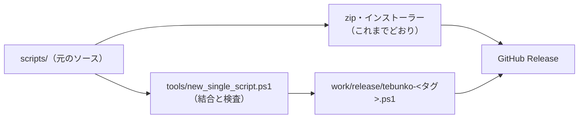

# 単一ファイルのリリース

扱うこと: リリースに、展開せずに動く 1 本の `.ps1`（`tebunko-<タグ>.ps1`）を zip・インストーラーと並べて載せる機能の設計（作り方・結合の規則・実行時の違い・検査・配布・速さの測り方）。扱わないこと: zip・インストーラーの作り方（[配布物と開発用のフォルダ構成](folders.md)）、利用者向けの使い方（[README](../../../README.md)）。先に読むページ: [配布物と開発用のフォルダ構成](folders.md)・[ソースの分け方](source.md)。

## 目的

zip は展開が要り、インストーラーは実行ファイル（.exe）を入れる。展開もインストールもせず、1 本のファイルだけを持ち運んで動かしたい利用者のために、同じ `scripts/` から機械的に作った 1 本の `.ps1` を配る。

- ソースは増やさない。`scripts/` が唯一の元で、1 本版は配布のときに作る。
- zip・インストーラーの中身と動きは変えない。
- 試験版として並べる。速さが zip 版の 1.2 倍以内であることを確かめ（下の「速さの測り方」）、利用者の確かめが済むまで、その位置づけは変えない。

## しくみ

ソースはそのまま、リリースの工程で結合の道具が 1 本にまとめて、zip の隣に載せる。

- 結合の道具は `tools/new_single_script.ps1`。`release.yml` が、zip の検査のあとに `-Version <タグ>` で呼ぶ。検査に通らなければ、そこで止まる。
- 出力は `work/release/` に書く（BOM 付き UTF-8・CRLF）。作ったファイルはリポジトリにコミットしない（`tests/meta/structure.Tests.ps1` の M5 が確かめる）。
- 読み込みのたどり方と禁止の語の一覧は `tools/script_rules.ps1` に集め、`tests/meta/layers.Tests.ps1`・`tests/meta/safety.Tests.ps1`・`tools/check_release_package.ps1` と共有する。

## 結合の規則

### 畳み込み

- 読み込み口の行（`. "$PSScriptRoot\..."` と `. "$TebunkoDir\..."`）を、相手のファイルの中身（同じ規則で畳み込んだもの）に差し替える。関数の中にある読み込み行も、文字列の差し替えなのでそのまま働く。
- 相手が初めて出てきたときだけ中身を入れ、2 回目以降は空にする（済んだファイルを集合で覚える）。
- 起動口（`gui.ps1`・`indexer.ps1`）は、`param` ブロックが二重にならないよう、構文木で `param` を除いた本体だけを取り出す。結合したファイルの頭の `param`（`$Part`・`$RetryFailed`・`$Channel`）が、起動口の `param` の名前をすべて持つ。

### 先頭に入れる変数

| 変数 | 中身 | 使う所 |
|---|---|---|
| `${bundledScriptPath}` | 実行中の `.ps1` 自身のパス（`$PSCommandPath`） | `shared/core/paths.ps1`（根フォルダ）、`tebunko/gui.ps1`（単一 .ps1 かどうかの見分け） |
| `${bundledVersion}` | `@{ Tag; Sha }`。`-Version` と `git rev-parse HEAD` から、`VERSION.txt` と同じ決め方で作る | `shared/core/version.ps1` の `readVersionFile` |
| `${bundledXaml}` | 画面定義（XAML）の文字列。キーは `scripts` 内の元のパス | `shared/ui/app_host.ps1`、`tebunko/ui/splash.ps1` |
| `${bundledParts}` | 別スレッドが読む部品（`lib`・`indexerLib`）の文字列 | `tebunko/core/parts.ps1` の `getPartLoad` |

XAML と部品は、単一引用符のヒアストリングとして埋め込む。中に行頭が `'@` の行があると途中で閉じるため、結合の道具が見つけたら止める。

### 読み込み口の並び

別スレッドは結合した 1 本を読み直さず、埋め込んだ部品の文字列を読む。結合したファイルの本体は、`-Part`（既定 `gui`）の値で次の順に分かれる。

1. `ui/startup_error.ps1`（起動の失敗の知らせ）、`lib.ps1` を読む。`-Part lib` はここで戻る。
2. `indexer/indexer_lib.ps1`、`indexer/indexer_main.ps1` を読む。`-Part indexerLib` はここで戻る。
3. `-Part indexer` は、`indexer.ps1` の本体を実行する（画面を出さずに取り込みだけ行って終わる）。
4. それ以外（既定）は、`gui.ps1` の本体を実行する（画面を起動する）。

`lib` と `indexerLib` の部品は、画面（`ui/` 配下）のファイルを含まない。画面のクラスを別のランスペースで二重にコンパイルすると、画面のスレッドの型と別物になるため（[クラスと関数の使い分け](classes.md)）。

## 実行時の違い

| 項目 | zip 版 | 単一ファイル版 |
|---|---|---|
| 根フォルダ | `scripts/shared/core/paths.ps1` から 3 階層上 | `.ps1` 自身がある場所 |
| データ（`setting.config`・`work/`） | 根フォルダ。書き込めなければ `%LOCALAPPDATA%\tebunko\<鍵>`（`getDataDir`） | 同じ。根フォルダが `.ps1` の場所になるだけ |
| 版の表示 | `VERSION.txt` | `${bundledVersion}` |
| 画面定義 | `scripts` 内の XAML ファイル | `${bundledXaml}`。テーマ（`theme.xaml`）も同じ所から引く |
| 別スレッドの部品 | 実在するファイルを dot-source する | 部品の文字列を関数（`importTebunkoPart`）として登録して呼ぶ |
| アイコン | `tebunko.ico` | 持たない。窓とバージョン情報は既定のアイコン |
| 起動口 | `tebunko.bat`（印の解除・実行ポリシーの指定・窓を隠す） | 無い。ファイルを直接実行する |
| 起動の失敗の知らせ | `reportStartupFailure` | 同じ。外側の受け皿が無いため、画面が開く前の失敗は PowerShell の窓にも出る |

- 多重起動の判定の鍵（`getFolderKey`）は、`.ps1` の隣のフォルダから作る。同じフォルダに zip 版を並べて置いても、後から起動した方が窓を作らずに終わる。
- 単一ファイル版は、自分自身の印（Zone.Identifier）を消さない。動き始めたあとに消しても起動には効かず、EDR からは防御の回避に見えるため。
- 実行ポリシーも指定しない。右クリック［PowerShell で実行］、または呼び出した側の指定のまま動く。
- zip 版・インストーラー版との間で、設定とインデックスを自動で引き継ぐことはしない。移すには、［エクスポート…］と［インポート…］を使う。

## 検査

結合の道具は、作った結果を次の 7 つで確かめ、1 つでも失敗すれば書き出さずに止まる。

1. 構文エラーが 0 件。
2. 読み込み口からたどれるファイルが、もれなく・重複なく 1 回ずつ入っている。
3. 読み込み行（`$PSScriptRoot`・`$TebunkoDir` の dot-source）が残っていない。
4. 起動口の `param` の名前が、頭の `param` にすべてある。
5. 禁止の語（`tools/script_rules.ps1` の一覧。`Invoke-Expression`・`[ScriptBlock]::Create`・`FromBase64String`・`EncodedCommand`・`ExecutionPolicy Bypass` など）が無い。
6. 版の文字列が、引数の `-Version` と SHA に一致する。
7. 部品が、入り口からたどれるファイルと過不足なく一致し、`ui/` のファイルを含まない。

テストは次のとおり。

- `tests/tools/new_single_script.Tests.ps1` … 結合の道具そのもの（連結の順・部品・新しい別スレッドでの読み込み・`-Part indexer`）。
- `tests/meta/structure.Tests.ps1` … ソースを 1 本にしても壊れない決まり（別スレッドがパスで部品を読まない・`${bundledScriptPath}` を dot-source や呼び出しに使わない・トップレベルの `trap`／`exit` の形・作った 1 本をコミットしない）。
- `tests/meta/layers.Tests.ps1`・`tests/meta/safety.Tests.ps1` … 層の決まりと禁止の語を、結合の元のソースに対して確かめる。
- 画面の自動テスト（`Gui` タグ）… 環境変数 `TEBUNKO_GUI_SINGLE=1` で、zip 版の代わりに単一ファイル版を組み立てて同じ場面を流す。CI の `gui-smoke` は、S8 で単一ファイル版の起動・検索・閉じるを流す。

## 配布

`release.yml` が、タグの push（または手動の試運転）で次を行う。

1. zip・インストーラーを作って検査する（これまでどおり）。
2. 結合の道具で `tebunko-<タグ>.ps1` を作る。
3. `SHA256SUMS.txt` に、単一ファイル版の SHA256 を 1 行追記する。`tebunko.cat` は `.ps1` を対象にしないため、改ざんの確認は `SHA256SUMS.txt` と来歴の署名で行う。
4. 来歴（Sigstore）に署名し、bundle（`tebunko-<タグ>.ps1.sigstore.json`）を作る（タグの push のときだけ）。
5. GitHub Release に、zip・インストーラーと並べて載せ、説明に SHA256 と試験版であることを書く。

zip・インストーラーの中身は変えない。検査の詳細は[第三者のツールによる検査結果](../../safety/scans.md)、開示する内容は[開示事項](../../safety/disclosure.md)にある。

## 速さの測り方

速さは、zip 版と単一ファイル版を同じ手順で測って比べる。測るのは起動と終了だけで、取り込みと検索は対象にしない。

- **測る物**: 起動（プロセスを起こしてから主画面が操作できるまで）と終了（窓を閉じてからプロセスが終わるまで）。主画面が出たかどうかは、UI オートメーションで、そのプロセスの窓の中に主画面のタブ（AutomationId `Tabs`）が現れたことで判定する。起動中の表示の窓は数えない。
- **手順**: `powershell.exe -NoProfile -STA -ExecutionPolicy RemoteSigned -File <入口>` で毎回新しいプロセスを起こす。zip 版と単一ファイル版は別々の空のフォルダに置き、交互に測る。先頭の 1 組はウォームアップとして捨て、残りの回（既定 5 回）の中央値を比べる。
- **合格の線**: 単一ファイル版の中央値が、zip 版の中央値の 1.2 倍以内（[速さの回帰テストと上限の決め方](../testing/perf-check.md)の、Office を使う形式の比べ方と同じ余裕）。倍率と合否の計算は `tools/perf/startup_common.ps1`、測る入口は `tools/perf/measure_startup.ps1`。計算の部分は `tests/tools/perf_startup.Tests.ps1` が確かめる。
- **終了コード**: 0 でない回があっても値は捨てず、回数を結果に出す。
- **どこで測るか**: GitHub Actions の `perf.yml` を手動で起動し、入力 `startup` を 5 にする。zip 版と単一ファイル版を同じランナーで測るので、比べるのはこの結果どうしにする。結果はジョブの Summary と artifact（`startup-<実行の番号>`）に出る。手元の PC での測定は、ほかの負荷で揺れるため、合否には使わない。

## 制約

- 単一ファイル版は約 2MB の 1 本のファイルで、起動のたびに全体を構文解析する。起動が zip 版より遅くなる可能性があり、それを上の方法で確かめる。
- アイコン（`tebunko.ico`）を埋め込まない。窓とバージョン情報は既定のアイコンになる。
- `tebunko.bat` が持つ、起動の失敗のフォールバック（言語モードなどの記録）は持たない。
- 組み込んだ部品は、画面（`ui/`）のファイルを含められない。画面のファイルを `lib`・`indexerLib` から読み込むと、結合の検査で止まる。
- `tebunko.cat`（カタログ）の対象にならない。
