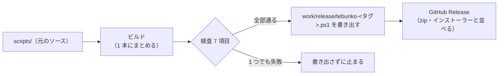

# 単一 PowerShell のビルド

扱うこと: `scripts/` のソースから、展開せずに動く 1 本の `.ps1` を作る仕組み。ビルド（まとめる）と検査（まとめた結果を確かめる）の 2 段に分けて説明する。扱わないこと: zip・インストーラーの作り方（[配布物と開発用のフォルダ構成](folders.md)）、利用者向けの使い方（[README](../../../README.md)）。先に読むページ: [配布物と開発用のフォルダ構成](folders.md)・[ソースの分け方](source.md)。

## 目的

zip は展開が要り、インストーラーは実行ファイル（.exe）を入れる。展開もインストールもせず、1 本のファイルだけを持ち運んで動かしたい利用者のために、同じ `scripts/` から機械的に 1 本の `.ps1`（`tebunko-<タグ>.ps1`）を作る。

- ソースは増やさない。`scripts/` が唯一の元で、1 本の `.ps1` はビルドのたびに作り直す。
- zip・インストーラーの中身と動きは変えない。
- 試験版として zip・インストーラーと並べて配る。利用者の確かめが済むまで、その位置づけは変えない。

## 仕組み（全体）

単一 .ps1 の作成は、ビルドと検査の 2 段である。ビルドは `scripts/` を 1 本にまとめる。検査は、まとめた結果を確かめる。どちらも `tools/new_single_script.ps1` が行う。検査に通ったものだけを書き出し、1 つでも失敗したら何も書き出さずに止まる。



- `release.yml` が、zip の検査のあとに `-Version <タグ>` を付けて呼ぶ。止まったら、リリースの工程もそこで止まる。
- 出力は `work/release/` に書く（BOM 付き UTF-8・CRLF）。作ったファイルはリポジトリにコミットしない（`tests/meta/structure.Tests.ps1` の M5 が確かめる）。
- ファイルのたどり方と禁止の語の一覧は `tools/script_rules.ps1` に集め、`tests/meta/layers.Tests.ps1`・`tests/meta/safety.Tests.ps1`・`tools/check_release_package.ps1` と共有する。

## ビルドのロジック

### 読み込み行の差し替え

`scripts/` のファイルは、ほかのファイルを `. "$PSScriptRoot\..."` や `. "$TebunkoDir\..."` の行で読み込む。ビルドは、この行を、読み込まれるファイルの中身に置き換える。置き換えた中身の中にも読み込み行があれば、同じ規則でさらに置き換える。

例: `lib.ps1` の次の行は、`settings.ps1` の中身に置き換わる。

```powershell
. "$PSScriptRoot\core\settings.ps1"
```

- 同じファイルが 2 回以上読み込まれていたら、中身を入れるのは 1 回目だけにする。2 回目以降の行は空にする（入れ終えたファイルを集合で覚えておく）。
- 関数の中にある読み込み行も、行の置き換えなので、そのまま働く。

### 起動口の `param`

起動口（`gui.ps1`・`indexer.ps1`）は、`param` ブロックを持つことがある。そのまま入れると `param` が二重になるため、構文木で `param` を除いた本体だけを取り出して入れる。結合したファイルの頭に、`param ($Part, $RetryFailed, $Channel)` を 1 つだけ置く。

### 単一 .ps1 の 2 段の形

結合した `.ps1` は、先頭と本体の 2 段でできている。

- **先頭**: 別スレッドが読む「部品」の文字列を持つ。部品は `lib`（検索や設定など、画面を使わない処理）と `indexerLib`（取り込みの処理）の 2 つ。
- **本体**: 起動したスレッドが実行するコード。画面のファイルも `lib` も入る。

別スレッドは、本体を読み直さず、先頭の部品の文字列だけを読む。部品には画面のファイルを入れない。画面のクラスを別のランスペースでもう一度コンパイルすると、画面のスレッドの型と別物になるためである（[クラスと関数の使い分け](classes.md)）。画面のファイルは本体にだけ入る。`lib` の中身は、本体にも部品にも入る。本体は画面のスレッドで使い、部品は別スレッドで使うためである。

例: `lib.ps1` に `ui/` のファイルを読み込む行を足すと、`lib` の部品に画面のファイルが入るので、検査 7 で止まる。

### 先頭に入れる変数

| 変数 | 中身 | 使う所 |
|---|---|---|
| `${bundledScriptPath}` | 実行中の `.ps1` 自身のパス（`$PSCommandPath`） | `shared/core/paths.ps1`（根フォルダ）、`tebunko/gui.ps1`（単一 .ps1 かどうかの見分け） |
| `${bundledVersion}` | `@{ Tag; Sha }`。`-Version` と `git rev-parse HEAD` から、`VERSION.txt` と同じ決め方で作る | `shared/core/version.ps1` の `readVersionFile` |
| `${bundledXaml}` | 画面定義（XAML）の文字列。キーは `scripts` 内の元のパス | `shared/ui/app_host.ps1`、`tebunko/ui/splash.ps1` |
| `${bundledParts}` | 別スレッドが読む部品（`lib`・`indexerLib`）の文字列 | `tebunko/core/parts.ps1` の `getPartLoad` |

XAML と部品は、単一引用符のヒアストリングとして埋め込む。中に行頭が `'@` の行があると途中で閉じるため、ビルドが見つけたら止める。

### 本体の読み込みの順と `-Part` の分かれ方

先頭と本体の境には、目印の行（`# ---- 本体（ここより上は、別スレッドが読む部品の埋め込み） ----`）を置く。テストはこの行までを切り出して部品を取り出し、`getPartLoad` を通して読む。本体は次の順に並べる。

1. `ui/startup_error_view.ps1`（起動の失敗の文言）、`ui/startup_error.ps1`（知らせ方）、`lib.ps1` の順に読む（`gui.ps1` の先頭と同じ順）。
2. `indexer/indexer_lib.ps1` と `indexer/indexer_main.ps1` を読む。
3. `-Part indexer` のときは、`indexer.ps1` の本体を実行する。画面を出さずに取り込みだけ行って終わる。
4. それ以外（既定は `gui`）のときは、`gui.ps1` の本体を実行する。画面を起動する。

部品だけを読んで戻る `-Part lib` のような指定は、本体に無い。

## 検査のロジック

ビルドの結果を、次の 7 つで確かめる。1 つでも失敗したら止まる。

| # | 確かめること | 防ぐもの |
|---|---|---|
| 1 | 構文エラーが 0 件である | まとめ方を誤って、起動しないファイルを配ること |
| 2 | 読み込み口からたどれるファイルが、すべて入っている。読み込み口からたどれない余計なファイルは入っていない | ファイルの入れ忘れと、関係ないファイルの混入 |
| 3 | 読み込み行（`$PSScriptRoot`・`$TebunkoDir` の dot-source）が残っていない | 差し替え漏れ。実行時に無いファイルを探して落ちる |
| 4 | 起動口の `param` の名前が、頭の `param` にすべてある | 起動の引数を渡せなくなること |
| 5 | 禁止の語（`tools/script_rules.ps1` の一覧。`Invoke-Expression`・`[ScriptBlock]::Create`・`FromBase64String`・`EncodedCommand`・`ExecutionPolicy Bypass` など）が無い | ウイルス対策ソフトが疑う書き方が混ざること |
| 6 | 版の文字列が、指定した `-Version` と、コミットの SHA に一致する | 版の表示が違うファイルを配ること |
| 7 | 別スレッド用の部品が、入り口からたどれるファイルと過不足なく一致する。部品が読んだファイルのパスに `\ui\` を含むものが無い | 部品の入れ忘れ・余計なファイルと、画面のコードが別スレッドに混ざること |

- 同じファイルが二重に入ることは、検査ではなくビルドの規則（上の「読み込み行の差し替え」）が防ぐ。
- 検査 7 が見るのはパスだけで、ファイルの中身は見ない。パスに `\ui\` を含む（`ui\` フォルダの下にある）ファイルは、`*_view.ps1` でも部品に入れると止まる。

テストは次のとおり。

- `tests/tools/new_single_script.Tests.ps1` … ビルドと検査そのもの（まとめる順・部品・新しい別スレッドでの読み込み・`-Part indexer`）。
- `tests/meta/structure.Tests.ps1` … ソースを 1 本にしても壊れない決まり（別スレッドがパスで部品を読まない・`${bundledScriptPath}` を dot-source や呼び出しに使わない・トップレベルの `trap`／`exit` の形・作った 1 本をコミットしない）。
- `tests/meta/layers.Tests.ps1`・`tests/meta/safety.Tests.ps1` … 層の決まりと禁止の語を、まとめる元のソースに対して確かめる。
- 画面の自動テスト（`Gui` タグ）… 環境変数 `TEBUNKO_GUI_SINGLE=1` で、zip 版の代わりに単一 .ps1 版を組み立てて同じ場面を流す。CI の `gui-smoke` は、S8 で単一 .ps1 版の起動・検索・閉じるを流す。

## 実行時の違い

| 項目 | zip 版 | 単一 .ps1 版 |
|---|---|---|
| 根フォルダ | `scripts/shared/core/paths.ps1` から 3 階層上 | `.ps1` 自身がある場所 |
| 設定（`setting.config`） | 根フォルダ。書き込めなければ既定のワークスペースの直下（`getSettingsFilePath`） | 同じ決め方。根フォルダが `.ps1` のある場所になる |
| 版の表示 | `VERSION.txt` | `${bundledVersion}` |
| 画面定義 | `scripts` 内の XAML ファイル | `${bundledXaml}`。テーマ（`theme.xaml`）も同じ所から引く |
| 別スレッドの部品 | 実在するファイルを dot-source する | 部品の文字列を関数（`importTebunkoPart`）として登録して呼ぶ |
| アイコン | `xaml/app_icon.xaml`（ベクターの絵） | `${bundledXaml}`。窓・スプラッシュ・バージョン情報に出る |
| 起動口 | `tebunko.bat`（印の解除・実行ポリシーの指定・窓を隠す） | 無い。ファイルを直接実行する |
| 起動の失敗の知らせ | `reportStartupFailure` | 同じ。外側の受け皿が無いため、画面が開く前の失敗は PowerShell の窓にも出る |

- 設定は、起動した版のフォルダごとに別になる。zip 版と単一 .ps1 版を別のフォルダに置くと、設定は共有されない。
- 作業フォルダ（既定は `%USERPROFILE%\Documents\tebunko_ws`）は、設定の `workspaceFolder` が空なら、別のフォルダに置いた zip 版と単一 .ps1 版で同じ場所を使う。インデックスも共有される。取り込みは作業フォルダごとに 1 つずつしか動かない。
- 窓の多重起動の判定の鍵（`getFolderKey`）は、`.ps1` のあるフォルダから作る。同じフォルダに zip 版を並べて置くと、後から起動した方は画面を作らずに終わる（起動画面は一瞬出る。どちらを先に起動しても同じ）。別のフォルダなら、両方が起動できる。
- 単一 .ps1 版は、自分自身の印（Zone.Identifier）を消さない。動き始めたあとに消しても起動には効かず、EDR からは防御の回避に見えるため。
- 実行ポリシーも指定しない。右クリック［PowerShell で実行］、または呼び出した側の指定のまま動く。
- zip 版・インストーラー版との間で、設定とインデックスを自動で引き継ぐことはしない。移すには、［エクスポート…］と［インポート…］を使う。

## 配布

`release.yml` が、タグの push（または手動の試運転）で次を行う。

1. zip・インストーラーを作って検査する。
2. 結合の道具で `tebunko-<タグ>.ps1` を作る。
3. `SHA256SUMS.txt` に、単一 .ps1 版の SHA256 を 1 行追記する。`tebunko.cat` は `.ps1` を対象にしないため、改ざんの確認は `SHA256SUMS.txt` と来歴の署名で行う。
4. 来歴（Sigstore）に署名し、bundle（`tebunko-<タグ>.ps1.sigstore.json`）を作る（タグの push のときだけ）。
5. GitHub Release に、zip・インストーラーと並べて載せ、説明に SHA256 と試験版であることを書く。

zip・インストーラーの中身は変えない。検査の詳細は[第三者のツールによる検査結果](../../safety/scans.md)、開示する内容は[開示事項](../../safety/disclosure.md)にある。

## 制約

単一 .ps1 版で新しく生じるものだけを書く。

- `tebunko.ico` は埋め込まない。画面のアイコンは XAML（`app_icon.xaml`）なので、ほかの画面定義と同じく埋め込まれる。`.ico` が要るのはインストーラー・ショートカットだけで、単一 .ps1 版は使わない。
- `tebunko.bat` が持つ、起動の失敗のフォールバック（言語モードなどの記録）は持たない。
- `lib.ps1` の読み込みの失敗は、起動の失敗の知らせ（`reportStartupFailure`）に届かず、PowerShell の窓に出る。
- `tebunko.cat`（カタログ）の対象にならない。