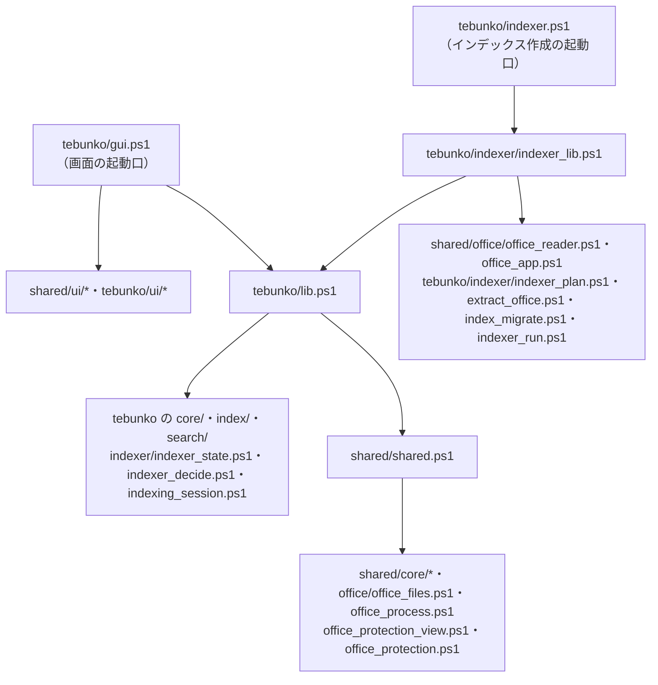

# ソースの分け方

扱うこと: `scripts/` を文脈と層で分ける考え方、フォルダごとの中身、読み込み口とその依存の向き。扱わないこと: 配布物・開発用フォルダの全体（[配布物と開発用のフォルダ構成](folders.md)）、クラス設計（[クラスと関数の使い分け](classes.md)）。先に読むページ: [設計の概要](../index.md)。

ソースは**文脈**（どの機能か）と**層**（何をするか）で分ける。どのツールにも依らない共通部分（`shared/`）と、このツール固有の部分（`tebunko/`）を分け、依存を一方向にするため。処理は**文脈**（どの機能のものか）と**層**（何をするものか）で分けて置く。

| 分け方 | 内容 |
|---|---|
| 文脈（上位） | `scripts/shared/`（どのツールからも使う）と `scripts/tebunko/`（このツール固有）。その下はドメイン（`core`・`office`・`index`・`indexer`・`search`・`ui`） |
| 層（下位） | 判断層（入力は素の値、出力は素の値）・状態層（ファイル・COM を読み書き）・画面層（`$ui` を触る） |

決まりごとは 3 つ。いずれも `tests/meta/` で機械的に確かめる（[テストの実行](../testing/run.md)）。

1. `shared/` はツールを知らない（依存は一方向）。ツール同士も互いを読み込まない。
2. 判断層は画面に触らない。触らないからテストが書ける。
3. 足したファイルは、必ずどこかの読み込み口から読み込む。

## フォルダの分け方

| フォルダ | 置くもの |
|---|---|
| `scripts/shared/core/` | パス定義（`paths.ps1`）・ファイルの読み書き（`fs.ps1`）・データの置き場所（`data_dir.ps1`）・TSV とセルの文字列（`text.ps1`）・フォルダのパスと一覧（`folder.ps1`）・スレッドのプール（`worker_pool.ps1`。`WorkerPool`・`BackgroundQueue`）・配布物の版の記録（`version.ps1`。`VERSION.txt` の読み取り） |
| `scripts/shared/office/` | Office ファイルの判定（`office_files.ps1`）・プロセスの一覧と強制終了（`office_process.ps1`）・Office ファイルを ZIP として読む処理（`office_reader.ps1`）・Office アプリ（COM）の起動と終了（`office_app.ps1`）・暗号化されたファイルの種類の判定（判断層 `office_protection_view.ps1`）とその読み取り（`office_protection.ps1`） |
| `scripts/shared/ui/` | 画面の土台と共通部品（`types.ps1`・`app_host.ps1`・`shell.ps1`・`folder_dialog.ps1`） |
| `scripts/tebunko/core/` | tebunko のパス定義（`paths.ps1`）・設定ファイル（`settings.ps1`）・ワークスペース（`workspace.ps1`） |
| `scripts/tebunko/index/` | インデックス名と TSV の名前の決め方（`index_name.ps1`）・インデックスの作成と集計（`index_store.ps1`）・検索用の本文インデックスの形式（`pack_format.ps1`）と読み書き（`pack_store.ps1`）・高速検索用の システムインデックスと状態（`system_index.ps1`） |
| `scripts/tebunko/indexer/` | インデックス作成の状態ファイル（`indexer_state.ps1`）・取り込み直すかの判断（`indexer_decide.ps1`）・取り込み対象の決定（`indexer_plan.ps1`）・1 ファイルの取り込みと抽出（`extract_office.ps1`）・作業フォルダ・外したフォルダのインデックスの後始末（`index_migrate.ps1`）・インデックス作成の本体と取り込みのスレッド（`indexer_run.ps1`）・画面のインデックス作成 1 回分のスレッド（`indexing_session.ps1`。`IndexingSession`）・インデックス作成の部品の読み込み口（`indexer_lib.ps1`） |
| `scripts/tebunko/search/` | 検索条件（`search_query.ps1`）・本文インデックスの検索（`pack_search.ps1`）・検索結果の組み立てとインデックスの件数（`search_run.ps1`）・元のファイルの場所（`source_map.ps1`）・高速検索の決まり（`search_gram.ps1`）・Windows Search への問い合わせ（`windows_search.ps1`）・高速検索で照合する本文インデックスの収集（`fast_search.ps1`）・検索の司令のスレッド（`search_service.ps1`。`SearchService`） |
| `scripts/tebunko/ui/` | タブごとの画面（`*_tab.ps1` ほか）と、その判断層（`*_view.ps1`）。画面の枠（左の欄と画面の切り替え: `ui/shell/` の `nav.ps1`・判断層の `nav_view.ps1`）と、タブに属さないもの（左の欄の［tebunko について］と「tebunko について」ダイアログ：`about_dialog.ps1`・判断層の `about_view.ps1` の `getAboutView`）も置く |

層は次の 3 つに分ける。**判断層は画面に触らないため、そのままテストできる**（[テスト](../testing/index.md)）。

| 層 | 例 | テスト |
|---|---|---|
| 判断層（入力は素の値、出力は素の値） | `text.ps1`・`index_name.ps1`・`pack_format.ps1`・`search_query.ps1`・`search_gram.ps1`・`indexer_decide.ps1`・`*_view.ps1`（`tebunko/ui/` の画面の判断層のほか、`shared/office/office_protection_view.ps1` のように `ui/` の外にも置く。テスト（`layers.Tests.ps1`）とカバレッジは名前で拾うため、置き場所によらず判断層として扱われる） | する（主にタグ `Unit`） |
| 状態層（ファイル・COM を読み書きする） | `indexer_state.ps1`・`index_store.ps1`・`pack_store.ps1`・`pack_search.ps1`・`search_run.ps1`・`system_index.ps1`・`fast_search.ps1`・`windows_search.ps1`・`version.ps1` | する（主にタグ `Io`。`$TestDrive` を使う） |
| 画面層（`$ui` を触る） | `gui.ps1`・`*_tab.ps1`・`shell.ps1`・`app_host.ps1`・`folder_dialog.ps1`、`result_list.ps1`・`open_source.ps1`・`preview.ps1`・`index_tree.ps1` | `gui.ps1`・`*_tab.ps1`・`shell.ps1`・`app_host.ps1`・`*_dialog.ps1` は手で確かめる（カバレッジの対象外）。ほかは `$ui` を偽物にしてテストする |

依存の向きは一方向にする。**`shared/` はツール（`tebunko/`）を知らない。** ツール同士も互いを読み込まない。判断層と状態層（`core/`・`index/`・`indexer/`・`search/`・`shared/` の `core/`・`office/`）は `$ui`・`$window`・WPF の型に触らず、画面以外の読み込み口（`shared.ps1`・`lib.ps1`・`indexer.ps1`）は `ui/` のファイルを読み込まない。これらの決まりは `tests/meta/layers.Tests.ps1` で機械的に確かめる。

## 読み込み口

読み込み口は次の 2 つ。ファイルを足したら、読み込み口か起動口のどれかから読み込む（読み込み漏れは `tests/meta/layers.Tests.ps1` が起動口からたどって検出する）。読み込みは `. "$PSScriptRoot\..."` の形で書く（この形の行だけを検査がたどる）。

| 読み込み口 | 読み込むもの | 使う側 |
|---|---|---|
| `scripts/shared/shared.ps1` | 共通基盤（`core/` のすべてと、`office/` のうち `office_files.ps1`・`office_process.ps1`・`office_protection_view.ps1`・`office_protection.ps1`） | `tebunko/lib.ps1` |
| `scripts/tebunko/lib.ps1` | 上記＋ tebunko の `core/`・`index/`・`search/` と、`indexer/` のうち `indexer_state.ps1`・`indexer_decide.ps1`・`indexing_session.ps1` | 画面・インデクサ・テスト・画面が起こす別スレッド |
| `scripts/tebunko/indexer/indexer_lib.ps1` | `lib.ps1` ＋ インデックス作成だけで使う `office_reader.ps1`・`office_app.ps1`・`indexer_plan.ps1`・`extract_office.ps1`・`index_migrate.ps1`・`indexer_run.ps1` | `indexer.ps1`・取り込みのスレッド（画面は読み込まない） |

画面の部品（`shared/ui/`・`tebunko/ui/`）は `gui.ps1` が、インデックス作成だけで使うもの（`office_reader.ps1`・`office_app.ps1`・`indexer_plan.ps1`・`extract_office.ps1`・`index_migrate.ps1`・`indexer_run.ps1`）は `indexer/indexer_lib.ps1` が読み込む。`indexer_lib.ps1` は `indexer.ps1` と取り込みのスレッドが読み込む（画面は読み込まない）。

各スクリプト・テストからは dot-source（`. "$PSScriptRoot\lib.ps1"`）して使う。

別スレッド（検索・背景の仕事・取り込み）の中では `$PSScriptRoot` が使えない。そのため、スレッドへ読み込ませる部品（`lib`・`indexerLib`）の読み込みは、`scripts/tebunko/core/parts.ps1` の `getPartLoad` が、呼び出し側で絶対パスに解決した `. '<パス>'` の文字列にして渡す。

## 起動口となるスクリプト（`scripts/`）

| パス | 種別 | 説明 |
|---|---|---|
| `scripts/shared/` | スクリプト | どのツールからも使う部品（`core/`・`office/`・`ui/`・`xaml/`） |
| `scripts/shared/shared.ps1` | スクリプト | 共通基盤の読み込み口 |
| `scripts/shared/office/office_reader.ps1` | スクリプト | Office ファイルを ZIP として直接読み、Word・PowerPoint の本文・図形・コメント・SmartArt・グラフと、Excel の図形・コメント・SmartArt・グラフ（表示のグラフシートを含む）の文字を取り出す（[インデックスのファイルの形](../index-data/format.md)、[Word・PowerPoint の共通処理と Office アプリの管理](../indexing/office-apps.md)、Word は [Word](../indexing/word.md)、PowerPoint は [PowerPoint](../indexing/powerpoint.md)、Excel は [Excel](../indexing/excel.md)） |
| `scripts/shared/xaml/` | 画面定義 | 共通の画面定義（`theme.xaml`・確認ダイアログ） |
| `scripts/tebunko/` | スクリプト | tebunko 固有の処理と画面（`core/`・`index/`・`indexer/`・`search/`・`ui/`・`xaml/`） |
| `scripts/tebunko/gui.ps1` | スクリプト | 画面の起動口（[画面](../gui/index.md)）。検索・残った Office の終了は画面の中で行う |
| `scripts/tebunko/indexer.ps1` | スクリプト | インデックス作成の起動口（[インデックス作成](../indexing/index.md)）。画面は自分のプロセスのスレッドでこれを実行する（`-Channel`）。画面を使わずにコンソールから実行することもできる |
| `scripts/tebunko/lib.ps1` | スクリプト | 画面以外の部品の読み込み口 |
| `scripts/tebunko/xaml/` | 画面定義 | tebunko の画面定義（`tebunko.xaml`・タブ・ダイアログ） |
| `scripts/tebunko/startup/*.txt` | 文言 | `tebunko.bat` が起動に失敗したときに読む、場面ごとの文言（BOM 付き UTF-8・CRLF）。`tebunko.bat` は ASCII で書く決まりのため、日本語の文言はここに分ける。読み込み口からは読まない（スクリプトではない）（[起動に失敗したときの知らせ](../../safety/disclosure.md#起動に失敗したときの知らせtebunkobat)） |
| `scripts/tebunko/tebunko.ico` | 画像 | 画面のアイコン（[画面の共通の決まり](../gui/common.md)）。元データは `docs/images/logo.svg`（リポジトリの管理者が作成）で、`tools/new_icon.ps1` で作る。手で編集しない |

リリースでは、上の `scripts/` をそのまま使う zip・インストーラーに加えて、`tools/new_single_script.ps1` が読み込み口をたどって 1 本の `.ps1`（`tebunko-<タグ>.ps1`）に機械的に結合した試験版も作る。結合の元は変えないため、ここで決めたフォルダ・層・読み込み口の決まりはそのまま効く（[単一 PowerShell のビルド](single-script.md)）。
